# ESPECIFICACION DE ARQUITECTURA DE SOFTWARE - IQ ENGLISH TUTORING LMS

Documento tecnico integral de arquitectura de software, diseno modular, patrones estructurales, modelo de objetos, analisis jerarquico de tareas (HTA) e implementacion cloud-native para la plataforma **IQ English - Tutoring Management System**.

---

## 1. RESUMEN EJECUTIVO Y VISION ARQUITECTONICA

### 1.1 Proposito del Sistema
IQ English Tutoring Management System es una plataforma integral de gestion academica y control de tutorias de ingles, orientada a optimizar la planificacion curricular, la asignacion docente, el control de cupos en tiempo real, el autoservicio estudiantil de reservas y reagendamientos, la evaluacion continua y la practica oral asistida por inteligencia artificial.

### 1.2 Atributos de Calidad y Acuerdos de Nivel de Servicio (SLA)
- **Disponibilidad (Availability):** Diseno de alta disponibilidad para operar con un SLA superior al 99.9% mediante arquitectura de micro-contenedores stateless.
- **Rendimiento y Latencia (Performance):** Tiempos de respuesta p95 inferiores a 150 ms para operaciones de lectura de catalogo y reserva de sesiones.
- **Consistencia Transaccional (ACID Consistency):** Aislamiento estricto en el motor de reservas y cancelaciones para impedir sobreventa de cupos (overbooking) bajo alta concurrencia.
- **Seguridad en Profundidad (Defense in Depth):** Autenticacion mediante JSON Web Tokens (JWT), autorizacion granular RBAC con 43 permisos, validacion estricta en capas y proteccion de datos sensibles.
- **Escalabilidad Horizontal (Scalability):** Backend desacoplado y sin estado de sesion HTTP, permitiendo escalado elastico automatico en entornos de nube.

### 1.3 Principios Rectores de Diseno
- **Clean Architecture & Onion Architecture:** Direccion de dependencias hacia el centro del dominio, aislando la logica de negocio de frameworks y bases de datos.
- **Domain-Driven Design (DDD):** Modelado basado en el lenguaje ubicuo del ambito academico institucional (Programas, Niveles, Libros, Modulos, Grupos, Sesiones, Citas, Asistencia).
- **SOLID Principles:** Aplicacion rigurosa de los cinco principios de diseno orientado a objetos en todos los componentes del backend y frontend.
- **12-Factor App Methodology:** Configuracion desacoplada por variables de entorno, procesos sin estado, paridad entre desarrollo y produccion, y logs como flujos continuos de eventos.

---

## 2. MODELO DE DISENO Y PATRONES ARQUITECTONICOS

### 2.1 Patron Arquitectonico: Monolito Modular en Capas Limpias
La solucion esta estructurada bajo un enfoque de **Monolito Modular con Arquitectura Limpia**. Este patron maximiza la cohesion de los dominios academicos sin incurrir en la sobrecarga operacional o latencia de red de los microservicios distribuidos, manteniendo fronteras bien delimitadas que permiten una futura transicion a microservicios si la escala lo requiere.

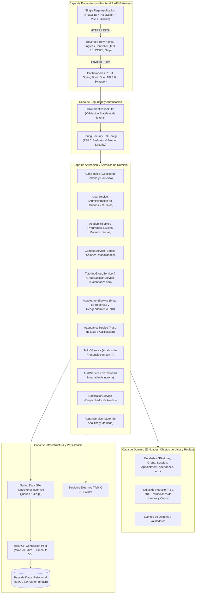

### 2.2 Patrones de Diseno GoF y Empresariales Aplicados

| Patron de Diseno | Componente en la Solucion | Proposito y Beneficio Tecnico |
| :--- | :--- | :--- |
| **Repository Pattern** | `UserRepository`, `AppointmentRepository`, `GroupSessionRepository` | Abstrae el acceso a la base de datos y provee una coleccion en memoria desacoplada de SQL. |
| **Data Transfer Object (DTO)** | `UserDto`, `AppointmentRequest`, `GroupSessionDto` | Previene la exposicion directa de entidades del dominio y optimiza la carga de red. |
| **Service Layer & Facade** | `AppointmentServiceImpl`, `UserServiceImpl` | Encapsula la orquestacion de reglas complejas y coordina multiples repositorios transaccionales. |
| **Strategy Pattern** | Autenticacion dual (Credenciales vs Enrollment Code), Motores de cancelacion | Permite intercambiar algoritmos de validacion y autenticacion en tiempo de ejecucion. |
| **Observer Pattern** | `AuditService`, `NotificationService` | Permite desacoplar el registro de auditoria y notificaciones de los flujos transaccionales primarios. |
| **Dependency Injection / IoC** | Spring Framework (`@Autowired`, `@Service`, `@Component`) | Inversion de control total, facilitando pruebas unitarias con mocks e inyeccion por constructor. |
| **Global Exception Handler** | `GlobalExceptionHandler` (`@RestControllerAdvice`) | Centraliza la captura de excepciones tecnicas y de negocio retornando payloads estandarizados. |
| **Pessimistic / Optimistic Locking** | Consultas con `@Lock` en `GroupSession` y `Appointment` | Garantiza que dos solicitudes concurrentes de reserva no excedan la capacidad maxima de alumnos. |

---

## 3. ENFOQUE DE PROGRAMACION ORIENTADA A OBJETOS (OOP) Y PRINCIPIOS SOLID

### 3.1 Aplicacion Rigurosa de Principios SOLID

1. **Single Responsibility Principle (SRP):**
   - Cada clase de servicio posee una unica responsabilidad de negocio. Por ejemplo, `AppointmentService` se enfoca exclusivamente en el ciclo de vida de las reservas (creacion, cancelacion, reagendamiento y validacion de cupos), delegando la persistencia a `AppointmentRepository` y la notificacion a `NotificationService`.
2. **Open/Closed Principle (OCP):**
   - El diseno de interfaces de servicio (`UserService`, `AcademicService`, `AppointmentService`) permite extender el comportamiento mediante nuevas implementaciones o decoradores sin alterar el codigo cliente ni las interfaces publicas.
3. **Liskov Substitution Principle (LSP):**
   - Las implementaciones concretas como `AppointmentServiceImpl` o `UserServiceImpl` cumplen enteramente los contratos definidos por sus interfaces, garantizando que cualquier cliente pueda interactuar con la abstraccion sin efectos colaterales.
4. **Interface Segregation Principle (ISP):**
   - Las interfaces del sistema son altamente cohesionadas y no obligan a los clientes a depender de metodos que no utilizan. Por ejemplo, los repositorios segregan operaciones de lectura general mediante `JpaRepository` y consultas especializadas por parametros de dominio.
5. **Dependency Inversion Principle (DIP):**
   - Los controladores REST dependen exclusivamente de las abstracciones de servicio (`UserService`, `AuthService`), nunca de implementaciones concretas ni de clases de infraestructura.

### 3.2 Diagrama de Clases del Modelo de Dominio y Jerarquias OOP

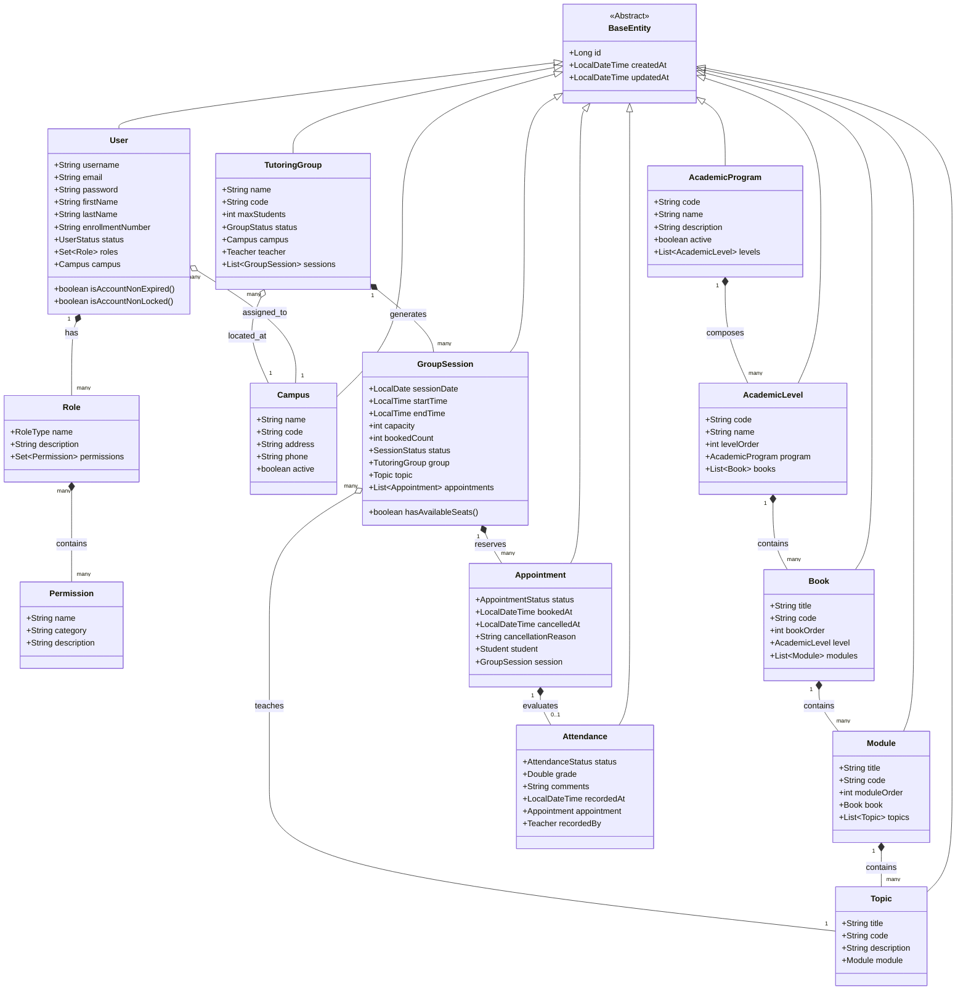

---

## 4. ARQUITECTURA MODULAR DEL SISTEMA

El sistema se compone de 11 modulos funcionales independientes interconectados a traves de contratos de servicio:

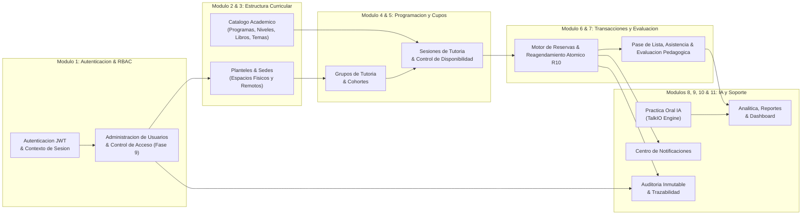

### 4.1 Matriz de Modulos, Responsabilidades y Dependencias

| Identificador de Modulo | Componentes Principales | Responsabilidad Primaria | Dependencias Internas |
| :--- | :--- | :--- | :--- |
| **M1: Auth & RBAC** | `AuthController`, `JwtTokenProvider`, `SecurityConfig` | Autenticacion segura, generacion y validacion de tokens JWT, evaluacion de roles. | `UserRepository`, `RoleRepository` |
| **M2: Academic Catalog** | `AcademicCatalogController`, `AcademicService` | Jerarquia curricular completa de 5 niveles academicos y libros oficiales IQ English. | Ninguna (Catalogo Maestro) |
| **M3: Campus Management** | `CampusController`, `CampusService` | Administracion de planteles, control de modalidades presenciales y virtuales. | Ninguna |
| **M4: Tutoring Groups** | `TutoringGroupController`, `TutoringGroupService` | Administracion de cohortes de tutoria, asignacion docente y cupos maximos. | `CampusService`, `UserService` |
| **M5: Group Sessions** | `GroupSessionController`, `GroupSessionService` | Calendarizacion de sesiones, busqueda de horarios disponibles y control de cupos. | `TutoringGroupService`, `AcademicService` |
| **M6: Appointments Engine** | `AppointmentController`, `AppointmentService` | Orquestacion de reservas, cancelaciones y reagendamiento atomico bajo Regla R10. | `GroupSessionService`, `NotificationService`, `AuditService` |
| **M7: Attendance & Grading**| `AttendanceController`, `AttendanceService` | Pase de lista, registro de presentismo/ausentismo, calificacion y notas docentes. | `AppointmentService`, `AuditService` |
| **M8: TalkIO AI Engine** | `TalkIOController`, `TalkIOService` | Integracion con motor de inteligencia artificial para practica de fluidez y pronunciacion. | `UserService`, `AuditService` |
| **M9: User Management** | `UserController`, `UserService` | Gestion de perfiles, creacion, modificacion de roles, reseteo de contrasenas y exportacion CSV. | `CampusService`, `AuditService`, `RoleRepository` |
| **M10: Audit Trail** | `AuditController`, `AuditService` | Registro inmutable de eventos de seguridad y transacciones de negocio. | Ninguna (Modulo Receptor) |
| **M11: Reports & Analytics**| `ReportController`, `ReportService` | Consolidacion de metricas de ocupacion, asistencia, distribucion de roles y desempeno. | Todos los repositorios de lectura |

---

## 5. STACK TECNOLOGICO DETALLADO Y JUSTIFICACION

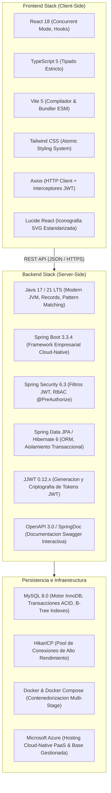

### 5.1 Justificacion Tecnica de Decisiones de Arquitectura

1. **Java 17 LTS + Spring Boot 3.3.x:**
   - Proporciona estabilidad de nivel empresarial, soporte a largo plazo, compatibilidad nativa con virtual threads de la JVM y un ecosistema de seguridad maduro.
2. **React 18 + TypeScript 5 + Vite 5:**
   - Ofrece tiempos de construccion ultrarrapidos (< 500ms en HMR), reduccion de errores en tiempo de compilacion mediante tipado estricto e interfaces sincronizadas con los DTOs del backend.
3. **MySQL 8.0 con Motor InnoDB:**
   - Soporta transacciones ACID completas con niveles de aislamiento configurables, bloqueo de registros por clave primaria y llaves foraneas que preservan la integridad referencial.
4. **Tailwind CSS:**
   - Elimina la sobrecarga de archivos CSS masivos mediante purgado automatico de clases no utilizadas, permitiendo una interfaz moderna, limpia y responsive para navegadores de escritorio y dispositivos moviles.

---

## 6. ANALISIS JERARQUICO DE TAREAS (HTA - HIERARCHICAL TASK ANALYSIS)

El Analisis Jerarquico de Tareas descompone las operaciones mas criticas y complejas del sistema en sub-tareas y planes de ejecucion secuenciales y condicionales:

### 6.1 HTA 1: Flujo de Reservacion de Tutoria por Estudiante

```mermaid
flowchart TD
    Task0["0. Reservar Cita de Tutoria de Ingles"]
    Task1["1. Autenticacion y Validacion de Credenciales"]
    Task2["2. Exploracion y Filtrado de Disponibilidad"]
    Task3["3. Seleccion de Sesion y Validacion de Reglas de Negocio"]
    Task4["4. Confirmacion Transaccional y Bloqueo de Cupo"]
    Task5["5. Notificacion y Registro de Auditoria"]

    Task0 --> Task1
    Task0 --> Task2
    Task0 --> Task3
    Task0 --> Task4
    Task0 --> Task5

    Task1_1["1.1 Enviar credenciales JWT a /api/v1/auth/login"]
    Task1_2["1.2 Extraer claims y rol STUDENT en cliente"]
    Task1 --> Task1_1
    Task1 --> Task1_2

    Task2_1["2.1 Consultar /api/v1/tutoring/sessions con filtros"]
    Task2_2["2.2 Filtrar por fecha, nivel curricular y modalidad"]
    Task2 --> Task2_1
    Task2 --> Task2_2

    Task3_1["3.1 Verificar regla de anticipacion minima (2 horas antes)"]
    Task3_2["3.2 Comprobar limite de reservas activas por semana (Max 3)"]
    Task3_3["3.3 Verificar que el alumno no tenga citas solapadas"]
    Task3 --> Task3_1
    Task3 --> Task3_2
    Task3 --> Task3_3

    Task4_1["4.1 Iniciar transaccion ACID en AppointmentService"]
    Task4_2["4.2 Bloquear registro de sesion y validar bookedCount < capacity"]
    Task4_3["4.3 Incrementar bookedCount en 1"]
    Task4_4["4.4 Persistir entidad Appointment en estado BOOKED"]
    Task4 --> Task4_1
    Task4 --> Task4_2
    Task4 --> Task4_3
    Task4 --> Task4_4

    Task5_1["5.1 Generar notificacion para el estudiante"]
    Task5_2["5.2 Registrar evento en bitacora inmutable de auditoria"]
    Task5 --> Task5_1
    Task5 --> Task5_2
```

### 6.2 HTA 2: Flujo de Reagendamiento Atomico (Regla R10)

```mermaid
flowchart TD
    R0["0. Reagendar Cita de Tutoria (Regla R10)"]
    R1["1. Solicitar Reagendamiento con ID Cita Origen y ID Sesion Destino"]
    R2["2. Validar Politica de Cancelacion en Sesion Origen"]
    R3["3. Validar Disponibilidad y Capacidad en Sesion Destino"]
    R4["4. Ejecutar Swapping Atomico en Base de Datos"]
    R5["5. Notificar y Confirmar Operacion al Usuario"]

    R0 --> R1
    R0 --> R2
    R0 --> R3
    R0 --> R4
    R0 --> R5

    R2_1["2.1 Validar que cita origen este en estado BOOKED"]
    R2_2["2.2 Validar ventana de cancelacion (minimo 4 horas antes)"]
    R2 --> R2_1
    R2 --> R2_2

    R3_1["3.1 Bloquear sesion destino con bloqueo pesimista"]
    R3_2["3.2 Verificar que sesion destino tenga cupo disponible"]
    R3 --> R3_1
    R3 --> R3_2

    R4_1["4.1 Decrementar bookedCount en sesion origen"]
    R4_2["4.2 Incrementar bookedCount en sesion destino"]
    R4_3["4.3 Marcar cita origen como RESCHEDULED"]
    R4_4["4.4 Crear nueva cita para sesion destino en estado BOOKED"]
    R4_5["4.5 En caso de falla en destino, hacer ROLLBACK total"]
    R4 --> R4_1
    R4 --> R4_2
    R4 --> R4_3
    R4 --> R4_4
    R4 --> R4_5

    R5_1["5.1 Emitir evento de auditoria 'APPOINTMENT_RESCHEDULED'"]
    R5_2["5.2 Enviar confirmacion con detalles de nueva sesion"]
    R5 --> R5_1
    R5 --> R5_2
```

---

## 7. DIAGRAMAS DE SECUENCIA Y DINAMICA TRANSACCIONAL

### 7.1 Secuencia de Autenticacion JWT y Validacion de Seguridad

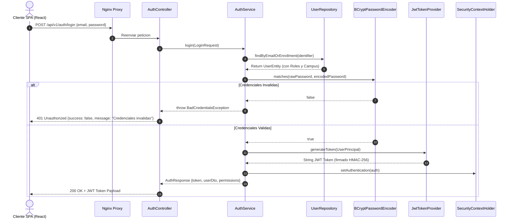

### 7.2 Secuencia de Reagendamiento Atomico R10 con Rollback Transaccional

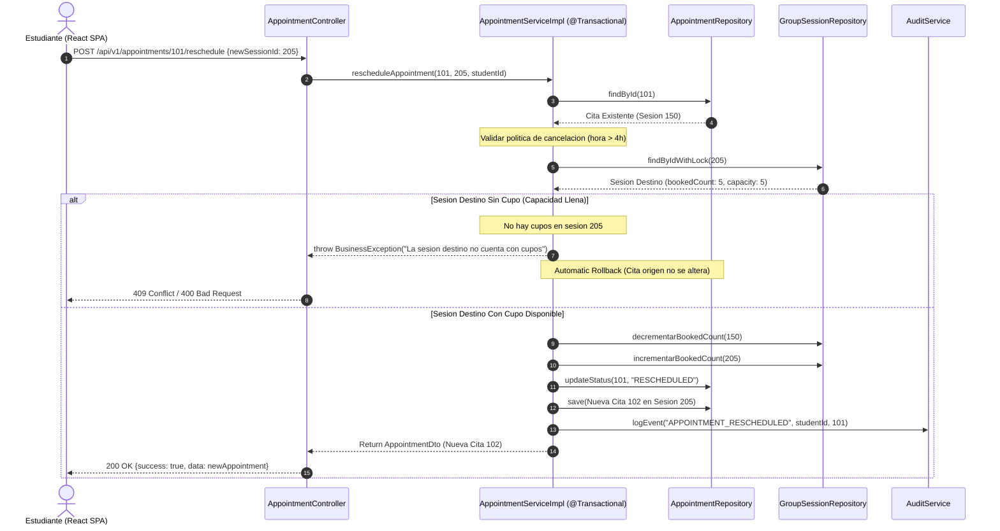

---

## 8. MODELO DE SEGURIDAD Y CONTROL DE ACCESO (RBAC)

### 8.1 Arquitectura de Filtros de Seguridad

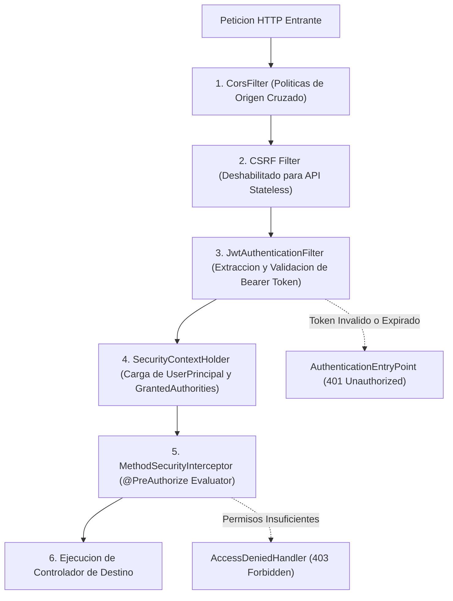

### 8.2 Matriz de Roles y Autorizaciones del Sistema

| Rol del Sistema | Alcance y Descripcion Operativa | Permisos Clave Asignados |
| :--- | :--- | :--- |
| **ROLE_ADMIN** | Control total de la plataforma, administracion de usuarios, seguridad y configuracion global. | `USERS_READ`, `USERS_CREATE`, `USERS_UPDATE`, `USERS_DELETE`, `AUDIT_READ`, `REPORTS_READ`, `CATALOG_MANAGE` |
| **ROLE_COORDINATOR** | Planificacion academica, creacion de grupos, calendarizacion de sesiones y reportes de campus. | `GROUPS_CREATE`, `SESSIONS_SCHEDULE`, `ATTENDANCE_OVERVIEW`, `REPORTS_READ`, `CAMPUS_READ` |
| **ROLE_TEACHER** | Gestion de clases asignadas, consulta de lista de estudiantes y registro de asistencia con notas. | `SESSIONS_VIEW_ASSIGNED`, `ATTENDANCE_RECORD`, `STUDENTS_VIEW_PROGRESS` |
| **ROLE_STUDENT** | Autoservicio academico, exploracion de horarios, reservas de tutorias, reagendamiento y TalkIO. | `APPOINTMENTS_BOOK`, `APPOINTMENTS_CANCEL`, `TALKIO_PRACTICE`, `PROFILE_SELF_UPDATE` |

---

## 9. ARQUITECTURA CLOUD-NATIVE EN MICROSOFT AZURE

### 9.1 Diagrama de Arquitectura de Infraestructura en Microsoft Azure

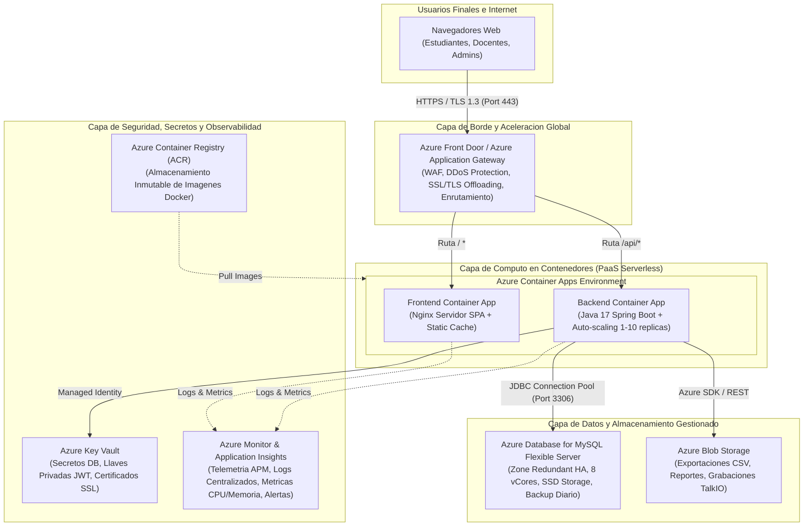

### 9.2 Mapeo de Componentes Locales vs Servicios Nube Azure

| Capa Arquitectonica | Componente en Desarrollo Local | Servicio Gestionado en Microsoft Azure | Beneficio Operacional en Produccion |
| :--- | :--- | :--- | :--- |
| **Ingreso y Seguridad Web** | Nginx Reverse Proxy local | **Azure Front Door + WAF** | Proteccion contra ataques DDoS, aceleracion CDN y SSL global. |
| **Computo Frontend** | Node.js / Vite Dev Server / Nginx | **Azure Container Apps (Frontend)** | Escalado automatico sin servidor con consumo por peticion. |
| **Computo Backend** | Spring Boot JAR embebido | **Azure Container Apps (Backend)** | Auto-escalado elastico basado en concurrencia y consumo de CPU. |
| **Persistencia Relacional** | MySQL 8.0 contenedor Docker | **Azure Database for MySQL Flexible Server** | Alta disponibilidad zonal, backups automaticos y parches sin downtime. |
| **Archivos y Reportes** | Sistema de archivos local | **Azure Blob Storage** | Durabilidad 99.999999999% (11 nueves) y acceso HTTP seguro. |
| **Gestion de Secretos** | `application-local.yml` | **Azure Key Vault** | Cifrado HSM, rotacion de credenciales y acceso por Managed Identity. |
| **Observabilidad y Logs** | Consola y archivos `.log` | **Application Insights & Azure Monitor** | Trazabilidad distribuida, monitoreo de cuellos de botella y alertas 24/7. |

---

## 10. MAQUINAS DE ESTADOS Y CICLOS DE VIDA DEL DOMINIO

### 10.1 Ciclo de Vida de una Cita de Tutoria (`AppointmentStatus`)

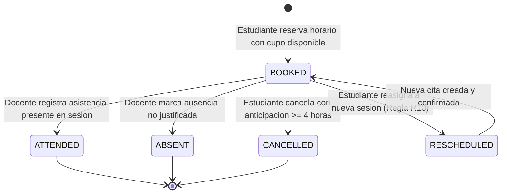

### 10.2 Ciclo de Vida de una Sesion de Tutoria (`SessionStatus`)

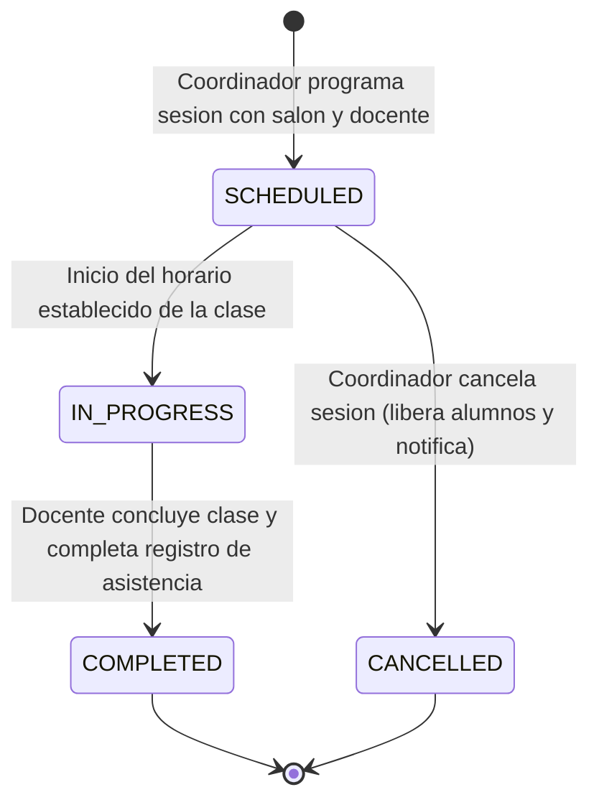

### 10.3 Ciclo de Vida de una Cuenta de Usuario (`UserStatus`)

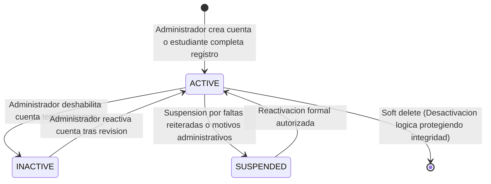

---

## 11. ESTRATEGIAS DE CONCURRENCIA, RESILIENCIA Y ESCALABILIDAD

### 11.1 Control de Concurrencia en Asignacion de Cupos
Para garantizar que nunca se sobrepase la capacidad maxima (`capacity`) de una sesion de tutoria cuando multiples estudiantes intentan reservar exactamente al mismo milisegundo, la arquitectura implementa:
- **Aislamiento Transaccional:** Nivel de transaccion manejado por Spring `@Transactional(isolation = Isolation.READ_COMMITTED)`.
- **Bloqueo Pesimista en Persistencia:** Uso de `SELECT ... FOR UPDATE` en consultas criticas (`findByIdWithLock`) que bloquea el registro de `GroupSession` hasta que la transaccion confirma o revierte.
- **Validacion Atomica en Memoria:** Comprobacion estricta:
  ```java
  if (session.getBookedCount() >= session.getCapacity()) {
      throw new ConflictException("La sesion seleccionada ya no cuenta con cupos disponibles");
  }
  session.setBookedCount(session.getBookedCount() + 1);
  ```

### 11.2 Resiliencia y Manejo Estandarizado de Errores
El componente `GlobalExceptionHandler` intercepta todas las excepciones no controladas y de negocio, normalizando la salida en un esquema JSON predecible:

```json
{
  "success": false,
  "message": "Violacion de regla de negocio R10: ventana de cancelacion superada.",
  "data": null,
  "timestamp": "2026-09-25T18:30:00Z"
}
```

---

## 12. TABLA DE CONTROL DE VERSIONES Y REVISION ARQUITECTONICA

| Version | Fecha | Autor / Equipo | Modificaciones Principales Realizadas |
| :--- | :--- | :--- | :--- |
| **1.0.0** | 2026-09-20 | Software Architecture Team | Diseno inicial de arquitectura en capas y catalogo curricular. |
| **1.1.0** | 2026-09-23 | Senior Backend & Security Lead | Integracion de seguridad Spring Security 6.3, JWT y RBAC. |
| **2.0.0** | 2026-09-25 | Multi-disciplinary Engineering Team | Actualizacion integral Fase 9: User Management, diagramas Mermaid corregidos, HTA, secuencias atomicas R10, especificacion Cloud-Native en Azure y normalizacion de codificacion sin acentos. |
