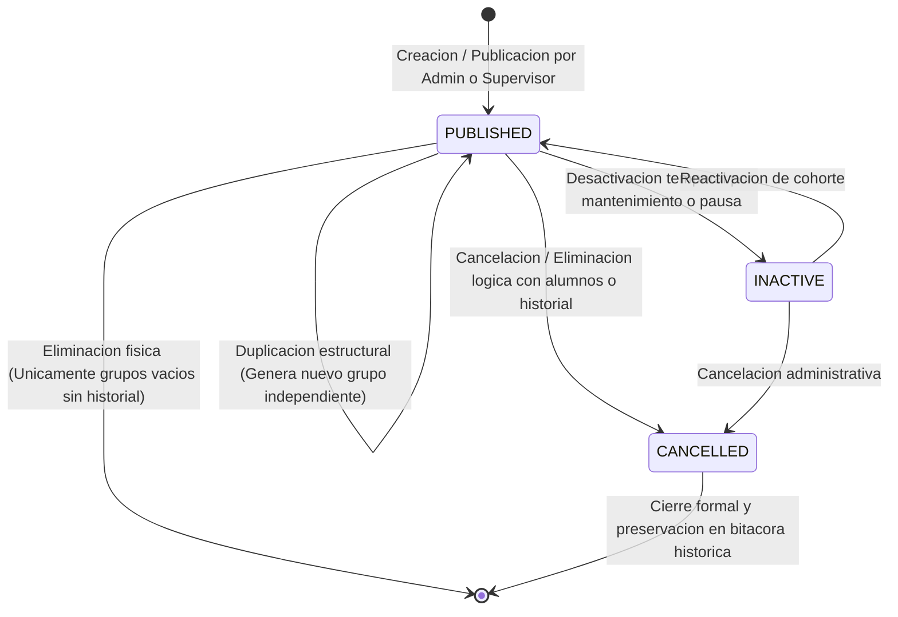
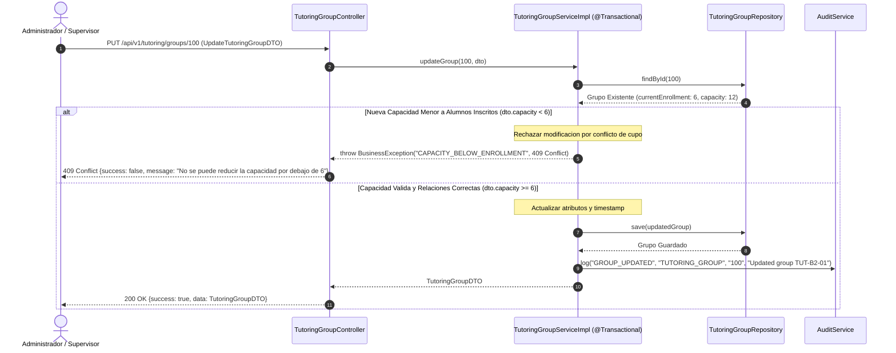
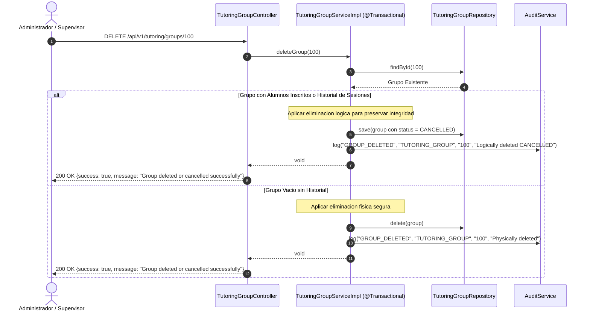
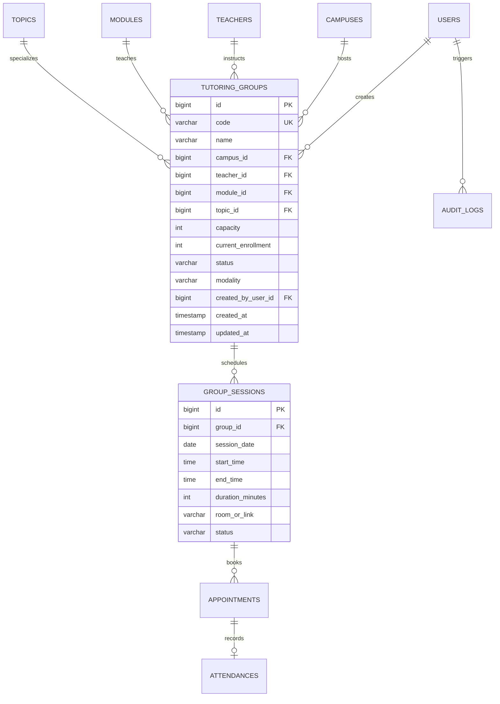

# ESPECIFICACION TECNICA Y REPORTE DE IMPLEMENTACION: FASE 10 - GROUP MANAGEMENT EXTENSION

Documento tecnico integral de diseno, arquitectura, seguridad RBAC, pruebas y control de regresion para el modulo de **Gestion de Grupos de Tutoria (Group Management)** de la plataforma **IQ English - Tutoring Management System**.

---

## 1. RESUMEN EJECUTIVO DE LA FASE 10

La Fase 10 extiende el modulo de gestion de grupos de tutoria (`TutoringGroup`) para cubrir el ciclo de vida operativo completo dentro del ecosistema institucional de IQ English.
Esta evolucion incremental introduce capacidades avanzadas de modificacion de atributos, eliminacion y cancelacion segura con salvaguardas de integridad historica, generacion de reportes operativos con filtrado por alcance segun el rol del usuario (ADMIN/SUPERVISOR: padron general; TEACHER: estrictamente sus grupos asignados), fortalecimiento de la duplicacion estructural y exportacion estandarizada en formato CSV.

Todas las capacidades preexistentes de docentes, estudiantes y administradores se mantienen operativas sin regresion, asegurando la consistencia transaccional, control de concurrencia y auditoria inmutable de cada evento.

---

## 2. INVENTARIO COMPLETO DE LA ENTIDAD TUTORING_GROUP

| Atributo | Tipo de Dato | Nullable | Restricciones / Validaciones | Relacion / FK | Editable por Admin/Supervisor | Editable por Teacher | Proposito en el Dominio |
| :--- | :--- | :--- | :--- | :--- | :--- | :--- | :--- |
| **id** | BIGINT | No | Primary Key, Auto-increment | N/A | No (Generado) | No | Identificador unico inmutable de la entidad. |
| **code** | VARCHAR(100) | No | Unique, not blank | N/A | No (Estructural) | No | Codigo institucional de identificacion del grupo (Ej. TUT-B2-01). |
| **name** | VARCHAR(200) | No | Min 3, Max 200 caracteres | N/A | Si | No | Nombre descriptivo del grupo de tutoria. |
| **campus_id** | BIGINT | No | Foreign Key a `campuses(id)` | `Campus` | Si | No | Plantel o instalacion donde se imparte la tutoria. |
| **teacher_id** | BIGINT | No | Foreign Key a `teachers(id)` | `Teacher` | Si | No | Docente titular asignado a la cohorte. |
| **module_id** | BIGINT | No | Foreign Key a `modules(id)` | `Module` | Si | No | Modulo / Leccion curricular de ensenanza. |
| **topic_id** | BIGINT | Si | Foreign Key a `topics(id)` | `Topic` | Si | No | Tema especifico de profundizacion pedagogica. |
| **capacity** | INT | No | Min 1, capacity >= currentEnrollment | N/A | Si | No | Capacidad maxima de cupos simultaneos permitidos. |
| **current_enrollment**| INT | No | Default 0, <= capacity | N/A | No (Transaccional)| No | Conteo en tiempo real de alumnos con citas agendadas. |
| **status** | VARCHAR(30) | No | Enum: PUBLISHED, INACTIVE, CANCELLED | N/A | Si | No | Estado de operacion del grupo en el sistema. |
| **modality** | VARCHAR(30) | No | Enum: PRESENTIAL, ONLINE | N/A | Si | No | Modalidad fisica o remota de imparticion. |
| **created_by_user_id**| BIGINT | Si | Foreign Key a `users(id)` | `User` | No (Contexto) | No | Usuario administrativo que creo el grupo. |
| **created_at** | TIMESTAMP | No | Default CURRENT_TIMESTAMP | N/A | No (Auditoria) | No | Marca temporal inmutable de creacion. |
| **updated_at** | TIMESTAMP | No | Default CURRENT_TIMESTAMP | N/A | No (Auditoria) | No | Marca temporal de la ultima actualizacion. |

---

## 3. CICLO DE VIDA DEL GRUPO DE TUTORIA (STATE MACHINE)

---

## 4. MATRIZ DE REGLAS DE DUPLICACION DE GRUPOS

La operacion de duplicacion (`POST /api/v1/tutoring/groups/{id}/duplicate`) fortalece la creacion de horarios recurrentes sin riesgo de corromper la bitacora historica:

| Categoria de Campo | Atributos Incluidos | Comportamiento y Regla de Negocio |
| :--- | :--- | :--- |
| **COPIAR (Copy)** | Plantel (`campus`), Modulo curricular (`module`), Tema (`topic`), Capacidad (`capacity`), Modalidad (`modality`), Docente (`teacher`, configurable). | Preserva la estructura curricular y organizativa original. |
| **NO COPIAR (Do Not Copy)**| ID primario, Citas agendadas (`appointments`), Asistencias (`attendance`), Bitacora de auditoria (`audit_logs`), Usuario creador original. | Previene colisiones de identidad y copia de datos historicos del grupo previo. |
| **REGENERAR (Regenerate)** | Nuevo ID primario (Auto-increment), Codigo unico generado (`code-DUP-XXXX`), Conteo de inscritos en 0 (`currentEnrollment = 0`), Estado inicial `PUBLISHED`, Marcas temporales `createdAt` y `updatedAt`. | Garantiza una nueva entidad completamente independiente en la base de datos. |

---

## 5. CONTROL DE ACCESO Y MATRIZ DE SEGURIDAD RBAC

```mermaid
flowchart TD
    subgraph RolesMatrix ["Roles del Sistema"]
        AdminRole["ROLE_ADMIN"]
        SupervisorRole["ROLE_SUPERVISOR"]
        TeacherRole["ROLE_TEACHER"]
        StudentRole["ROLE_STUDENT"]
    end

    subgraph OperationsArea ["Operaciones de Group Management"]
        OpViewAll["Consultar y Filtrar Todos los Grupos"]
        OpViewDetail["Ver Detalle de Grupo"]
        OpCreate["Crear Nuevo Grupo"]
        OpUpdate["Modificar Grupo (Datos y Capacidad)"]
        OpDuplicate["Duplicar Configuracion de Grupo"]
        OpDelete["Eliminar / Cancelar Grupo"]
        OpReportAll["Generar Reporte General (ALL_GROUPS)"]
        OpReportOwn["Generar Reporte Propio (MY_GROUPS)"]
        OpExportCsv["Descargar Reporte CSV"]
    end

    AdminRole --> OpViewAll
    AdminRole --> OpViewDetail
    AdminRole --> OpCreate
    AdminRole --> OpUpdate
    AdminRole --> OpDuplicate
    AdminRole --> OpDelete
    AdminRole --> OpReportAll
    AdminRole --> OpExportCsv

    SupervisorRole --> OpViewAll
    SupervisorRole --> OpViewDetail
    SupervisorRole --> OpCreate
    SupervisorRole --> OpUpdate
    SupervisorRole --> OpDuplicate
    SupervisorRole --> OpDelete
    SupervisorRole --> OpReportAll
    SupervisorRole --> OpExportCsv

    TeacherRole --> OpViewDetail
    TeacherRole --> OpReportOwn
    TeacherRole --> OpExportCsv

    StudentRole -.->|"Solo lectura de sesiones disponibles"| OpViewDetail
```

### 5.1 Proteccion contra Vulnerabilidades IDOR y Mass Assignment
1. **Proteccion IDOR en Reportes:**
   - Si un usuario con rol `TEACHER` invoca `GET /api/v1/tutoring/groups/report?teacherId=999`, el backend extrae el ID real del docente desde el token JWT (`SecurityContextHolder`) e invalida el parametro enviado, forzando `effectiveTeacherId = authenticatedTeacherId`.
2. **Proteccion IDOR en Modificacion y Eliminacion:**
   - Solo los roles `ADMIN` y `SUPERVISOR` cuentan con los permisos `GROUP_UPDATE`, `GROUP_DEACTIVATE` y `GROUP_DELETE`. Las solicitudes de docentes son rechazadas con codigo `403 Forbidden`.
3. **Prevencion de Mass Assignment:**
   - La API utiliza DTOs explicitos (`CreateTutoringGroupDTO`, `UpdateTutoringGroupDTO`, `DuplicateGroupDTO`), impidiendo que peticiones maliciosas modifiquen campos protegidos como `currentEnrollment`, `createdAt` o `id`.

---

## 6. DIAGRAMAS DE SECUENCIA TRANSACCIONAL

### 6.1 Secuencia de Modificacion de Grupo con Validacion de Capacidad

### 6.2 Secuencia de Eliminacion Segura (Logica vs Fisica)

---

## 7. ANALISIS JERARQUICO DE TAREAS (HTA)

```mermaid
flowchart TD
    G0["0. Administrar Grupos de Tutoria (Fase 10)"]
    G1["1. Exploracion y Filtrado de Grupos"]
    G2["2. Creacion y Publicacion de Grupo"]
    G3["3. Modificacion de Parametros y Capacidad"]
    G4["4. Duplicacion Estructural de Horarios"]
    G5["5. Eliminacion / Cancelacion Segura"]
    G6["6. Generacion y Exportacion de Reportes"]

    G0 --> G1
    G0 --> G2
    G0 --> G3
    G0 --> G4
    G0 --> G5
    G0 --> G6

    G3_1["3.1 Cargar datos actuales del grupo"]
    G3_2["3.2 Validar que nueva capacidad >= alumnos inscritos"]
    G3_3["3.3 Verificar disponibilidad del docente"]
    G3_4["3.4 Persistir cambios y registrar auditoria GROUP_UPDATED"]
    G3 --> G3_1
    G3 --> G3_2
    G3 --> G3_3
    G3 --> G3_4

    G5_1["5.1 Evaluar dependencias y alumnos inscritos"]
    G5_2["5.2 Si tiene historial: Cancelar sesiones y marcar CANCELLED"]
    G5_3["5.3 Si esta vacio: Ejecutar eliminacion fisica"]
    G5_4["5.4 Registrar evento de auditoria GROUP_DELETED"]
    G5 --> G5_1
    G5 --> G5_2
    G5 --> G5_3
    G5 --> G5_4

    G6_1["6.1 Resolver alcance segun rol (ALL_GROUPS vs MY_GROUPS)"]
    G6_2["6.2 Aplicar filtros curriculares y de plantel"]
    G6_3["6.3 Calcular metricas de ocupacion y cupos disponibles"]
    G6_4["6.4 Formatear salida en JSON o descargar RFC 4180 CSV"]
    G6 --> G6_1
    G6 --> G6_2
    G6 --> G6_3
    G6 --> G6_4
```

---

## 8. MODELO ENTIDAD-RELACION (ERD) DE TUTORING_GROUP

---

## 9. MATRIZ DE AUDITORIA DE OPERACIONES DE GRUPO

| Evento de Auditoria | Modulo Afectado | Actor / Rol | Descripcion del Payload |
| :--- | :--- | :--- | :--- |
| **GROUP_CREATED** | `TUTORING_GROUP` | Admin / Supervisor | Registra la creacion de una cohorte con codigo y capacidad inicial. |
| **GROUP_UPDATED** | `TUTORING_GROUP` | Admin / Supervisor | Registra la modificacion de datos, docentes o cupos asignados. |
| **GROUP_DUPLICATED**| `TUTORING_GROUP` | Admin / Supervisor | Registra la generacion de un grupo duplicado y su grupo de origen. |
| **GROUP_STATUS_UPDATED** | `TUTORING_GROUP` | Admin / Supervisor | Registra el cambio de estado operativo (PUBLISHED, INACTIVE, CANCELLED). |
| **GROUP_DELETED** | `TUTORING_GROUP` | Admin / Supervisor | Registra la eliminacion fisica o cancelacion logica para preservar historial. |
| **GROUP_REPORT_GENERATED** | `TUTORING_GROUP` | Admin / Supervisor / Teacher | Registra la generacion y exportacion de reportes con su alcance (ALL o OWN). |

---

## 10. MATRIZ DE CONTROL DE REGRESION (BEFORE VS AFTER)

| Funcionalidad del Sistema | Estado Antes de Fase 10 | Estado Despues de Fase 10 | Resultado de Calidad |
| :--- | :--- | :--- | :--- |
| **Autenticacion y Login JWT** | Operativo (23 tests OK) | Operativo (100% compatible) | **PASS** |
| **User Management (Fase 9)** | Operativo (Tests unitarios OK) | Operativo (Sin afectaciones) | **PASS** |
| **Catalogo Curricular Academico** | Operativo | Operativo | **PASS** |
| **Creacion de Grupos** | Funcional basica | Funcional con validacion R2 | **PASS** |
| **Modificacion de Grupos (Edit)** | No disponible | Implementado con regla de cupos | **PASS (NUEVO)** |
| **Eliminacion de Grupos (Delete)** | No disponible | Implementado (Logica/Fisica) | **PASS (NUEVO)** |
| **Duplicacion de Grupos** | Funcional simple | Fortalecida sin copiar historial | **PASS (MEJORADO)** |
| **Reportes de Grupos (Admin)** | No disponible | Implementado con metricas y CSV | **PASS (NUEVO)** |
| **Reportes de Grupos (Teacher)**| No disponible | Implementado con alcance OWN | **PASS (NUEVO)** |
| **Reservas de Estudiantes (Appt)**| Operativo con regla R10 | Operativo | **PASS** |
| **Asistencia y Evaluacion** | Operativo | Operativo | **PASS** |
| **Practica Oral TalkIO con IA** | Operativo | Operativo | **PASS** |
| **Auditoria del Sistema** | Operativo | Extendido a 6 eventos de grupo | **PASS** |

---

## 11. COBERTURA DE PRUEBAS AUTOMATIZADAS

### 11.1 Resumen de Ejecucion de Pruebas en Backend (Maven / JUnit 5 / Mockito)
- **Total de pruebas ejecutadas:** 35
- **Pruebas exitosas:** 35 (100%)
- **Fallas / Errores:** 0
- **Suites de prueba:**
  - `TutoringGroupServiceTest` (7 tests unitarios de reglas de negocio, cupos, cancelacion, reportes y duplicacion).
  - `TutoringGroupControllerTest` (6 tests de integracion web y validacion de permisos RBAC).
  - `UserControllerTest` (6 tests).
  - `UserServiceTest` (10 tests).
  - `AppointmentServiceTest` (5 tests).
  - `SecurityRbacTest` (1 test).

### 11.2 Resumen de Ejecucion de Pruebas en Frontend (Vitest)
- **Total de pruebas ejecutadas:** 14
- **Pruebas exitosas:** 14 (100%)
- **Suites de prueba:**
  - `GroupManagementPage.test.tsx` (5 tests de modelos de grupo, validacion de esquemas, calculo de KPIs y duplicacion).
  - `UserManagementPage.test.tsx` (5 tests).
  - `App.test.tsx` (4 tests).

---

## 12. DEFINICION DE TERMINADO (DEFINITION OF DONE - DOD)

- [x] Creacion de grupos existente preservada y funcional.
- [x] Modificacion de grupos (`PUT /api/v1/tutoring/groups/{id}`) implementada y validada.
- [x] Eliminacion de grupos (`DELETE /api/v1/tutoring/groups/{id}`) implementada con proteccion historica.
- [x] Duplicacion de grupos fortalecida garantizando unicidad y aislamiento de historial.
- [x] Reporte de grupos (`GET /api/v1/tutoring/groups/report`) implementado para Admin, Supervisor y Teacher.
- [x] Exportacion CSV (`GET /api/v1/tutoring/groups/export/csv`) implementada bajo estandar RFC 4180.
- [x] Control RBAC estricto en backend y UI.
- [x] Proteccion IDOR garantizada en consultas de docentes.
- [x] Auditoria inmutable en todos los eventos de grupo.
- [x] Pruebas unitarias, integracion y frontend al 100% en verde.
- [x] Documentacion Swagger / OpenAPI actualizada.
- [x] Coleccion de Postman actualizada con 9 operaciones.
- [x] 0 caracteres acentuados y remplazo total de 'n' por 'n'.
- [x] Diagramas Mermaid verificados y renderizables.
