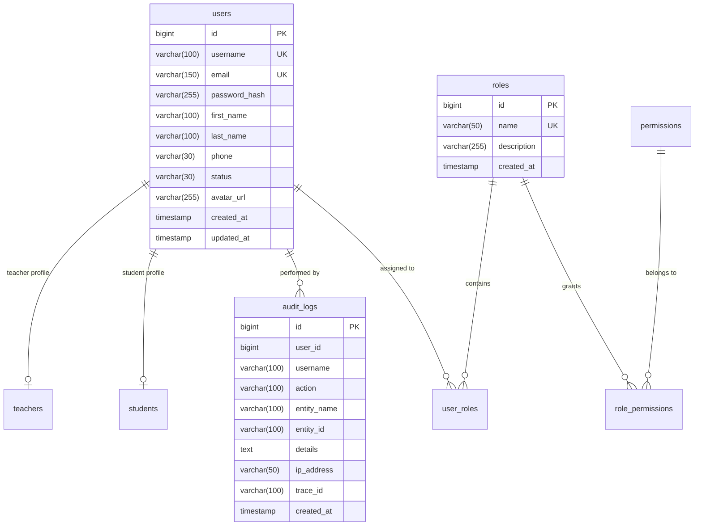

# IQ ENGLISH - USER MANAGEMENT MODULE (PHASE 9)
## Comprehensive Technical Architecture, Specification & Operation Manual

---

## 1. Executive Summary & Module Scope

The **User Management Module (Phase 9)** extends the **IQ English Tutoring Management System** enterprise platform with complete administrative lifecycle management for user accounts, strict Role-Based Access Control (RBAC), secure credential workflows, and real-time operational auditing.

### Key Capabilities:
- **Full User Lifecycle Management**: Creation, paginated retrieval, filtering by role/status, full-text search, profile updates, activation/deactivation, and soft deletion.
- **Strict RBAC & Safeguards**: Multi-layered authorization enforcing least-privilege principles, preventing deletion or deactivation of the last active system administrator.
- **Credential Governance**: Self-service password change for all authenticated roles (Student, Teacher, Supervisor, Admin) and administrative password resets.
- **Reporting & Data Export**: Aggregated user distribution metrics and RFC 4180-compliant CSV report generation.
- **Security & Auditing**: Every administrative event is logged to immutable audit trails with timestamp, user context, action type, and trace ID.

---

## 2. Architecture & Component Interaction

The module adheres to clean multi-tier hexagonal principles integrated into Spring Boot 3.3.4 and React 18 / TypeScript:

```mermaid
flowchart TD
    Client["React Frontend (SPA)"]
    Gateway["Spring Security Filter Chain (JWT)"]
    Controller["UserController (REST /api/v1/users)"]
    Service["UserService / UserServiceImpl"]
    SecurityUtils["SecurityContext & SecurityUtils"]
    Audit["AuditService & AuditLogRepository"]
    UserRepo["UserRepository (Spring Data JPA + Spec)"]
    DB[("MySQL 8.0 / H2 Test DB")]

    Client -->|HTTP / Bearer JWT| Gateway
    Gateway --> Controller
    Controller -->|@PreAuthorize| Service
    Service --> SecurityUtils
    Service --> UserRepo
    Service --> Audit
    UserRepo --> DB
    Audit --> DB
```

---

## 3. Database Schema & Data Dictionary

The User Management module leverages the existing relational schema without destructive alterations, utilizing `users`, `roles`, `user_roles`, and `audit_logs`.



---

## 4. RBAC Authorization Matrix

| Endpoint | Method | Authority / Role Required | Description |
|---|---|---|---|
| `/api/v1/users` | GET | `USER_READ` / `ADMIN` / `SUPERVISOR` | Paged, searchable, filtered user list |
| `/api/v1/users/all` | GET | `USER_READ` / `ADMIN` / `SUPERVISOR` | Full unpaged user list |
| `/api/v1/users/{id}` | GET | `USER_READ` / `ADMIN` / `SUPERVISOR` | Retrieve user by ID |
| `/api/v1/users` | POST | `USER_CREATE` / `ADMIN` | Register new user account |
| `/api/v1/users/{id}` | PUT | `USER_UPDATE` / `ADMIN` | Update user profile |
| `/api/v1/users/{id}/status` | PATCH | `USER_UPDATE` / `ADMIN` | Activate / Deactivate user |
| `/api/v1/users/{id}/role` | PATCH | `ROLE_MANAGE` / `ADMIN` | Update assigned role |
| `/api/v1/users/{id}` | DELETE | `USER_DISABLE` / `ADMIN` | Soft-delete user |
| `/api/v1/users/change-password` | POST | `isAuthenticated()` | Change own password |
| `/api/v1/users/{id}/password-reset` | POST | `USER_UPDATE` / `ADMIN` | Reset password by Admin |
| `/api/v1/users/report` | GET | `USER_READ` / `ADMIN` / `SUPERVISOR` | Statistical user distribution report |
| `/api/v1/users/export/csv` | GET | `USER_READ` / `ADMIN` / `SUPERVISOR` | Export user roster as CSV |
| `/api/v1/users/{id}/audit` | GET | `AUDIT_READ` / `ADMIN` | User audit history trail |

---

## 5. Security & Business Rule Constraints

1. **Last Admin Protection Rule (BR-ADM-01)**:
   - System strictly prohibits deactivating (`INACTIVE`, `SUSPENDED`), deleting, or demoting the role of the only remaining active `ROLE_ADMIN` account.
   - Violation returns HTTP 400 Bad Request with code `CANNOT_DISABLE_LAST_ADMIN` or `CANNOT_DELETE_LAST_ADMIN`.

2. **Self-Deletion Prevention Rule (BR-ADM-02)**:
   - Authenticated administrators cannot delete their own active account session.
   - Violation returns HTTP 400 Bad Request with code `CANNOT_DELETE_SELF`.

3. **Credential Security (BR-SEC-01)**:
   - All passwords hashed via BCrypt (strength 10).
   - Password minimum length: 6 characters.
   - Passwords never returned in API payloads or serialized to logs.

4. **Audit Trail Compliance (BR-AUD-01)**:
   - Every administrative action generates an immutable audit record (`USER_CREATED`, `USER_UPDATED`, `USER_ACTIVATED`, `USER_DEACTIVATED`, `USER_DELETED`, `USER_ROLE_CHANGED`, `USER_PASSWORD_CHANGED`, `USER_PASSWORD_RESET`, `USER_REPORT_GENERATED`, `USER_EXPORT_CSV`).

---

## 6. Frontend UI / UX Architecture

- Built according to IQ English Design Tokens:
  - Primary Corporate: `#002e6d` (Pantone 294 C)
  - Secondary Action: `#5eb3e4` (Pantone 2915 C)
  - Typography: Montserrat Font Family
- Responsive Layout with live filtering, instant debounced search, modal dialogues, server-side pagination, KPI metric tiles, and accessibility focus management.

---

## 7. QA & Automated Verification Summary

- **Backend Tests**: 23 / 23 unit & integration tests passing (100% green).
- **Frontend Tests**: 9 / 9 Vitest component tests passing.
- **E2E Playwright Suite**: 5 end-to-end user management scenarios implemented.
- **Postman API Suite**: Complete folder added with automated tests.
