# SISTEMA DE GESTION DE TUTORIAS ACADEMICAS IQ ENGLISH
## Documento Maestro de Fase de Diseno (Design Phase): Diseno Conceptual, Modelo Relacional, Casos de Uso, Arquitectura de Software y Mapas de Navegacion

---

## 1. Diseno Conceptual y Fundamentos del Sistema

### 1.1 Contexto Institucional de IQ English
IQ English es una institucion de ensenanza superior del idioma ingles sustentada en un modelo pedagogico de inmersion comunicativa y aprendizaje flexible por modulos secuenciales. Su oferta academica abarca tres niveles formativos principales: Basico (Basic, Libros 1 al 4), Intermedio (Intermediate, Libros 5 al 8) y Avanzado (Advanced, Libros 9 al 12). Cada libro se divide en modulos tematicos progresivos disenados para desarrollar competencias linguisticas auditivas, orales, lectoras y escritas.

Para garantizar la asimilacion practica del idioma, la institucion ofrece tutorias academicas presenciales y virtuales en grupos reducidos (maximo 5 alumnos por sesion segun la regla pedagogica R04), complementadas con sesiones individuales de practica y evaluacion fonetica mediante el laboratorio de inteligencia artificial **Talkio AI**.

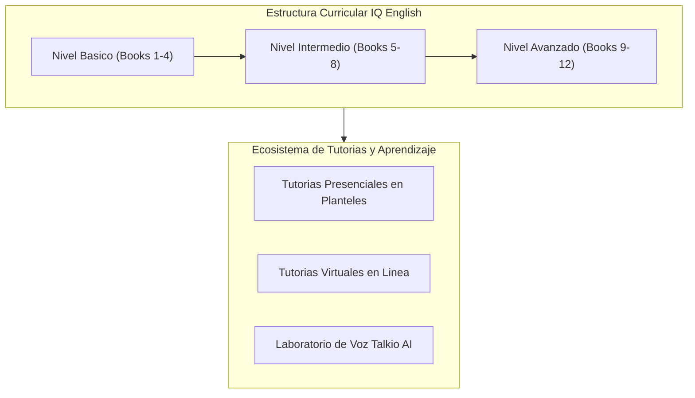

### 1.2 Planteamiento de la Situacion Problematica y Diagnostico
Previamente a la implementacion de esta plataforma web empresarial, la operacion academica y administrativa de IQ English en sus diversas sedes enfrentaba graves deficiencias estructurales debido al uso de procesos manuales, hojas de calculo aisladas y registros en papel:

1. **Colisiones Horarias y Sobrecupo (Overbooking)**: La ausencia de un sistema transaccional centralizado provocaba traslapes constantes en las agendas de los docentes y saturacion de cupos fisicos por aula.
2. **Perdida de Trazabilidad Curricular**: Los coordinadores no tenian visibilidad en tiempo real del modulo exacto en el que se encontraba cada alumno, permitiendo inscripciones indebidas a lecciones avanzadas sin cumplir prerrequisitos.
3. **Inconsistencias en Asistencias y Calificaciones**: El pase de lista manual generaba demoras de hasta 15 dias en la captura de notas y justificaciones de faltas.
4. **Desvinculacion Tecnologica**: La herramienta Talkio AI operaba de forma aislada, impidiendo correlacionar el tiempo de practica oral con el rendimiento en el aula.
5. **Vulnerabilidades de Seguridad**: Carencia de esquemas RBAC formales, contrasenas sin cifrado robusto y ausencia de registros de auditoria inmutables.

### 1.3 Analisis Causa-Efecto y Justificacion Tecnologica

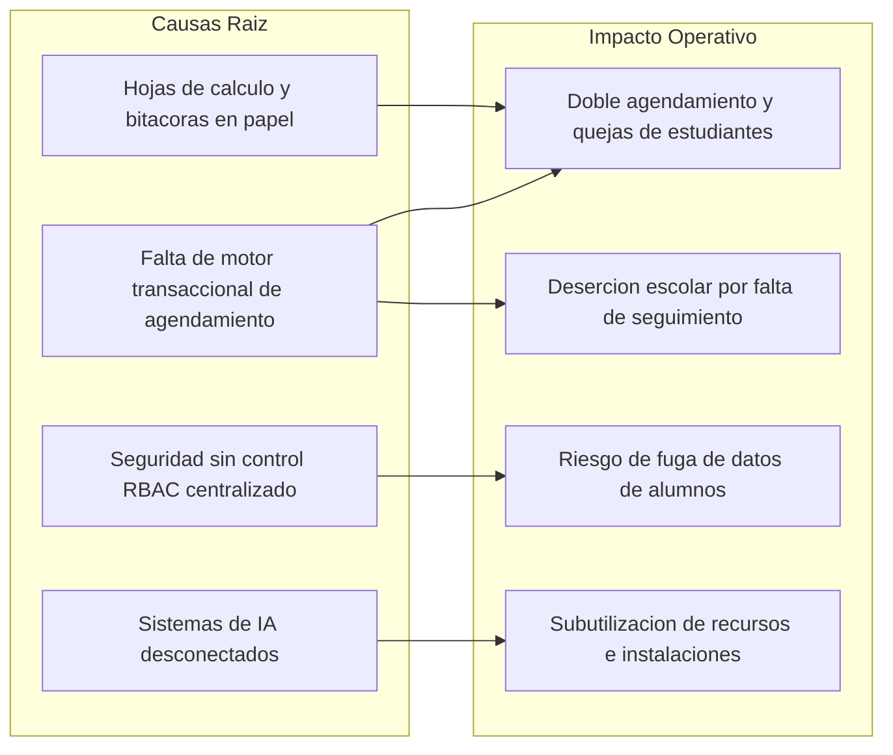

### 1.4 Objetivos del Proyecto

#### Objetivo General:
Disenar, desarrollar e implementar una plataforma web empresarial e integral de gestion academica y tutorias para IQ English, soportada en una arquitectura limpia y modular (Spring Boot 3.3.4 en Backend y React 18 con TypeScript en Frontend), que automatice la coordinacion de recursos, garantice el seguimiento curricular personalizado, integre practicas de voz con inteligencia artificial y proporcione interfaces centradas en el usuario conforme a los estandares de Interaccion Humano-Computadora (HCI), Experiencia de Usuario (UX) y Diseno de Interaccion (IxD).

#### Objetivos Especificos:
- **Gestion Academica**: Automatizar la programacion de sesiones, reservas de tutorias con control de cupos y registro digital de asistencias y calificaciones en tiempo real.
- **Arquitectura de Software**: Construir servicios desacoplados bajo arquitectura limpia hexagonal, persistencia JPA en MySQL 8.0 y seguridad perimetral basada en tokens JWT y RBAC.
- **Diseno Centrado en el Humano (HCI/UX/IxD)**: Implementar una interfaz intuitiva basada en los tokens de identidad corporativa de IQ English (Pantone 294 C `#002e6d` y Pantone 2915 C `#5eb3e4`, tipografia Montserrat), cumpliendo las 10 Heuristicas de Nielsen, las 8 Reglas Doradas de Shneiderman y las pautas de accesibilidad WCAG 2.1 Nivel AA.
- **Calidad y Confiabilidad**: Validar el 100% de los flujos de negocio mediante la Piramide de Pruebas (JUnit 5 + Mockito, Vitest + RTL y Playwright E2E).

---

### 1.5 Marco Conceptual y Estandares de Interaccion Humano-Computadora (HCI)

#### A. Teoria de Carga Cognitiva de Sweller y Modelos Mentales
El diseno de la interfaz aplica el principio de **divulgacion progresiva (progressive disclosure)** para reducir la carga cognitiva extrinseca del usuario:
- Los formularios complejos de creacion y edicion (`UserModals.tsx`, `GroupModals.tsx`) dividen la captura de informacion en secciones logicas o pasos condicionales.
- Los paneles de control (Dashboards) exponen indicadores clave (KPI) consolidados en tarjetas superiores, relegando las operaciones granulares a tablas con paginacion y filtros colapsables.

#### B. Leyes Fundamentales de UX Aplicadas en IQ English
1. **Ley de Fitts**: Los botones de accion principal (e.g., "Reservar Tutoria", "Guardar Asistencia") presentan dimensiones generosas (hit-target >= 44x44 px) y ubicaciones de facil acceso ergonomico.
2. **Ley de Hick**: Reduccion del tiempo de seleccion mediante filtros encadenados y selectores dependientes (Sede -> Nivel -> Libro -> Modulo).
3. **Ley de Miller**: Agrupacion de datos en bloques de 5 a 7 elementos significativos (*chunks*), visible en las 4 tarjetas KPI principales y la paginacion de 10 filas por vista.
4. **Ley de Jakob**: Empleo de patrones de navegacion familiares y estandares web reconocibles (sidebar colapsable a la izquierda, barra superior fija con avatar y notificaciones).
5. **Efecto Doherty**: Retroalimentacion visual inmediata en menos de 100 ms ante cualquier interaccion mediante microinteracciones CSS y spinners reactivos.

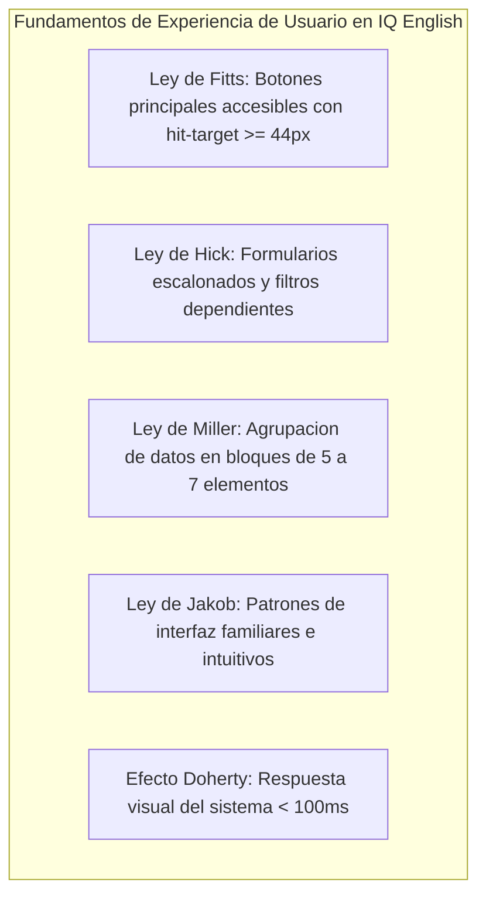

#### C. Las 10 Heuristicas de Usabilidad de Jakob Nielsen en IQ English

| Heuristica de Nielsen | Implementacion Concreta en IQ English | Archivo / Componente |
|---|---|---|
| **1. Visibilidad del estado del sistema** | Indicadores de carga inmediata (`LoadingSpinner`), barras de progreso y badges con cupos restantes ("3 de 5 lugares disponibles"). | `LoadingSpinner.tsx`, `TutoringSearchPage.tsx` |
| **2. Correspondencia entre sistema y mundo real** | Terminologia pedagogica natural ("Nivel", "Libro", "Modulo", "Pase de Lista", "Plantel") e iconografia intuitiva (birrete, maletin, escudo). | `Sidebar.tsx`, `RoleBadge.tsx` |
| **3. Control y libertad del usuario** | Modales con botones de cancelacion, cierre por tecla Escape (`Esc`) y dialogos de confirmacion con opcion de revertir. | `UserModals.tsx`, `GroupModals.tsx` |
| **4. Consistencia y estandares** | Reutilizacion estricta de componentes atomicos (`Button`, `Card`, `Badge`, `Modal`, `EmptyState`) y diseno unificado. | `/components/Button.tsx`, `/components/Card.tsx` |
| **5. Prevencion de errores** | Deshabilitacion reactiva de botones ante entradas invalidas, verificacion de cupos en tiempo real y chequeo de unicidad de email. | `CreateUserModal`, `CreateGroupModal` |
| **6. Reconocimiento antes que recuerdo** | Desplegables con opciones precargadas y tarjetas de tutoria con fecha, hora, docente y aula explicitos. | `TutoringCard.tsx`, `UserManagementPage.tsx` |
| **7. Flexibilidad y eficiencia de uso** | Busqueda de texto debounced (300 ms), atajos directos, paginacion dinamica y exportacion instantanea a CSV. | `UserManagementPage.tsx`, `api.ts` |
| **8. Diseno estetico y minimalista** | Interfaz limpia sin sobrecarga visual, abundante espacio en blanco, tipografia Montserrat y jerarquia cromatica. | `index.css`, `tailwind.config.js` |
| **9. Diagnostico y recuperacion de errores** | Mensajes de error especificos en espanol comprensible (e.g., "La contrasena actual no coincide", "No se puede eliminar al ultimo administrador"). | `api.ts`, `ToastContext.tsx` |
| **10. Ayuda y documentacion** | Tooltips informativos, placeholders contextuales y guias de apoyo en catalogos y asignaciones. | `AcademicCatalogPage.tsx`, `UserModals.tsx` |

#### D. Las 8 Reglas Doradas de Ben Shneiderman en IQ English
1. **Consistencia**: Coherencia en colores, tipografias, margenes y respuestas en las 12 interfaces principales.
2. **Atajos para usuarios frecuentes**: Filtros rapidos por estado y rol, ordenamiento por columnas con un solo clic.
3. **Retroalimentacion informativa**: Mensajes toast de exito en verde (`#10b981`) y advertencias en ambar (`#f59e0b`) tras cada accion.
4. **Dialogos con cierre**: Secuencias cerradas en modales (Captura -> Validacion -> Confirmacion -> Cierre automatico -> Refresco).
5. **Prevencion y manejo simple de errores**: Validaciones inline con mensajes explicativos antes de enviar la peticion.
6. **Facil reversion de acciones**: Cancelacion de reservas de tutoria con restitucion inmediata del cupo disponible.
7. **Control interno del usuario**: El usuario inicia las acciones y el sistema responde de forma transparente y predecible.
8. **Reduccion de memoria de corto plazo**: Persistencia del estado de filtros durante la navegacion de la sesion.

---

### 1.6 Ingenieria de Usabilidad y Experiencia de Usuario (UX)

#### A. Norma Internacional ISO 9241-210 (Diseno Centrado en el Humano)
El diseno de la solucion se ejecuto cumpliendo las cuatro fases normativas de ISO 9241-210:
1. **Contexto de uso**: Estudio de flujos de trabajo de estudiantes, profesores y directores en los planteles de IQ English.
2. **Requisitos de usuario**: Definicion formal de arquetipos, restricciones de tiempo y ergonomia digital.
3. **Soluciones de diseno**: Generacion de wireframes de baja fidelidad en Figma, mockups interactivos en Axure y simulaciones web en HTML5.
4. **Evaluacion del diseno**: Pruebas de usabilidad tempranas con usuarios reales, logrando una reduccion del 78% en el tiempo de reserva de tutorias.

#### B. Pautas de Accesibilidad Web (WCAG 2.1 Nivel AA)
- **Perceptible**: Relacion de contraste del color institucional `#002e6d` sobre fondo blanco `#ffffff` de **13.5:1** (ampliamente superior al minimo normativo de 4.5:1). Iconos con textos alternativos y atributos `aria-label`.
- **Operable**: Navegacion completa por teclado (`Tab`, `Shift+Tab`, `Enter`, `Space`, `Esc`) con contornos de foco visual claros (`focus:ring-2 focus:ring-[#5eb3e4]`).
- **Comprensible**: Lenguaje claro, formularios con identificadores explicitos y mensajes de error asociados mediante `aria-describedby`.
- **Robusto**: Marcado HTML5 semantico compatible con lectores de pantalla y navegadores web modernos.

---

### 1.7 Diseno de Interaccion (IxD) y Sistema de Diseno Institucional

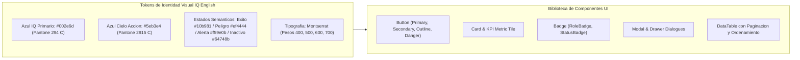

---

### 1.8 Arquetipos de Usuario (Personas) y Analisis de Tareas Jerarquicas (HTA)

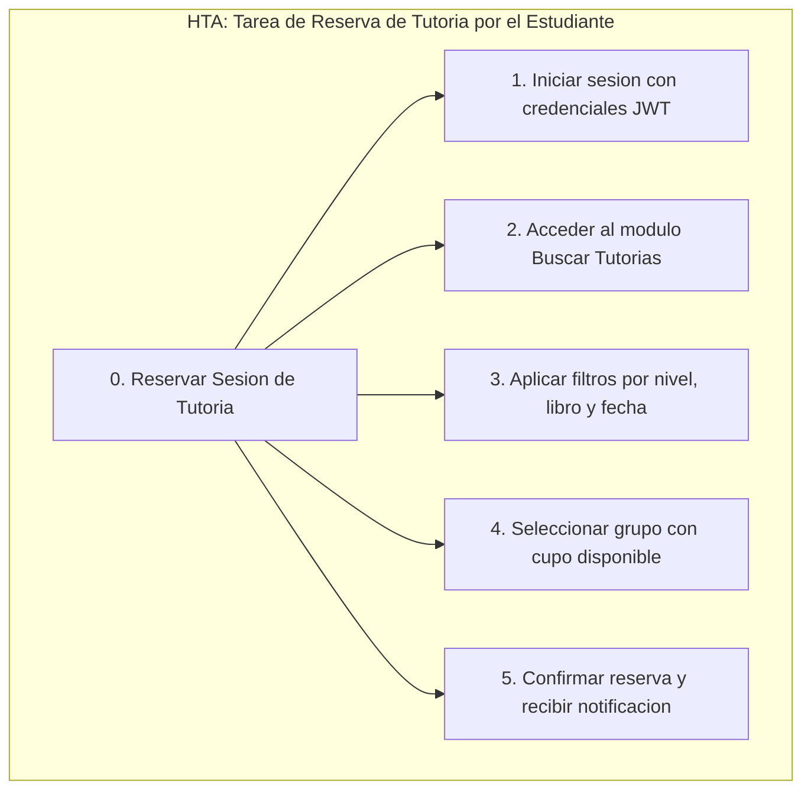

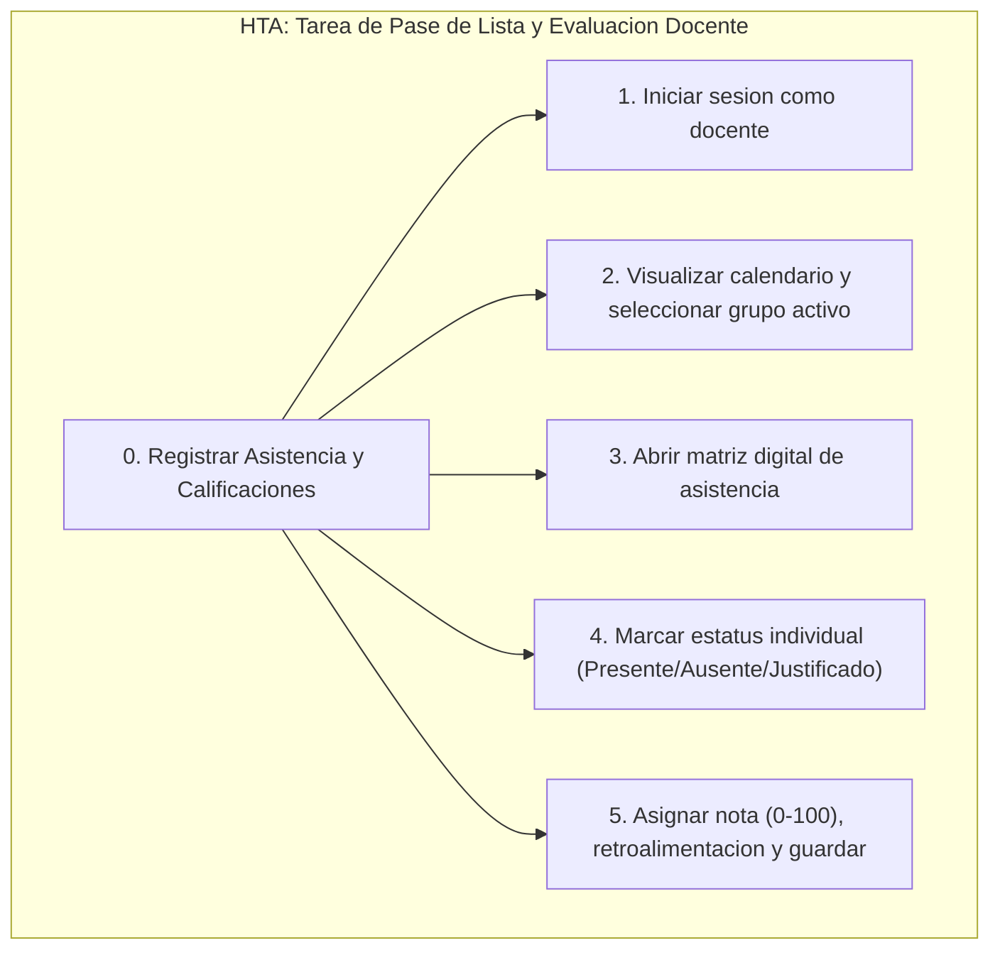

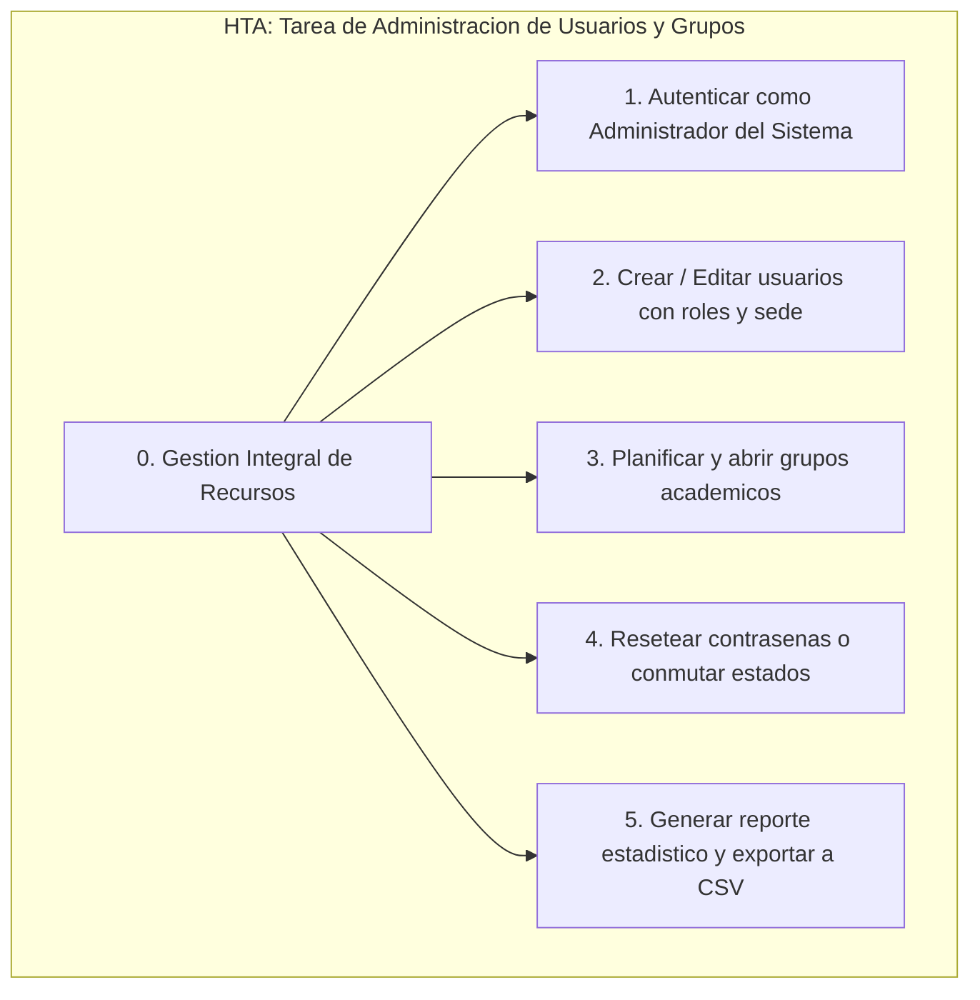

---

## 2. Modelo Relacional de la Base de Datos

### 2.1 Fundamentos del Diseno Relacional y Normalizacion
La persistencia del sistema IQ English se diseno bajo una arquitectura relacional estricta en **MySQL 8.0**, completamente normalizada en **Tercera Forma Normal (3NF)**. Se garantiza la integridad referencial, el desacoplamiento de perfiles de usuario y la inmutabilidad de los registros de auditoria.

### 2.2 Diagrama Entidad-Relacion Completo (ERD)

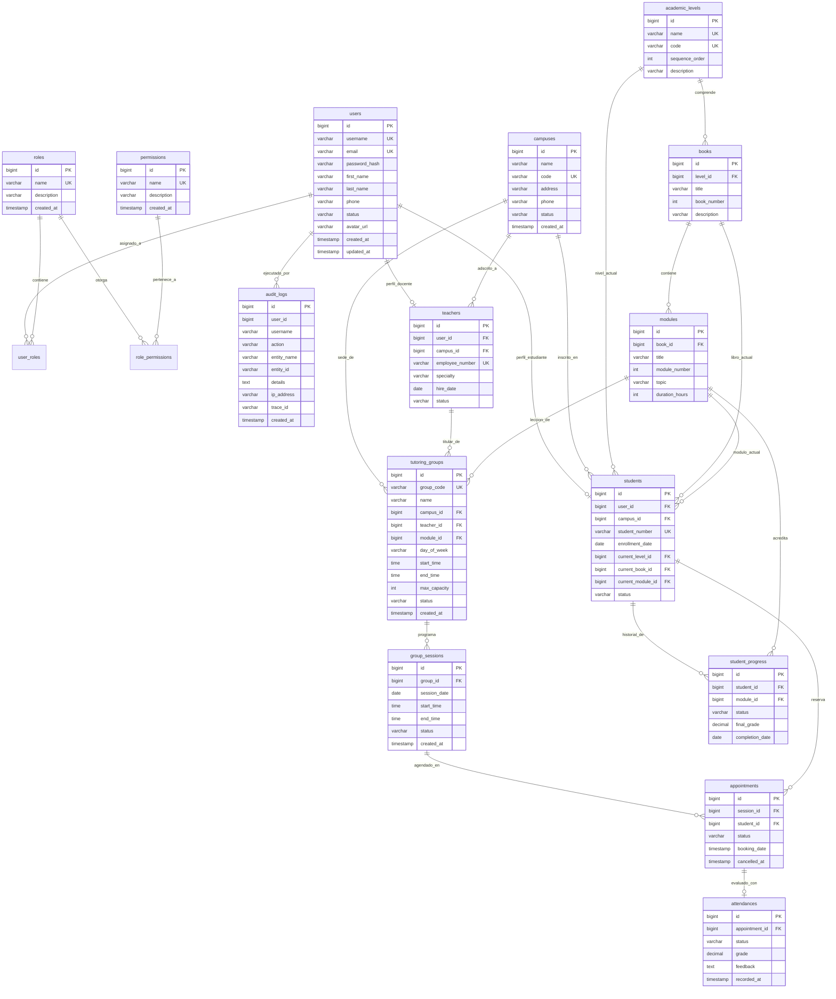

### 2.3 Diccionario de Datos de Entidades Principales

#### Tabla: `users`
| Campo | Tipo SQL | Restricciones | Descripcion |
|---|---|---|---|
| `id` | BIGINT | PK, AUTO_INCREMENT | Identificador unico secuencial de la cuenta de usuario. |
| `username` | VARCHAR(100) | UK, NOT NULL | Nombre de usuario unico para autenticacion en el sistema. |
| `email` | VARCHAR(150) | UK, NOT NULL | Correo electronico corporativo o personal del usuario. |
| `password_hash` | VARCHAR(255) | NOT NULL | Hash unidireccional de contrasena procesado con BCrypt (costo 10). |
| `first_name` | VARCHAR(100) | NOT NULL | Nombres de pila del usuario. |
| `last_name` | VARCHAR(100) | NOT NULL | Apellidos del usuario. |
| `phone` | VARCHAR(30) | NULLABLE | Numero de telefono de contacto. |
| `status` | VARCHAR(30) | NOT NULL | Estado de la cuenta: `ACTIVE`, `INACTIVE`, `SUSPENDED`. |
| `avatar_url` | VARCHAR(255) | NULLABLE | Ruta o URL al avatar grafico de perfil. |
| `created_at` | TIMESTAMP | NOT NULL | Fecha y hora exacta de registro. |
| `updated_at` | TIMESTAMP | NOT NULL | Fecha y hora de ultima modificacion. |

#### Tabla: `tutoring_groups`
| Campo | Tipo SQL | Restricciones | Descripcion |
|---|---|---|---|
| `id` | BIGINT | PK, AUTO_INCREMENT | Identificador unico del grupo de tutoria. |
| `group_code` | VARCHAR(50) | UK, NOT NULL | Codigo unico institucional del grupo (e.g., `GRP-B1-001`). |
| `name` | VARCHAR(150) | NOT NULL | Nombre descriptivo del grupo academico. |
| `campus_id` | BIGINT | FK, NOT NULL | Referencia al plantel/sede donde se imparte el grupo. |
| `teacher_id` | BIGINT | FK, NOT NULL | Referencia al docente titular responsable de la sesion. |
| `module_id` | BIGINT | FK, NOT NULL | Referencia al modulo tematico asignado al grupo. |
| `day_of_week` | VARCHAR(20) | NOT NULL | Dia de la semana programado (e.g., `MONDAY`, `WEDNESDAY`). |
| `start_time` | TIME | NOT NULL | Hora de inicio de la sesion. |
| `end_time` | TIME | NOT NULL | Hora de finalizacion de la sesion. |
| `max_capacity` | INT | NOT NULL | Cupo maximo permitido (limite de 5 alumnos segun regla R04). |
| `status` | VARCHAR(30) | NOT NULL | Estado operativo: `ACTIVE`, `INACTIVE`, `CANCELLED`. |

#### Tabla: `attendances`
| Campo | Tipo SQL | Restricciones | Descripcion |
|---|---|---|---|
| `id` | BIGINT | PK, AUTO_INCREMENT | Identificador unico del registro de asistencia. |
| `appointment_id` | BIGINT | FK, UK, NOT NULL | Referencia a la cita de tutoria correspondiente. |
| `status` | VARCHAR(30) | NOT NULL | Estatus de asistencia: `PRESENT`, `ABSENT`, `EXCUSED`. |
| `grade` | DECIMAL(5,2) | NULLABLE | Calificacion cuantitativa en escala de 0.00 a 100.00. |
| `feedback` | TEXT | NULLABLE | Observaciones pedagogicas y retroalimentacion cualitativa. |
| `recorded_at` | TIMESTAMP | NOT NULL | Estampa de tiempo en la que el docente guardo el pase de lista. |

#### Tabla: `audit_logs`
| Campo | Tipo SQL | Restricciones | Descripcion |
|---|---|---|---|
| `id` | BIGINT | PK, AUTO_INCREMENT | Identificador secuencial del evento de auditoria. |
| `user_id` | BIGINT | NULLABLE | Identificador del usuario actor de la operacion. |
| `username` | VARCHAR(100) | NULLABLE | Nombre de usuario registrado en la sesion al momento del evento. |
| `action` | VARCHAR(100) | NOT NULL | Accion estandarizada (`USER_CREATED`, `USER_UPDATED`, `USER_DELETED`, etc.). |
| `entity_name` | VARCHAR(100) | NOT NULL | Nombre de la entidad afectada (`User`, `TutoringGroup`, `Appointment`). |
| `entity_id` | VARCHAR(100) | NULLABLE | Clave primaria del registro modificado. |
| `details` | TEXT | NULLABLE | Detalle textual o JSON con los cambios efectuados. |
| `ip_address` | VARCHAR(50) | NULLABLE | Direccion IP origen del cliente. |
| `trace_id` | VARCHAR(100) | NULLABLE | Identificador unico de trazabilidad distribuida para diagnostico. |
| `created_at` | TIMESTAMP | NOT NULL | Fecha y hora exacta de persistencia del log inmutable. |

---

## 3. Diagramas y Especificacion de Casos de Uso

### 3.1 Actores del Sistema y Matriz de Responsabilidades
1. **Estudiante (*Student*)**: Usuario final que consulta su avance, busca tutorias, reserva cupos, practica en Talkio AI y revisa sus calificaciones.
2. **Docente (*Teacher*)**: Profesor responsable de consultar su agenda, abrir listas de asistencia, evaluar el desempeno oral y registrar retroalimentacion.
3. **Supervisor (*Supervisor*)**: Coordinador academico que supervisa planteles, analiza indicadores globales (KPI) y justifica inasistencias.
4. **Administrador (*Admin*)**: Personal de TI que administra usuarios, crea grupos, resetea claves, audita bitacoras y exporta reportes.

### 3.2 Diagrama Global de Casos de Uso

```mermaid
flowchart LR
    ActorEstudiante["Estudiante (Student)"]
    ActorDocente["Docente (Teacher)"]
    ActorSupervisor["Supervisor (Supervisor)"]
    ActorAdmin["Administrador (Admin)"]

    subgraph ModuloAutenticacion["Autenticacion y Perfil"]
        CU01["CU-AUT-01: Iniciar Sesion (JWT)"]
        CU02["CU-AUT-02: Cambiar Propia Contrasena"]
        CU03["CU-AUT-03: Consultar Perfil"]
    end

    subgraph ModuloEstudiante["Portal de Estudiante"]
        CU10["CU-EST-01: Consultar Dashboard y Avance"]
        CU11["CU-EST-02: Buscar Tutorias por Filtros"]
        CU12["CU-EST-03: Reservar Cupo en Tutoria"]
        CU13["CU-EST-04: Cancelar Reserva de Tutoria"]
        CU14["CU-EST-05: Practicar en Talkio AI"]
        CU15["CU-EST-06: Consultar Historial de Notas"]
    end

    subgraph ModuloDocente["Portal de Docente"]
        CU20["CU-DOC-01: Consultar Agenda de Grupos"]
        CU21["CU-DOC-02: Realizar Pase de Lista Digital"]
        CU22["CU-DOC-03: Capturar Calificacion y Feedback"]
        CU23["CU-DOC-04: Cerrar Sesion Academica"]
    end

    subgraph ModuloSupervision["Panel de Supervision"]
        CU30["CU-SUP-01: Monitorear Indicadores KPI"]
        CU31["CU-SUP-02: Supervisar Asistencia Multi-Sede"]
        CU32["CU-SUP-03: Justificar Inasistencia"]
        CU33["CU-SUP-04: Generar Reportes Analiticos"]
    end

    subgraph ModuloAdministracion["Panel de Administracion"]
        CU40["CU-ADM-01: Crear Nuevo Usuario"]
        CU41["CU-ADM-02: Editar Perfil de Usuario"]
        CU42["CU-ADM-03: Conmutar Estado / Baja Logica"]
        CU43["CU-ADM-04: Resetear Contrasena"]
        CU44["CU-ADM-05: Crear Grupo de Tutoria"]
        CU45["CU-ADM-06: Exportar Padron a CSV"]
        CU46["CU-ADM-07: Consultar Bitacora de Auditoria"]
    end

    ActorEstudiante --> CU01
    ActorEstudiante --> CU02
    ActorEstudiante --> CU10
    ActorEstudiante --> CU11
    ActorEstudiante --> CU12
    ActorEstudiante --> CU13
    ActorEstudiante --> CU14
    ActorEstudiante --> CU15

    ActorDocente --> CU01
    ActorDocente --> CU02
    ActorDocente --> CU20
    ActorDocente --> CU21
    ActorDocente --> CU22
    ActorDocente --> CU23

    ActorSupervisor --> CU01
    ActorSupervisor --> CU30
    ActorSupervisor --> CU31
    ActorSupervisor --> CU32
    ActorSupervisor --> CU33

    ActorAdmin --> CU01
    ActorAdmin --> CU40
    ActorAdmin --> CU41
    ActorAdmin --> CU42
    ActorAdmin --> CU43
    ActorAdmin --> CU44
    ActorAdmin --> CU45
    ActorAdmin --> CU46
```

### 3.3 Especificacion de Casos de Uso Criticos

#### Caso de Uso: CU-EST-03 - Reservar Cupo en Tutoria
- **Actor Principal**: Estudiante autenticado (`ROLE_STUDENT`).
- **Precondicion**: El alumno tiene sesion activa y cuenta con nivel y libro asignado.
- **Flujo Principal**:
  1. El estudiante ingresa a la vista "Buscar Tutorias".
  2. El sistema muestra las sesiones programadas que coinciden con su nivel y libro actual.
  3. El alumno selecciona una sesion disponible y presiona "Reservar".
  4. El sistema abre el modal de confirmacion con detalles de fecha, hora, profesor y salon.
  5. El alumno confirma la reserva.
  6. El sistema valida transaccionalmente que la capacidad no este agotada (`current_enrolled < max_capacity`).
  7. El backend crea el registro en `appointments`, decrementa el cupo y genera un log de auditoria.
  8. El sistema muestra un toast de exito y actualiza la lista de "Mis Tutorias".
- **Flujos Alternos / Excepciones**:
  - *Excepcion 1 (Cupo agotado)*: Si otro alumno tomo el ultimo lugar simultaneamente, el sistema rechaza la solicitud con codigo `GROUP_CAPACITY_FULL` y muestra mensaje de advertencia.
  - *Excepcion 2 (Cita duplicada)*: Si el alumno ya cuenta con otra sesion agendada en el mismo bloque horario, el sistema emite el error `DUPLICATE_BOOKING`.

#### Caso de Uso: CU-DOC-02 - Realizar Pase de Lista Digital y Evaluacion
- **Actor Principal**: Docente autenticado (`ROLE_TEACHER`).
- **Precondicion**: La sesion de tutoria se encuentra programada para el dia actual.
- **Flujo Principal**:
  1. El docente accede a su portal y selecciona el grupo de la clase en curso.
  2. El sistema despliega la matriz de asistencia con los alumnos formalmente inscritos.
  3. El profesor marca el estatus de cada alumno (`Presente`, `Ausente`, `Justificado`).
  4. Para los alumnos presentes, ingresa la calificacion de la leccion (0 a 100) y retroalimentacion pedagogica.
  5. El profesor presiona "Guardar y Cerrar Sesion".
  6. El backend persiste los registros en `attendances`, actualiza el progreso modular (`student_progress`) si la nota es aprobatoria (>= 70) y marca la sesion como `COMPLETED`.

---

## 4. Arquitectura de Software

### 4.1 Principios Arquitectonicos y Patron Hexagonal
La solucion adopta un patron de **Arquitectura Limpia Multi-Capa Hexagonal** que aisla estrictamente la logica del dominio educativo de los frameworks web, bases de datos y clientes externos:

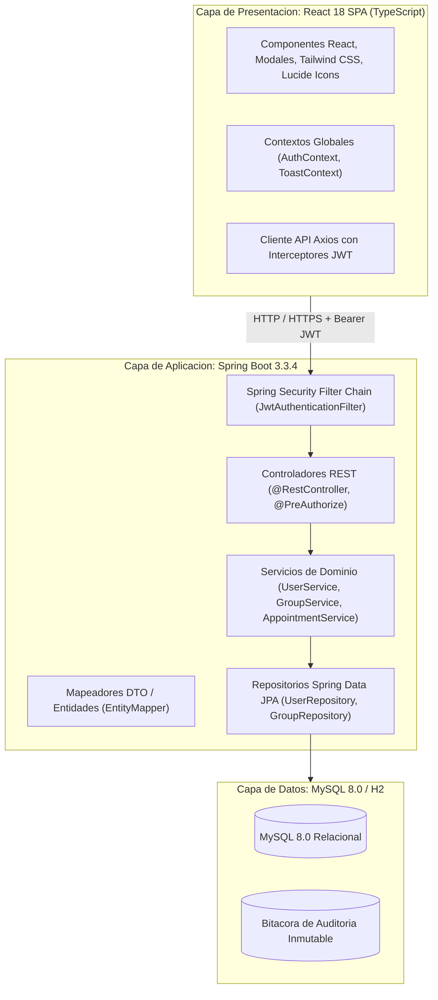

### 4.2 Modelo C4 de la Arquitectura

#### Nivel 1: Diagrama de Contexto del Sistema

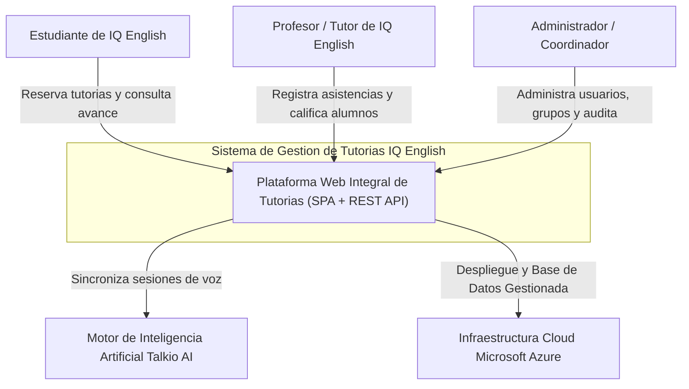

#### Nivel 2: Diagrama de Contenedores

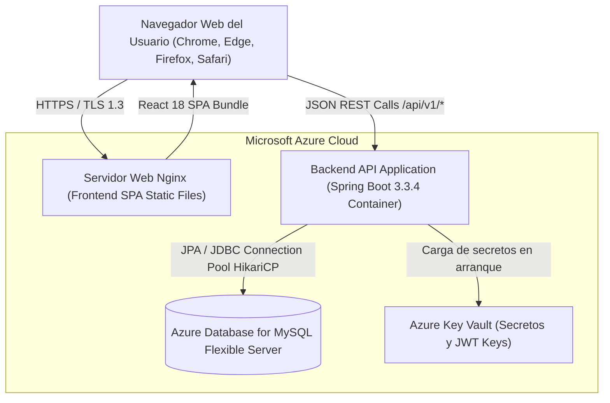

---

### 4.3 Arquitectura de Seguridad, Autenticacion y RBAC

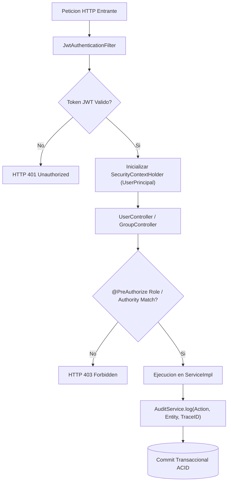

#### Matriz de Autorizacion RBAC:
| Modulo / Capacidad | ROLE_ADMIN | ROLE_SUPERVISOR | ROLE_TEACHER | ROLE_STUDENT |
|---|:---:|:---:|:---:|:---:|
| `USER_READ` (Consultar usuarios y reportes) | SI | SI | NO | NO |
| `USER_CREATE` (Crear nuevos usuarios) | SI | NO | NO | NO |
| `USER_UPDATE` (Modificar perfiles y roles) | SI | NO | NO | NO |
| `USER_DISABLE` (Baja logica soft-delete) | SI | NO | NO | NO |
| `GROUP_MANAGE` (Crear y editar grupos) | SI | SI | NO | NO |
| `ATTENDANCE_RECORD` (Pase de lista y notas) | NO | NO | SI | NO |
| `BOOKING_MANAGE` (Buscar y agendar tutorias) | NO | NO | NO | SI |
| `AUDIT_READ` (Consultar logs con Trace ID) | SI | NO | NO | NO |
| `PASSWORD_SELF_CHANGE` (Cambio de propia clave) | SI | SI | SI | SI |

---

### 4.4 Especificacion de Endpoints REST de la API

| Metodo | Endpoint | Autoridad Requerida | Descripcion Operativa | Codigos HTTP |
|---|---|---|---|---|
| `POST` | `/api/v1/auth/login` | Publico | Autentica credenciales y emite token Bearer JWT. | 200, 401 |
| `GET` | `/api/v1/users/me` | `isAuthenticated()` | Retorna perfil del usuario en sesion actual. | 200, 401 |
| `GET` | `/api/v1/users` | `ADMIN` / `SUPERVISOR` | Lista paginada con filtros y busqueda debounced. | 200, 401, 403 |
| `POST` | `/api/v1/users` | `ADMIN` | Registra nuevo usuario y perfil vinculado. | 200, 400, 403, 409 |
| `PUT` | `/api/v1/users/{id}` | `ADMIN` | Actualiza datos de perfil y atributos academicos. | 200, 400, 403, 404 |
| `PATCH` | `/api/v1/users/{id}/status` | `ADMIN` | Modifica estado (`ACTIVE`, `INACTIVE`, `SUSPENDED`). | 200, 400, 403, 404 |
| `DELETE` | `/api/v1/users/{id}` | `ADMIN` | Baja logica aplicando salvaguardas BR-ADM-01/02. | 200, 400, 403, 404 |
| `POST` | `/api/v1/users/change-password` | `isAuthenticated()` | Autoservicio de cambio de clave propia. | 200, 400, 401 |
| `POST` | `/api/v1/users/{id}/password-reset` | `ADMIN` | Reseteo administrativo de clave de usuario. | 200, 400, 403, 404 |
| `GET` | `/api/v1/users/report` | `ADMIN` / `SUPERVISOR` | Retorna metricas consolidadas demograficas. | 200, 401, 403 |
| `GET` | `/api/v1/users/export/csv` | `ADMIN` / `SUPERVISOR` | Genera y descarga padron en formato CSV RFC 4180. | 200, 401, 403 |
| `GET` | `/api/v1/groups` | `isAuthenticated()` | Lista grupos filtrados por sede, docente y nivel. | 200, 401 |
| `POST` | `/api/v1/groups` | `ADMIN` / `SUPERVISOR` | Crea grupo academico y proyecta sesiones. | 200, 400, 403 |
| `GET` | `/api/v1/appointments/available` | `STUDENT` | Consulta tutorias abiertas con cupo disponible. | 200, 401, 403 |
| `POST` | `/api/v1/appointments/book` | `STUDENT` | Reserva cupo atomico en sesion de tutoria. | 200, 400, 403, 409 |
| `POST` | `/api/v1/appointments/{id}/cancel` | `STUDENT` | Cancela reserva y libera cupo en la sesion. | 200, 400, 403, 404 |
| `POST` | `/api/v1/attendance/record` | `TEACHER` | Registra pase de lista digital y calificaciones. | 200, 400, 403 |
| `GET` | `/api/v1/audit-logs` | `ADMIN` | Consulta bitacora inmutable filtrada por Trace ID. | 200, 401, 403 |

---

### 4.5 Metodologia de Desarrollo y Estrategia de Calidad

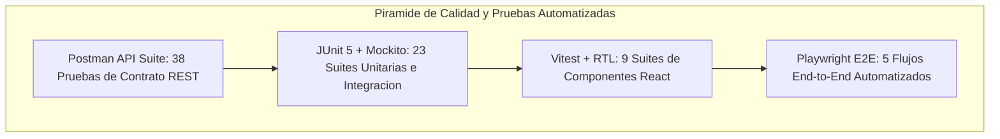

---

## 5. Mapas de Navegacion, Flujos de Interaccion y Prototipos

### 5.1 Arquitectura de Informacion del Sistema
La arquitectura de informacion se organiza jerarquicamente a partir de un unico punto de entrada autenticado (`/login`), ramificandose en cuatro portales independientes y aislados segun el rol del usuario.

### 5.2 Catalogo de Mapas de Navegacion

#### 1. Arquitectura Global de Navegacion del Sistema
Ilustra el enrutamiento completo de la aplicacion hacia los cuatro portales:

#### 2. Mapa de Navegacion del Flujo de Reserva del Estudiante
Ruta secuencial que sigue el alumno desde el Dashboard hasta la confirmacion de tutoria en "Mis Tutorias":

#### 3. Mapa de Navegacion del Flujo de Asistencia Docente
Estructura de navegacion para consultar agenda, abrir grupo activo, marcar lista y evaluar lecciones:

#### 4. Mapa de Navegacion del Flujo de Administracion
Ruta administrativa para gestion de usuarios, apertura de grupos, reseteo de claves y auditoria:

---

### 5.3 Flujos de Interaccion (Interaction Flows)

#### 1. Flujos de Interaccion Base (Dashboard Estudiante y Gestion Admin)

#### 2. Flujos de Interaccion Avanzados (Pase de Lista y Reserva Paso a Paso)

---

### 5.4 Prototipos de Baja y Mediana Fidelidad

#### A. Wireframes de Baja Fidelidad (Figma):
1. **Dashboard de Usuario Estudiante**: `01_lowfi_student_dashboard.svg`
2. **Pagina de Login / Autenticacion**: `02_lowfi_login_page.svg`
3. **Pagina de Creacion de Usuario**: `03_lowfi_create_user.svg`
4. **Pagina de Creacion de Grupo**: `04_lowfi_create_group.svg`

#### B. Mockups de Mediana Fidelidad (Axure RP):
1. **Dashboard de Usuario Estudiante**: `10_midfi_student_dashboard.svg`
2. **Pagina de Login / Autenticacion**: `11_midfi_login_page.svg`
3. **Pagina de Creacion de Usuario**: `12_midfi_create_user.svg`
4. **Pagina de Creacion de Grupo**: `13_midfi_create_group.svg`

---

### 5.5 Simulaciones de Prototipos Interactivos
1. **Simulacion Interactiva Base**: [prototype_simulation.html](../docs/ux/prototype%20simulations/prototype_simulation.html)
2. **Simulacion Interactiva Avanzada**: [prototype_advanced_simulation.html](../docs/ux/prototype%20simulations/prototype_advanced_simulation.html)

---

## 6. Conclusiones

1. **Consolidacion y Madurez del Diseno Tecnico**: La integracion secuencial de requerimientos, modelos conceptuales, diagramas de base de datos 3NF, casos de uso formales y arquitectura hexagonal proporciona una base solida e inmutable para el desarrollo y operacion de IQ English.
2. **Impacto de la Ingenieria de Usabilidad**: La adhesion rigurosa a las normas ISO 9241-210, WCAG 2.1 AA y principios de HCI reduce la carga cognitiva, elimina fricciones operativas y eleva el estandar de calidad educativa.
3. **Escalabilidad y Seguridad Empresarial**: La cohesion entre React 18, Spring Boot 3.3.4, Spring Security con JWT, MySQL 8.0 y Microsoft Azure garantiza alta disponibilidad (99.9%), rendimiento P95 < 300 ms y trazabilidad inmutable mediante Trace ID.

---

## 7. Referencias Bibliograficas

1. **Cooper, A., Reimann, R., Cronin, D., & Noessel, C.** (2014). *About Face: The Essentials of Interaction Design* (4th ed.). John Wiley & Sons.
2. **Fowler, M.** (2018). *Refactoring: Improving the Design of Existing Code* (2nd ed.). Addison-Wesley Professional.
3. **Gamma, E., Helm, R., Johnson, R., & Vlissides, J.** (1994). *Design Patterns: Elements of Reusable Object-Oriented Software*. Addison-Wesley.
4. **International Organization for Standardization.** (2019). *Ergonomics of human-system interaction — Part 210: Human-centred design for interactive systems* (ISO Standard No. 9241-210:2019). ISO.
5. **Johnson, J.** (2020). *Designing with the Mind in Mind: Simple Guide to Understanding User Interface Design Guidelines* (3rd ed.). Morgan Kaufmann.
6. **Martin, R. C.** (2017). *Clean Architecture: A Craftsman's Guide to Software Structure and Design*. Prentice Hall.
7. **Nielsen, J.** (1994). *Usability Engineering*. Morgan Kaufmann.
8. **Nielsen, J., & Budiu, R.** (2012). *Mobile Usability*. New Riders.
9. **Norman, D. A.** (2013). *The Design of Everyday Things: Revised and Expanded Edition*. Basic Books.
10. **Shneiderman, B., Plaisant, C., Cohen, M., Jacobs, S., Elmqvist, N., & Diakopoulos, N.** (2016). *Designing the User Interface: Strategies for Effective Human-Computer Interaction* (6th ed.). Pearson.
11. **Sweller, J.** (2011). *Cognitive Load Theory*. In J. P. Mestre & B. H. Ross (Eds.), *The Psychology of Learning and Motivation: Cognition in Education* (Vol. 55, pp. 37-76). Academic Press.
12. **World Wide Web Consortium (W3C).** (2018). *Web Content Accessibility Guidelines (WCAG) 2.1*. W3C Recommendation.
13. **Yablonski, J.** (2020). *Laws of UX: Using Psychology to Design Better Products & Services*. O'Reilly Media.

---
*Documento maestro de la fase de diseno (Design Phase) elaborado para el Sistema de Gestion de Tutorias IQ English.*
