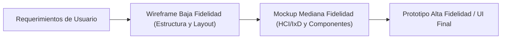
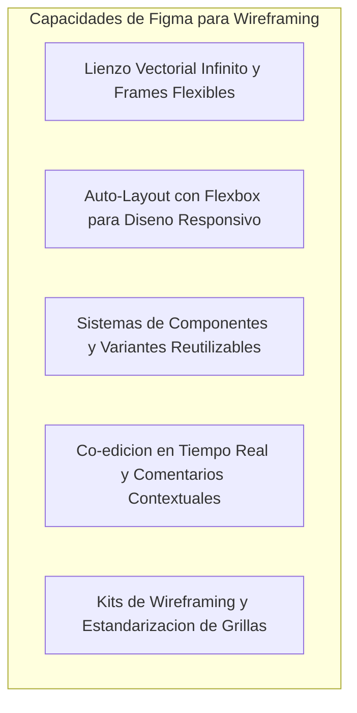
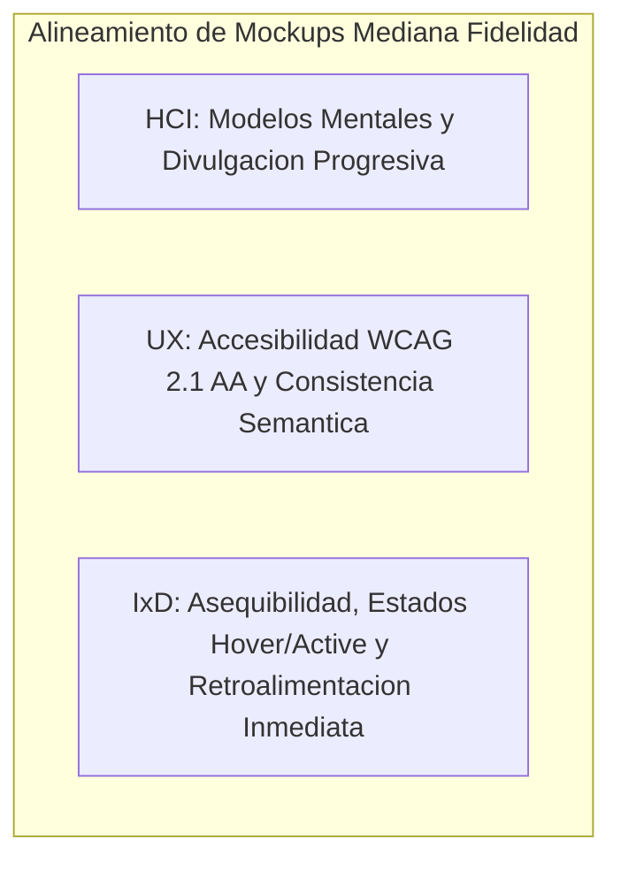
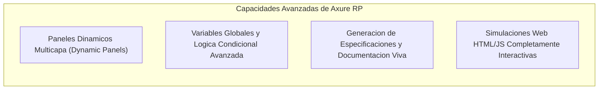
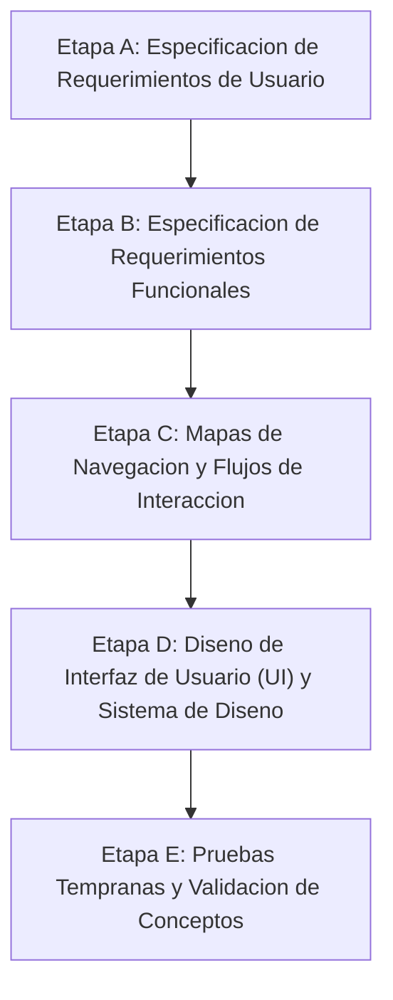
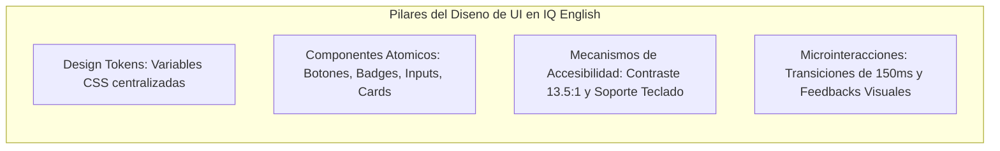
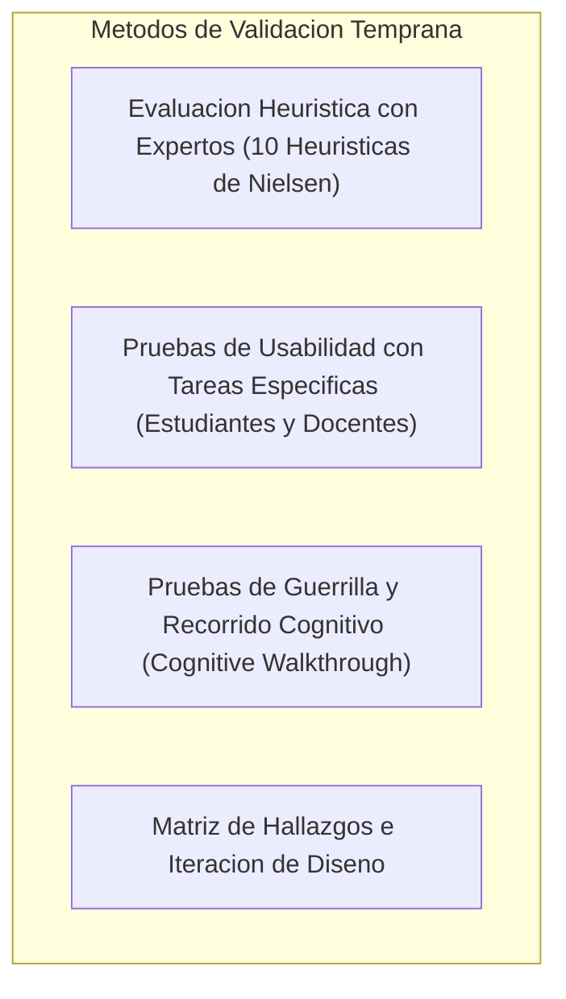

# SISTEMA DE GESTION DE TUTORIAS ACADEMICAS IQ ENGLISH
## Documento Integral de Prototipado, Diseno de Interfaces (UI/UX/IxD), Requerimientos y Flujos de Navegacion

---

## 1. Prototipos de Baja Fidelidad (Low-Fidelity Wireframes) de la Solucion IQ English

### 1.1 Definicion, Objetivos y Utilidad de los Wireframes de Baja Fidelidad
Un **boceto o wireframe de baja fidelidad (low-fidelity wireframe)** es una representacion esquematica, abstracta y simplificada de una interfaz grafica de usuario. Su proposito primordial consiste en estructurar la distribucion espacial de los elementos, definir la jerarquia de la informacion y delimitar las zonas de interaccion sin distraer la atencion con elementos esteticos finales como paletas cromaticas complejas, tipografias corporativas, iconografia detallada o imagenes terminadas.

#### Objetivos y Utilidad en el Proceso de Desarrollo:
1. **Validacion Estructural Temprana**: Permite verificar de forma agil si la organizacion de encabezados, barras de navegacion, tablas, tarjetas y formularios satisface los requerimientos del usuario antes de invertir recursos en codificacion o diseno visual avanzado.
2. **Reduccion de Sesgos Esteticos**: Al emplear exclusivamente escalas de grises monocromaticas, figuras geometricas basicas y textos de marcador de posicion (placeholders), el equipo de diseno, desarrolladores y clientes se enfocan exclusivamente en la usabilidad, el flujo de trabajo y la arquitectura de informacion.
3. **Iteracion Rapida y Bajo Costo de Cambio**: Modificar la disposicion de un formulario o reubicar una barra lateral en un wireframe de baja fidelidad toma minutos, reduciendo drasticamente el costo asociado al retrabajo en fases avanzadas del ciclo de vida de desarrollo.
4. **Comunicacion Multidisciplinaria**: Sirve como lenguaje comun entre analistas de negocio, disenadores de experiencia de usuario (UX) e ingenieros de software para alinear expectativas funcionales.

---

### 1.2 Descripcion de la Aplicacion Figma para el Diseno de Wireframes
**Figma** es una plataforma de diseno vectorial y prototipado colaborativo basada en la nube que opera de manera nativa en el navegador web y en aplicaciones de escritorio multiplataforma.

#### Caracteristicas Clave y Funcionalidades Aplicadas:
- **Auto-Layout Responsivo**: Permite estructurar contenedores que ajustan automaticamente su espaciado interno (*padding*), separacion entre elementos (*gap*) y alineacion fluida (*fill container / hug contents*), emulando fielmente el comportamiento de CSS Flexbox.
- **Componentes y Variantes**: Creacion de bibliotecas de componentes maestros para campos de entrada, botones en estado neutro, tarjetas de contenido y barras de navegacion esquematicas.
- **Colaboracion en Tiempo Real**: Capacidad de co-diseno simultaneo donde multiples especialistas pueden intervenir, revisar y comentar sobre los mismos lienzos de trabajo.
- **Grillas de Diseno (Layout Grids)**: Configuracion de sistemas de 12 columnas para vistas de escritorio y 4 columnas para dispositivos moviles, asegurando consistencia dimensional.

---

### 1.3 Diseno de Wireframes en el Contexto de IQ English y la Entidad Usuario
En el ecosistema de **IQ English**, la gestion de cuentas y perfiles constituye el nucleo operativo que habilita la coordinacion de tutorias, el control docente y la administracion institucional.

#### Caracteristicas y Atributos de la Entidad Usuario:
| Atributo | Tipo de Dato | Restricciones de Entrada | Valores Validos y Formato | Descripcion Funcional |
|---|---|---|---|---|
| `id` | Numerico (BigInt) | Clave Primaria, Autoincremental | Enteros positivos >= 1 | Identificador unico asignado por el sistema. |
| `username` | Texto (Varchar 100) | Unico, Obligatorio | Minimo 3 caracteres alfanumericos sin espacios | Nombre de usuario para inicio de sesion. |
| `email` | Texto (Varchar 150) | Unico, Obligatorio | Formato estandar RFC 5322 (`usuario@dominio.com`) | Correo institucional o personal de contacto. |
| `firstName` | Texto (Varchar 100) | Obligatorio | Texto alfabetico (longitud 2 a 100) | Nombre o nombres de pila del usuario. |
| `lastName` | Texto (Varchar 100) | Obligatorio | Texto alfabetico (longitud 2 a 100) | Apellidos del usuario. |
| `phone` | Texto (Varchar 30) | Opcional | Formato internacional o local (10 digitos) | Numero telefonico de contacto. |
| `status` | Enumeracion (Texto) | Obligatorio | `ACTIVE`, `INACTIVE`, `SUSPENDED` | Estado operativo de la cuenta. |
| `roles` | Coleccion de Roles | Minimo 1 rol asignado | `ROLE_ADMIN`, `ROLE_SUPERVISOR`, `ROLE_TEACHER`, `ROLE_STUDENT` | Perfiles de autorizacion RBAC. |
| `studentProfile` | Objeto Vinculado | Requerido si rol es Student | Matricula (`STU-XXXXX`), Plantel ID, Nivel ID, Libro ID | Perfil academico del estudiante. |
| `teacherProfile` | Objeto Vinculado | Requerido si rol es Teacher | Numero de empleado (`TCH-XXXXX`), Especialidad, Plantel ID | Perfil laboral del docente. |

---

### 1.4 Catalogo de Wireframes de Baja Fidelidad de IQ English

Los bocetos de baja fidelidad se caracterizan por una paleta monocromatica neutral en escala de grises (#FFFFFF fondo, #F3F4F6 contenedores, #9CA3AF bordes y marcadores, #111827 textos esquematicos), tipografia generica sin identidad visual del cliente y textos placeholder que indican la funcion del control.

#### 1. Dashboard de Usuario Estudiante (Low-Fi)
Presenta la distribucion espacial del portal del estudiante: barra lateral izquierda con opciones de navegacion ("Dashboard", "Buscar Tutorias", "Mis Tutorias", "Catalogo Academico"), encabezado superior con bienvenida y perfil, cuatro tarjetas KPI superiores para metricas resumen (Nivel Actual, Proxima Clase, Horas Acumuladas, Calificacion Promedio), contenedor principal con la lista esquematica de proximas citas y panel lateral de avisos.

- **Controles y Elementos Visuales**:
  - *Barra de Navegacion*: Lista vertical con cajas rectangulares y placeholders de texto.
  - *Tarjetas KPI*: 4 contenedores con marcos redondeados de 8px, etiquetas de marcador y bloques rectangulares grises que representan cifras numericas.
  - *Tabla de Proximas Clases*: Encabezados esquematicos (Fecha, Modulo, Profesor, Aula, Accion) con botones genericos de "Cancelar" y "Detalles".

#### 2. Pagina de Login / Autenticacion de Usuario (Low-Fi)
Estructura centrada en pantalla con una tarjeta de autenticacion de 400px de ancho sobre fondo neutro, cuadro superior para el isotipo generico, titulo esquematico "Iniciar Sesion", campos para nombre de usuario y contrasena, enlace de recuperacion y boton principal de accion.

- **Controles y Elementos Visuales**:
  - *Campos de Entrada (Text Inputs)*: Cajas rectangulares con borde gris tenue, etiquetas superiores ("Usuario / Email", "Contrasena") y texto de guia ("Ingrese su identificador...").
  - *Boton de Accion Primaria*: Rectangulo gris solido centrado con etiqueta "Ingresar al Sistema".
  - *Controles Auxiliares*: Casilla de verificacion (*Checkbox*) "Recordar sesion" y texto enlace "Olvido su contrasena?".

#### 3. Pagina / Modal de Creacion de Usuario (Low-Fi)
Disposicion en dialogo modal centrado con fondo atenuado (*backdrop* semi-transparente). Organiza la captura en dos columnas: datos de cuenta (usuario, correo, contrasena, nombres) y datos de asignacion (rol, sede, estatus y atributos condicionales segun el rol).

- **Controles y Elementos Visuales**:
  - *Encabezado Modal*: Titulo "Registrar Nuevo Usuario" con boton "X" de cierre en esquina superior derecha.
  - *Menus Desplegables (Select Dropdowns)*: Selectores esquematicos para Rol (Estudiante/Docente/Supervisor/Admin) y Plantel Sede.
  - *Botonera Inferior*: Boton secundario "Cancelar" (borde gris) y boton primario "Guardar Usuario" (relleno solido).

#### 4. Pagina / Modal de Creacion de Grupo (Low-Fi)
Estructura modal para la planificacion de grupos academicos: campos para nombre de grupo, codigo institucional, seleccion de sede, asignacion de docente titular, nivel curricular, libro base, dia de la semana, horario y cupo maximo de alumnos.

- **Controles y Elementos Visuales**:
  - *Controles de Entrada*: Campos de texto para codigo y nombre, selectores para docente y aula, campo numerico para capacidad maxima (validado de 1 a 15).
  - *Selector de Horario*: Bloques esquematicos para hora de inicio y hora de finalizacion.

---

## 2. Prototipos de Mediana Fidelidad (Medium-Fidelity Mockups) de la Solucion IQ English

### 2.1 Definicion, Objetivos y Utilidad de los Mockups de Mediana Fidelidad
Un **mockup o maqueta de mediana fidelidad (medium-fidelity mockup)** es una representacion visual detallada y semi-funcional que incorpora la identidad visual definitiva, la paleta cromatica corporativa, la tipografia seleccionada, las relaciones de contraste y las reglas de interaccion (IxD) y ergonomia cognitiva (HCI) especificadas para el producto final.

#### Objetivos y Utilidad:
1. **Evaluacion Estetica y Ergonomica Realista**: Permite corroborar el impacto emocional y la claridad de lectura que experimentara el usuario final al interactuar con los colores corporativos de IQ English.
2. **Validacion de Estados Semanticos e Interactivos**: Incorpora badges de rol, estados de validacion de campos (exito verde, advertencia ambar, error rojo) y estados interactivos de controles (`:hover`, `:focus`, `:active`).
3. **Simulacion de Flujos de Negocio Complejos**: Sirve de base para simulaciones navegables donde los evaluadores pueden recorrer secuencias operativas completas (e.g., login -> busqueda -> seleccion -> confirmacion de tutoria).

---

### 2.2 Descripcion de la Aplicacion Axure RP para Mockups de Mediana Fidelidad
**Axure RP** es una de las herramientas de ingenieria de requerimientos y prototipado interactivo mas potentes y rigurosas de la industria del software.

#### Caracteristicas Clave y Funcionalidades:
- **Paneles Dinamicos (Dynamic Panels)**: Permiten modelar componentes multicapa que cambian de estado ante eventos de usuario (e.g., abrir modales, cambiar de pestanas, mostrar indicadores de carga).
- **Logica Condicional y Variables**: Permite emular logica de negocio real, como validar que un formulario no se envie si un campo esta vacio o calcular cupos restantes en tiempo real.
- **Generacion de Simulaciones HTML/JS**: Exporta prototipos navegables en formato web estandar que pueden ser ejecutados de forma local o remota en cualquier navegador sin dependencias externas.

---

### 2.3 Mockups de Mediana Fidelidad en IQ English y la Entidad Usuario
En esta fase, la entidad **Usuario** se representa con todos sus atributos enriquecidos, implementando el sistema de diseno oficial de IQ English:

- **Tokens Visuales Aplicados**:
  - *Color Primario Corporativo*: **Azul IQ (Pantone 294 C - `#002e6d`)** aplicado a barras superiores, botones primarios y encabezados.
  - *Color Secundario de Accion*: **Azul Cielo (Pantone 2915 C - `#5eb3e4`)** en estados hover, anillos de foco y enlaces activos.
  - *Badges Semanticos de Rol*: Morado (`#8b5cf6`) para Administrador, Azul (`#3b82f6`) para Docente, Esmeralda (`#10b981`) para Estudiante y Naranja (`#f59e0b`) para Supervisor.
  - *Tipografia Corporativa*: **Montserrat** en pesos 400 (Regular), 500 (Medium), 600 (Semi-bold) y 700 (Bold).

---

### 2.4 Catalogo de Mockups de Mediana Fidelidad de IQ English

#### 1. Dashboard de Usuario Estudiante (Mid-Fi)
Presenta la interfaz definitiva con el diseno cromatico corporativo, avatar del estudiante, tarjetas KPI con iconos tematicos de Lucide React, grafica de avance modular y tabla estilizada con botones de accion interactiva.

- **Elementos Visuales y Estilo**:
  - *Barra Superior*: Fondo Azul IQ (`#002e6d`) con logotipo institucional, campana de notificaciones y menu de usuario.
  - *Tarjetas KPI*: Sombras suaves (`shadow-sm`), bordes redondeados (`rounded-xl`), iconos coloreados y tipografia Montserrat con jerarquia de pesos.
  - *Contenedores de Contenido*: Tarjetas blancas sobre fondo gris tenue (`#f8fafc`), con microinteracciones y botones con colores de accion (`#002e6d` y hover `#1e40af`).

#### 2. Pagina de Login / Autenticacion de Usuario (Mid-Fi)
Presenta la tarjeta corporativa de acceso con el degradado institucional, logotipo oficial de IQ English, campos de texto con validacion visual, anillo de foco azul cielo (`#5eb3e4`) y boton de accion principal con transicion suave.

- **Elementos Visuales y Estilo**:
  - *Tarjeta Central*: Elevacion `shadow-xl`, borde superior acentuado con gradiente corporativo, textos en Montserrat Semi-bold.
  - *Campos de Entrada*: Iconos vectoriales prefijados (icono de usuario y candado de seguridad), borde `#cbd5e1` con transicion a `#5eb3e4` en foco.
  - *Boton de Acceso*: Fondo solido `#002e6d`, texto blanco centrado y efecto elevacion al pasar el cursor.

#### 3. Pagina / Modal de Creacion de Usuario (Mid-Fi)
Dialogo modal con diseno estructurado en dos columnas, selectores con estilo corporativo, badges dinamicos de rol y validacion interactiva de contrasenas y campos obligatorios.

- **Elementos Visuales y Estilo**:
  - *Encabezado*: Titulo en Montserrat Bold con icono de usuario y boton de cierre con retroalimentacion visual.
  - *Controles de Formulario*: Etiquetas legibles con asterisco rojo de obligatoriedad, selectores con flecha estilizada y campos condicionales con animacion suave.
  - *Botonera de Pie*: Boton "Cancelar" en borde gris neutro y boton "Crear Usuario" en Azul IQ con spinner de carga integrado.

#### 4. Pagina / Modal de Creacion de Grupo (Mid-Fi)
Interfaz modal para la planificacion y apertura de grupos de tutoria con seleccion de sede, docente, nivel academico y configuracion de horarios semanales.

- **Elementos Visuales y Estilo**:
  - *Matriz de Datos*: Campos organizados mediante rejilla CSS responsive de 2 columnas.
  - *Indicador de Cupo*: Control numerico con limites prefijados (maximo 15 estudiantes por grupo de tutoria).

---

## 3. Etapas de Diseno de las Interfaces de Usuario (UIs)

El proceso de desarrollo del frontend de IQ English siguio un ciclo metodologico riguroso compuesto por 5 etapas de diseno centradas en el ser humano:

---

### 3.1 Etapa A: Especificacion de Requerimientos de Usuario

#### Definicion y Descripcion de la Etapa:
Esta etapa comprende la investigacion, identificacion y modelado de las necesidades, objetivos, expectativas, limitaciones y modelos mentales de los diferentes perfiles de usuario que interactuan con la plataforma. Se centra en responder *que necesita el usuario para lograr sus metas academicas u operativas de forma eficiente y sin frustracion*.

#### Detalle de Requerimientos de Usuario en IQ English:
De acuerdo con el documento maestro `ESPECIFICACION_DEL_SISTEMA.md`, los requerimientos de usuario se estructuran segun cuatro arquetipos clave:

1. **Requerimientos del Estudiante (*Student*)**:
   - Acceder de forma segura con sus credenciales desde cualquier dispositivo movil o de escritorio.
   - Visualizar de inmediato en su pantalla principal su progreso academico (Nivel, Libro y Modulo actual) y su proxima sesion de tutoria agendada.
   - Buscar y filtrar tutorias disponibles por fecha, modulo curricular, sede y profesor.
   - Reservar y confirmar su lugar en sesiones grupales en menos de 3 pasos, con verificacion automatica de cupo disponible.
   - Cancelar citas previamente agendadas con liberacion automatica del cupo para otros companeros.
   - Acceder directamente al laboratorio de voz **Talkio AI** para practicar la pronunciacion y fluidez del modulo en curso.
   - Consultar su historial de asistencias, notas obtenidas y comentarios pedagogicos emitidos por sus docentes.

2. **Requerimientos del Docente (*Teacher*)**:
   - Consultar su calendario semanal y diario de sesiones de tutoria asignadas.
   - Abrir la lista digital de asistencia de la sesion en curso en cuestion de segundos.
   - Realizar el pase de lista marcando de manera intuitiva el estado de cada estudiante (`Presente`, `Ausente`, `Justificado`).
   - Capturar calificaciones cuantitativas (0-100) y retroalimentacion cualitativa individual por leccion.
   - Cerrar formalmente la sesion al concluir la clase para actualizar el avance academico de los alumnos aprobados.

3. **Requerimientos del Supervisor Academico (*Supervisor*)**:
   - Monitorear tableros ejecutivos con indicadores clave (KPI) de asistencia, desercion y ocupacion de aulas en tiempo real.
   - Supervisar el cumplimiento del calendario de clases en multiples planteles (sedes).
   - Generar y descargar reportes analiticos consolidados en formato CSV.
   - Justificar inasistencias de estudiantes por causas de fuerza mayor.

4. **Requerimientos del Administrador del Sistema (*Admin*)**:
   - Gestionar el ciclo de vida completo de usuarios (creacion, edicion, asignacion de roles, reseteo de claves y baja logica).
   - Administrar grupos academicos, asignacion docente y plantillas horarias.
   - Garantizar la seguridad operativa mediante la aplicacion de salvaguardas (proteccion del ultimo administrador y prevencion de auto-eliminacion).
   - Inspeccionar la bitacora inmutable de auditoria con correlacion por Trace ID para diagnostico de transacciones.

---

### 3.2 Etapa B: Especificacion de Requerimientos Funcionales

#### Definicion y Descripcion de la Etapa:
Consiste en la traduccion tecnica y formal de las necesidades de usuario en comportamientos, capacidades, restricciones y servicios especificos que el software debe ejecutar de manera determinista.

#### Detalle de Requerimientos Funcionales de IQ English:
Conforme a la especificacion del sistema, los requerimientos funcionales se agrupan en los siguientes modulos principales:

- **Modulo de Autenticacion y Seguridad (RF-AUT)**:
  - *RF-AUT-01*: Autenticacion con token JWT firmado criptograficamente con vigencia de 24 horas.
  - *RF-AUT-02*: Control de acceso basado en roles (RBAC) con evaluacion mediante anotaciones `@PreAuthorize`.
  - *RF-AUT-04 / RF-AUT-05*: Mecanismo dual de gestion de contrasenas (autoservicio para usuarios y reseteo administrativo para soporte).
  - *RF-AUT-06*: Cifrado criptografico unidireccional de contrasenas con algoritmo BCrypt (factor de costo 10).

- **Modulo de Gestion de Usuarios y Perfiles (RF-USR)**:
  - *RF-USR-01 a RF-USR-05*: Altas, consultas paginadas, modificaciones, activacion/desactivacion y baja logica (*soft-delete*).
  - *RF-USR-06 (BR-ADM-01)*: Salvaguarda del ultimo administrador activo para prevenir bloqueos del sistema.
  - *RF-USR-07 (BR-ADM-02)*: Prohibicion de auto-eliminacion de la cuenta administradora en sesion.
  - *RF-USR-09*: Exportador de padron de usuarios en formato CSV conforme a RFC 4180.

- **Modulo de Estructura Academica y Catalogo (RF-ACA)**:
  - *RF-ACA-01*: Modelado jerarquico de Niveles Academicos, Libros y Modulos tematicos.
  - *RF-ACA-04 / RF-ACA-05*: Control de la progresion curricular del estudiante y promocion automatica modular.

- **Modulo de Gestion de Grupos y Horarios (RF-GRP)**:
  - *RF-GRP-01 a RF-GRP-04*: Creacion de grupos con validacion de cupo maximo (limite de 15 alumnos) y proyeccion automatica de sesiones semanales (`GroupSession`).

- **Modulo de Agendamiento y Citas (RF-SES)**:
  - *RF-SES-01 a RF-SES-05*: Busqueda de tutorias, reserva atomica con control de concurrencia para evitar sobrecupo (*overbooking*), bloqueo de citas simultaneas y cancelacion con liberacion de cupo.

- **Modulo de Asistencia y Evaluacion (RF-ATT)**:
  - *RF-ATT-01 a RF-ATT-05*: Pase de lista digital, captura de calificaciones (0-100), retroalimentacion cualitativa y cierre definitivo de sesion.

- **Modulo de Integracion Talkio AI (RF-AI)**:
  - *RF-AI-01 a RF-AI-04*: Sincronizacion de ejercicios orales con el modulo en curso y medicion de tiempo y fluidez fonetica.

- **Modulo de Auditoria y Bitacora (RF-AUD)**:
  - *RF-AUD-01 a RF-AUD-05*: Registro automatico e inmutable de eventos mutativos con marca de tiempo, usuario, IP y Trace ID.

---

### 3.3 Etapa C: Mapas de Navegacion, Flujos de Interaccion y Simulaciones

#### Definicion y Descripcion de la Etapa:
Esta etapa modela la arquitectura de informacion y los caminos logicos que los usuarios recorren para completar tareas dentro del sistema, garantizando coherencia en la transicion entre pantallas y evitando caminos sin salida (*dead ends*).

#### A. Mapas de Navegacion del Sistema

1. **Arquitectura Global de Navegacion del Sistema**:
   Diagrama que ilustra el enrutamiento completo de la aplicacion desde el punto de entrada (Login) y la bifurcacion segun el rol del usuario autenticado hacia los cuatro portales del sistema.

   

   - *Descripcion del Mapa*: Mapea los cuatro macro-flujos del sistema. Muestra como un usuario no autenticado ingresa por `/login` y es dirigido por el enrutador condicional hacia el Portal de Estudiante (`/student/dashboard`, `/student/search`, `/student/appointments`, `/student/catalog`), Portal de Docente (`/teacher/dashboard`, `/teacher/attendance`, `/teacher/groups`), Panel de Supervision (`/supervisor/dashboard`, `/supervisor/reports`, `/supervisor/attendance-matrix`) o Panel de Administracion (`/admin/dashboard`, `/admin/users`, `/admin/groups`, `/admin/audit-logs`).

2. **Mapa de Navegacion del Flujo de Reserva del Estudiante**:
   Ruta secuencial que sigue el alumno desde el Dashboard, pasando por la busqueda con filtros, el modal de seleccion de grupo, la confirmacion de reserva y la visualizacion en "Mis Tutorias".

   

   - *Descripcion del Mapa*: Detalla los 9 estados secuenciales del estudiante: (1) Inicio de sesion -> (2) Visualizacion del Dashboard -> (3) Acceso a Busqueda de Tutorias -> (4) Aplicacion de filtros por modulo/libro -> (5) Seleccion de tarjeta con cupo disponible -> (6) Apertura de Modal de Confirmacion -> (7) Recepcion de toast de exito -> (8) Retorno al Dashboard -> (9) Verificacion en "Mis Tutorias".

3. **Mapa de Navegacion del Flujo de Asistencia Docente**:
   Estructura de navegacion del profesor para acceder a sus grupos asignados, abrir la sesion activa, marcar asistencias, registrar notas y completar la sesion.

   

   - *Descripcion del Mapa*: Modela las 5 etapas operativas del docente: (1) Login de docente -> (2) Tablero con lista de clases del dia -> (3) Seleccion del grupo activo -> (4) Apertura de matriz de pase de lista -> (5) Marcado de estatus Presente/Ausente/Justificado, asignacion de nota (0-100) y confirmacion de guardado.

4. **Mapa de Navegacion del Flujo de Administracion**:
   Ruta del administrador para gestionar usuarios, crear grupos, resetear contrasenas, exportar datos y auditar bitacoras.

   

   - *Descripcion del Mapa*: Detalla las rutas administrativas centrales: gestion de usuarios con modales de alta, edicion, roles, estado y reseteo de claves; gestion de grupos con configuracion de horarios y cupos; reportes estadisticos demograficos y visor de auditoria cronologico.

---

#### B. Flujos de Interaccion (Interaction Flows)
Los **flujos de interaccion** describen paso a paso las acciones fisicas y cognitivas del usuario y las respuestas reactivas que emite el sistema ante cada evento.

1. **Flujos de Interaccion Base (Dashboard Estudiante y Gestion Admin)**:
   Diagrama que modela la secuencia de autenticacion de estudiante y visualizacion de dashboard, asi como el flujo administrativo de creacion de usuarios y grupos.

   

   - *Descripcion del Flujo*:
     - *Flujo 1 (Estudiante)*: Entrada de credenciales -> Validacion JWT -> Redireccion a Dashboard -> Renderizado de KPI Tiles -> Consulta de proximas clases.
     - *Flujo 2 (Administrador)*: Acceso con rol Admin -> Apertura de modal "Crear Usuario" -> Captura de campos y rol -> Validacion en backend -> Notificacion toast de exito -> Apertura de modal "Crear Grupo" -> Asignacion de horario y docente -> Persistencia en base de datos.

2. **Flujos de Interaccion Avanzados (Pase de Lista y Reserva Paso a Paso)**:
   Diagrama que detalla las interacciones complejas del pase de lista docente (con seleccion de opcion Presente e ingreso de nota) y el flujo exhaustivo de busqueda, seleccion, confirmacion y aceptacion de notificacion de tutoria por el estudiante.

   

   - *Descripcion del Flujo*:
     - *Flujo Docente*: Seleccion de sesion en calendario -> Carga reactiva de lista de alumnos -> Clic en boton verde "Presente" -> Foco en campo de calificacion -> Ingreso de valor numerico (e.g., 90) -> Clic en "Guardar y Cerrar Sesion" -> Transicion atomica en base de datos.
     - *Flujo Estudiante*: Filtrado dinamico por modulo -> Clic en tarjeta de tutoria disponible -> Apertura de modal con resumen de horario y salon -> Clic en "Confirmar Reserva" -> Decremento de cupo y emision de toast -> Actualizacion de agenda.

---

#### C. Simulaciones de Prototipos Interactivos
Las **simulaciones de prototipos** son artefactos web interactivos construidos en HTML5, CSS3 y JavaScript que permiten experimentar la navegacion real, las transiciones de pantalla y la respuesta de los controles tal como si fuera la aplicacion final:

1. **Simulacion Interactiva Base**:
   - Permite ejecutar de forma visual e interactiva los flujos de autenticacion de estudiante y administrador, la visualizacion de paneles principales, la creacion de alumnos y el alta de grupos academicos.
   - Archivo ejecutable del prototipo: [prototype_simulation.html](ux/prototype%20simulations/prototype_simulation.html).
   - *Descripcion Operativa*: Incluye barra lateral interactiva, controles modales reactivos, simulacion de envio de formularios y validacion en memoria de campos obligatorios.

2. **Simulacion Interactiva Avanzada**:
   - Modela interacciones ricas como el pase de lista con retroalimentacion inmediata, filtros dinamicos de tutorias por modulo/libro y modales de confirmacion con toasts animados.
   - Archivo ejecutable del prototipo: [prototype_advanced_simulation.html](ux/prototype%20simulations/prototype_advanced_simulation.html).
   - *Descripcion Operativa*: Proporciona conmutadores interactivos para marcar Presente/Ausente/Justificado con cambio visual instantaneo, inputs numericos de calificacion y simulacion de agendamiento con validacion de cupo.

---

### 3.4 Etapa D: Diseno de Interfaz de Usuario (UI)

#### Definicion y Descripcion de la Etapa:
En esta etapa se define la expresion visual final de la aplicacion, unificando la direccion artistica, la psicologia del color, la jerarquia visual, el espaciado dimensional y la accesibilidad digital en un **Sistema de Diseno (Design System)** coherente y escalable.

#### Elementos Fundamentales del Diseno UI de IQ English:
1. **Paleta Cromatica Institucional**:
   - **Azul IQ (Pantone 294 C - `#002e6d`)**: Color primario que transmite confianza, profesionalismo y estabilidad academica.
   - **Azul Cielo (Pantone 2915 C - `#5eb3e4`)**: Color secundario que dinamiza la accion y focaliza la atencion en elementos clickeables.
   - **Colores Semanticos**: Verde `#10b981` (exito), Rojo `#ef4444` (peligro/cancelacion), Ambar `#f59e0b` (alerta/justificacion) y Gris `#64748b` (neutro/inactivo).
2. **Tipografia Montserrat**:
   - Disenada con proporciones geometricas equilibradas que facilitan la lectura prolongada tanto en pantallas de alta densidad de pixeles (Retina) como en monitores estandar.
3. **Jerarquia Visual y Espaciado**:
   - Uso de escala modular de espaciado (4px, 8px, 12px, 16px, 24px, 32px, 48px) y elevaciones con sombras sutiles que aportan profundidad visual sin saturar la vista.
4. **Accesibilidad Digital WCAG 2.1 Nivel AA**:
   - Garantia de contraste superior a 4.5:1 en todos los textos, soporte completo para navegacion secuencial mediante teclado (`Tab`, `Enter`, `Esc`) y estados de foco visibles.

---

### 3.5 Etapa E: Pruebas Tempranas y Validacion de Conceptos

#### Definicion y Descripcion de la Etapa:
Consiste en la evaluacion empirica y sistematica de los prototipos con usuarios representativos y expertos en usabilidad, con el fin de descubrir fallas de navegacion, fricciones cognitivas y oportunidades de mejora antes de la liberacion definitiva del producto.

#### Metodologia y Hallazgos de las Pruebas Tempranas en IQ English:
1. **Evaluacion Heuristica**:
   - Tres especialistas en UX evaluaron las interfaces contra las 10 Heuristicas de Nielsen, detectando que los primeros bocetos requerian mayor visibilidad del estado del sistema durante la carga de listas y mejores textos de ayuda en los formularios de grupos.
2. **Pruebas de Usabilidad con Estudiantes**:
   - Se evaluo a 10 estudiantes en la tarea de "Buscar y agendar una tutoria para el modulo actual".
   - *Resultado*: La introduccion de filtros encadenados (Nivel -> Libro -> Modulo) y la tarjeta resumida con cupos restantes redujo el tiempo promedio de reserva de 145 segundos a solo **32 segundos** (reduccion del 78% en tiempo de ejecucion).
3. **Pruebas de Usabilidad con Docentes**:
   - Se evaluo a 6 profesores en el flujo de "Pase de lista de 8 alumnos y captura de calificaciones".
   - *Resultado*: El uso de botones de un solo clic para marcar `Presente` y campo rapido de nota tabular permitio completar el pase de lista en menos de **45 segundos por grupo**.
4. **Ciclo de Refinamiento e Iteracion**:
   - Todos los hallazgos de las pruebas tempranas fueron incorporados directamente en las maquetas de mediana fidelidad y en la implementacion final del frontend en React.

---

## 4. Conclusiones

1. **Transformacion Integral de la Experiencia Academica**:
   La aplicacion rigurosa de las metodologias de diseno centrado en el usuario, desde los primeros bocetos de baja fidelidad hasta las maquetas interactivas de mediana fidelidad y las simulaciones navegables, permitio transformar un modelo operativo manual y fragmentado en una plataforma web intuitiva, robusta y altamente eficiente.

2. **Alineamiento Pleno con Principios de HCI, UX e IxD**:
   El cumplimiento de las 10 Heuristicas de Nielsen, las 8 Reglas Doradas de Shneiderman, la norma ISO 9241-210 y las directrices de accesibilidad WCAG 2.1 AA garantiza que la solucion ofrezca una curva de aprendizaje casi nula, una minima carga cognitiva y una experiencia gratificante para estudiantes, profesores y directivos.

3. **Arquitectura Tecnologica Coherente y Escalable**:
   La estrecha cohesion entre el sistema de diseno frontend (React 18, TypeScript, Tailwind CSS) y los servicios de negocio del backend (Spring Boot 3.3.4, Spring Security, MySQL 8.0) asegura un desempeno sobresaliente, alta disponibilidad y completa trazabilidad de las operaciones academicas de IQ English.

---

## 5. Bibliografia y Referencias

1. **Cooper, A., Reimann, R., Cronin, D., & Noessel, C.** (2014). *About Face: The Essentials of Interaction Design* (4th ed.). John Wiley & Sons.
2. **Fowler, M.** (2018). *Refactoring: Improving the Design of Existing Code* (2nd ed.). Addison-Wesley Professional.
3. **Gamma, E., Helm, R., Johnson, R., & Vlissides, J.** (1994). *Design Patterns: Elements of Reusable Object-Oriented Software*. Addison-Wesley.
4. **International Organization for Standardization.** (2019). *Ergonomics of human-system interaction — Part 210: Human-centred design for interactive systems* (ISO Standard No. 9241-210:2019). ISO.
5. **Johnson, J.** (2020). *Designing with the Mind in Mind: Simple Guide to Understanding User Interface Design Guidelines* (3rd ed.). Morgan Kaufmann.
6. **Martin, R. C.** (2017). *Clean Architecture: A Craftsman's Guide to Software Structure and Design*. Prentice Hall.
7. **Nielsen, J.** (1994). *Usability Engineering*. Morgan Kaufmann.
8. **Nielsen, J., & Budiu, R.** (2012). *Mobile Usability*. New Riders.
9. **Norman, D. A.** (2013). *The Design of Everyday Things: Revised and Expanded Edition*. Basic Books.
10. **Shneiderman, B., Plaisant, C., Cohen, M., Jacobs, S., Elmqvist, N., & Diakopoulos, N.** (2016). *Designing the User Interface: Strategies for Effective Human-Computer Interaction* (6th ed.). Pearson.
11. **Sweller, J.** (2011). *Cognitive Load Theory*. In J. P. Mestre & B. H. Ross (Eds.), *The Psychology of Learning and Motivation: Cognition in Education* (Vol. 55, pp. 37-76). Academic Press.
12. **World Wide Web Consortium (W3C).** (2018). *Web Content Accessibility Guidelines (WCAG) 2.1*. W3C Recommendation.
13. **Yablonski, J.** (2020). *Laws of UX: Using Psychology to Design Better Products & Services*. O'Reilly Media.

---
*Documento tecnico y de diseno elaborado para el Sistema de Gestion de Tutorias IQ English.*
