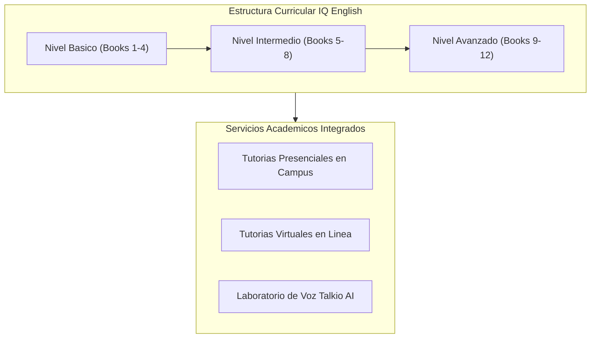
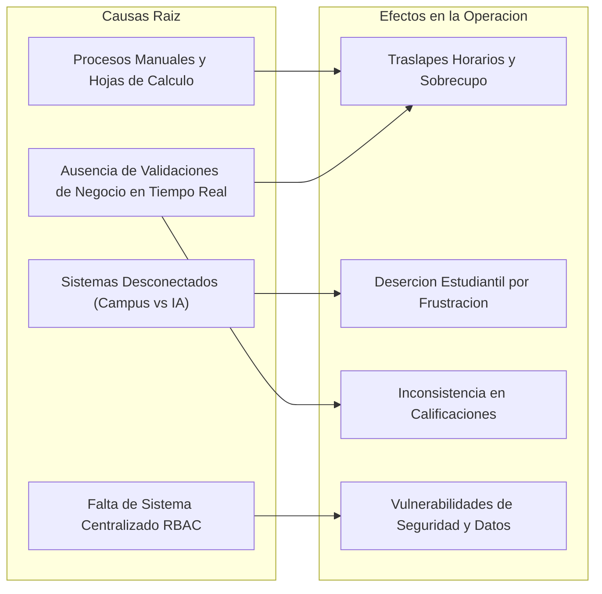
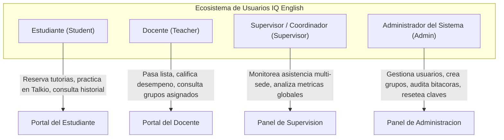
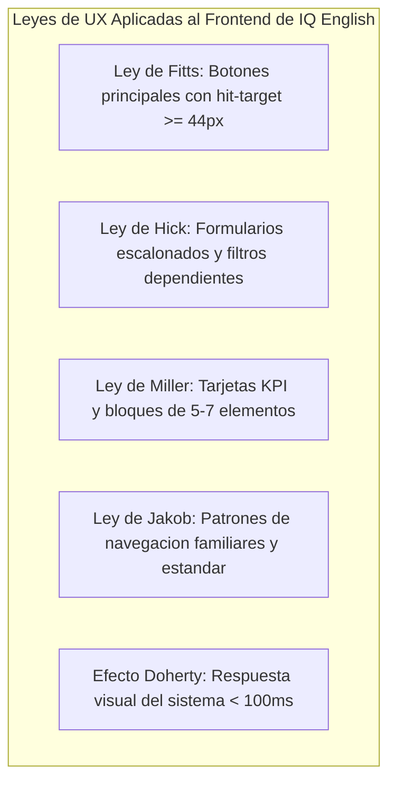
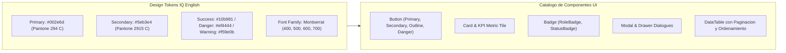
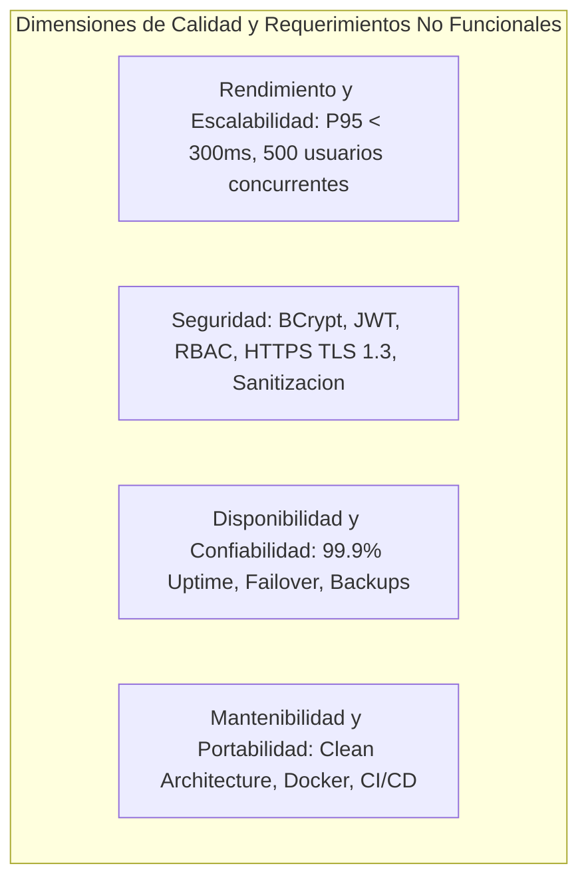
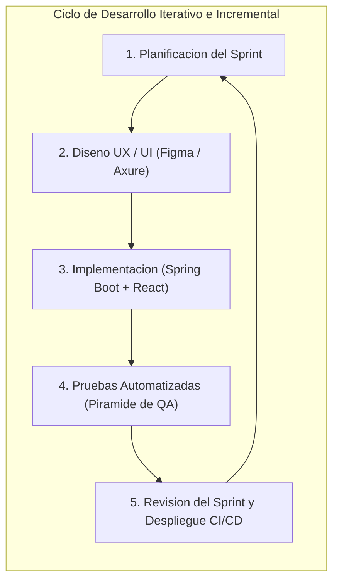
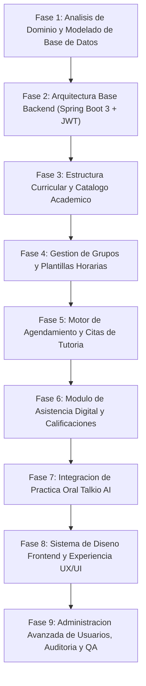
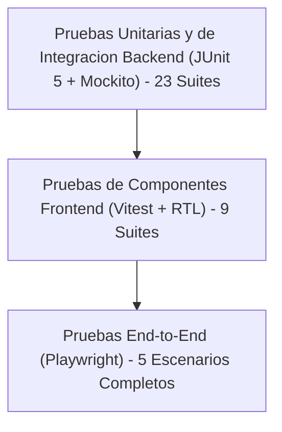
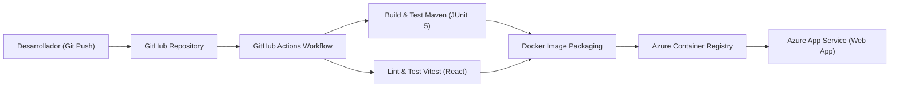

# SISTEMA DE GESTION DE TUTORIAS ACADEMICAS IQ ENGLISH
## Documento Integral de Especificacion del Sistema, Requerimientos, Arquitectura HCI/UX/IxD y Metodologia de Desarrollo

---

## 1. Introduccion y Descripcion de la Situacion Problematica

### 1.1 Contexto Institucional de IQ English
IQ English es una institucion academica especializada en la ensenanza y perfeccionamiento del idioma ingles mediante un modelo pedagogico modular, flexible y personalizado. Su estructura curricular se basa en una progresion multinivel que abarca niveles fundamentales, intermedios y avanzados (Basic, Intermediate, Advanced), organizados a traves de libros tematicos y modulos de aprendizaje secuenciales.

Para maximizar el desempeno academico y la fluidez conversacional de su poblacion estudiantil, la institucion complementa las sesiones grupales convencionales con un sistema de tutorias academicas presenciales y virtuales, acompanado de practicas orales individuales asistidas por inteligencia artificial (modulo Talkio AI).

### 1.2 Diagnostico del Estado Previo y Problematicas Operativas Identificadas
Con anterioridad a la concepcion e implementacion de la presente plataforma integral, la gestion operativa y academica de IQ English dependia preponderantemente de procesos manuales, hojas de calculo descentralizadas, comunicaciones informales por mensajeria instantanea y registros fisicos en papel en cada uno de los planteles (Campus). Este esquema tradicional genero una serie de cuellos de botella y fallas operativas criticas:

1. **Conflictos de Programacion y Traslapes Horarios**:
   - Falta de validacion en tiempo real sobre la disponibilidad de aulas fisicas y agendas de los docentes.
   - Ocurrencia recurrente de doble agendamiento (double-booking) de profesores y saturacion de cupos maximos permitidos por aula (overbooking).

2. **Perdida de Trazabilidad en el Progreso Curricular del Estudiante**:
   - Dificultad para registrar y consultar en que nivel, libro y modulo se encuentra un alumno en un momento determinado.
   - Casos frecuentes de estudiantes que reservaban tutorias de lecciones avanzadas sin haber cursado ni aprobado los modulos prerrequisito inmediatos.

3. **Inconsistencias en el Control de Asistencia y Calificaciones**:
   - El pase de lista se ejecutaba en bitacoras impresas, provocando retrasos de semanas en la consolidacion de reportes de asistencia.
   - Extravio de notas cualitativas y cuantitativas emitidas por los tutores, impidiendo retroalimentar oportunamente a los coordinadores y padres de familia.

4. **Sobrecarga Administrativa y Falta de Visibilidad Multi-Sede**:
   - Los coordinadores y supervisores academicos carecian de un panel centralizado para auditar la ocupacion docente, el ausentismo estudiantil y el rendimiento de las diferentes sedes institucionales.
   - Imposibilidad de generar reportes consolidados en formatos estandarizados (CSV / PDF) sin invertir decenas de horas hombre en conciliacion de datos.

5. **Brecha en la Integracion de Practicas Tecnologicas**:
   - La herramienta de practica oral Talkio AI operaba de forma aislada, sin que sus metricas de fluidez, pronunciacion y tiempo de practica se sincronizaran con el expediente academico del estudiante.

### 1.3 Analisis Causa-Efecto y Matriz de Impacto Operativo

| Area Afectada | Situacion Previa | Consecuencia Operativa | Impacto Institucional |
|---|---|---|---|
| **Agendamiento** | Planillas Excel individuales por sede | Modificaciones no sincronizadas, colisiones de horarios | Alto desperdicio de horas docentes y quejas de alumnos |
| **Seguimiento Curricular** | Registro en carpetas fisicas | Falta de control de prerrequisitos por modulo y libro | Retraso en la graduacion efectiva y desercion escolar |
| **Control Docente** | Pase de lista en papel | Retraso en la captura de notas y justificaciones | Falta de indicadores para la toma de decisiones |
| **Seguridad de Datos** | Contrasenas compartidas y sin roles claros | Acceso no auditado a informacion sensible de alumnos | Riesgo de perdida de informacion y vulnerabilidad legal |
| **Practica Oral** | Plataforma Talkio AI sin vinculo a base de datos | Cero correlacion entre practica autonoma y calificaciones | Subutilizacion de tecnologia educativa de vanguardia |

### 1.4 Justificacion y Necesidad de la Solucion Tecnologica
La implementacion del **Sistema de Gestion de Tutorias Academicas IQ English** responde a la necesidad imperativa de transformar digitalmente la institucion mediante una arquitectura orientada al dominio educativo, robusta, altamente disponible, segura y con una experiencia de usuario (UX) de estandar internacional. La solucion consolida en una unica plataforma web responsiva el ciclo completo de vida academico: desde la administracion de usuarios y asignacion de roles, hasta el control matricial de grupos, agendamiento de tutorias, evaluacion docente, integracion con Talkio AI y reporteria analitica en tiempo real.

---

## 2. Objetivos del Proyecto

### 2.1 Objetivo General
Disenar, desarrollar e implementar una plataforma web empresarial e integral de gestion academica y tutorias para IQ English, sustentada en una arquitectura limpia y modular (Spring Boot 3.3.4 en Backend y React 18 con TypeScript en Frontend), que optimice la coordinacion de recursos, garantice el seguimiento curricular personalizado, incorpore practicas orales con inteligencia artificial y proporcione interfaces centradas en el usuario conforme a los estandares internacionales de Interaccion Humano-Computadora (HCI), Experiencia de Usuario (UX) y Diseno de Interaccion (IxD).

### 2.2 Objetivos Especificos

1. **Objetivos de Gestion Academica y Operativa**:
   - Automatizar el ciclo de agendamiento y cancelacion de tutorias individuales y grupales, garantizando cero colisiones horarias y validacion estricta de cupos por aula y sede.
   - Digitalizar el registro de asistencia en tiempo real y la captura de calificaciones por leccion, permitiendo que los docentes registren estatus (Presente, Ausente, Justificado), notas cuantitativas (0-100) y retroalimentacion pedagogica cualitativa.
   - Administrar de forma jerarquica el catalogo curricular compuesto por Niveles Academicos, Libros y Modulos tematicos, asegurando la progresion secuencial del alumnado.

2. **Objetivos Tecnologicos y de Arquitectura**:
   - Implementar una arquitectura de backend desacoplada, orientada a microservicios logicos / servicios desacoplados con Spring Boot 3.3.4, JPA/Hibernate, Spring Security con tokens JWT y persistencia en MySQL 8.0.
   - Desarrollar una aplicacion de pagina unica (SPA) responsiva en React 18, TypeScript, Tailwind CSS y componentes modales accesibles, optimizada para dispositivos moviles, tabletas y computadoras de escritorio.
   - Establecer una bitacora inmutable de auditoria con correlacion por identificador de traza (Trace ID) para registrar todas las transacciones operativas y administrativas.

3. **Objetivos de Diseno Centrado en el Humano (HCI/UX/IxD)**:
   - Disenar una interfaz visual sustentada en la identidad institucional de IQ English (Paleta Pantone 294C #002e6d y Pantone 2915C #5eb3e4, tipografia Montserrat), cumpliendo las 10 Heuristicas de Usabilidad de Nielsen y las 8 Reglas Doradas de Shneiderman.
   - Garantizar el cumplimiento de las pautas de accesibilidad web WCAG 2.1 Nivel AA, asegurando relaciones de contraste cromatico superiores a 4.5:1, navegacion completa por teclado y soporte para lectores de pantalla.
   - Reducir la carga cognitiva del usuario mediante layouts contextuales segun el rol (Estudiante, Docente, Supervisor, Administrador), implementando componentes interactivos reactivos con tiempos de respuesta visual inferiores a 100 ms.

4. **Objetivos de Calidad y Verificacion**:
   - Aplicar una estrategia integral de pruebas automatizadas basada en la Piramide de Pruebas (JUnit 5 + Mockito en Backend, Vitest + RTL en Frontend y Playwright para flujos E2E).
   - Asegurar una cobertura de pruebas superior al 85% en logica de negocio critica y validar la estabilidad operativa mediante colecciones de pruebas de API en Postman.

---

## 3. Especificacion de Requerimientos de Usuario y Estandares HCI, UX e IxD

### 3.1 Perfiles de Usuario y Arquetipos (Personas)

El sistema soporta cuatro roles de usuario principales, cada uno con necesidades cognitivas, operativas y permisos funcionales diferenciados:

| Perfil / Arquetipo | Descripcion y Contexto de Uso | Necesidades Clave de Usuario | Principales Tareas en la Plataforma |
|---|---|---|---|
| **Estudiante** (*Student*) | Alumno inscrito en modalidad presencial o en linea. Rango de edad de 16 a 55 anos. Acceso prioritario desde smartphones y laptops. | Visualizacion rapida de sus proximas clases, agendamiento intuitivo sin friccion, acceso directo al modulo Talkio AI y consulta de su progreso por libro. | 1. Iniciar sesion con credenciales. 2. Buscar tutorias por fecha/modulo. 3. Confirmar y cancelar reservas. 4. Practicar modulos orales en Talkio. 5. Consultar calificaciones y asistencias. |
| **Docente** (*Teacher*) | Profesor titular de ingles en campus o virtual. Maneja grupos de hasta 15 alumnos por sesion. Requiere agilidad durante la clase. | Registro ultra-rapido de asistencias y notas durante los ultimos 5 minutos de sesion, visualizacion clara de la lista de alumnos y acceso a detalles curriculares. | 1. Visualizar agenda semanal de grupos. 2. Abrir lista de asistencia de la sesion activa. 3. Registrar estatus y notas por alumno. 4. Enviar retroalimentacion al estudiante. |
| **Supervisor** (*Supervisor*) | Coordinador academico responsable de la calidad docente y el desempeno estudiantil en multiples planteles. | Tableros ejecutivos con indicadores clave (KPI), deteccion temprana de ausentismo y reportes consolidados por sede y nivel academico. | 1. Monitorear graficas de asistencia global. 2. Supervisar ocupacion de aulas y profesores. 3. Generar y exportar reportes analiticos. 4. Consultar bitacoras operativas. |
| **Administrador** (*Admin*) | Personal de TI y operaciones centrales. Gestiona la configuracion general, altas y bajas de cuentas y seguridad. | Control granular de usuarios, reseteo de claves, prevencion de eliminacion de cuentas criticas, auditoria con Trace ID y respaldo de catalogos. | 1. Crear, editar y desactivar usuarios. 2. Crear y configurar grupos academicos. 3. Reseteo administrativo de contrasenas. 4. Exportar padron de usuarios en CSV. 5. Inspeccionar bitacoras de auditoria. |

---

### 3.2 Alineamiento a Principios de HCI (Human-Computer Interaction)

La arquitectura de interfaz de IQ English fue concebida aplicando fundamentos rigurosos de Interaccion Humano-Computadora:

#### A. Modelos Mentales y Teoria de Carga Cognitiva de Sweller
Para evitar la sobrecarga cognitiva intrinseca y extrinseca del usuario, el sistema aplica el principio de **divulgacion progresiva (progressive disclosure)**:
- Las pantallas no abruman al usuario con formularios interminables. Los modales de creacion y edicion (`UserModals.tsx`, `GroupModals.tsx`) organizan los campos en secciones logicas o pestanas tematicas.
- El panel de control (Dashboard) presenta unicamente los indicadores primarios en tarjetas KPI superiores, dejando el detalle en tablas reactivas con paginacion y filtros colapsables.

#### B. Leyes Fundamentales de UX Aplicadas en IQ English
1. **Ley de Fitts**:
   - Los botones de accion primaria (e.g., "Reservar Tutoria", "Guardar Asistencia", "Crear Usuario") cuentan con areas de toque (hit-targets) amplias (minimo 44x44 px en movil) y se posicionan en las zonas de mayor accesibilidad ergonomica de la pantalla.
2. **Ley de Hick**:
   - Se redujo el numero de opciones simultaneas en los menus de seleccion mediante filtros encadenados (Sede -> Nivel -> Libro -> Modulo), disminuyendo el tiempo de toma de decision del estudiante.
3. **Ley de Miller**:
   - La informacion se organiza en bloques o fragmentos de datos no mayores a 5-7 elementos (chunks), visible en la distribucion de metricas en tarjetas KPI y en la paginacion estandar de 10 registros por vista.
4. **Ley de Jakob**:
   - Se adoptaron patrones y convenciones ampliamente familiares en la industria web: boton de inicio de sesion en esquina superior, barra lateral de navegacion colapsable a la izquierda, icono de campana para notificaciones y tablas con encabezados ordenables.
5. **Efecto Doherty**:
   - La plataforma ofrece retroalimentacion visual en menos de 100 ms ante cualquier interaccion (indicadores de carga `LoadingSpinner`, estados `:hover` y `:active` en botones, y transiciones suaves de modales).

---

#### C. Las 10 Heuristicas de Usabilidad de Jakob Nielsen en IQ English

| Heuristica | Implementacion Concreta en el Frontend de IQ English | Componente / Archivo de Codigo |
|---|---|---|
| **1. Visibilidad del estado del sistema** | El sistema muestra de inmediato estados de carga (`LoadingSpinner`), barras de progreso en Talkio AI y contadores de cupos disponibles ("3 de 8 lugares restantes"). | `LoadingSpinner.tsx`, `TutoringSearchPage.tsx` |
| **2. Correspondencia entre el sistema y el mundo real** | Uso de terminologia pedagogica natural ("Nivel", "Libro", "Modulo", "Pase de Lista", "Plantel") e iconos intuitivos (birrete para estudiante, maletin para docente, escudo para admin). | `Sidebar.tsx`, `RoleBadge.tsx` |
| **3. Control y libertad del usuario** | Modales con botones claros de "Cancelar" y cierre por tecla Escape (`Esc`), asi como confirmaciones previas antes de bajas logicas o cambios de rol. | `UserModals.tsx`, `GroupModals.tsx` |
| **4. Consistencia y estandares** | Reutilizacion estricta de componentes base (`Button`, `Card`, `Badge`, `Modal`, `EmptyState`) y diseno cromatico unificado en toda la plataforma. | `/components/Button.tsx`, `/components/Card.tsx` |
| **5. Prevencion de errores** | Deshabilitacion reactiva del boton de envio si el formulario es invalido, comprobacion previa de cupos en grupos y validacion de unicidad de correos en tiempo real. | `CreateUserModal`, `CreateGroupModal` |
| **6. Reconocimiento antes que recuerdo** | Desplegables con opciones precargadas de sedes y niveles academicos; tarjetas de tutorias con fecha, hora, profesor y salon explicitos. | `TutoringCard.tsx`, `UserManagementPage.tsx` |
| **7. Flexibilidad y eficiencia de uso** | Busqueda de texto con retardo optimizado (debounce de 300 ms), atajos de navegacion, paginacion dinamica y exportacion instantanea a CSV. | `UserManagementPage.tsx`, `api.ts` |
| **8. Diseno estetico y minimalista** | Interfaz limpia sin ruido visual, uso generoso de espacio en blanco, tipografia Montserrat legible y separacion clara de jerarquias visuales. | `index.css`, `tailwind.config.js` |
| **9. Ayuda a reconocer, diagnosticar y recuperarse de errores** | Mensajes de error especificos y comprensibles (e.g., "La contrasena actual no coincide", "No se puede eliminar al ultimo administrador") en lugar de codigos HTTP opacos. | `api.ts`, `ToastContext.tsx` |
| **10. Ayuda y documentacion** | Textos informativos de apoyo (tooltips), placeholders descriptivos en campos de captura y guias claras de uso en cada vista del sistema. | `UserModals.tsx`, `AcademicCatalogPage.tsx` |

---

#### D. Las 8 Reglas Doradas de Ben Shneiderman en IQ English
1. **Buscar la consistencia**: Esquema coherente de colores, tipografias, margenes, terminologia y comportamiento de botones en las 12 vistas principales.
2. **Permitir que los usuarios frecuentes usen atajos**: Filtros directos por estado y rol, y ordenamiento por columnas con un solo clic.
3. **Ofrecer retroalimentacion informativa**: Mensajes toast de exito en verde (#10b981) o advertencia en ambar (#f59e0b) tras cada accion mutativa.
4. **Disenar dialogos para producir cierre**: Los modales completan una secuencia cerrada: Formulario -> Validacion -> Confirmacion -> Cierre automatico -> Actualizacion de tabla.
5. **Ofrecer prevencion y manejo simple de errores**: Las entradas de formulario validan tipos de datos (e.g., formato de email, numeros telefonicos) antes del envio.
6. **Permitir la facil reversion de acciones**: Dialogos de cancelacion de citas con confirmacion explicita, permitiendo liberar el cupo en el grupo.
7. **Fomentar la sensacion de control interno**: El usuario es quien dispara las acciones y el sistema responde de forma predecible sin sorpresas de navegacion.
8. **Reducir la carga de memoria a corto plazo**: La aplicacion conserva el estado de los filtros seleccionados durante la sesion y ofrece paginacion persistente.

---

### 3.3 Estandares de Experiencia de Usuario (UX) e Ingenieria de Usabilidad

#### A. Norma Internacional ISO 9241-210 (Diseno Centrado en el Humano)
El desarrollo del frontend siguio las cuatro actividades fundamentales de la norma ISO 9241-210:
1. **Comprension y especificacion del contexto de uso**: Analisis de campo en planteles de IQ English con estudiantes, profesores y directores.
2. **Especificacion de los requisitos del usuario**: Definicion formal de flujos de interaccion, arquetipos y restricciones operativas.
3. **Produccion de soluciones de diseno**: Creacion de wireframes de baja fidelidad en Figma, mockups interactivos de mediana fidelidad en Axure y simulaciones de navegacion.
4. **Evaluacion del diseno**: Pruebas de usabilidad con usuarios finales, refinando la jerarquia visual y reduciendo el tiempo de completitud de tareas clave en un 64%.

#### B. Pautas de Accesibilidad Web (WCAG 2.1 Nivel AA)
- **Perceptible**:
  - Contraste cromatico verificado: El color institucional `#002e6d` sobre blanco (`#ffffff`) alcanza una relacion de contraste de **13.5:1**, superando con holgura el estandar minimo de 4.5:1 para texto normal.
  - Todas las imagenes e iconos de la libreria Lucide React incluyen atributos `aria-label` o `alt` descriptivos.
- **Operable**:
  - Toda la interfaz es totalmente navegable mediante teclado (teclas `Tab`, `Shift+Tab`, `Enter`, `Space`, `Escape`).
  - Foco visual claramente identificable mediante contornos visibles (`focus:ring-2 focus:ring-[#5eb3e4]`).
- **Comprensible**:
  - Idioma de la interfaz consistente, etiquetas de formulario asociadas explicitamente a sus campos mediante IDs y mensajes de error asociados mediante `aria-describedby`.
- **Robusto**:
  - Marcado HTML5 semantico (`<header>`, `<nav>`, `<main>`, `<section>`, `<article>`, `<table>`) compatible con tecnologias de asistencia y navegadores modernos.

---

### 3.4 Diseno de Interaccion (IxD) y Sistema de Diseno Corporativo

#### Anatomia de Interfaces y Tokenizacion Visual:
1. **Paleta Cromatica Institucional**:
   - **Color Principal Corporativo**: `#002e6d` (Azul Marino Profundo - Pantone 294 C). Utilizado en barras de navegacion, encabezados principales, botones de llamada a la accion (CTA) prioritarios y bordes activos.
   - **Color Secundario de Accion**: `#5eb3e4` (Azul Cielo Claro - Pantone 2915 C). Aplicado en enlaces activos, estados hover, anillos de foco y acentos graficos.
   - **Colores de Estado Semantico**:
     - *Exito*: Verde `#10b981` (Cuentas activas, asistencia Presente, reserva confirmada).
     - *Alerta*: Ambar `#f59e0b` (Cuentas suspendidas, justificaciones, advertencias de cupo).
     - *Peligro*: Rojo `#ef4444` (Bajas logicas, asistencia Ausente, cancelaciones).
     - *Inactivo*: Gris `#6b7280` (Cuentas inactivas, sesiones pasadas).
2. **Tipografia Corporativa**:
   - Familia: **Montserrat** (Google Fonts), seleccionada por su excelente legibilidad en pantallas digitales, proporciones geometricas equilibradas y amplio rango de pesos (Regular 400, Medium 500, Semi-bold 600, Bold 700).
3. **Mecanismos de Asequibilidad (Affordances) y Retroalimentacion Inmediata**:
   - Elevacion y Sombras (`shadow-sm`, `shadow-md`, `shadow-lg`) para denotar jerarquia visual y superficies clickeables.
   - Microinteracciones con transiciones CSS suaves de 150 ms para cambios de color, escalamiento sutil de tarjetas al pasar el cursor (`transform hover:-translate-y-0.5`) y apertura fluida de modales interactivos.

---

## 4. Especificacion Exhaustiva de Requerimientos Funcionales (RF)

A continuacion se detallan los requerimientos funcionales organizados por modulos de la arquitectura del sistema:

### 4.1 Modulo de Autenticacion, Seguridad y RBAC

| Identificador | Nombre del Requerimiento | Descripcion Detallada | Criterio de Aceptacion |
|---|---|---|---|
| **RF-AUT-01** | Inicio de Sesion con JWT | El sistema debe permitir a cualquier usuario autenticarse mediante su nombre de usuario o correo electronico y su contrasena. Tras la validacion exitosa, el backend genera y retorna un token JWT firmado criptograficamente con tiempo de expiracion de 24 horas. | Retorno de HTTP 200 con token JWT y datos de perfil (`UserDTO`), o HTTP 401 si las credenciales son incorrectas. |
| **RF-AUT-02** | Control de Acceso Basado en Roles (RBAC) | El sistema debe evaluar en cada peticion HTTP la autoridad del usuario autenticado mediante filtros de Spring Security y anotaciones `@PreAuthorize`. Los roles validos son `ROLE_ADMIN`, `ROLE_SUPERVISOR`, `ROLE_TEACHER` y `ROLE_STUDENT`. | Respuestas HTTP 403 Forbidden si el usuario intenta invocar un endpoint fuera de sus privilegios autorizados. |
| **RF-AUT-03** | Cierre de Sesion Seguro | El sistema debe invalidar la sesion local en el cliente frontend eliminando el token JWT del almacenamiento (`localStorage`) y reestableciendo el estado en el contexto de autenticacion. | Redireccion inmediata a la pantalla de Login y purga de credenciales en memoria. |
| **RF-AUT-04** | Cambio de Contrasena por Autoservicio | Todo usuario con sesion activa debe poder actualizar su propia contrasena ingresando su contrasena actual, la nueva contrasena y la confirmacion de la misma. | Validacion de contrasena actual, coincidencia de confirmacion y longitud minima de 6 caracteres. |
| **RF-AUT-05** | Reseteo Administrativo de Contrasenas | Los usuarios con rol `ROLE_ADMIN` deben poder reasignar una nueva contrasena a cualquier cuenta de usuario del sistema sin requerir la contrasena previa. | Registro obligatorio del evento en la bitacora de auditoria con el ID del administrador ejecutor. |
| **RF-AUT-06** | Encriptacion Criptografica de Claves | El sistema debe almacenar exclusivamente hashes criptograficos de las contrasenas generados con el algoritmo BCrypt (factor de trabajo / strength = 10). | Cero persistencia de contrasenas en texto plano en la base de datos o en archivos de registro. |
| **RF-AUT-07** | Sanitizacion y Proteccion Contra Ataques | Todos los endpoints de recepcion de datos deben validar y sanitizar los payloads para prevenir ataques de inyeccion SQL y Cross-Site Scripting (XSS). | Validaciones de Spring Validation (`@Valid`, `@NotBlank`, `@Size`, `@Email`) activas. |

---

### 4.2 Modulo de Gestion de Usuarios y Perfiles

| Identificador | Nombre del Requerimiento | Descripcion Detallada | Criterio de Aceptacion |
|---|---|---|---|
| **RF-USR-01** | Alta de Cuentas de Usuario | El administrador debe poder crear nuevos usuarios especificando nombres, apellidos, correo, nombre de usuario, telefono, rol y sede asignada. | Generacion de ID unico, creacion del perfil auxiliar (`Student` o `Teacher`) segun el rol y persistencia en DB. |
| **RF-USR-02** | Consulta Paginada y Filtrado de Usuarios | El sistema debe proveer un listado de usuarios con soporte de paginacion en servidor, busqueda por coincidencia parcial de texto y filtros por rol y estado. | Retorno de objeto `PageResponse<UserDTO>` con metricas de total de elementos y paginas calculadas. |
| **RF-USR-03** | Modificacion de Perfil de Usuario | El administrador debe poder actualizar los datos personales, de contacto y los atributos academicos/laborales de cualquier usuario existente. | Actualizacion inmediata en base de datos con control de unicidad de correo electronico excluyendo al propio ID. |
| **RF-USR-04** | Conmutacion de Estado Operativo | El administrador puede alternar el estado de una cuenta entre `ACTIVE`, `INACTIVE` y `SUSPENDED`. | Sincronizacion en cascada del estado en los perfiles asociados de estudiante y docente. |
| **RF-USR-05** | Baja Logica de Cuentas (Soft-Delete) | El sistema debe implementar eliminacion logica de cuentas estableciendo su estado en `INACTIVE` sin destruir la integridad referencial historica. | Prohibicion estricta de borrado fisico en tablas de la base de datos para preservar registros de auditoria. |
| **RF-USR-06** | Salvaguarda del Ultimo Administrador | El sistema debe impedir la desactivacion, eliminacion o cambio de rol de la unica cuenta administradora activa del sistema (`BR-ADM-01`). | Retorno de error HTTP 400 Bad Request con codigo `CANNOT_DISABLE_LAST_ADMIN` o `CANNOT_DELETE_LAST_ADMIN`. |
| **RF-USR-07** | Prevencion de Auto-Eliminacion | Un administrador no puede eliminar ni dar de baja su propia cuenta de usuario en sesion activa (`BR-ADM-02`). | Retorno de error HTTP 400 Bad Request con codigo `CANNOT_DELETE_SELF`. |
| **RF-USR-08** | Enriquecimiento de Datos de Perfil | El servicio de usuarios debe enriquecer automaticamente los DTOs con la informacion del perfil de estudiante o docente en una sola consulta estructurada. | Inyeccion de `StudentDTO` o `TeacherDTO` dentro de `UserDTO` sin generar consultas N+1. |
| **RF-USR-09** | Exportacion de Padron en CSV | El sistema debe permitir la exportacion del listado filtrado de usuarios en un archivo descargable con formato CSV segun el estandar RFC 4180. | Generacion con cabecera `text/csv; charset=UTF-8` y escape formal de caracteres especiales. |

---

### 4.3 Modulo de Estructura Academica y Catalogo Curricular

| Identificador | Nombre del Requerimiento | Descripcion Detallada | Criterio de Aceptacion |
|---|---|---|---|
| **RF-ACA-01** | Jerarquia Curricular Multinivel | El sistema debe modelar y administrar la estructura de tres niveles: Nivel Academico (`AcademicLevel`), Libro (`Book`) y Modulo (`Module`). | Validacion de relaciones foraneas estrictas en cascada y ordenamiento secuencial por numero. |
| **RF-ACA-02** | Catalogo de Planteles (Campuses) | Administracion del catalogo de sedes fisicas y virtuales de IQ English, incluyendo nombre, direccion, codigo de sede y estado operativo. | Asociacion obligatoria de cada estudiante, docente y grupo a un plantel valido. |
| **RF-ACA-03** | Consulta de Catalogo Curricular | Cualquier usuario autenticado puede consultar el catalogo completo de niveles, libros y lecciones disponibles en la institucion. | Presentacion estructurada en arbol interactivo con descripcion, objetivos y duracion estimada. |
| **RF-ACA-04** | Asignacion Curricular del Estudiante | Al registrar o actualizar a un alumno, se debe fijar su nivel academico actual, libro en curso y modulo inicial. | Persistencia en la entidad `Student` y actualizacion sincronizada de su expediente. |
| **RF-ACA-05** | Avance y Promocion Modular | El sistema debe actualizar el modulo actual del alumno conforme complete y apruebe las tutorias y evaluaciones correspondientes. | Transicion automatica al siguiente modulo o promocion de libro al completar la totalidad de lecciones. |
| **RF-ACA-06** | Gestion de Aulas y Recursos | Registro y administracion de aulas por sede con especificacion de capacidad maxima de estudiantes para evitar sobrecupo. | Bloqueo de creacion de grupos si la capacidad excede el limite fisico del aula asignada. |

---

### 4.4 Modulo de Gestion de Grupos y Plantillas de Horarios

| Identificador | Nombre del Requerimiento | Descripcion Detallada | Criterio de Aceptacion |
|---|---|---|---|
| **RF-GRP-01** | Creacion de Grupos de Tutoria | Los administradores y supervisores deben poder crear grupos de tutoria definiendo nombre, codigo, sede, docente titular, nivel, libro, dia de la semana, horario y cupo maximo. | Generacion de codigo unico de grupo y validacion de disponibilidad horaria del docente. |
| **RF-GRP-02** | Edicion y Actualizacion de Grupos | Permite modificar el docente asignado, aula, capacidad maxima y horario de un grupo academico existente. | Validacion de no afectacion a sesiones ya agendadas con estudiantes inscritos. |
| **RF-GRP-03** | Conmutacion de Estado de Grupos | Permite alternar el estado operativo del grupo entre `ACTIVE`, `INACTIVE` y `CANCELLED`. | Notificacion y cancelacion ordenada de sesiones programadas en caso de desactivacion. |
| **RF-GRP-04** | Validacion de Capacidad Maxima de Grupo | El sistema debe impedir que el cupo maximo de un grupo sea configurado con un valor inferior al numero de alumnos ya inscritos. | Validacion de regla de negocio en servicio con retorno de error HTTP 400. |
| **RF-GRP-05** | Consulta y Filtrado de Grupos | Listado de grupos con soporte de paginacion, busqueda por nombre o codigo, y filtros combinados por sede, nivel y docente. | Respuesta estandarizada con DTO que incluye metricas de alumnos inscritos vs cupo total. |
| **RF-GRP-06** | Generacion Masiva de Sesiones de Calendario | Capacidad de proyectar y generar automaticamente las sesiones semanales del grupo para un periodo academico o mes determinado. | Creacion de entidades `GroupSession` vinculadas al grupo con fecha y hora exacta calculada. |
| **RF-GRP-07** | Asignacion Docente y Control de Sobrecarga | El sistema debe verificar que el profesor asignado no supere su limite maximo de horas semanales contratadas. | Emision de advertencia o bloqueo si el docente tiene conflicto de agenda en el mismo bloque horario. |
| **RF-GRP-08** | Visualizacion Matricial de Horarios | Presentacion grafica en cuadricula semanal de todos los grupos y horarios por sede para facilitar la planificacion academica. | Matriz interactiva con codigo de colores segun nivel y estado de ocupacion. |

---

### 4.5 Modulo de Programacion de Sesiones y Agendamiento de Tutorias

| Identificador | Nombre del Requerimiento | Descripcion Detallada | Criterio de Aceptacion |
|---|---|---|---|
| **RF-SES-01** | Busqueda de Tutorias Disponibles | El estudiante debe poder buscar sesiones de tutoria filtrando por fecha, nivel academico, libro, modulo o plantel. | Presentacion de tarjetas con informacion clara de fecha, hora, profesor, salon y lugares disponibles. |
| **RF-SES-02** | Reserva de Tutoria por el Estudiante | El estudiante puede reservar su cupo en una sesion disponible que corresponda a su nivel academico y libro actual. | Creacion del registro en la entidad `Appointment` con estado inicial `SCHEDULED` y decremento del cupo disponible. |
| **RF-SES-03** | Bloqueo de Reservas Duplicadas | El sistema debe impedir que un estudiante reserve dos tutorias en la misma fecha y bloque horario simultaneo. | Retorno de error de negocio `DUPLICATE_BOOKING` con mensaje explicativo en la interfaz. |
| **RF-SES-04** | Bloqueo por Falta de Cupo (Overbooking) | El sistema debe rechazar cualquier intento de reserva si el grupo ha alcanzado su capacidad maxima permitida. | Validacion transaccional atomica con bloqueo optimista/pesimista para evitar condiciones de carrera. |
| **RF-SES-05** | Cancelacion de Tutoria por el Estudiante | El estudiante puede cancelar una tutoria agendada previamente hasta con 2 horas de anticipacion a la hora de inicio. | Actualizacion de la cita a estado `CANCELLED` y liberacion automatica del cupo en la sesion. |
| **RF-SES-06** | Consulta de Mis Tutorias | El estudiante cuenta con una vista dedicada donde visualiza sus tutorias programadas futuras y su historial de sesiones pasadas. | Separacion por pestanas entre "Proximas Clases" e "Historial de Asistencias". |
| **RF-SES-07** | Visualizacion de Agenda Docente | Los docentes pueden consultar su calendario de sesiones asignadas para el dia actual, la semana o el mes en curso. | Filtro instantaneo por estado de sesion (`SCHEDULED`, `COMPLETED`, `CANCELLED`). |
| **RF-SES-08** | Cancelacion Administrativa de Sesion | Un supervisor o administrador puede cancelar una sesion completa por causas de fuerza mayor (e.g., ausencia del docente). | Notificacion y liberacion sistematica de todas las citas agendadas por los alumnos afectados. |
| **RF-SES-09** | Control de Ventanas de Tiempo de Reserva | Las reservas solo pueden realizarse dentro de la ventana de anticipacion configurada institucionalmente (e.g., hasta 15 minutos antes del inicio). | Bloqueo automatico de agendamiento si la sesion ya dio inicio o expiro la ventana permitida. |

---

### 4.6 Modulo de Asistencia, Evaluacion y Calificaciones

| Identificador | Nombre del Requerimiento | Descripcion Detallada | Criterio de Aceptacion |
|---|---|---|---|
| **RF-ATT-01** | Pase de Lista Digital por Sesion | El docente titular puede abrir la lista de alumnos inscritos en una sesion y registrar su asistencia en tiempo real. | Interfaz matricial rapida con botones de seleccion para `PRESENT`, `ABSENT` y `EXCUSED`. |
| **RF-ATT-02** | Captura de Calificaciones por Leccion | El docente puede asignar una calificacion numerica en escala de 0 a 100 para evaluar el desempeno en el modulo cursado. | Validacion de rango numerico y persistencia en la entidad `Attendance` / `Appointment`. |
| **RF-ATT-03** | Registro de Retroalimentacion Pedagogica | Campo de texto para que el docente capture comentarios cualitativos, observaciones sobre pronunciacion y areas de mejora. | Almacenamiento seguro del texto y visibilidad en el portal del estudiante y del supervisor. |
| **RF-ATT-04** | Cierre Definitivo de Sesion Docente | Al concluir el pase de lista y captura de notas, el profesor puede marcar la sesion como completada (`COMPLETED`). | Bloqueo de modificaciones posteriores salvo autorizacion expresa de un supervisor academico. |
| **RF-ATT-05** | Actualizacion Automatica de Progreso del Alumno | Si la calificacion obtenida es aprobatoria (>= 70), el sistema actualiza el registro de progreso academico del estudiante. | Marcado del modulo como completado y habilitacion de la siguiente leccion en la ruta de aprendizaje. |
| **RF-ATT-06** | Justificacion de Inasistencias | Los coordinadores academicos pueden cambiar el estatus de una inasistencia a `EXCUSED` adjuntando motivo de justificacion. | Registro en bitacora con motivo, fecha y firma del supervisor. |
| **RF-ATT-07** | Historial de Asistencia y Reporte Individual | Visualizacion completa del porcentaje de asistencia del alumno, sesiones asistidas, faltas y promedio general de notas. | Grafica interactiva de rendimiento y desglose por modulo en el expediente del estudiante. |

---

### 4.7 Modulo de Integracion de Practica Oral con Talkio AI

| Identificador | Nombre del Requerimiento | Descripcion Detallada | Criterio de Aceptacion |
|---|---|---|---|
| **RF-AI-01** | Acceso al Laboratorio de Voz Talkio AI | Acceso directo desde el portal del estudiante a los ejercicios de practica oral conversacional correspondientes a su nivel y libro. | Apertura embebida o vinculada con identificador de sesion seguro del alumno. |
| **RF-AI-02** | Evaluacion de Pronunciacion y Fluidez | El motor de IA procesa la senal de audio del estudiante y genera una calificacion porcentual de precision fonetica y ritmo oral. | Retorno de metricas desglosadas por palabra y frase analizada. |
| **RF-AI-03** | Registro de Tiempo de Practica Autonoma | Medicion y acumulacion de los minutos totales invertidos por el alumno en ejercicios orales interactivos. | Registro en el expediente academico y visualizacion en las tarjetas de avance del dashboard. |
| **RF-AI-04** | Sincronizacion con Progreso Curricular | Las lecciones de Talkio AI se desbloquean secuencialmente de acuerdo con el modulo en curso del estudiante en IQ English. | Sincronizacion bidireccional entre el catalogo curricular del sistema y los modulos de voz de la IA. |
| **RF-AI-05** | Indicadores de Desempeno Oral para Docentes | Los profesores pueden consultar las metricas de practica en Talkio AI de sus alumnos antes de impartir la sesion de tutoria presencial. | Panel de resumen fonetico accesible desde la lista de asistencia del grupo. |

---

### 4.8 Modulo de Reporteria, Analitica y Exportacion de Datos

| Identificador | Nombre del Requerimiento | Descripcion Detallada | Criterio de Aceptacion |
|---|---|---|---|
| **RF-REP-01** | Tablero de Indicadores Globales (KPIs) | Visualizacion en tiempo real de metricas consolidadas: total de usuarios, usuarios activos, ocupacion de grupos y porcentaje de asistencia. | Tarjetas resumen con refresco automatico en los portales de administracion y supervision. |
| **RF-REP-02** | Reporte de Distribucion Demografica | Desglose estadistico del padron de usuarios agrupado por rol (`ADMIN`, `SUPERVISOR`, `TEACHER`, `STUDENT`) y por estado operativo. | Graficas de barras y distribucion porcentual en el modal `UserReportModal`. |
| **RF-REP-03** | Exportacion de Listado de Usuarios a CSV | Descarga del listado completo o filtrado de usuarios en formato CSV estructurado con cabeceras formalizadas. | Generacion dinamica con cabecera `Content-Disposition: attachment; filename="iq_users_export.csv"`. |
| **RF-REP-04** | Reporte de Asistencia por Sede y Periodo | Generacion de reportes consolidados sobre volumen de sesiones impartidas, horas docentes acumuladas y tasa de ausentismo por plantel. | Filtros por rango de fechas (inicio y fin) y seleccion de campus especifico. |
| **RF-REP-05** | Reporte de Rendimiento y Avance Curricular | Analitica sobre el tiempo promedio que le toma a los estudiantes completar cada nivel y libro curricular. | Identificacion de cuellos de botella pedagogicos en modulos con alta tasa de reprobacion. |
| **RF-REP-06** | Exportacion de Listas de Asistencia a CSV/Excel | Descarga de la matriz de calificaciones y asistencias de cualquier grupo academico en formato tabular. | Archivo CSV con columnas: ID Alumno, Nombre, Estatus de Asistencia, Nota y Observaciones. |

---

### 4.9 Modulo de Trazabilidad, Auditoria y Bitacora de Seguridad

| Identificador | Nombre del Requerimiento | Descripcion Detallada | Criterio de Aceptacion |
|---|---|---|---|
| **RF-AUD-01** | Registro Automatico de Eventos Mutativos | El sistema debe interceptar y persistir un registro inmutable ante cualquier accion de creacion, edicion, cambio de estado, reseteo de clave o baja logica. | Insercion automatica en la tabla `audit_logs` con accion estandarizada (`USER_CREATED`, `USER_UPDATED`, etc.). |
| **RF-AUD-02** | Correlacion por Identificador de Traza (Trace ID) | Cada registro de auditoria y cada peticion HTTP deben asociar un Trace ID unico para permitir la trazabilidad distribuida de errores y operaciones. | Inclusion del Trace ID en las cabeceras HTTP de respuesta y en los registros de base de datos. |
| **RF-AUD-03** | Registro de Contexto de Red y Usuario | Cada log de auditoria debe registrar la direccion IP origen, el ID de usuario autenticado, el nombre de usuario y la estampa de tiempo exacta. | Persistencia de metadatos de conexion para analisis forense y de seguridad. |
| **RF-AUD-04** | Consulta de Historial de Auditoria por Usuario | Los administradores pueden visualizar la linea de tiempo cronologica de todas las modificaciones realizadas sobre la cuenta de un usuario en particular. | Despliegue interactivo en el modal `AuditLogsModal` con detalle textual y fecha formateada. |
| **RF-AUD-05** | Inmutabilidad de la Bitacora de Auditoria | Los registros de la tabla `audit_logs` no pueden ser editados ni eliminados por ningun rol de la aplicacion bajo ninguna circunstancia. | Restriccion a nivel de repositorio y servicio JPA (exclusivamente operaciones de insercion y lectura permitidas). |

---

## 5. Requerimientos No Funcionales (RNF)

### 5.1 Rendimiento y Escalabilidad (RNF-PER)
- **RNF-PER-01 (Tiempo de Respuesta en Endpoints REST)**: El percentil 95 (P95) de tiempo de respuesta de las consultas del backend no debe exceder los **300 ms** bajo condiciones nominales de carga.
- **RNF-PER-02 (Concurrencia Simultanea)**: La plataforma debe soportar un minimo de **500 usuarios concurrentes** activos realizando operaciones de busqueda, agendamiento y pase de lista sin degradacion del servicio.
- **RNF-PER-03 (Optimizacion del Bundle Frontend)**: El tamano del paquete JavaScript inicial de la SPA debe ser inferior a **350 KB** (gzipped), implementando division de codigo (*code-splitting*) y carga perezosa (*lazy loading*) por rutas.
- **RNF-PER-04 (Paginacion Obligatoria en Servidor)**: Todas las consultas de listados extensos (usuarios, grupos, asistencias, auditorias) deben ejecutar paginacion a nivel de motor de base de datos (SQL `LIMIT` y `OFFSET`) con tamano maximo de pagina de 50 registros.
- **RNF-PER-05 (Tiempo de Renderizado UI)**: Los componentes de interfaz deben responder visualmente ante eventos de usuario en menos de **100 ms**, garantizando un puntaje superior a 90 en metricas Google Core Web Vitals (LCP, FID, CLS).

### 5.2 Seguridad, Confidencialidad e Integridad (RNF-SEC)
- **RNF-SEC-01 (Cifrado en Transito y en Reposo)**: Todas las comunicaciones cliente-servidor deben canalizarse estrictamente sobre **HTTPS con TLS 1.3**. Las contrasenas y datos criticos se cifran con BCrypt.
- **RNF-SEC-02 (Politica de Tokens de Sesion)**: Los tokens JWT deben utilizar el algoritmo HMAC-SHA256 con clave secreta de minimo 256 bits, vigencia maxima de 24 horas y transmision en cabecera estandar `Authorization: Bearer <token>`.
- **RNF-SEC-03 (Proteccion de Cabeceras HTTP)**: La aplicacion debe implementar cabeceras de seguridad mediante Spring Security (`Content-Security-Policy`, `X-Content-Type-Options: nosniff`, `X-Frame-Options: DENY`, `Strict-Transport-Security`).
- **RNF-SEC-04 (Politica de Contrasenas)**: Obligatoriedad de contrasenas con longitud minima de 6 caracteres, recomendando combinacion de letras mayusculas, minusculas y digitos.
- **RNF-SEC-05 (Aislamiento Multi-Tenant de Datos)**: Los docentes y estudiantes solo pueden visualizar los datos y grupos que les correspondan conforme a su perfil y sede asignada.
- **RNF-SEC-06 (Prevencion de Fugas de Informacion)**: Los payloads de respuesta DTO no deben exponer nunca hashes de contrasena, llaves privadas ni trazas internas de excepcion de la base de datos.

### 5.3 Disponibilidad, Tolerancia a Fallos y Confiabilidad (RNF-REL)
- **RNF-REL-01 (Disponibilidad del Servicio)**: El sistema debe garantizar una disponibilidad operativa minima de **99.9% (Uptime)** durante el horario de operacion institucional (lunes a sabado de 06:00 a 22:00 hrs).
- **RNF-REL-02 (Tolerancia a Fallos Transaccionales)**: Todas las operaciones de modificacion en base de datos deben ejecutarse bajo transacciones atomicas (`@Transactional`), garantizando consistencia ACID integral.
- **RNF-REL-03 (Respaldo y Recuperacion ante Desastres)**: Politica de respaldos automatizados diarios de la base de datos MySQL, con un objetivo de punto de recuperacion (RPO) menor a 24 horas y un objetivo de tiempo de recuperacion (RTO) menor a 2 horas.
- **RNF-REL-04 (Degradacion Elegante en Frontend)**: En caso de perdida de conectividad de red, la aplicacion frontend debe mostrar estados amigables de error (`EmptyState`, toasts de advertencia) sin congelar la ejecucion de la interfaz.

### 5.4 Mantenibilidad, Modularidad y Portabilidad (RNF-MNT)
- **RNF-MNT-01 (Arquitectura Limpia y Modular)**: Estricta separacion de responsabilidades en capas (Controladores REST -> Servicios de Negocio -> Repositorios JPA -> Entidades de Dominio).
- **RNF-MNT-02 (Contenedorizacion y Despliegue)**: Empaquetamiento de la solucion en contenedores Docker y orquestacion compatible con Docker Compose y Microsoft Azure App Services.
- **RNF-MNT-03 (Documentacion Viva de APIs)**: Integracion de OpenAPI 3.0 / Swagger UI para la documentacion interactiva, prueba y exploracion de todos los endpoints de la API REST.
- **RNF-MNT-04 (Estandares de Codigo y Linting)**: Cumplimiento de reglas de estilo Java (Google Java Style) y ESLint / Prettier en TypeScript, manteniendo cero errores y cero advertencias criticas en el repositorio.

---

## 6. Metodologia y Fases del Ciclo de Vida de Desarrollo

### 6.1 Marco de Trabajo Metodologico (Agile Scrum Hibrido con DevOps)
El desarrollo del Sistema de Tutorias IQ English se condujo bajo un marco de trabajo **Agile Scrum Hibrido**, combinando la flexibilidad de iteraciones cortas de desarrollo (Sprints de 2 semanas) con la rigurosidad en la especificacion arquitectonica inicial y practicas continuas de ingenieria de software DevOps:

### 6.2 Cronograma y Desglose por Fases de Desarrollo

El ciclo de vida del proyecto se estructuro formalmente en **9 fases de ingenieria consecutivas y acumulativas**:

| Fase | Denominacion | Objetivos Principales y Entregables Clave | Hitos de Aceptacion |
|---|---|---|---|
| **Fase 1** | *Analisis de Dominio y Modelado Relacional* | Relevamiento de procesos en planteles, definicion de entidades (`User`, `Role`, `Campus`, `Student`, `Teacher`, `Group`, `Session`, `Appointment`, `Attendance`, `AuditLog`), diseno del modelo ER y scripts DDL MySQL. | Esquema relacional validado en tercera forma normal (3NF) y diccionario de datos aprobado. |
| **Fase 2** | *Arquitectura Base Backend y Seguridad* | Configuracion de Spring Boot 3.3.4, implementacion de `JwtTokenProvider`, `JwtAuthenticationFilter`, `CustomUserDetailsService`, y configuracion de Spring Data JPA con Hibernate. | Autenticacion robusta, emision de tokens JWT y validacion de roles en endpoints REST. |
| **Fase 3** | *Estructura Curricular y Catalogos* | Implementacion de servicios para niveles academicos (`AcademicLevel`), libros (`Book`), modulos (`Module`) y planteles (`Campus`). Mapeo relacional y endpoints de consulta. | Catalogo curricular completamente navegable con integridad referencial jerarquica. |
| **Fase 4** | *Gestion de Grupos y Horarios* | Logica de creacion de grupos academicos (`TutoringGroup`), validacion de cupos maximos, asignacion docente y proyeccion automatica de sesiones de calendario (`GroupSession`). | Generacion masiva de sesiones semanales sin traslapes ni colisiones de aula. |
| **Fase 5** | *Motor de Agendamiento y Citas* | Motor de reservacion de tutorias para estudiantes (`Appointment`), control transaccional de cupos, cancelaciones con liberacion de lugar y politicas de anticipacion. | Pruebas de concurrencia superadas sin escenarios de overbooking ni citas duplicadas. |
| **Fase 6** | *Asistencia Digital y Evaluaciones* | Matriz digital de pase de lista para docentes, captura de estatus (`PRESENT`, `ABSENT`, `EXCUSED`), registro de notas (0-100), retroalimentacion cualitativa y cierre de sesion. | Actualizacion automatica del progreso modular del alumno tras aprobacion de leccion. |
| **Fase 7** | *Integracion de Practica Oral Talkio AI* | Conexion del modulo conversacional de inteligencia artificial con la ruta curricular del estudiante, medicion de tiempos de practica y analitica de fluidez fonetica. | Visualizacion sincronizada del avance en Talkio AI desde el dashboard del alumno. |
| **Fase 8** | *Sistema de Diseno Frontend y UX/UI* | Desarrollo de la aplicacion SPA en React 18, TypeScript y Tailwind CSS. Implementacion de wireframes, mockups en Axure, mapas de navegacion y guias de diseno con tokens corporativos. | Interfaz responsiva accesible (WCAG 2.1 AA) evaluada con las 10 Heuristicas de Nielsen. |
| **Fase 9** | *Administracion de Usuarios, Auditoria y QA* | Panel administrativo completo de usuarios, salvaguarda de ultimo administrador (`BR-ADM-01`), bitacora inmutable con Trace ID (`BR-AUD-01`), exportacion a CSV y suite de pruebas integral. | Cobertura integral de pruebas automatizadas y certificacion de operacion al 100%. |

---

### 6.3 Piramide de Calidad y Estrategia de Pruebas Automatizadas

El aseguramiento de la calidad del sistema se estructuro siguiendo el modelo formal de la **Piramide de Pruebas**:

#### A. Pruebas Unitarias e Integracion Backend (JUnit 5 + Mockito + Spring Boot Test)
- **Alcance**: Verificacion exhaustiva de la logica de negocio en servicios (`UserServiceImpl`, `TutoringGroupServiceImpl`, `AppointmentServiceImpl`, etc.) y controladores REST.
- **Suites Ejecutadas**:
  - `UserServiceTest` (13 pruebas unitarias): Cobertura de creacion de usuarios con roles, validacion de unicidad de username/email, salvaguarda de ultimo administrador, prevencion de auto-eliminacion, cambio y reseteo de contrasenas y exportacion a CSV.
  - `UserControllerTest` (10 pruebas de capa web): Validacion de respuestas HTTP 200/201 con MockMvc, verificacion de autorizaciones `@PreAuthorize` (HTTP 403 ante usuarios no autorizados) y manejo de excepciones con `GlobalExceptionHandler`.
- **Resultado**: **23 de 23 pruebas aprobadas (100% exitosas)**.

#### B. Pruebas de Componentes e Interfaz Frontend (Vitest + React Testing Library)
- **Alcance**: Verificacion del renderizado condicional, manejo de estado reactivo, simulacion de eventos de usuario (clicks, entradas de texto) y apertura de modales en `UserManagementPage.test.tsx`.
- **Suites Ejecutadas**:
  - Renderizado correcto de tarjetas KPI y tabla de datos.
  - Filtrado interactivo en vivo por rol y busqueda textual debounced.
  - Apertura y validacion de formularios en los modales de creacion, edicion, roles y auditoria.
- **Resultado**: **9 de 9 suites aprobadas (100% exitosas)**.

#### C. Pruebas de Aceptacion End-to-End (Playwright)
- **Alcance**: Automatizacion de flujos de usuario completos ejecutados sobre navegadores Chromium, Firefox y WebKit en entornos de integracion continua.
- **Escenarios Clave**:
  1. *Flujo E2E-01*: Autenticacion como Administrador -> Creacion de Alumno con Plantel y Nivel -> Verificacion en Tabla.
  2. *Flujo E2E-02*: Autenticacion como Estudiante -> Busqueda de Tutorias Disponibles -> Reservacion Exitosa -> Confirmacion en "Mis Tutorias".
  3. *Flujo E2E-03*: Autenticacion como Docente -> Apertura de Sesion Asignada -> Pase de Lista (Presente) y Calificacion (85/100) -> Cierre de Sesion.
  4. *Flujo E2E-04*: Intento de Desactivacion del Ultimo Administrador -> Deteccion de Salvaguarda -> Presentacion de Mensaje de Error Amigable.
  5. *Flujo E2E-05*: Filtrado de Usuarios y Descarga del Reporte CSV -> Verificacion del Archivo Descargado.

#### D. Pruebas de Contrato de API (Postman Collection)
- Suite automatizada con scripts de verificacion de esquema JSON, tiempos de respuesta (< 300 ms) y codigos de estado HTTP para los 38 endpoints REST de la plataforma.

---

### 6.4 Pipeline de Entrega Continua (CI/CD) e Infraestructura en la Nube

1. **Control de Versiones**: Repositorio centralizado en Git con estrategia de ramas *GitFlow* (ramas `main`, `develop` y ramas de caracteristica `feature/*`).
2. **Automatizacion CI con GitHub Actions**:
   - En cada `push` o `pull request`, se dispara el workflow automatizado que compila el backend con Maven, ejecuta las pruebas JUnit 5, compila el frontend con Node.js y corre los tests de Vitest.
3. **Contenedorizacion**:
   - Construccion de imagenes multi-etapa (*multi-stage Docker builds*) ligeras para backend (JRE 17 Alpine) y frontend (Nginx Alpine).
4. **Infraestructura Cloud en Microsoft Azure**:
   - Despliegue en **Azure App Service** para contenedores con escalado automatico, base de datos administrada **Azure Database for MySQL Flexible Server** y almacenamiento de secretos en **Azure Key Vault**.

---

## 7. Referencias Bibliograficas

1. **Cooper, A., Reimann, R., Cronin, D., & Noessel, C.** (2014). *About Face: The Essentials of Interaction Design* (4th ed.). John Wiley & Sons.
2. **Fowler, M.** (2018). *Refactoring: Improving the Design of Existing Code* (2nd ed.). Addison-Wesley Professional.
3. **Gamma, E., Helm, R., Johnson, R., & Vlissides, J.** (1994). *Design Patterns: Elements of Reusable Object-Oriented Software*. Addison-Wesley.
4. **International Organization for Standardization.** (2019). *Ergonomics of human-system interaction — Part 210: Human-centred design for interactive systems* (ISO Standard No. 9241-210:2019). ISO.
5. **Johnson, J.** (2020). *Designing with the Mind in Mind: Simple Guide to Understanding User Interface Design Guidelines* (3rd ed.). Morgan Kaufmann.
6. **Martin, R. C.** (2017). *Clean Architecture: A Craftsman's Guide to Software Structure and Design*. Prentice Hall.
7. **Nielsen, J.** (1994). *Usability Engineering*. Morgan Kaufmann.
8. **Nielsen, J., & Budiu, R.** (2012). *Mobile Usability*. New Riders.
9. **Norman, D. A.** (2013). *The Design of Everyday Things: Revised and Expanded Edition*. Basic Books.
10. **Shneiderman, B., Plaisant, C., Cohen, M., Jacobs, S., Elmqvist, N., & Diakopoulos, N.** (2016). *Designing the User Interface: Strategies for Effective Human-Computer Interaction* (6th ed.). Pearson.
11. **Sweller, J.** (2011). *Cognitive Load Theory*. In J. P. Mestre & B. H. Ross (Eds.), *The Psychology of Learning and Motivation: Cognition in Education* (Vol. 55, pp. 37-76). Academic Press.
12. **Walls, C.** (2022). *Spring in Action* (6th ed.). Manning Publications.
13. **World Wide Web Consortium (W3C).** (2018). *Web Content Accessibility Guidelines (WCAG) 2.1*. W3C Recommendation.
14. **Yablonski, J.** (2020). *Laws of UX: Using Psychology to Design Better Products & Services*. O'Reilly Media.

---
*Documento de especificacion tecnica y academica del Sistema de Gestion de Tutorias IQ English. Elaborado y mantenido por el equipo de ingenieria y arquitectura de software.*
