# ESPECIFICACION DE ARQUITECTURA DE SOFTWARE - IQ ENGLISH TUTORING LMS

Documento tecnico integral de arquitectura de software, diseno modular, patrones estructurales, modelo de objetos, analisis jerarquico de tareas (HTA) e implementacion cloud-native para la plataforma **IQ English - Tutoring Management System**.

---

## 1. RESUMEN EJECUTIVO Y VISION ARQUITECTONICA

### 1.1 Proposito del Sistema
IQ English Tutoring Management System es una plataforma integral de gestion academica y control de tutorias de ingles, orientada a optimizar la planificacion curricular, la asignacion docente, el control de cupos en tiempo real, el autoservicio estudiantil de reservas y reagendamientos, la evaluacion continua y la practica oral asistida por inteligencia artificial.

### 1.2 Atributos de Calidad y Acuerdos de Nivel de Servicio (SLA)
- **Disponibilidad (Availability):** Diseno de alta disponibilidad para operar con un SLA superior al 99.9% mediante arquitectura de micro-contenedores stateless.
- **Rendimiento y Latencia (Performance):** Tiempos de respuesta p95 inferiores a 150 ms para operaciones de lectura de catalogo y reserva de sesiones.
- **Consistencia Transaccional (ACID Consistency):** Aislamiento estricto en el motor de reservas y cancelaciones para impedir sobreventa de cupos (overbooking) bajo alta concurrencia.
- **Seguridad en Profundidad (Defense in Depth):** Autenticacion mediante JSON Web Tokens (JWT), autorizacion granular RBAC con 43 permisos, validacion estricta en capas y proteccion de datos sensibles.
- **Escalabilidad Horizontal (Scalability):** Backend desacoplado y sin estado de sesion HTTP, permitiendo escalado elastico automatico en entornos de nube.

### 1.3 Principios Rectores de Diseno
- **Clean Architecture & Onion Architecture:** Direccion de dependencias hacia el centro del dominio, aislando la logica de negocio de frameworks y bases de datos.
- **Domain-Driven Design (DDD):** Modelado basado en el lenguaje ubicuo del ambito academico institucional (Programas, Niveles, Libros, Modulos, Grupos, Sesiones, Citas, Asistencia).
- **SOLID Principles:** Aplicacion rigurosa de los cinco principios de diseno orientado a objetos en todos los componentes del backend y frontend.
- **12-Factor App Methodology:** Configuracion desacoplada por variables de entorno, procesos sin estado, paridad entre desarrollo y produccion, y logs como flujos continuos de eventos.

---

## 2. MODELO DE DISENO Y PATRONES ARQUITECTONICOS

### 2.1 Patron Arquitectonico: Monolito Modular en Capas Limpias
La solucion esta estructurada bajo un enfoque de **Monolito Modular con Arquitectura Limpia**. Este patron maximiza la cohesion de los dominios academicos sin incurrir en la sobrecarga operacional o latencia de red de los microservicios distribuidos, manteniendo fronteras bien delimitadas que permiten una futura transicion a microservicios si la escala lo requiere.

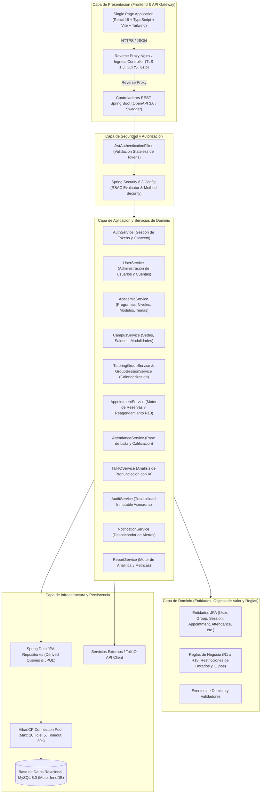

### 2.2 Patrones de Diseno GoF y Empresariales Aplicados

| Patron de Diseno | Componente en la Solucion | Proposito y Beneficio Tecnico |
| :--- | :--- | :--- |
| **Repository Pattern** | `UserRepository`, `AppointmentRepository`, `GroupSessionRepository` | Abstrae el acceso a la base de datos y provee una coleccion en memoria desacoplada de SQL. |
| **Data Transfer Object (DTO)** | `UserDto`, `AppointmentRequest`, `GroupSessionDto` | Previene la exposicion directa de entidades del dominio y optimiza la carga de red. |
| **Service Layer & Facade** | `AppointmentServiceImpl`, `UserServiceImpl` | Encapsula la orquestacion de reglas complejas y coordina multiples repositorios transaccionales. |
| **Strategy Pattern** | Autenticacion dual (Credenciales vs Enrollment Code), Motores de cancelacion | Permite intercambiar algoritmos de validacion y autenticacion en tiempo de ejecucion. |
| **Observer Pattern** | `AuditService`, `NotificationService` | Permite desacoplar el registro de auditoria y notificaciones de los flujos transaccionales primarios. |
| **Dependency Injection / IoC** | Spring Framework (`@Autowired`, `@Service`, `@Component`) | Inversion de control total, facilitando pruebas unitarias con mocks e inyeccion por constructor. |
| **Global Exception Handler** | `GlobalExceptionHandler` (`@RestControllerAdvice`) | Centraliza la captura de excepciones tecnicas y de negocio retornando payloads estandarizados. |
| **Pessimistic / Optimistic Locking** | Consultas con `@Lock` en `GroupSession` y `Appointment` | Garantiza que dos solicitudes concurrentes de reserva no excedan la capacidad maxima de alumnos. |

---

## 3. ENFOQUE DE PROGRAMACION ORIENTADA A OBJETOS (OOP) Y PRINCIPIOS SOLID

### 3.1 Aplicacion Rigurosa de Principios SOLID

1. **Single Responsibility Principle (SRP):**
   - Cada clase de servicio posee una unica responsabilidad de negocio. Por ejemplo, `AppointmentService` se enfoca exclusivamente en el ciclo de vida de las reservas (creacion, cancelacion, reagendamiento y validacion de cupos), delegando la persistencia a `AppointmentRepository` y la notificacion a `NotificationService`.
2. **Open/Closed Principle (OCP):**
   - El diseno de interfaces de servicio (`UserService`, `AcademicService`, `AppointmentService`) permite extender el comportamiento mediante nuevas implementaciones o decoradores sin alterar el codigo cliente ni las interfaces publicas.
3. **Liskov Substitution Principle (LSP):**
   - Las implementaciones concretas como `AppointmentServiceImpl` o `UserServiceImpl` cumplen enteramente los contratos definidos por sus interfaces, garantizando que cualquier cliente pueda interactuar con la abstraccion sin efectos colaterales.
4. **Interface Segregation Principle (ISP):**
   - Las interfaces del sistema son altamente cohesionadas y no obligan a los clientes a depender de metodos que no utilizan. Por ejemplo, los repositorios segregan operaciones de lectura general mediante `JpaRepository` y consultas especializadas por parametros de dominio.
5. **Dependency Inversion Principle (DIP):**
   - Los controladores REST dependen exclusivamente de las abstracciones de servicio (`UserService`, `AuthService`), nunca de implementaciones concretas ni de clases de infraestructura.

### 3.2 Diagrama de Clases del Modelo de Dominio y Jerarquias OOP

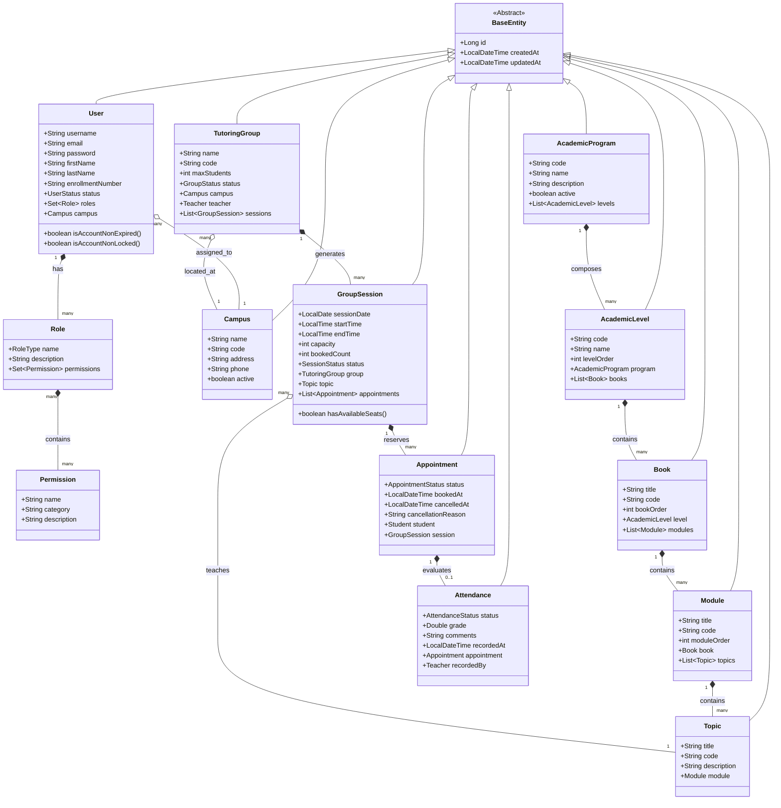

---

## 4. ARQUITECTURA MODULAR DEL SISTEMA

El sistema se compone de 11 modulos funcionales independientes interconectados a traves de contratos de servicio:

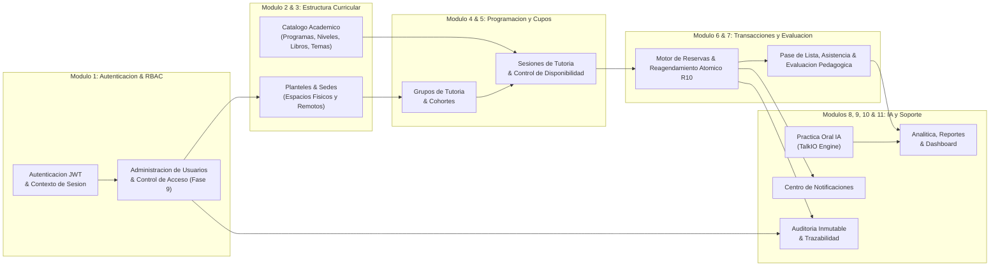

### 4.1 Matriz de Modulos, Responsabilidades y Dependencias

| Identificador de Modulo | Componentes Principales | Responsabilidad Primaria | Dependencias Internas |
| :--- | :--- | :--- | :--- |
| **M1: Auth & RBAC** | `AuthController`, `JwtTokenProvider`, `SecurityConfig` | Autenticacion segura, generacion y validacion de tokens JWT, evaluacion de roles. | `UserRepository`, `RoleRepository` |
| **M2: Academic Catalog** | `AcademicCatalogController`, `AcademicService` | Jerarquia curricular completa de 5 niveles academicos y libros oficiales IQ English. | Ninguna (Catalogo Maestro) |
| **M3: Campus Management** | `CampusController`, `CampusService` | Administracion de planteles, control de modalidades presenciales y virtuales. | Ninguna |
| **M4: Tutoring Groups** | `TutoringGroupController`, `TutoringGroupService` | Administracion de cohortes de tutoria, asignacion docente y cupos maximos. | `CampusService`, `UserService` |
| **M5: Group Sessions** | `GroupSessionController`, `GroupSessionService` | Calendarizacion de sesiones, busqueda de horarios disponibles y control de cupos. | `TutoringGroupService`, `AcademicService` |
| **M6: Appointments Engine** | `AppointmentController`, `AppointmentService` | Orquestacion de reservas, cancelaciones y reagendamiento atomico bajo Regla R10. | `GroupSessionService`, `NotificationService`, `AuditService` |
| **M7: Attendance & Grading**| `AttendanceController`, `AttendanceService` | Pase de lista, registro de presentismo/ausentismo, calificacion y notas docentes. | `AppointmentService`, `AuditService` |
| **M8: TalkIO AI Engine** | `TalkIOController`, `TalkIOService` | Integracion con motor de inteligencia artificial para practica de fluidez y pronunciacion. | `UserService`, `AuditService` |
| **M9: User Management** | `UserController`, `UserService` | Gestion de perfiles, creacion, modificacion de roles, reseteo de contrasenas y exportacion CSV. | `CampusService`, `AuditService`, `RoleRepository` |
| **M10: Audit Trail** | `AuditController`, `AuditService` | Registro inmutable de eventos de seguridad y transacciones de negocio. | Ninguna (Modulo Receptor) |
| **M11: Reports & Analytics**| `ReportController`, `ReportService` | Consolidacion de metricas de ocupacion, asistencia, distribucion de roles y desempeno. | Todos los repositorios de lectura |

---

## 5. STACK TECNOLOGICO DETALLADO Y JUSTIFICACION

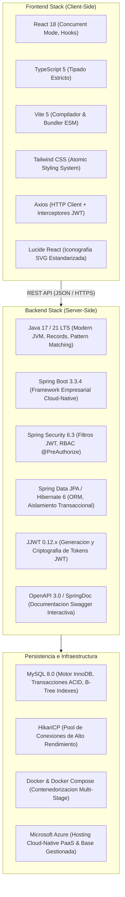

### 5.1 Justificacion Tecnica de Decisiones de Arquitectura

1. **Java 17 LTS + Spring Boot 3.3.x:**
   - Proporciona estabilidad de nivel empresarial, soporte a largo plazo, compatibilidad nativa con virtual threads de la JVM y un ecosistema de seguridad maduro.
2. **React 18 + TypeScript 5 + Vite 5:**
   - Ofrece tiempos de construccion ultrarrapidos (< 500ms en HMR), reduccion de errores en tiempo de compilacion mediante tipado estricto e interfaces sincronizadas con los DTOs del backend.
3. **MySQL 8.0 con Motor InnoDB:**
   - Soporta transacciones ACID completas con niveles de aislamiento configurables, bloqueo de registros por clave primaria y llaves foraneas que preservan la integridad referencial.
4. **Tailwind CSS:**
   - Elimina la sobrecarga de archivos CSS masivos mediante purgado automatico de clases no utilizadas, permitiendo una interfaz moderna, limpia y responsive para navegadores de escritorio y dispositivos moviles.

---

## 6. ANALISIS JERARQUICO DE TAREAS (HTA - HIERARCHICAL TASK ANALYSIS)

El Analisis Jerarquico de Tareas (HTA) descompone de forma estructurada todas las operaciones funcionales y tecnicas implementadas en el sistema IQ English. Cada analisis define un objetivo principal (Nivel 0), desglosado en sub-operaciones jerarquicas (Niveles 1 y 2) junto con su respectivo Plan de Ejecucion logico y condicional.

---

### 6.1 HTA 01: Flujo de Reservacion de Tutoria por Estudiante

```mermaid
flowchart TD
    HTA01_0["0. Reservar Cita de Tutoria de Ingles"]
    HTA01_1["1. Autenticacion y Validacion de Credenciales"]
    HTA01_2["2. Exploracion y Filtrado de Disponibilidad"]
    HTA01_3["3. Seleccion de Sesion y Validacion de Reglas de Negocio"]
    HTA01_4["4. Confirmacion Transaccional y Bloqueo de Cupo"]
    HTA01_5["5. Notificacion y Registro de Auditoria"]

    HTA01_0 --> HTA01_1
    HTA01_0 --> HTA01_2
    HTA01_0 --> HTA01_3
    HTA01_0 --> HTA01_4
    HTA01_0 --> HTA01_5

    HTA01_1_1["1.1 Enviar credenciales JWT a /api/v1/auth/login"]
    HTA01_1_2["1.2 Extraer claims y rol STUDENT en cliente"]
    HTA01_1 --> HTA01_1_1
    HTA01_1 --> HTA01_1_2

    HTA01_2_1["2.1 Consultar /api/v1/tutoring/sessions con filtros"]
    HTA01_2_2["2.2 Filtrar por fecha, nivel curricular y modalidad"]
    HTA01_2 --> HTA01_2_1
    HTA01_2 --> HTA01_2_2

    HTA01_3_1["3.1 Verificar regla de anticipacion minima (2 horas antes)"]
    HTA01_3_2["3.2 Comprobar limite de reservas activas por semana (Max 3)"]
    HTA01_3_3["3.3 Verificar que el alumno no tenga citas solapadas"]
    HTA01_3 --> HTA01_3_1
    HTA01_3 --> HTA01_3_2
    HTA01_3 --> HTA01_3_3

    HTA01_4_1["4.1 Iniciar transaccion ACID en AppointmentService"]
    HTA01_4_2["4.2 Bloquear registro de sesion y validar bookedCount < capacity"]
    HTA01_4_3["4.3 Incrementar bookedCount en 1"]
    HTA01_4_4["4.4 Persistir entidad Appointment en estado BOOKED"]
    HTA01_4 --> HTA01_4_1
    HTA01_4 --> HTA01_4_2
    HTA01_4 --> HTA01_4_3
    HTA01_4 --> HTA01_4_4

    HTA01_5_1["5.1 Generar notificacion para el estudiante"]
    HTA01_5_2["5.2 Registrar evento en bitacora inmutable de auditoria"]
    HTA01_5 --> HTA01_5_1
    HTA01_5 --> HTA01_5_2
```

**Plan 0:** Ejecutar 1 -> 2 -> 3. Si las validaciones en 3 son satisfactorias, ejecutar 4 -> 5. Si 3 falla, abortar operacion y retornar codigo HTTP 400/409 con detalle del error.

---

### 6.2 HTA 02: Flujo de Reagendamiento Atomico (Regla R10)

```mermaid
flowchart TD
    HTA02_0["0. Reagendar Cita de Tutoria (Regla R10)"]
    HTA02_1["1. Solicitar Reagendamiento con ID Cita Origen y ID Sesion Destino"]
    HTA02_2["2. Validar Politica de Cancelacion en Sesion Origen"]
    HTA02_3["3. Validar Disponibilidad y Capacidad en Sesion Destino"]
    HTA02_4["4. Ejecutar Swapping Atomico en Base de Datos"]
    HTA02_5["5. Notificar y Confirmar Operacion al Usuario"]

    HTA02_0 --> HTA02_1
    HTA02_0 --> HTA02_2
    HTA02_0 --> HTA02_3
    HTA02_0 --> HTA02_4
    HTA02_0 --> HTA02_5

    HTA02_2_1["2.1 Validar que cita origen este en estado BOOKED"]
    HTA02_2_2["2.2 Validar ventana de cancelacion (minimo 4 horas antes)"]
    HTA02_2 --> HTA02_2_1
    HTA02_2 --> HTA02_2_2

    HTA02_3_1["3.1 Bloquear sesion destino con bloqueo pesimista"]
    HTA02_3_2["3.2 Verificar que sesion destino tenga cupo disponible"]
    HTA02_3 --> HTA02_3_1
    HTA02_3 --> HTA02_3_2

    HTA02_4_1["4.1 Decrementar bookedCount en sesion origen"]
    HTA02_4_2["4.2 Incrementar bookedCount en sesion destino"]
    HTA02_4_3["4.3 Marcar cita origen como RESCHEDULED"]
    HTA02_4_4["4.4 Crear nueva cita para sesion destino en estado BOOKED"]
    HTA02_4_5["4.5 En caso de falla en destino, hacer ROLLBACK total"]
    HTA02_4 --> HTA02_4_1
    HTA02_4 --> HTA02_4_2
    HTA02_4 --> HTA02_4_3
    HTA02_4 --> HTA02_4_4
    HTA02_4 --> HTA02_4_5

    HTA02_5_1["5.1 Emitir evento de auditoria 'APPOINTMENT_RESCHEDULED'"]
    HTA02_5_2["5.2 Enviar confirmacion con detalles de nueva sesion"]
    HTA02_5 --> HTA02_5_1
    HTA02_5 --> HTA02_5_2
```

**Plan 0:** Ejecutar 1 -> 2 -> 3. Si 2 o 3 no cumplen las reglas de negocio, denegar solicitud. Si son validas, ejecutar transaccion atomica 4. Al completar con exito, ejecutar 5.

---

### 6.3 HTA 03: Flujo de Cancelacion de Cita y Liberacion de Cupo (Regla R09)

```mermaid
flowchart TD
    HTA03_0["0. Cancelar Cita de Tutoria por Estudiante o Administrador"]
    HTA03_1["1. Recepcion de Solicitud de Cancelacion"]
    HTA03_2["2. Verificacion de Permisos y Politica de Tiempo"]
    HTA03_3["3. Actualizacion de Estado y Liberacion de Cupo"]
    HTA03_4["4. Emision de Notificaciones y Registro de Auditoria"]

    HTA03_0 --> HTA03_1
    HTA03_0 --> HTA03_2
    HTA03_0 --> HTA03_3
    HTA03_0 --> HTA03_4

    HTA03_1_1["1.1 Obtener ID de cita y credenciales del solicitante"]
    HTA03_1_2["1.2 Cargar entidad Appointment y GroupSession asociada"]
    HTA03_1 --> HTA03_1_1
    HTA03_1 --> HTA03_1_2

    HTA03_2_1["2.1 Validar que cita este activa en estado BOOKED"]
    HTA03_2_2["2.2 Validar regla R09: Cancelacion con anticipacion minima de 4 horas si es alumno"]
    HTA03_2_3["2.3 Omitir restriccion temporal si el solicitante es ADMIN o TEACHER"]
    HTA03_2 --> HTA03_2_1
    HTA03_2 --> HTA03_2_2
    HTA03_2 --> HTA03_2_3

    HTA03_3_1["3.1 Iniciar transaccion @Transactional en AppointmentService"]
    HTA03_3_2["3.2 Cambiar estado de cita a CANCELLED"]
    HTA03_3_3["3.3 Decrementar bookedCount en GroupSession (bookedCount - 1)"]
    HTA03_3_4["3.4 Persistir motivo de cancelacion y timestamp"]
    HTA03_3 --> HTA03_3_1
    HTA03_3 --> HTA03_3_2
    HTA03_3 --> HTA03_3_3
    HTA03_3 --> HTA03_3_4

    HTA03_4_1["4.1 Despachar notificacion de cancelacion a estudiante y profesor"]
    HTA03_4_2["4.2 Registrar log en bitacora de auditoria (APPOINTMENT_CANCELLED)"]
    HTA03_4 --> HTA03_4_1
    HTA03_4 --> HTA03_4_2
```

**Plan 0:** Ejecutar 1 -> 2. Si 2 falla (fuera de tiempo o estado invalido), rechazar con excepcion de negocio. Si es valido, ejecutar 3 -> 4.

---

### 6.4 HTA 04: Flujo de Autenticacion JWT e Inicio de Sesion

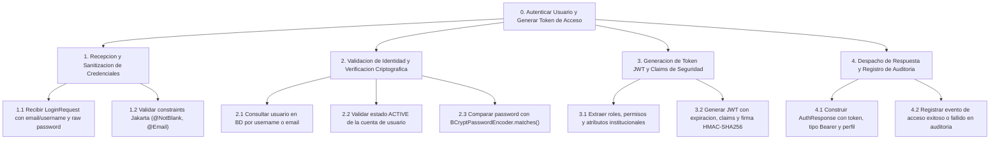

**Plan 0:** Ejecutar 1 -> 2. Si 2 falla por credenciales o cuenta inactiva, responder HTTP 401 Unauthorized y registrar fallo en auditoria. Si es valido, ejecutar 3 -> 4.

---

### 6.5 HTA 05: Flujo de Cambio y Restablecimiento de Contrasena

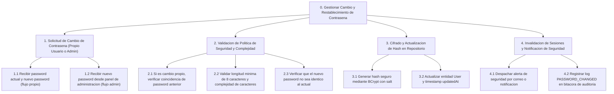

**Plan 0:** En flujo propio, ejecutar 1.1 -> 2.1 -> 2.2 -> 2.3 -> 3 -> 4. En flujo administrador, ejecutar 1.2 -> 2.2 -> 3 -> 4. Si cualquier validacion de 2 falla, rechazar peticion.

---

### 6.6 HTA 06: Flujo de Creacion y Configuracion de Grupo de Tutoria

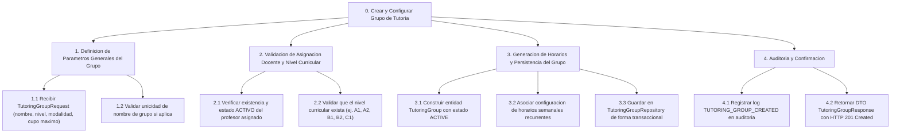

**Plan 0:** Ejecutar 1 -> 2. Si 2 valida la existencia y rol del profesor y nivel, ejecutar 3 -> 4. Si la validacion falla, retornar HTTP 400 Bad Request.

---

### 6.7 HTA 07: Flujo de Duplicacion Parametrizada de Grupos de Tutoria

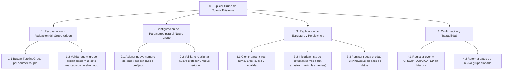

**Plan 0:** Ejecutar 1 -> 2 -> 3 -> 4 en una transaccion ACID. Si el grupo origen no existe, retornar HTTP 404 Not Found.

---

### 6.8 HTA 08: Flujo de Eliminacion Logica o Fisica de Grupos de Tutoria

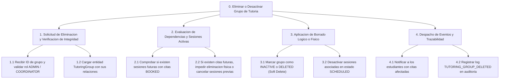

**Plan 0:** Ejecutar 1 -> 2. Si 2 detecta conflictos no resueltos, abortar operacion con HTTP 409 Conflict. De lo contrario, proceder con 3 -> 4.

---

### 6.9 HTA 09: Flujo de Programacion y Cancelacion de Sesiones de Grupo

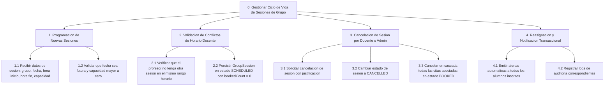

**Plan 0:** Para creacion, ejecutar 1 -> 2. Para cancelacion de sesion existente, ejecutar 3 -> 4.

---

### 6.10 HTA 10: Flujo de Pase de Lista y Evaluacion Docente

```mermaid
flowchart TD
    HTA10_0["0. Registrar Asistencia y Calificar Participacion"]
    HTA10_1["1. Carga de Sesion y Lista de Estudiantes Inscritos"]
    HTA10_2["2. Captura de Asistencia Individual (Presente, Ausente, Justificado)"]
    HTA10_3["3. Evaluacion Cualitativa y Cuantitativa de Desempeno"]
    HTA10_4["4. Persistencia Transaccional y Actualizacion de Metricas"]

    HTA10_0 --> HTA10_1
    HTA10_0 --> HTA10_2
    HTA10_0 --> HTA10_3
    HTA10_0 --> HTA10_4

    HTA10_1_1["1.1 Profesor accede a /api/v1/tutoring/sessions/{id}/attendance"]
    HTA10_1_2["1.2 Validar que el usuario autenticado sea el profesor titular o admin"]
    HTA10_1 --> HTA10_1_1
    HTA10_1 --> HTA10_1_2

    HTA10_2_1["2.1 Recibir AttendanceRecordRequest para cada estudiante"]
    HTA10_2_2["2.2 Asignar estado: ATTENDED, ABSENT o JUSTIFIED"]
    HTA10_2 --> HTA10_2_1
    HTA10_2 --> HTA10_2_2

    HTA10_3_1["3.1 Registrar calificacion numerica o rubrica de participacion"]
    HTA10_3_2["3.2 Ingresar retroalimentacion docente (Teacher Feedback)"]
    HTA10_3 --> HTA10_3_1
    HTA10_3 --> HTA10_3_2

    HTA10_4_1["4.1 Guardar entidades Attendance en base de datos"]
    HTA10_4_2["4.2 Actualizar estado de sesion a COMPLETED si todos fueron evaluados"]
    HTA10_4_3["4.3 Disparar evaluacion de progreso curricular para alumnos presentes"]
    HTA10_4 --> HTA10_4_1
    HTA10_4 --> HTA10_4_2
    HTA10_4 --> HTA10_4_3
```

**Plan 0:** Ejecutar 1 -> 2 -> 3 -> 4. Si la sesion no pertenece al profesor, rechazar con HTTP 403 Forbidden.

---

### 6.11 HTA 11: Flujo de Acreditacion de Modulos y Progreso Curricular

```mermaid
flowchart TD
    HTA11_0["0. Evaluar y Actualizar Progreso Curricular del Estudiante"]
    HTA11_1["1. Recopilacion de Asistencias, Evaluaciones y Practicas"]
    HTA11_2["2. Calculo de Cumplimiento de Horas y Criterios Minimos"]
    HTA11_3["3. Determinacion de Promocion de Nivel o Acreditacion de Modulo"]
    HTA11_4["4. Persistencia de Registro Academico y Notificacion"]

    HTA11_0 --> HTA11_1
    HTA11_0 --> HTA11_2
    HTA11_0 --> HTA11_3
    HTA11_0 --> HTA11_4

    HTA11_1_1["1.1 Consultar total de sesiones completadas en el nivel actual"]
    HTA11_1_2["1.2 Recopilar puntajes promedio de retroalimentacion docente"]
    HTA11_1_3["1.3 Consultar horas de practica completadas en modulo TalkIO"]
    HTA11_1 --> HTA11_1_1
    HTA11_1 --> HTA11_1_2
    HTA11_1 --> HTA11_1_3

    HTA11_2_1["2.1 Verificar porcentaje de asistencia >= 80%"]
    HTA11_2_2["2.2 Verificar calificacion promedio aprobatoria >= 70/100"]
    HTA11_2 --> HTA11_2_1
    HTA11_2 --> HTA11_2_2

    HTA11_3_1["3.1 Si cumple requisitos, marcar modulo como PASSED"]
    HTA11_3_2["3.2 Promover nivel academico del estudiante (ej. A1 -> A2)"]
    HTA11_3_3["3.3 Si no cumple, registrar estado IN_PROGRESS o NEEDS_REINFORCEMENT"]
    HTA11_3 --> HTA11_3_1
    HTA11_3 --> HTA11_3_2
    HTA11_3 --> HTA11_3_3

    HTA11_4_1["4.1 Guardar AcademicProgress en base de datos"]
    HTA11_4_2["4.2 Emitir notificacion de felicitacion o plan de mejora al estudiante"]
    HTA11_4 --> HTA11_4_1
    HTA11_4 --> HTA11_4_2
```

**Plan 0:** Ejecutar 1 -> 2 -> 3 -> 4. Si el calculo en 2 es aprobatorio, ejecutar 3.1 y 3.2; en caso contrario ejecutar 3.3. Finalizar con 4.

---

### 6.12 HTA 12: Flujo de Sesion de Practica Conversacional TalkIO

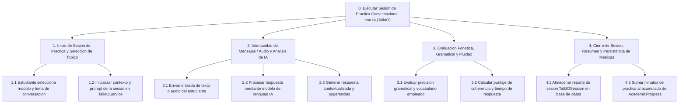

**Plan 0:** Ejecutar 1 -> Ciclo interactivo repetitivo (2 -> 3) hasta finalizacion -> 4.

---

### 6.13 HTA 13: Flujo de Alta y Provisionamiento de Cuentas de Usuario

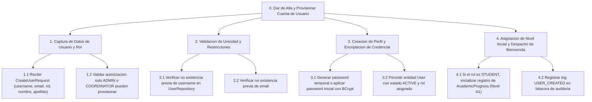

**Plan 0:** Ejecutar 1 -> 2. Si el email o username ya existe, responder HTTP 409 Conflict. Si es unico, ejecutar 3 -> 4.

---

### 6.14 HTA 14: Flujo de Actualizacion de Roles, Estados y Permisos de Usuario

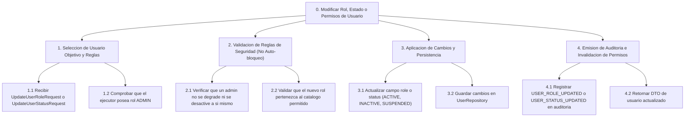

**Plan 0:** Ejecutar 1 -> 2. Si 2 viola reglas de seguridad, retornar HTTP 400 Bad Request. Si es correcto, ejecutar 3 -> 4.

---

### 6.15 HTA 15: Flujo de Generacion de Reportes Operativos y Exportacion CSV

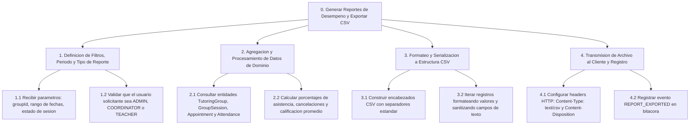

**Plan 0:** Ejecutar 1 -> 2 -> 3 -> 4. Si no existen registros para el criterio, exportar archivo con encabezados y cuerpo vacio o responder HTTP 204 No Content segun parametro.

---

### 6.16 HTA 16: Flujo de Trazabilidad y Consulta de Bitacora de Auditoria

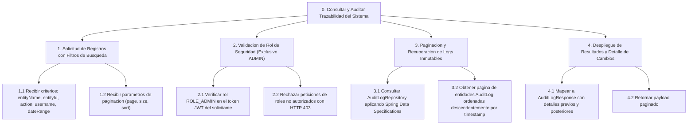

**Plan 0:** Ejecutar 1 -> 2. Si 2 valida rol ADMIN, ejecutar 3 -> 4. Si no, denegar acceso.

---

### 6.17 HTA 17: Flujo de Gestion y Despacho de Notificaciones

```mermaid
flowchart TD
    HTA17_0["0. Despachar y Gestionar Notificaciones a Usuarios"]
    HTA17_1["1. Captura de Evento Disparador de Notificacion"]
    HTA17_2["2. Construccion de Mensaje y Determinacion de Canal"]
    HTA17_3["3. Persistencia de Notificacion en Bandeja Interna"]
    HTA17_4["4. Despacho Asincrono y Marcado de Lectura"]

    HTA17_0 --> HTA17_1
    HTA17_0 --> HTA17_2
    HTA17_0 --> HTA17_3
    HTA17_0 --> HTA17_4

    HTA17_1_1["1.1 Recibir evento del dominio (Cita creada, Cancelacion, Recordatorio)"]
    HTA17_1_2["1.2 Identificar usuarios destinatarios y prioridad del mensaje"]
    HTA17_1 --> HTA17_1_1
    HTA17_1 --> HTA17_1_2

    HTA17_2_1["2.1 Renderizar plantilla de texto con datos especificos del evento"]
    HTA17_2_2["2.2 Determinar canal: IN_APP (sistema) y/o EMAIL (externo)"]
    HTA17_2 --> HTA17_2_1
    HTA17_2 --> HTA17_2_2

    HTA17_3_1["3.1 Crear entidad Notification con estado UNREAD"]
    HTA17_3_2["3.2 Guardar registro en NotificationRepository"]
    HTA17_3 --> HTA17_3_1
    HTA17_3 --> HTA17_3_2

    HTA17_4_1["4.1 Proveer endpoint /api/v1/notifications/my para consulta de usuario"]
    HTA17_4_2["4.2 Actualizar estado a READ cuando el usuario visualiza la notificacion"]
    HTA17_4 --> HTA17_4_1
    HTA17_4 --> HTA17_4_2
```

**Plan 0:** Ejecutar 1 -> 2 -> 3 -> 4. En lectura del usuario, invocar sub-proceso 4.2.

---

## 7. DIAGRAMAS DE SECUENCIA Y DINAMICA TRANSACCIONAL

Esta seccion presenta la especificacion formal de la dinamica de interaccion temporal y el comportamiento transaccional para todas las operaciones implementadas en la plataforma IQ English Tutoring LMS. Cada diagrama de secuencia esta alineado de manera univoca con los diagramas de Analisis Jerarquico de Tareas (HTA) documentados en la Seccion 6.

Para cada operacion se detallan los limites transaccionales (@Transactional), niveles de aislamiento, propagacion, politicas de rollback, estrategias de bloqueo y control de concurrencia, asi como la colaboracion entre clientes SPA (React), controladores REST, capas de servicio, repositorios JPA/Hibernate, bitacora de auditoria y despacho asincrono de notificaciones.

---

### 7.1 Secuencia de Reservacion de Cita de Tutoria (Alineado con HTA 01)

* **Operacion REST:** `POST /api/v1/appointments/book`
* **Controlador:** `AppointmentController.bookAppointment(request, principal)`
* **Servicio:** `AppointmentServiceImpl.bookAppointment(request, studentId)`
* **Transaccionalidad:** `@Lransactional(propagation = Propagation.REQUIRED, isolation = Isolation.READ_COMMITTED, rollbackFor = Exception.class)`;
* **Mecanismos de Bloqueo y Concurrencia:** Bloqueo pesimista sobre `GroupSession` (`findByIdWithLock`) para evitar sobreventa de cupos concurrentes. Validacion de la regla R07 (>= 2 horas de antelacion) y R08 (no solapamiento de horarios).

```mermaid
sequenceDiagram
    autonumber
    actor Estudiante as Estudiante (React SPA)
    participant Nginx as Nginx Proxy / Gateway
    participant ApptCtrl as AppointmentController
    participant ApptSvc as AppointmentServiceImpl (@Transactional)
    participant ProgressSvc as AcademicProgressService
    participant SessionRepo as GroupSessionRepository
    participant ApptRepo as AppointmentRepository
    participant AuditSvc as AuditService
    participant NotifSvc as NotificationService (@Async)

    Estudiante->>Nginx: POST /api/v1/appointments/book {sessionId, moduleId}
    Nginx->>ApptCtrl: Reenviar peticion con JWT Bearer
    ApptCtrl->>ApptSvc: bookAppointment(request, studentId)

    Note over ApptSvc: 1. Validar elegibilidad curricular
    ApptSvc->>ProgressSvc: canBookModule(studentId, moduleId)
    ProgressSvc-->>ApptSvc: true (Modulo habilitado)

    Note over ApptSvc: 2. Bloqueo y verificacion de cupos
    ApptSvc->>SessionRepo: findByIdWithLock(sessionTd)
    SessionRepo-->>ApptSvc: GroupSessionEntity (bookedCount, capacity, startTime)

    alt Cupo Agotado (bookedCount >= capacity)
        ApptSvc-->>ApptCtrl: throw CapacityExceededException("Cupos agotados")
        ApptCtrl-->>Estudiante: 409 Conflict {success: false, message: "Cupo agotado"}
    else Cupo Disponible
        Note over ApptSvc: 3. Validar no duplicidad y regla R08
        ApptSvc->>ApptRepo: existsActiveAppointment(studentId, sessionId)
        ApptRepo-->>ApptSvc: false (Sin colision)

        Note over ApptSvc: 4. Persistir reservacion e incrementar cupo
        ApptSvc->>SessionRepo: incrementBookedCount(sessionId)
        ApptSvc->>ApptRepo: save(AppointmentEntity: SCHEDULED)
        ApptRepo-->>ApptSvc: AppointmentEntity (id=101)

        ApptSvc->>AuditSvc: logEvent("APPOINTMENT_BOOKED", studentId, 101)
        ApptSvc->>NotifSvc: sendBookingConfirmation(studentId, 101)

        ApptSvc-->>ApptCtrl: AppointmentDto (id=101, status=SCHEDULED)
        ApptCtrl-->>Estudiante: 201 Created {success: true, data: appointmentDto}
    end
```

---

### 7.2 Secuencia de Reagendamiento Atomico R10 con Rollback Transaccional (Alineado con HTA 02)

* **Operacion REST:** `POST /api/v1/appointments/{id}/reschedule`
* **Controlador:** `AppointmentController.rescheduleAppointment(id, request, principal)`
* **Servicio:** `AppointmentServiceImpl.rescheduleAppointment(appointmentId, request, studentId)`
* **Transaccionalidad:** @Transactional(propagation = Propagation.REQUIRED, isolation = Isolation.READ_COMMITTED, rollbackFor = Exception.class)`
* **Garantia de Atomicidad:** Si la sesion destino no cuenta con cupo disponible o se produce cualquier excepcion durante el proceso, la transaccion completa sufre un Rollback automatico, asegurando que la cita de origen y los cupos de ambas sesiones permanezcan inalterados.

```mermaid
sequenceDiagram
    autonumber
    actor Estudiante as Estudiante (React SPA)
    participant ApptCtrl as AppointmentController
    participant ApptSvc as AppointmentServiceImpl (@Transactional)
    participant ApptRepo as AppointmentRepository
    participant SessionRepo as GroupSessionRepository
    participant AuditSvc as AuditService
    participant NotifSvc as NotificationService (@Async)

    Estudiante->>ApptCtrl: POST /api/v1/appointments/101/reschedule {newSessionId: 205}
    ApptCtrl->>ApptSvc: rescheduleAppointment(101, 205, studentId)
    ApptSvc->>ApptRepo: findById(101)
    ApptRepo-->>ApptSvc: Cita Existente (Sesion 150, Estado: SCHEDULED)

    Note over ApptSvc: Validar politica R10 (Antelacion >= 4 horas)
    ApptSvc->>SessionRepo: findByIdWithLock(205)
    SessionRepo-->>ApptSvc: Sesion Destino (bookedCount: 5, capacity: 5)

    alt Sesion Destino Sin Cupo Disponible
        Note over ApptSvc: Capacidad agotada en sesion 205
        ApptSvc-->>ApptCtrl: throw BusinessException("Sesion destino sin cupos")
        Note over ApptSvc,ApptRepo: Rollback Automatico (Cita 101 no sufre alteracion)
        ApptCtrl-->>Estudiante: 409 Conflict {success: false, message: "Sin cupo"}
    else Sesion Destino Con Cupo Disponible
        Note over ApptSvc: Actualizacion atomica de inventario
        ApptSvc->>SessionRepo: decrementBookedCount(150)
        ApptSvc->>SessionRepo: incrementBookedCount(205)
        ApptSvc->>ApptRepo: updateStatus(101, "RESCHEDULED")
        ApptSvc->>ApptRepo: save(Nueva Cita 102 en Sesion 205: SCHEDULED)
        ApptSvc->>AuditSvc: logEvent("APPOINTMENT_RESCHEDULED", studentId, 101)
        ApptSvc->>NotifSvc: sendRescheduleConfirmation(studentId, 102)
        ApptSvc-->>ApptCtrl: AppointmentDto (Nueva Cita 102)
        ApptCtrl-->>Estudiante: 200 OK {success: true, data: newAppointment}
    end
```

---

### 7.3 Secuencia de Cancelacion de Cita y Liberacion de Cupo R09 (Alineado con HTA 03)

* **Operacion REST:** `POST /api/v1/appointments/{id}/cancel`
* **Controlador:** `AppointmentController.cancelAppointment(id, request, principal)`
* **Servicio:** `AppointmentServiceImpl.cancelAppointment(appointmentId, request, userId, isAdmin)`
* **Transaccionalidad:** @Transactional(propagation = Propagation.REQUIRED, rollbackFor = Exception.class)
* **Politica de Negocio:** Regla R09 (cancelacion permitida con minimo 2 horas de anticipacion respecto a la hora de inicio de la sesion; los administradores pueden realizar bypass autorizado).

```mermaid
sequenceDiagram
    autonumber
    actor Estudiante as Estudiante (React SPA)
    participant ApptCtrl as AppointmentController
    participant ApptSvc as AppointmentServiceImpl (@Transactional)
    participant ApptRepo as AppointmentRepository
    participant SessionRepo as GroupSessionRepository
    participant AuditSvc as AuditService
    participant NotifSvc as NotificationService (@Async)

    Estudiante->>ApptCtrl: POST /api/v1/appointments/101/cancel {reason: "Motivo personal"}
    ApptCtrl->>ApptSvc: cancelAppointment(101, reason, studentId, isAdmin=false)

    ApptSvc->>ApptRepo: findById(101)
    ApptRepo-->>ApptSvc: AppointmentEntity (id=101, sessionTd=150, status=SCHEDULED)

    Note over ApptSvc: Validar pertenencia y ventana R09 (>= 2h)
    alt Cancelacion Extemporanea (< 2h y no Admin)
        ApptSvc-->>ApptCtrl: throw PolicyViolationException("Cancelacion fuera de tiempo limite")
        ApptCtrl-->>Estudiante: 400 Bad Request {success: false, message: "Regla R09 violada"}
    else Cancelacion Valida en Tiempo
        ApptSvc->>ApptRepo: updateStatusAndReason(101, "CANCELLED", reason)
        ApptSvc->>SessionRepo: decrementBookedCount(150)
        ApptSvc->>AuditSvc: logEvent("APPOINTMENT_CANCELLED", studentId, 101)
        ApptSvc->>NotifSvc: notifyCancellation(studentId, 101)
        ApptSvc-->>ApptCtrl: AppointmentDto (status=CANCELLED)
        ApptCtrl-->>Estudiante: 200 OK {success: true, message: "Cita cancelada con exito"}
    end
```

---

### 7.4 Secuencia de Autenticacion JWT e Inicio de Sesion (Alineado con HTA 04)

* **Operacion REST:** `POST /api/v1/auth/login`
* **Controlador:** `AuthController.login(loginRequest)`
* **Servicio:** `AuthServiceImpl.login(loginRequest)`
* **Transaccionalidad:** `@Transactional(readOnly = true)`
* **Mecanismos de Seguridad:** Validacion de hash mediante `BCryptPasswordEncoder`, emision de Token JWT firmado digitalmente con HMAC-SHA256 y persistencia en bitacora de auditoria.

```mermaid
sequenceDiagram
    autonumber
    actor Usuario as Cliente SPA (React)
    participant Nginx as Nginx Proxy / Gateway
    participant AuthCtrl as AuthController
    participant AuthSvc as AuthServiceImpl (@Transactional readOnly)
    participant UserRepo as UserRepository
    participant PasswordEnc as BCryptPasswordEncoder
    participant JwtProv as JwtTokenProvider
    participant SecurityCtx as SecurityContextHolder
    participant AuditSvc as AuditService

    Usuario->>Nginx: POST /api/v1/auth/login {identifier, password}
    Nginx->0AuthCtrl: Reenviar peticion de autenticacion
    AuthCtrl->>AuthSvc: login(LoginRequest)
    AuthSvc->>UserRepo: findByEmailOrEnrollment(identifier)
    UserRepo-->>AuthSvc: UserEntity (con roles, campus y passwordHash)

    alt Usuario No Encontrado o Inactivo
        AuthSvc-->>AuthCtrl: throw BadCredentialsException("Credenciales invalidas")
        AuthCtrl-->>Usuario: 401 Unauthorized {success: false, message: "Acceso denegado"}
    else Usuario Localizado
        AuthSvc->>PasswordEnc: matches(rawPassword, passwordHash)
        alt Contrasena Invalida
            PasswordEnc-->>AuthSvc: false
            AuthSvc->>AuditSvc: logAuthFailure(identifier, "PASSWORD_MISMATCH")
            AuthSvc-->>AuthCtrl: throw BadCredentialsException("Credenciales invalidas")
            AuthCtrl-->>Usuario: 401 Unauthorized {success: false, message: "Credenciales invalidas"}
        else Contrasena Valida
            PasswordEnc-->>AuthSvc: true
            AuthSvc->>JwtProv: generateToken(UserPrincipal)
            JwtProv-->>AuthSvc: String JWT Token (HMAC-SHA256)
            AuthSvc->>SecurityCtx: setAuthentication(auth)
            AuthSvc->>AuditSvc: logEvent("AUTH_LOGIN_SUCCESS", user.getId())
            AuthSvc-->>AuthCtrl: AuthResponse {token, userDto, permissions}
            AuthCtrl-->>Usuario: 200 OK + JWT Token Payload
        end
    end
```

---

### 7.5 Secuencia de Cambio y Restablecimiento de Contrasena (Alineado con HTA 05)

* **Operacion REST*** `POST> /api/v1/users/change-password` o `POST /api/v1/users/{id}/reset-password`
* **Controlador:** `UserController.changeOwnPassword / adminResetPassword`
* **Servicio:** `UserServiceImpl.changeOwnPassword / adminResetPassword`
* **Transaccionalidad:** @Transactional(propagation = Propagation.REQUIRED, rollbackFor = Exception.class)
* **Politica de Seguridad:** Verificacion obligatoria de entropia de contrasena, hasheo con salt BCrypt y envio asincrono de notificacion de alerta de seguridad al usuario.

```mermaid
sequenceDiagram
    autonumber
    actor Solicitante as Usuario / Admin (React SPA)
    participant UserCtrl as UserController
    participant UserSvc as UserServiceImpl (@Transactional)
    participant UserRepo as UserRepository
    participant PasswordEnc as BCryptPasswordEncoder
    participant AuditSvc as AuditService
    participant NotifSvc as NotificationService (@Async)

    Solicitante->>UserCtrl: POST /api/v1/users/change-password {oldPass, newPass}
    UserCtrl->>UserSvc: changeOwnPassword(userId, request)
    UserSvc->>UserRepo: findById(userId)
    UserRepo-->>UserSvc: UserEntity (con passwordHash actual)

    Note over UserSvc: 1. Validar contrasena actual
    UserSvc->>PasswordEnc: matches(oldPass, currentHash)
    alt Contrasena Actual Incorrecta
        PasswordEnc-->>UserSvc: false
        UserSvc-->>UserCtrl: throw BadCredentialsException("Contrasena actual incorrecta")
        UserCtrl-->>Solicitante: 400 Bad Request {success: false, message: "Validacion fallida"}
    else Contrasena Actual Valida
        PasswordEnc-->>UserSvc: true
        Note over UserSvc: 2. Hashear nueva credencial y persistir
        UserSvc->>PasswordEnc: encode(newPass)
        PasswordEnc-->>UserSvc: newEncodedHash
        UserSvc->>UserRepo: updatePassword(userId, newEncodedHash, now())
        UserSvc->>AuditSvc: logEvent("PASSWORD_CHANGED", userId)
        UserSvc->>NotifSvc: sendSecurityAlert(userId, "PASSWORD_UPDATED")
        UserSvc-->>UserCtrl: true (Actualizacion exitosa)
        UserCtrl-->>Solicitante: 200 OK {success: true, message: "Contrasena actualizada con exito"}
    end
```

---

### 7.6 Secuencia de Creacion y Configuracion de Grupo de Tutoria (Alineado con HTA 06)

* **Operacion REST*** `POST> /api/v1/tutoring-groups`
* **Controlador:** `TutoringGroupController.createGroup(request)`
* **Servicio:** `TutoringGroupServiceImpl.createGroup(request)`
* **Transaccionalidad:** `@Transactional(propagation = Propagation.REQUIRED, rollbackFor = Exception.class)`
* **Reglas de Integridad:** Validacion de unicidad de codigo de grupo, comprobacion de no solapamiento de horario para el profesor y generacion sincronizada de sesiones de tutoria.

```mermaid
sequenceDiagram
    autonumber
    actor Admin as Administrador (React SPA)
    participant GroupCtrl as TutoringGroupController
    participant GroupSvc as TutoringGroupServiceImpl (@Transactional)
    participant UserRepo as UserRepository
    participant GroupRepo as TutoringGroupRepository
    participant SessionRepo as GroupSessionRepository
    participant AuditSvc as AuditService

    Admin->>GroupCtrl: POST /api/v1/tutoring-groups {code, teacherId, campusId, schedule}
    GroupCtrl->>GroupSvc: createGroup(CreateGroupRequest)

    Note over GroupSvc: 1. Validar existencia y rol de profesor
    GroupSvc->>UserRepo: findByIdAndRole(teacherId, "ROLE_TEACHER")
    UserRepo-->>GroupSvc: Teacher Entity (Validado)

    Note over GroupSvc: 2. Validar no colision de codigo u horario
    GroupSvc->>GroupRepo: existsByCodeOrScheduleOverlap(code, teacherId, schedule)
    GroupRepo-->>GroupSvc: false (Sin colisiones)

    Note over GroupSvc: 3. Persistir entidad TutoringGroup
    GroupSvc->>GroupRepo: save(TutoringGroupEntity)
    GroupRepo-->>GroupSvc: TutoringGroupEntity (id=50)

    Note over GroupSvc: 4. Generar sesiones recurrentes del ciclo
    GroupSvc->>SessionRepo: saveAll(generatedSessionsList)
    SessionRepo-->>GroupSvc: List<GroupSessionEntity>

    GroupSvc->>AuditSvc: logEvent("GROUP_CREATED", adminId, 50)
    GroupSvc-->>GroupCtrl: TutoringGroupDto (id=50, sessionsCreated=12)
    GroupCtrl-->>Admin: 201 Created {success: true, data: groupDto}
```

---

### 7.7 Secuencia de Duplicacion Parametrizada de Grupos de Tutoria (Alineado con HTA 07)

* **Operacion REST*** `POST> /api/v1/tutoring-groups/{id}/duplicate`
* **Controlador:** `TutoringGroupController.duplicateGroup(id, request)`
* **Servicio:** `TutoringGroupServiceImpl.duplicateGroup(sourceGroupId, request)`
* **Transaccionalidad:** @Transactional(propagation = Propagation.REQUIRED, rollbackFor = Exception.class)`
* **Mecanismo:** Clonacion parametrizada de estructura de grupo, reasignacion de nuevo ciclo/fechas y persistencia atomica de sesiones nodo replicadas.

```mermaid
sequenceDiagram
    autonumber
    actor Admin as Administrador / Coordinador (React SPA)
    participant GroupCtrl as TutoringGroupController
    participant GroupSvc as TutoringGroupServiceImpl (@Transactional)
    participant GroupRepo as TutoringGroupRepository
    participant SessionRepo as GroupSessionRepository
    participant AuditSvc as AuditService

    Admin->>GroupCtrl: POST /api/v1/tutoring-groups/50/duplicate {newCode, newStartDate, copySessions: true}
    GroupCtrl->>GroupSvc: duplicateGroup(50, DuplicateGroupRequest)

    GroupSvc->>GroupRepo: findById(50)
    alt Grupo Origen No Existe
        GroupRepo-->>GroupSvc: Optional.empty()
        GroupSvc-->>GroupCtrl: throw ResourceNotFoundException("Grupo origen no encontrado")
        GroupCtrl-->>Admin: 404 Not Found {success: false, message: "Grupo no existe"}
    else Grupo Origen Localizado
        GroupRepo-->>GroupSvc: Source TutoringGroupEntity
        Note over GroupSvc: 1. Instanciar y persistir nuevo grupo clonado
        GroupSvc->>GroupRepo: save(ClonedGroupEntity)
        GroupRepo-->>GroupSvc: ClonedGroupEntity (id=51)

        Note over GroupSvc: 2. Proyectar y persistir nuevas sesiones
        GroupSvc->>SessionRepo: saveAll(clonedProjectedSessions)
        SessionRepo-->>GroupSvc: List<GroupSessionEntity>

        GroupSvc->>AuditSvc: logEvent("GROUP_DUPLICATED", adminId, 51)
        GroupSvc-->>GroupCtrl: TutoringGroupDto (id=51, clonedFrom=50)
        GroupCtrl-->>Admin: 201 Created {success: true, data: newGroupDto}
    end
```

---

### 7.8 Secuencia de Eliminacion Logica o Fisica de Grupos de Tutoria (Alineado con HTA 08)

* **Operacion REST:** `DELETE /api/v1/tutoring-groups/{id}?force=false`
* **Controlador:** `TutoringGroupController.deleteGroup(id, force)`
* **Servicio:** `TutoringGroupServiceImpl.deleteGroup(groupId, force)`
* **Transaccionalidad:** @Transactional(propagation = Propagation.REQUIRED, rollbackFor = Exception.class)
* **Politica de Integridad:** Se restringe la eliminacion estandar si existen citas activas agendadas. Bajo bandera `force=true`, se ejecutan cancelaciones en cascada y notificaciones a los estudiantes.

```mermaid
sequenceDiagram
    autonumber
    actor Admin as Administrador (React SPA)
    participant GroupCtrl as TutoringGroupController
    participant GroupSvc as TutoringGroupServiceImpl (@Transactional)
    participant GroupRepo as TutoringGroupRepository
    participant SessionRepo as GroupSessionRepository
    participant ApptRepo as AppointmentRepository
    participant NotifSvc as NotificationService (@Async)
    participant AuditSvc as AuditService

    Admin->>GroupCtrl: DELETE /api/v1/tutoring-groups/50?force=false
    GroupCtrl->>GroupSvc: deleteGroup(50, force=false)
    GroupSvc->>GroupRepo: findById(50)
    GroupRepo-->>GroupSvc: TutoringGroupEntity (id=50)

    GroupSvc->>ApptRepo: countActiveAppointmentsByGroupId(50)
    ApptRepo-->>GroupSvc: count = 3 (Citas activas pendientes)

    alt Citas Activas y force == false
        GroupSvc-->>GroupCtrl: throw ConflictException("Existen citas activas. Requiere confirmacion forzada")
        GroupCtrl-->>Admin: 409 Conflict {success: false, message: "Bloqueo por citas activas"}
    else Sin Citas o force == true
        opt force == true
            GroupSvc->>ApptRepo: cancelAllByGroupId(50, "GROUP_DELETED")
            GroupSvc->>SessionRepo: cancelAllSessionsByGroupId(50)
            GroupSvc->>NotifSvc: notifyAffectedStudents(groupId=50)
        end
        GroupSvc->>GroupRepo: softDelete(50)
        GroupSvc->>AuditSvc: logEvent("GROUP_DELETED", adminId, 50)
        GroupSvc-->>GroupCtrl: true (Eliminado)
        GroupCtrl-->>Admin: 200 OK {success: true, message: "Grupo eliminado con exito"}
    end
```

---

### 7.9 Secuencia de Programacion y Cancelacion de Sesiones de Grupo (Alineado con HTA 09)

* **Operacion REST*** `DELETE /api/v1/sessions/{id}` o `POST> /api/v1/tutoring-groups/{id}/sessions`
* **Controlador:** `GroupSessionController.cancelSession(sessionId, request)`
* **Servicio:** `GroupSessionServiceImpl.cancelSession(sessionId, request)`
* **Transaccionalidad:** @Transactional(propagation = Propagation.REQUIRED, rollbackFor = Exception.class)
* **Mecanismo:** Cancelacion sincronizada de sesion, invalidacion en cascada de citas programadas y emision de notificaciones y auditoria.

```mermaid
sequenceDiagram
    autonumber
    actor Admin as Administrador / Coordinador (React SPA)
    participant SessionCtrl as GroupSessionController
    participant SessionSvc as GroupSessionServiceImpl (@Transactional)
    participant SessionRepo as GroupSessionRepository
    participant ApptRepo as AppointmentRepository
    participant NotifSvc as NotificationService (@Async)
    participant AuditSvc as AuditService

    Admin->>SessionCtrl: DELETE /api/v1/sessions/150 {reason: "Ajuste de calendario"}
    SessionCtrl->>SessionSvc: cancelSession(150, request)

    SessionSvc->>SessionRepo: findById(150)
    SessionRepo-->>SessionSvc: GroupSessionEntity (id=150, status=SCHEDULED)

    Note over SessionSvc: 1. Cancelar citas activas vinculadas
    SessionSvc->>ApptRepo: findActiveBySessionId(150)
    ApptRepo-->>SessionSvc: List<AppointmentEntity> (4 citas activas)
    SessionSvc->>ApptRepo: cancelAppointmentsBulk(150, "SESSION_CANCELLED")

    Note over SessionSvc: 2. Actualizar estado de sesion
    SessionSvc->>SessionRepo: updateStatus(150, "CANCELLED")

    Note over SessionSvc: 3. Despacho asincrono y auditoria
    SessionSvc->>NotifSvc: sendBulkSessionCancelledAlert(150)
    SessionSvc->>AuditSvc: logEvent("SESSION_CANCELLED", adminId, 150)

    SessionSvc-->>SessionCtrl: SessionDto (id=150, status=CANCELLED)
    SessionCtrl-->>Admin: 200 OK {success: true, message: "Sesion cancelada"}
```

---

### 7.10 Secuencia de Pase de Lista y Evaluacion Docente (Alineado con HTA 10)

* **Operacion REST*** `POST> /api/v1/sessions/{id}/attendance`
* **Controlador:** `AttendanceController.recordAttendance(sessionId, request, principal)`
* **Servicio:** `AttendanceServiceImpl.recordAttendance(sessionId, request, teacherId)`
* **Transaccionalidad:** `@Transactional(propagation = Propagation.REQUIRED, rollbackFor = Exception.class)`
* **Dinamica:** Persistencia de registros de asistencia por estudiante (`PRESENT`, `ABSENT`, `EXCUSED`), guardado de evaluacion y actualizacion de horas acumuladas de tutoria.

```mermaid
sequenceDiagram
    autonumber
    actor Docente as Profesor / Tutor (React SPA)
    participant AttendCtrl as AttendanceController
    participant AttendSvc as AttendanceServiceImpl (@Transactional)
    participant SessionRepo as GroupSessionRepository
    participant AttendRepo as AttendanceRepository
    participant ProgressSvc as AcademicProgressService
    participant AuditSvc as AuditService

    Docente->>AttendCtrl: POST /api/v1/sessions/150/attendance {records: [...], notes}
    AttendCtrl->>AttendSvc: recordAttendance(150, request, teacherId)

    AttendSvc->>SessionRepo: findById(150)
    SessionRepo-->>AttendSvc: GroupSessionEntity (teacherId=teacherId, status=IN_PROGRESS)

    Note over AttendSvc: 1. Procesar registros de asistencia en lote
    loop Para cada estudiante en records
        AttendSvc->>AttendRepo: save(AttendanceEntity: studentId, status, score, comments)
        opt Si Estado == PRESENT
            AttendSvc->>ProgressSvc: addCompletedTutoringHours(studentId, sessionDuration)
        end
    end

    Note over AttendSvc: 2. Marcar sesion como completada
    AttendSvc->>SessionRepo: updateStatus(150, "COMPLETED")
    AttendSvc->>AuditSvc: logEvent("ATTENDANCE_RECORDED", teacherId, 150)

    AttendSvc-->>AttendCtrl: AttendanceSummaryDto (processedCount=5)
    AttendCtrl-->>Docente: 200 OK {success: true, message: "Asistencia registrada"}
```

---

### 7.11 Secuencia de Acreditacion de Modulos y Progreso Curricular (Alineado con HTA 11)

* **Operacion REST:** `POST /api/v1/academic-progress/{studentId}/credit-module`
* **Controlador:** `AcademicProgressController.creditModule(studentId, request)`
* **Servicio:** `AcademicProgressServiceImpl.creditModule(studentId, request)`
* **Transaccionalidad:** @Transactional(propagation = Propagation.REQUIRED, rollbackFor = Exception.class)
* **Reglas Curriculares:** Validacion de cumplimiento de asistencias minimas requeridas y calificacion aprobatoria; transicion de estado a `ACCREDITEDa y apertura del siguiente modulo en la malla academica.

```mermaid
sequenceDiagram
    autonumber
    actor Evaluador as Profesor / Coordinador (React SPA)
    participant ProgressCtrl as AcademicProgressController
    participant ProgressSvc as AcademicProgressServiceImpl (@Transactional)
    participant ProgressRepo as AcademicProgressRepository
    participant AuditSvc as AuditService
    participant NotifSvc as NotificationService (@Async)

    Evaluador->>ProgressCtrl: POST /api/v1/academic-progress/10/credit-module {moduleId: 3, finalScore: 92}
    ProgressCtrl->>ProgressSvc: creditModule(10, request)

    ProgressSvc->>ProgressRepo: findProgressByStudentAndModule(10, 3)
    ProgressRepo-->>ProgressSvc: AcademicProgressEntity (completedHours: 20, minRequired: 18)

    Note over ProgressSvc: 1. Validar requerimientos curriculares
    alt Requerimientos Insuficientes (Horas < 18 o Score < 70)
        ProgressSvc-->>ProgressCtrl: throw BusinessException("Requisitos curriculares incompletos")
        ProgressCtrl-->>Evaluador: 422 Unprocessable {success: false, message: "No cumple requisitos"}
    else Requerimientos Satisfechos
        Note over ProgressSvc: 2. Acreditar modulo actual
        ProgressSvc->>ProgressRepo: updateStatus(studentId=10, moduleId=3, "ACCREDITED", score=92)

        Note over ProgressSvc: 3. Desbloquear siguiente modulo
        ProgressSvc->>ProgressRepo: unlockNextModule(studentId=10, nextModuleId=4)

        ProgressSvc->>AuditSvc: logEvent("MODULE_ACCREDITED", evaluatorId, studentId=10)
        ProgressSvc->>NotifSvc: notifyStudentModulePassed(studentId=10, moduleId=3)

        ProgressSvc-->>ProgressCtrl: AcademicProgressDto (moduleId=3, status=ACCREDITED, nextUnlocked=4)
        ProgressCtrl-->>Evaluador: 200 OK {success: true, data: progressDto}
    end
```

---

### 7.12 Secuencia de Sesion de Practica Conversacional TalkIO (Alineado con HTA 12)

* **Operacion REST:** `POST /api/v1/talkIo/practice`
* **Controlador:** `TalkIOController.practice(request, principal)`
* **Servicio:** `TalkIOServiceImpl.practice(request, studentId)`
* **Transaccionalidad:** @Transactional(propagation = Propagation.REQUIRED)
* **Mecanismos de Integracion:** Invocacion a microservicio o motor de Inteligencia Artificial para analisis de fonetica, fluidez y gramatica; registro estructurado del transcript y computo de estadisticas de practica autonoma.

```mermaid
sequenceDiagram
    autonumber
    actor Estudiante as Estudiante (React SPA)
    participant TalkIOCtrl as TalkIOController
    participant TalkIOSvc as TalkIOServiceImpl (@Transactional)
    participant TalkIOAI as TalkIOAIService / Client
    participant TalkIORepo as TalkIORecordRepository
    participant ProgressRepo as AcademicProgressRepository
    participant AuditSvc as AuditService

    Estudiante->>TalkIOCtrl: POST /api/v1/talkIo/practice {promptId, audioPayload, textInput}
    TalkIOCtrl->>TalkIOSvc: practice(request, studentId)

    Note over TalkIOSvc: 1. Procesamiento de IA conversacional
    TalkIOSvc->>TalkIOAI: analyzeSpeech(audioPayload, textInput, cefrLevel)
    TalkIOAI-->>TalkIOSvc: AIAnalysisResult (pronunciationScore: 88, grammarFeedback: "...", accuracy: 91)

    Note over TalkIOSvc: 2. Persistir registro de evaluacion
    TalkIOSvc->>TalkIORepo: save(TalkIORecordEntity: studentId, promptId, scores, transcript)
    TalkIORepo-->>TalkIOSvc: TalkIORecordEntity (id=301)

    Note over TalkIOSvc: 3. Actualizar tiempo de practica autonoma
    TalkIOSvc->>ProgressRepo: incrementAutonomousPracticeMinutes(studentId, durationMinutes=15)

    TalkIOSvc->>AuditSvc: logEvent("TALKIO_PRACTICE_COMPLETED", studentId, 301)
    TalkIOSvc-->>TalkIOCtrl: TalkIOFeedbackDto (overallScore=89, feedbackDetails)
    TalkIOCtrl-->>Estudiante: 200 OK {success: true, data: feedbackDto}
```

---

### 7.13 Secuencia de Alta y Provisionamiento de Cuentas de Usuario (Alineado con HTA 13)

* **Operacion REST:** `POST /api/v1/users`
* **Controlador:** `UserController.createUser(request)`
* **Servicio:** `UserServiceImpl.createUser(request)`
* **Transaccionalidad:** @Transactional(propagation = Propagation.REQUIRED, rollbackFor = Exception.class)
* **Seguridad y Provisionamiento:** Validacion de no duplicidad de matricula y correo, encriptacion de credenciales con BCrypt, aprovisionamiento de registro curricular para estudiantes y despacho de correo con token de activacion.

```mermaid
sequenceDiagram
    autonumber
    actor Admin as Administrador (React SPA)
    participant UserCtrl as UserController
    participant UserSvc as UserServiceImpl (@Transactional)
    participant UserRepo as UserRepository
    participant PasswordEnc as BCryptPasswordEncoder
    participant ProgressRepo as AcademicProgressRepository
    participant NotifSvc as NotificationService (@Async)
    participant AuditSvc as AuditService

    Admin->>UserCtrl: POST /api/v1/users {email, enrollment, role, campusId, name}
    UserCtrl->>UserSvc: createUser(CreateUserRequest)

    Note over UserSvc: 1. Validar no duplicidad
    UserSvc->>UserRepo: existsByEmailOrEnrollment(email, enrollment)
    alt Usuario Existente
        UserRepo-->>UserSvc: true (Colision detectada)
        UserSvc-->>UserCtrl: throw ConflictException("Correo o matricula ya registrada")
        UserCtrl-->>Admin: 409 Conflict {success: false, message: "Usuario duplicado"}
    else Usuario Nuevo
        UserRepo-->>UserSvc: false
        Note over UserSvc: 2. Encriptar credencial temporal y persistir
        UserSvc->>PasswordEnc: encode(temporaryPassword)
        PasswordEnc-->>UserSvc: passwordHash
        UserSvc->>UserRepo: save(UserEntity: ACTIVE, role, campusId)
        UserRepo-->>UserSvc: UserEntity (id=88)

        opt Si Role == ROLE_STUDENT
            Note over UserSvc: 3. Inicializar ficha curricular
            UserSvc->>ProgressRepo: initializeStudentProgress(studentId=88, initialModuleId=1)
        end

        Note over UserSvc: 4. Despacho asincrono de bienvenida
        UserSvc->>NotifSvc: sendWelcomeEmailWithCredentials(userId=88, temporaryPassword)
        UserSvc->>AuditSvc: logEvent("USER_CREATED", adminId, 88)

        UserSvc-->>UserCtrl: UserDto (id=88, email, status=ACTIVE)
        UserCtrl-->>Admin: 201 Created {success: true, data: userDto}
    end
```

---

### 7.14 Secuencia de Actualizacion de Roles, Estados y Permisos de Usuario (Alineado con HTA 14)

* **Operacion REST*** `PATCH /api/v1/users/{id}/role` o `PATCH /api/v1/users/{id}/status`
* **Controlador:** `UserController.updateUserRole / updateUserStatus`
* **Servicio:** `UserServiceImpl.updateUserRole / updateUserStatus`
* **Transaccionalidad:** @Transactional(propagation = Propagation.REQUIRED, rollbackFor = Exception.class)
* **Reglas de Control:** Validacion estricta contra auto-desactivacion del administrador y revocacion inmediata de tokens JWT mediante lista negra ante bloqueos de seguridad.

```mermaid
sequenceDiagram
    autonumber
    actor Admin as Administrador (React SPA)
    participant UserCtrl as UserController
    participant UserSvc as UserServiceImpl (@Transactional)
    participant UserRepo as UserRepository
    participant TokenBlacklist as TokenBlacklistService / Cache
    participant AuditSvc as AuditService

    Admin->>UserCtrl: PATCH /api/v1/users/88/status {status: "SUSPENDED", reason: "Falta administrativa"}
    UserCtrl->>UserSvc: updateUserStatus(88, status, reason, adminId)

    UserSvc->>UserRepo: findById(88)
    UserRepo-->>UserSvc: UserEntity (id=88, role=ROLE_STUDENT, currentStatus=ACTIVE)

    Note over UserSvc: 1. Validar reglas de negocio (ej. no auto-bloqueo)
    alt Regla Violada (adminId == targetUserId y status != ACTIVE)
        UserSvc-->>UserCtrl: throw PolicyViolationException("No es posible auto-inhabilitar la cuenta propia")
        UserCtrl-->>Admin: 400 Bad Request {success: false, message: "Operacion no permitida"}
    else Operacion Valida
        Note over UserSvc: 2. Persistir nuevo estado
        UserSvc->>UserRepo: updateStatus(88, "SUSPENDED")

        Note over UserSvc: 3. Revocar tokens de sesion activos
        opt Si Status in [SUSPENDED, INACTIVE, LOCKED]
            UserSvc->>TokenBlacklist: invalidateAllTokensForUser(userId=88)
        end

        UserSvc->>AuditSvc: logEvent("USER_STATUS_UPDATED", adminId, 88)
        UserSvc-->>UserCtrl: UserDto (id=88, status=SUSPENDED)
        UserCtrl-->>Admin: 200 OK {success: true, data: userDto}
    end
```

---

### 7.15 Secuencia de Generacion de Reportes Operativos y Exportacion CSV (Alineado con HTA 15)

* **Operacion REST:** `GET /api/v1/reports/attendance?format=csv&campusId=1&startDate=2026-09-01&endDate=2026-09-30`
* **Controlador:** `ReportController.generateAttendanceReport`
* **Servicio:** `ReportServiceImpl.generateAttendanceReport`
* **Transaccionalidad:** @Transactional(readOnly = true, timeout = 60)
* **Rendimiento:** Ejecucion de consultas optimizadas con paginacion y streaming de bytes directamente al buffer de salida HTTP, evitando sobrecarga de memoria heap.

```mermaid
sequenceDiagram
    autonumber
    actor Gestor as Administrador / Coordinador (React SPA)
    participant ReportCtrl as ReportController
    participant ReportSvc as ReportServiceImpl (@Transactional readOnly)
    participant AttendRepo as AttendanceRepository
    participant SessionRepo as GroupSessionRepository
    participant AuditSvc as AuditService

    Gestor->>ReportCtrl: GET /api/v1/reports/attendance?format=csv&params...
    ReportCtrl->>ReportSvc: generateAttendanceReport(filterParams)

    Note over ReportSvc: 1. Ejecutar consultas agregadas
    ReportSvc->>AttendRepo: findAttendanceByCriteriaStream(campusId, dateRange)
    AttendRepo-->>ReportSvc: Stream<AttendanceRecordView>
    ReportSvc->>SessionRepo: findSessionMetrics(campusId, dateRange)
    SessionRepo-->>ReportSvc: SessionMetricsProjection

    Note over ReportSvc: 2. Transformar y formatear CSV en streaming
    ReportSvc->>ReportSvc: buildCsvStream(dataStream, metrics)

    ReportSvc->>AuditSvc: logEvent("REPORT_GENERATED", userId, "ATTENDANCE_CSV")
    ReportSvc-->>ReportCtrl: ByteArrayResource / Stream (CSV File)

    Note over ReportCtrl: 3. Configurar cabeceras de descarga
    ReportCtrl-->>Gestor: 200 OK Descarga de archivo CSV (reporte_asistencia.csv)
```

---

### 7.16 Secuencia de Trazabilidad y Consulta de Bitacora de Auditoria (Alineado con HTA 16)

* **Operacion REST*** `GET /api/v1/audit-logs?page=0&size=20&action=APPOINTMENT_BOOKED`
* **Controlador:** `AuditController.getAuditLogs(filterParams, pageable)`
* **Servicio:** `AuditServiceImpl.getAuditLogs(specification, pageable)`
* **Transaccionalidad:** `@Transactional(readOnly = true)`
* **Seguridad y Privacidad:** Construccion dinamica de predicados JPA (`AuditSpecification`), filtrado por perfil de auditoria y ofuscacion de datos sensibles o hashes en la capa de presentacion DTO.

```mermaid
sequenceDiagram
    autonumber
    actor Auditor as Auditor / Administrador (React SPA)
    participant AuditCtrl as AuditController
    participant AuditSvc as AuditServiceImpl (@Transactional readOnly)
    participant AuditSpec as AuditSpecification
    participant AuditRepo as AuditLogRepository

    Auditor->>AuditCtrl: GET /api/v1/audit-logs?action=APPOINTMENT_BOOKED&page=0&size=20
    AuditCtrl->>AuditSvc: getAuditLogs(filterCriteria, pageable)

    Note over AuditSvc: 1. Construir especificacion dinamica JPA
    AuditSvc->>AuditSpec: build(action, userId, dateRange, severity)
    AuditSpec-->>AuditSvc: Specification<AuditLogEntity>

    Note over AuditSvc: 2. Consultar con paginacion e indexacion
    AuditSvc->>AuditRepo: findAll(specification, pageable)
    AuditRepo-->>AuditSvc: Page<AuditLogEntity>

    Note over AuditSvc: 3. Sanitizar payloads y convertir a DTO
    AuditSvc->>AuditSvc: mapToSanitizedDtos(entityPage)

    AuditSvc-->>AuditCtrl: PageResponse<AuditLogDto> (totalElements, totalPages, content)
    AuditCtrl-->>Auditor: 200 OK {success: true, data: pageResponse}
```

---

### 7.17 Secuencia de Gestion y Despacho de Notificaciones (Alineado con HTA 17)

* **Operacion REST / Evento:** Despacho Asincrono @Async y `PATCH /api/v1/notifications/{id}/read`
* **Controlador:** `NotificationController`
* **Servicio:** `NotificationServiceImpl.sendNotification(userId, type, payload) / markAsRead(id)`
* **Transaccionalidad:** `@Transactional(propagation = Propagation.REQUIRES_NEW)`
* **Arquitectura Multicanal:** Persistencia transaccional aislada del registro de notificacion, envio de correos electronicos mediante `JavaMailSender` con tolerancia a fallos y distribucion en tiempo real mediante WebSocket / STOMP.

```mermaid
sequenceDiagram
    autonumber
    actor Emisor as Evento de Dominio / Servicio
    participant NotifSvc as NotificationServiceImpl (@Async, REQUIRES_NEW)
    participant NotifRepo as NotificationRepository
    participant MailSender as JavaMailSender / SMTP
    participant WsBroker as SimpMessagingTemplate (WebSocket)
    actor Receptor as Estudiante / Usuario (React SPA)
    participant NotifCtrl as NotificationController

    Emisor->>NotifSvc: notifyEvent(userId=10, type="BOOKING_CONFIRMED", payload)

    Note over NotifSvc: 1. Persistencia transaccional aislada
    NotifSvc->>NotifRepo: save(NotificationEntity: userId=10, status=UNREAD)
    NotifRepo-->>NotifSvc: NotificationEntity (id=901)

    Note over NotifSvc: 2. Despacho por canales concurrentes
    par Canal Correo Electronico
        NotifSvc->>MailSender: sendMimeMessage(to=userEmail, template)
    and Canal WebSocket Push
        NotifSvc->>WsBroker: convertAndSend("/topic/user/10/notifications", notifDto)
        WsBroker-->>Receptor: Evento Push recibido en tiempo real
    end

    Note over Receptor: 3. Confirmacion de lectura por el usuario
    Receptor->>NotifCtrl: PATCH /api/v1/notifications/901/read
    NotifCtrl->>NotifSvc: markAsRead(notificationId=901, userId=10)
    NotifSvc->>NotifRepo: markAsRead(901, readAt=now())
    NotifSvc-->>NotifCtrl: true (Actualizado)
    NotifCtrl-->>Receptor: 200 OK {success: true, message: "Notificacion leida"}
```

---

## 8. MODELO DE SEGURIDAD Y CONTROL DE ACCESO (RBAC)

### 8.1 Arquitectura de Filtros de Seguridad

```mermaid
flowchart TD
    InboundReq["Peticion HTTP Entrante"] --> CorsFilter["1. CorsFilter (Politicas de Origen Cruzado)"]
    CorsFilter --> CsrfDisabled["2. CSRF Filter (Deshabilitado para API Stateless)"]
    CsrfDisabled --> JwtAuthFilter["3. JwtAuthenticationFilter (Extraccion y Validacion de Bearer Token)"]
    JwtAuthFilter --> SecurityContext["4. SecurityContextHolder (Carga de UserPrincipal y GrantedAuthorities)"]
    SecurityContext --> MethodSecurity["5. MethodSecurityInterceptor (@PreAuthorize Evaluator)"]
    MethodSecurity --> ControllerEndpoint["6. Ejecucion de Controlador de Destino"]

    JwtAuthFilter -.->|"Token Invalido o Expirado"| AuthEntryPoint["AuthenticationEntryPoint (401 Unauthorized)"]
    MethodSecurity -.->|"Permisos Insuficientes"| AccessDeniedHandler["AccessDeniedHandler (403 Forbidden)"]
```

### 8.2 Matriz de Roles y Autorizaciones del Sistema

| Rol del Sistema | Alcance y Descripcion Operativa | Permisos Clave Asignados |
| :--- | :--- | :--- |
| **ROLE_ADMIN** | Control total de la plataforma, administracion de usuarios, seguridad y configuracion global. | `USERS_READ`, `USERS_CREATE`, `USERS_UPDATE`, `USERS_DELETE`, `AUDIT_READ`, `REPORTS_READ`, `CATALOG_MANAGE` |
| **ROLE_COORDINATOR** | Planificacion academica, creacion de grupos, calendarizacion de sesiones y reportes de campus. | `GROUPS_CREATE`, `SESSIONS_SCHEDULE`, `ATTENDANCE_OVERVIEW`, `REPORTS_READ`, `CAMPUS_READ` |
| **ROLE_TEACHER** | Gestion de clases asignadas, consulta de lista de estudiantes y registro de asistencia con notas. | `SESSIONS_VIEW_ASSIGNED`, `ATTENDANCE_RECORD`, `STUDENTS_VIEW_PROGRESS` |
| **ROLE_STUDENT** | Autoservicio academico, exploracion de horarios, reservas de tutorias, reagendamiento y TalkIO. | `APPOINTMENTS_BOOK`, `APPOINTMENTS_CANCEL`, `TALKIO_PRACTICE`, `PROFILE_SELF_UPDATE` |

---

## 9. ARQUITECTURA CLOUD-NATIVE EN MICROSOFT AZURE

### 9.1 Diagrama de Arquitectura de Infraestructura en Microsoft Azure

```mermaid
flowchart TD
    subgraph UsersDomain ["Usuarios Finales e Internet"]
        PublicWebClient["Navegadores Web (Estudiantes, Docentes, Admins)"]
    end

    subgraph AzureEdge ["Capa de Borde y Aceleracion Global"]
        AzureFrontDoor["Azure Front Door / Azure Application Gateway
(WAF, DDoS Protection, SSL/TLS Offloading, Enrutamiento)"]
    end

    subgraph AzureCompute ["Capa de Computo en Contenedores (PaaS Serverless)"]
        subgraph ContainerAppsEnv ["Azure Container Apps Environment"]
            FrontendApp["Frontend Container App
(Nginx Servidor SPA + Static Cache)"]
            BackendApp["Backend Container App
(Java 17 Spring Boot + Auto-scaling 1-10 replicas)"]
        end
    end

    subgraph AzureDataServices ["Capa de Datos y Almacenamiento Gestionado"]
        AzureMySQL["Azure Database for MySQL Flexible Server
(Zone Redundant HA, 8 vCores, SSD Storage, Backup Diario)"]
        AzureBlob["Azure Blob Storage
(Exportaciones CSV, Reportes, Grabaciones TalkIO)"]
    end

    subgraph AzureSecurityGovernance ["Capa de Seguridad, Secretos y Observabilidad"]
        AzureKeyVault["Azure Key Vault
(Secretos DB, Llaves Privadas JWT, Certificados SSL)"]
        AzureMonitor["Azure Monitor & Application Insights
(Telemetria APM, Logs Centralizados, Metricas CPU/Memoria, Alertas)"]
        AzureACR["Azure Container Registry (ACR)
(Almacenamiento Inmutable de Imagenes Docker)"]
    end

    PublicWebClient -->|"HTTPS / TLS 1.3 (Port 443)"| AzureFrontDoor
    AzureFrontDoor -->|"Ruta / *"| FrontendApp
    AzureFrontDoor -->|"Ruta /api/*"| BackendApp

    BackendApp -->|"JDBC Connection Pool (Port 3306)"| AzureMySQL
    BackendApp -->|"Azure SDK / REST"| AzureBlob
    BackendApp -->|"Managed Identity"| AzureKeyVault
    BackendApp -.->|"Logs & Metrics"| AzureMonitor
    FrontendApp -.->|"Logs & Metrics"| AzureMonitor
    AzureACR -.->|"Pull Images"| ContainerAppsEnv
```

### 9.2 Mapeo de Componentes Locales vs Servicios Nube Azure

| Capa Arquitectonica | Componente en Desarrollo Local | Servicio Gestionado en Microsoft Azure | Beneficio Operacional en Produccion |
| :--- | :--- | :--- | :--- |
| **Ingreso y Seguridad Web** | Nginx Reverse Proxy local | **Azure Front Door + WAF** | Proteccion contra ataques DDoS, aceleracion CDN y SSL global. |
| **Computo Frontend** | Node.js / Vite Dev Server / Nginx | **Azure Container Apps (Frontend)** | Escalado automatico sin servidor con consumo por peticion. |
| **Computo Backend** | Spring Boot JAR embebido | **Azure Container Apps (Backend)** | Auto-escalado elastico basado en concurrencia y consumo de CPU. |
| **Persistencia Relacional** | MySQL 8.0 contenedor Docker | **Azure Database for MySQL Flexible Server** | Alta disponibilidad zonal, backups automaticos y parches sin downtime. |
| **Archivos y Reportes** | Sistema de archivos local | **Azure Blob Storage** | Durabilidad 99.999999999% (11 nueves) y acceso HTTP seguro. |
| **Gestion de Secretos** | `application-local.yml` | **Azure Key Vault** | Cifrado HSM, rotacion de credenciales y acceso por Managed Identity. |
| **Observabilidad y Logs** | Consola y archivos `.log` | **Application Insights & Azure Monitor** | Trazabilidad distribuida, monitoreo de cuellos de botella y alertas 24/7. |

---

## 10. MAQUINAS DE ESTADOS Y CICLOS DE VIDA DEL DOMINIO

### 10.1 Ciclo de Vida de una Cita de Tutoria (`AppointmentStatus`)

```mermaid
stateDiagram-v2
    [*] --> BOOKED : Estudiante reserva horario con cupo disponible
    BOOKED --> ATTENDED : Docente registra asistencia presente en sesion
    BOOKED --> ABSENT : Docente marca ausencia no justificada
    BOOKED --> CANCELLED : Estudiante cancela con anticipacion >= 4 horas
    BOOKED --> RESCHEDULED : Estudiante reasigna a nueva sesion (Regla R10)
    RESCHEDULED --> BOOKED : Nueva cita creada y confirmada
    ATTENDED --> [*]
    ABSENT --> [*]
    CANCELLED --> [*]
```

### 10.2 Ciclo de Vida de una Sesion de Tutoria (`SessionStatus`)

```mermaid
stateDiagram-v2
    [*] --> SCHEDULED : Coordinador programa sesion con salon y docente
    SCHEDULED --> IN_PROGRESS : Inicio del horario establecido de la clase
    IN_PROGRESS --> COMPLETED : Docente concluye clase y completa registro de asistencia
    SCHEDULED --> CANCELLED : Coordinador cancela sesion (libera alumnos y notifica)
    COMPLETED --> [*]
    CANCELLED --> [*]
```

### 10.3 Ciclo de Vida de una Cuenta de Usuario (`UserStatus`)

```mermaid
stateDiagram-v2
    [*] --> ACTIVE : Administrador crea cuenta o estudiante completa registro
    ACTIVE --> INACTIVE : Administrador deshabilita cuenta temporalmente
    INACTIVE --> ACTIVE : Administrador reactiva cuenta tras revision
    ACTIVE --> SUSPENDED : Suspension por faltas reiteradas o motivos administrativos
    SUSPENDED --> ACTIVE : Reactivacion formal autorizada
    ACTIVE --> [*] : Soft delete (Desactivacion logica protegiendo integridad)
```

---

## 11. ESTRATEGIAS DE CONCURRENCIA, RESILIENCIA Y ESCALABILIDAD

### 11.1 Control de Concurrencia en Asignacion de Cupos
Para garantizar que nunca se sobrepase la capacidad maxima (`capacity`) de una sesion de tutoria cuando multiples estudiantes intentan reservar exactamente al mismo milisegundo, la arquitectura implementa:
- **Aislamiento Transaccional:** Nivel de transaccion manejado por Spring `@Transactional(isolation = Isolation.READ_COMMITTED)`.
- **Bloqueo Pesimista en Persistencia:** Uso de `SELECT ... FOR UPDATE` en consultas criticas (`findByIdWithLock`) que bloquea el registro de `GroupSession` hasta que la transaccion confirma o revierte.
- **Validacion Atomica en Memoria:** Comprobacion estricta:
  ```java
  if (session.getBookedCount() >= session.getCapacity()) {
      throw new ConflictException("La sesion seleccionada ya no cuenta con cupos disponibles");
  }
  session.setBookedCount(session.getBookedCount() + 1);
  ```

### 11.2 Resiliencia y Manejo Estandarizado de Errores
El componente `GlobalExceptionHandler` intercepta todas las excepciones no controladas y de negocio, normalizando la salida en un esquema JSON predecible:

```json
{
  "success": false,
  "message": "Violacion de regla de negocio R10: ventana de cancelacion superada.",
  "data": null,
  "timestamp": "2026-09-25T18:30:00Z"
}
```

---

## 12. TABLA DE CONTROL DE VERSIONES Y REVISION ARQUITECTONICA

| Version | Fecha | Autor / Equipo | Modificaciones Principales Realizadas |
| :--- | :--- | :--- | :--- |
| **1.0.0** | 2026-09-20 | Software Architecture Team | Diseno inicial de arquitectura en capas y catalogo curricular. |
| **1.1.0** | 2026-09-23 | Senior Backend & Security Lead | Integracion de seguridad Spring Security 6.3, JWT y RBAC. |
| **2.0.0** | 2026-09-25 | Multi-disciplinary Engineering Team | Actualizacion integral Fase 9: User Management, diagramas Mermaid corregidos, HTA, secuencias atomicas R10, especificacion Cloud-Native en Azure y normalizacion de codificacion sin acentos. |
