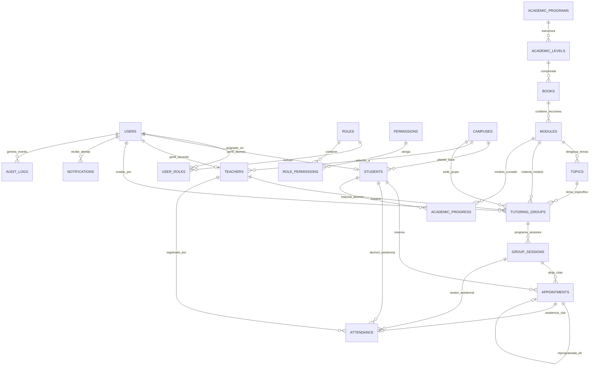
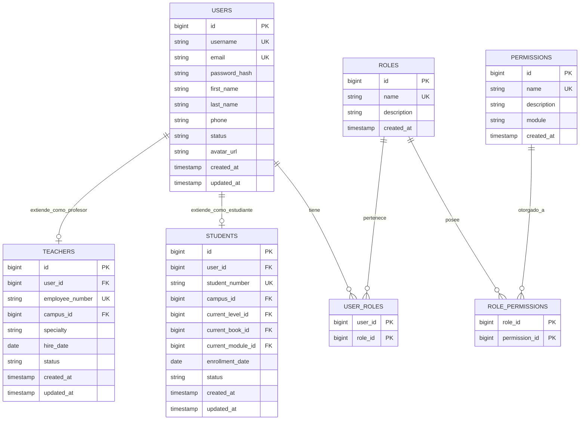
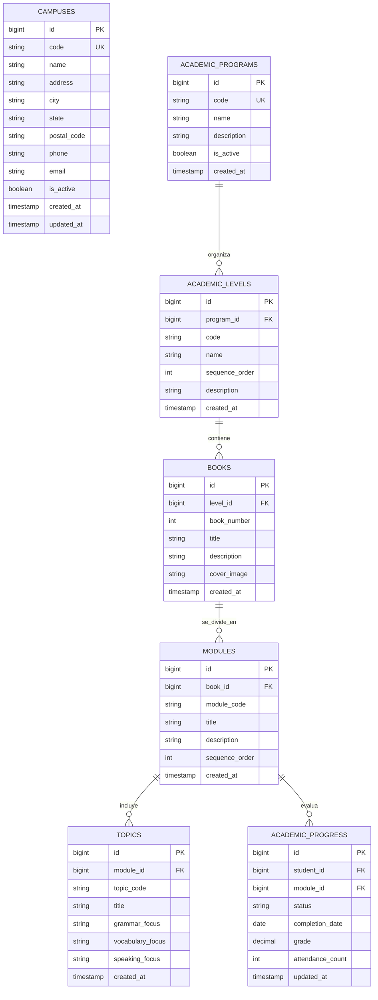
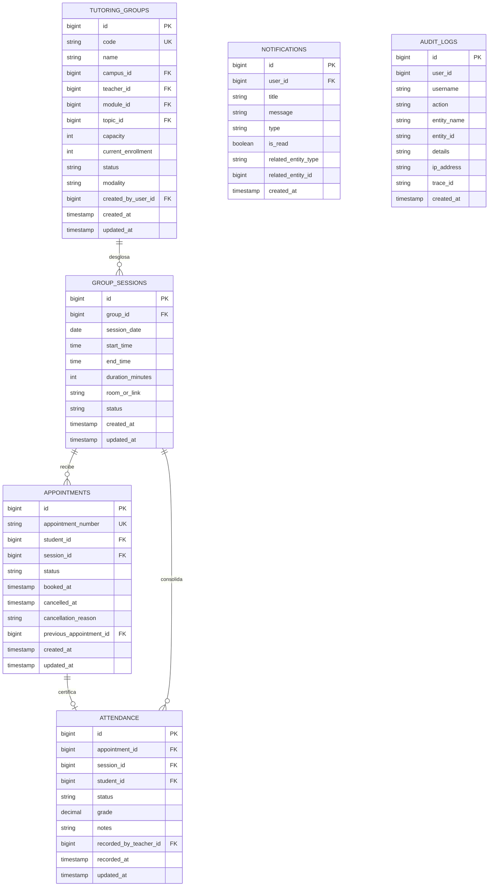

# Modelado de Base de Datos y Esquema Relacional - IQ English

Este documento detalla la arquitectura de base de datos relacional, el diccionario de datos exhaustivo, las estrategias de indexacion, las politicas de integridad referencial y las migraciones Flyway implementadas para el Sistema de Gestion de Tutorias IQ English sobre MySQL 8.0 / InnoDB (totalmente compatible con H2 Database para entornos de prueba y ejecucion local).

---

## 1. Arquitectura y Vision General de Persistencia

El modelo de datos esta concebido bajo principios de alta disponibilidad, consistencia transaccional (ACID), integridad referencial estricta y normalizacion en Tercera Forma Normal (3FN), con desnormalizaciones controladas unicamente para optimizar conteos y consultas criticas de alta concurrencia.

### Principios Fundamentales:
1. **Motor y Transaccionalidad:** MySQL 8.0 con motor de almacenamiento InnoDB. Soporta transacciones con nivel de aislamiento READ COMMITTED.
2. **Juego de Caracteres y Collation:** utf8mb4 y utf8mb4_unicode_ci para soporte completo internacional sin corrupcion de texto.
3. **Estrategia de Claves Primarias:** Claves subrogadas autonumericas (BIGINT AUTO_INCREMENT) en todas las entidades principales, garantizando estabilidad frente a cambios de negocio. Claves compuestas en tablas pivote (user_roles, role_permissions).
4. **Trazabilidad y Auditoria:** Marcas temporales (created_at, updated_at) en tablas operativas y tabla dedicada inmutable (audit_logs) para el rastreo de eventos del sistema.
5. **Gestion de Estados y Enumeraciones:** Estados representados mediante cadenas VARCHAR(30) validadas por capas de dominio y Spring Data JPA (ACTIVE, INACTIVE, SCHEDULED, COMPLETED, CANCELLED, CONFIRMED, ATTENDED, ABSENT, etc.).

---

## 2. Diagramas Entidad-Relacion (ERD)

### 2.1. Diagrama Global de la Solucion

---

### 2.2. Modulo de Seguridad, Usuarios y Perfiles

---

### 2.3. Modulo de Estructura Academica y Progreso

---

### 2.4. Modulo de Operacion de Tutorias, Citas, Asistencia y Trazabilidad

---

## 3. Diccionario de Datos Exhaustivo (20 Tablas Relacionales)

### 3.1. Tablas de Seguridad y Control de Acceso (RBAC)

#### Tabla: roles
Almacena los roles del sistema utilizados para autorizacion RBAC basada en Spring Security.
- **id** (BIGINT, PK, AUTO_INCREMENT, NOT NULL): Identificador unico del rol.
- **name** (VARCHAR(50), UK, NOT NULL): Nombre unico del rol (ROLE_STUDENT, ROLE_TEACHER, ROLE_SUPERVISOR, ROLE_ADMIN).
- **description** (VARCHAR(255), NULL): Descripcion funcional de las atribuciones del rol.
- **created_at** (TIMESTAMP, NOT NULL, DEFAULT CURRENT_TIMESTAMP): Fecha de alta del rol.

#### Tabla: permissions
Catalogo granular de privilegios y permisos de operacion.
- **id** (BIGINT, PK, AUTO_INCREMENT, NOT NULL): Identificador del permiso.
- **name** (VARCHAR(100), UK, NOT NULL): Clave de permiso (TUTORING_BOOK, TUTORING_CANCEL, ATTENDANCE_REGISTER, USER_MANAGE, etc.).
- **description** (VARCHAR(255), NULL): Detalle funcional del privilegio.
- **module** (VARCHAR(50), NOT NULL): Modulo de aplicacion (SECURITY, TUTORING, ACADEMIC, ATTENDANCE, ADMIN).
- **created_at** (TIMESTAMP, NOT NULL, DEFAULT CURRENT_TIMESTAMP): Fecha de creacion.

#### Tabla: role_permissions
Tabla asociativa que mapea privilegios a cada rol.
- **role_id** (BIGINT, PK, FK -> roles.id, ON DELETE CASCADE, NOT NULL): Rol asignado.
- **permission_id** (BIGINT, PK, FK -> permissions.id, ON DELETE CASCADE, NOT NULL): Permiso concedido.

#### Tabla: users
Registro principal de cuentas de usuario autenticables en la plataforma.
- **id** (BIGINT, PK, AUTO_INCREMENT, NOT NULL): Clave primaria de usuario.
- **username** (VARCHAR(100), UK, NOT NULL): Nombre de usuario unico para inicio de sesion.
- **email** (VARCHAR(150), UK, NOT NULL): Correo electronico corporativo o institucional.
- **password_hash** (VARCHAR(255), NOT NULL): Contrasena encriptada mediante algoritmo BCrypt.
- **first_name** (VARCHAR(100), NOT NULL): Nombre de pila del usuario.
- **last_name** (VARCHAR(100), NOT NULL): Apellidos del usuario.
- **phone** (VARCHAR(30), NULL): Numero telefonico de contacto.
- **status** (VARCHAR(30), NOT NULL, DEFAULT ACTIVE): Estado de la cuenta (ACTIVE, INACTIVE, SUSPENDED).
- **avatar_url** (VARCHAR(255), NULL): Ruta o URL de imagen de perfil.
- **created_at** (TIMESTAMP, NOT NULL, DEFAULT CURRENT_TIMESTAMP): Fecha y hora de registro.
- **updated_at** (TIMESTAMP, NOT NULL, DEFAULT CURRENT_TIMESTAMP): Fecha de ultima actualizacion.

#### Tabla: user_roles
Tabla asociativa entre usuarios y sus respectivos roles asignados.
- **user_id** (BIGINT, PK, FK -> users.id, ON DELETE CASCADE, NOT NULL): Usuario asociado.
- **role_id** (BIGINT, PK, FK -> roles.id, ON DELETE CASCADE, NOT NULL): Rol asignado.

---

### 3.2. Tablas de Estructura Organizacional y Catalogo Academico

#### Tabla: campuses
Sedes fisicas y virtuales de IQ English donde se imparten las sesiones.
- **id** (BIGINT, PK, AUTO_INCREMENT, NOT NULL): Identificador de la sede.
- **code** (VARCHAR(50), UK, NOT NULL): Codigo oficial del plantel (POLANCO, SANTA_FE, INSURGENTES, ONLINE).
- **name** (VARCHAR(150), NOT NULL): Nombre descriptivo del plantel.
- **address** (VARCHAR(255), NOT NULL): Direccion fisica del inmueble.
- **city** (VARCHAR(100), NOT NULL): Ciudad de ubicacion.
- **state** (VARCHAR(100), NOT NULL): Entidad federativa o estado.
- **postal_code** (VARCHAR(20), NOT NULL): Codigo postal.
- **phone** (VARCHAR(30), NULL): Telefono de atencion de la sede.
- **email** (VARCHAR(150), NULL): Correo de contacto del plantel.
- **is_active** (BOOLEAN, NOT NULL, DEFAULT TRUE): Indicador de disponibilidad operativa.
- **created_at** (TIMESTAMP, NOT NULL, DEFAULT CURRENT_TIMESTAMP): Fecha de registro.
- **updated_at** (TIMESTAMP, NOT NULL, DEFAULT CURRENT_TIMESTAMP): Fecha de actualizacion.

#### Tabla: academic_programs
Oferta educativa y planes curriculares de la institucion.
- **id** (BIGINT, PK, AUTO_INCREMENT, NOT NULL): Clave del programa.
- **code** (VARCHAR(50), UK, NOT NULL): Clave del plan de estudios (GEN_ENG, BUS_ENG, TOEFL_PREP).
- **name** (VARCHAR(150), NOT NULL): Nombre del programa academico.
- **description** (TEXT, NULL): Objetivos y alcance del programa.
- **is_active** (BOOLEAN, NOT NULL, DEFAULT TRUE): Estado de vigencia del programa.
- **created_at** (TIMESTAMP, NOT NULL, DEFAULT CURRENT_TIMESTAMP): Fecha de alta.

#### Tabla: academic_levels
Niveles de dominio estructurados secuencialmente dentro de cada programa.
- **id** (BIGINT, PK, AUTO_INCREMENT, NOT NULL): Clave primaria del nivel.
- **program_id** (BIGINT, FK -> academic_programs.id, NOT NULL): Programa al que pertenece.
- **code** (VARCHAR(50), NOT NULL): Codigo del nivel (BEG, INT, ADV).
- **name** (VARCHAR(100), NOT NULL): Nombre oficial (Beginner, Intermediate, Advanced).
- **sequence_order** (INT, NOT NULL): Orden progresivo de promocion academica.
- **description** (TEXT, NULL): Competencias esperadas del nivel.
- **created_at** (TIMESTAMP, NOT NULL, DEFAULT CURRENT_TIMESTAMP): Fecha de creacion.
- Restriccion Unica: uk_program_level (program_id, code).

#### Tabla: books
Libros de texto del plan de estudios de IQ English.
- **id** (BIGINT, PK, AUTO_INCREMENT, NOT NULL): Clave primaria del libro.
- **level_id** (BIGINT, FK -> academic_levels.id, NOT NULL): Nivel academico asociado.
- **book_number** (INT, NOT NULL): Numero de libro dentro del nivel (1, 2, 3).
- **title** (VARCHAR(150), NOT NULL): Titulo del material didactico (Book 1, Book 2, Book 3).
- **description** (TEXT, NULL): Resumen del contenido tematico.
- **cover_image** (VARCHAR(255), NULL): Ruta de la portada digital.
- **created_at** (TIMESTAMP, NOT NULL, DEFAULT CURRENT_TIMESTAMP): Fecha de registro.
- Restriccion Unica: uk_level_book (level_id, book_number).

#### Tabla: modules
Lecciones y unidades de aprendizaje contenidas en cada libro.
- **id** (BIGINT, PK, AUTO_INCREMENT, NOT NULL): Clave del modulo o leccion.
- **book_id** (BIGINT, FK -> books.id, NOT NULL): Libro de pertenencia.
- **module_code** (VARCHAR(50), NOT NULL): Clave del modulo (LESSON_01, LESSON_02, etc.).
- **title** (VARCHAR(200), NOT NULL): Titulo pedagogico de la leccion.
- **description** (TEXT, NULL): Sinopsis de objetivos de aprendizaje.
- **sequence_order** (INT, NOT NULL): Posicion ordinal en el libro.
- **created_at** (TIMESTAMP, NOT NULL, DEFAULT CURRENT_TIMESTAMP): Fecha de creacion.
- Restriccion Unica: uk_book_module (book_id, module_code).

#### Tabla: topics
Temas especificos de desarrollo de habilidades linguisticas por modulo.
- **id** (BIGINT, PK, AUTO_INCREMENT, NOT NULL): Clave primaria del tema.
- **module_id** (BIGINT, FK -> modules.id, NOT NULL): Modulo contenedor.
- **topic_code** (VARCHAR(50), NOT NULL): Codigo de referencia del tema.
- **title** (VARCHAR(255), NOT NULL): Nombre del tema academico.
- **grammar_focus** (VARCHAR(255), NULL): Enfoque gramatical a desarrollar.
- **vocabulary_focus** (VARCHAR(255), NULL): Campo semantico y vocabulario.
- **speaking_focus** (VARCHAR(255), NULL): Dinamica conversacional y de produccion oral.
- **created_at** (TIMESTAMP, NOT NULL, DEFAULT CURRENT_TIMESTAMP): Fecha de registro.

---

### 3.3. Tablas de Perfiles de Actores

#### Tabla: students
Perfil especializado y seguimiento academico de los estudiantes.
- **id** (BIGINT, PK, AUTO_INCREMENT, NOT NULL): Clave primaria del estudiante.
- **user_id** (BIGINT, FK -> users.id, UK, NOT NULL): Cuenta de usuario asociada.
- **student_number** (VARCHAR(50), UK, NOT NULL): Matricula oficial del alumno.
- **campus_id** (BIGINT, FK -> campuses.id, NOT NULL): Plantel sede de inscripcion.
- **current_level_id** (BIGINT, FK -> academic_levels.id, NOT NULL): Nivel academico activo.
- **current_book_id** (BIGINT, FK -> books.id, NOT NULL): Libro que cursa actualmente.
- **current_module_id** (BIGINT, FK -> modules.id, NULL): Modulo activo en curso.
- **enrollment_date** (DATE, NOT NULL): Fecha de matricula inicial.
- **status** (VARCHAR(30), NOT NULL, DEFAULT ACTIVE): Estado escolar (ACTIVE, GRADUATED, SUSPENDED, INACTIVE).
- **created_at** (TIMESTAMP, NOT NULL, DEFAULT CURRENT_TIMESTAMP): Fecha de alta.
- **updated_at** (TIMESTAMP, NOT NULL, DEFAULT CURRENT_TIMESTAMP): Fecha de actualizacion.

#### Tabla: teachers
Perfil profesional y administrativo del personal docente.
- **id** (BIGINT, PK, AUTO_INCREMENT, NOT NULL): Clave primaria del profesor.
- **user_id** (BIGINT, FK -> users.id, UK, NOT NULL): Cuenta de usuario correspondiente.
- **employee_number** (VARCHAR(50), UK, NOT NULL): Numero de empleado o nomina.
- **campus_id** (BIGINT, FK -> campuses.id, NOT NULL): Sede principal de asignacion.
- **specialty** (VARCHAR(150), NULL): Especialidad pedagogica (ej. Pronunciacion, Fonetica, Negocios).
- **hire_date** (DATE, NOT NULL): Fecha de contratacion.
- **status** (VARCHAR(30), NOT NULL, DEFAULT ACTIVE): Estado laboral (ACTIVE, ON_LEAVE, INACTIVE).
- **created_at** (TIMESTAMP, NOT NULL, DEFAULT CURRENT_TIMESTAMP): Fecha de registro.
- **updated_at** (TIMESTAMP, NOT NULL, DEFAULT CURRENT_TIMESTAMP): Fecha de actualizacion.

---

### 3.4. Tablas Operativas de Tutorias, Agenda y Asistencia

#### Tabla: tutoring_groups
Definicion de grupos de tutoria academica ofertados.
- **id** (BIGINT, PK, AUTO_INCREMENT, NOT NULL): Clave del grupo.
- **code** (VARCHAR(100), UK, NOT NULL): Codigo unico del grupo (GRP-POL-B1-001).
- **name** (VARCHAR(200), NOT NULL): Titulo o denominacion del grupo.
- **campus_id** (BIGINT, FK -> campuses.id, NOT NULL): Sede de imparticion.
- **teacher_id** (BIGINT, FK -> teachers.id, NOT NULL): Docente asignado como titular.
- **module_id** (BIGINT, FK -> modules.id, NOT NULL): Modulo tematico del grupo.
- **topic_id** (BIGINT, FK -> topics.id, NULL): Tema especifico de profundizacion si aplica.
- **capacity** (INT, NOT NULL, DEFAULT 12): Cupo maximo permitido por sesion.
- **current_enrollment** (INT, NOT NULL, DEFAULT 0): Numero actual de alumnos inscritos.
- **status** (VARCHAR(30), NOT NULL, DEFAULT PUBLISHED): Estado del grupo (DRAFT, PUBLISHED, IN_PROGRESS, COMPLETED, CANCELLED).
- **modality** (VARCHAR(30), NOT NULL, DEFAULT PRESENTIAL): Modalidad (PRESENTIAL, ONLINE, HYBRID).
- **created_by_user_id** (BIGINT, FK -> users.id, NULL): Usuario administrador o supervisor creador.
- **created_at** (TIMESTAMP, NOT NULL, DEFAULT CURRENT_TIMESTAMP): Fecha de creacion.
- **updated_at** (TIMESTAMP, NOT NULL, DEFAULT CURRENT_TIMESTAMP): Fecha de modificacion.

#### Tabla: group_sessions
Sesiones calendarizadas con fecha, horario y aula para cada grupo.
- **id** (BIGINT, PK, AUTO_INCREMENT, NOT NULL): Clave primaria de la sesion.
- **group_id** (BIGINT, FK -> tutoring_groups.id, ON DELETE CASCADE, NOT NULL): Grupo contenedor.
- **session_date** (DATE, NOT NULL): Fecha de realizacion de la clase.
- **start_time** (TIME, NOT NULL): Hora de inicio programada.
- **end_time** (TIME, NOT NULL): Hora de conclusion programada.
- **duration_minutes** (INT, NOT NULL, DEFAULT 60): Duracion neta en minutos.
- **room_or_link** (VARCHAR(255), NULL): Aula fisica (ej. Aula 204) o enlace de videoconferencia.
- **status** (VARCHAR(30), NOT NULL, DEFAULT SCHEDULED): Estado (SCHEDULED, IN_PROGRESS, COMPLETED, CANCELLED).
- **created_at** (TIMESTAMP, NOT NULL, DEFAULT CURRENT_TIMESTAMP): Fecha de calendarizacion.
- **updated_at** (TIMESTAMP, NOT NULL, DEFAULT CURRENT_TIMESTAMP): Fecha de actualizacion.

#### Tabla: appointments
Reservaciones individuales de los alumnos para asistir a una sesion de tutoria.
- **id** (BIGINT, PK, AUTO_INCREMENT, NOT NULL): Clave primaria de la cita.
- **appointment_number** (VARCHAR(60), UK, NOT NULL): Folio de reservacion (APT-2026-0001).
- **student_id** (BIGINT, FK -> students.id, NOT NULL): Alumno titular de la reserva.
- **session_id** (BIGINT, FK -> group_sessions.id, NOT NULL): Sesion reservada.
- **status** (VARCHAR(30), NOT NULL, DEFAULT CONFIRMED): Estado de la cita (CONFIRMED, CANCELLED, RESCHEDULED, ATTENDED, NO_SHOW).
- **booked_at** (TIMESTAMP, NOT NULL, DEFAULT CURRENT_TIMESTAMP): Marca temporal de reservacion.
- **cancelled_at** (TIMESTAMP, NULL): Fecha y hora en que se proceso una cancelacion.
- **cancellation_reason** (VARCHAR(255), NULL): Motivo justificado de la cancelacion.
- **previous_appointment_id** (BIGINT, FK -> appointments.id, NULL): Referencia a la cita previa en caso de reprogramacion.
- **created_at** (TIMESTAMP, NOT NULL, DEFAULT CURRENT_TIMESTAMP): Fecha de insercion.
- **updated_at** (TIMESTAMP, NOT NULL, DEFAULT CURRENT_TIMESTAMP): Fecha de modificacion.

#### Tabla: attendance
Registro formal de pase de lista y evaluacion cualitativa y cuantitativa por sesion.
- **id** (BIGINT, PK, AUTO_INCREMENT, NOT NULL): Clave primaria del registro de asistencia.
- **appointment_id** (BIGINT, FK -> appointments.id, UK, NOT NULL): Cita acreditada.
- **session_id** (BIGINT, FK -> group_sessions.id, NOT NULL): Sesion evaluada.
- **student_id** (BIGINT, FK -> students.id, NOT NULL): Alumno evaluado.
- **status** (VARCHAR(30), NOT NULL, DEFAULT PRESENT): Estatus de asistencia (PRESENT, LATE, ABSENT, EXCUSED).
- **grade** (DECIMAL(5,2), NULL): Calificacion numerica obtenida en la dinamica (0.00 a 100.00).
- **notes** (TEXT, NULL): Retroalimentacion y observaciones pedagogicas del docente.
- **recorded_by_teacher_id** (BIGINT, FK -> teachers.id, NOT NULL): Docente que asento el pase de lista.
- **recorded_at** (TIMESTAMP, NOT NULL, DEFAULT CURRENT_TIMESTAMP): Fecha y hora de captura.
- **updated_at** (TIMESTAMP, NOT NULL, DEFAULT CURRENT_TIMESTAMP): Fecha de modificacion.
- Restriccion Unica: uk_appt_attendance (appointment_id).

#### Tabla: academic_progress
Matriz de acreditacion de lecciones y avance curricular por estudiante.
- **id** (BIGINT, PK, AUTO_INCREMENT, NOT NULL): Clave del registro de progreso.
- **student_id** (BIGINT, FK -> students.id, NOT NULL): Alumno evaluado.
- **module_id** (BIGINT, FK -> modules.id, NOT NULL): Modulo o leccion acreditada.
- **status** (VARCHAR(30), NOT NULL, DEFAULT IN_PROGRESS): Estado (IN_PROGRESS, COMPLETED, FAILED, WAIVED).
- **completion_date** (DATE, NULL): Fecha oficial de acreditacion del modulo.
- **grade** (DECIMAL(5,2), NULL): Promedio ponderado alcanzado.
- **attendance_count** (INT, NOT NULL, DEFAULT 0): Numero total de tutorias completadas para este modulo.
- **updated_at** (TIMESTAMP, NOT NULL, DEFAULT CURRENT_TIMESTAMP): Fecha de actualizacion.
- Restriccion Unica: uk_student_module_prog (student_id, module_id).

---

### 3.5. Tablas de Notificaciones y Auditoria del Sistema

#### Tabla: notifications
Bandeja interna de alertas y avisos para los usuarios de la plataforma.
- **id** (BIGINT, PK, AUTO_INCREMENT, NOT NULL): Clave de la notificacion.
- **user_id** (BIGINT, FK -> users.id, ON DELETE CASCADE, NOT NULL): Destinatario.
- **title** (VARCHAR(200), NOT NULL): Encabezado o asunto del mensaje.
- **message** (TEXT, NOT NULL): Cuerpo del aviso.
- **type** (VARCHAR(50), NOT NULL): Categoria (APPOINTMENT_CONFIRMED, APPOINTMENT_CANCELLED, REMINDER, SYSTEM).
- **is_read** (BOOLEAN, NOT NULL, DEFAULT FALSE): Indicador de lectura.
- **related_entity_type** (VARCHAR(50), NULL): Entidad vinculada (APPOINTMENT, GROUP, USER).
- **related_entity_id** (BIGINT, NULL): Identificador de la entidad de referencia.
- **created_at** (TIMESTAMP, NOT NULL, DEFAULT CURRENT_TIMESTAMP): Fecha de emision.

#### Tabla: audit_logs
Bitacora inmutable de eventos de seguridad y operaciones transaccionales criticas.
- **id** (BIGINT, PK, AUTO_INCREMENT, NOT NULL): Clave del registro de auditoria.
- **user_id** (BIGINT, NULL): Identificador del usuario actor (si aplica).
- **username** (VARCHAR(100), NULL): Nombre de usuario al momento del evento.
- **action** (VARCHAR(100), NOT NULL): Operacion ejecutada (USER_CREATED, PASSWORD_RESET, GROUP_DELETED, APPOINTMENT_BOOKED, etc.).
- **entity_name** (VARCHAR(100), NOT NULL): Nombre de la entidad impactada (USER, TUTORING_GROUP, APPOINTMENT).
- **entity_id** (VARCHAR(100), NULL): Identificador del registro modificado.
- **details** (TEXT, NULL): Descripcion detallada del cambio o payload JSON de contexto.
- **ip_address** (VARCHAR(50), NULL): Direccion IP de origen de la peticion.
- **trace_id** (VARCHAR(100), NULL): Identificador de traza distribuida para correlacion de logs.
- **created_at** (TIMESTAMP, NOT NULL, DEFAULT CURRENT_TIMESTAMP): Marca temporal exacta del evento.

---

## 4. Estrategia de Indexacion y Optimizacion de Rendimiento

Con el fin de garantizar tiempos de respuesta inferiores a 50 milisegundos en operaciones de alta concurrencia (como busqueda de horarios disponibles y validacion de doble reserva), se han definido indices estrategicos:

| Tabla | Nombre del Indice | Columnas Indexadas | Proposito Tecnico | Complejidad / Beneficio |
| :--- | :--- | :--- | :--- | :--- |
| users | idx_user_email | email | Busqueda rapida en autenticacion y recuperacion | O(log N) - B-Tree |
| students | idx_student_user | user_id | Resolucion 1-a-1 de perfil de alumno | O(1) / O(log N) |
| teachers | idx_teacher_user | user_id | Resolucion 1-a-1 de perfil de profesor | O(1) / O(log N) |
| tutoring_groups | idx_group_module | module_id | Filtro de grupos por nivel o leccion | Optimiza catalogo academico |
| tutoring_groups | idx_group_teacher | teacher_id | Filtro de grupos asignados al docente | Evita escaneo completo de tabla |
| tutoring_groups | idx_group_campus | campus_id | Segmentacion de oferta por plantel fisico | Acelera consultas multisede |
| group_sessions | idx_session_date | session_date | Busqueda de sesiones en rango de fechas | Acelera vista de calendario |
| group_sessions | idx_session_group | group_id | Resolucion de sesiones pertenecientes a un grupo | Optimizacion de relaciones hijas |
| appointments | idx_appt_student | student_id | Historial y agenda activa del alumno | Acelera pantalla de mis citas |
| appointments | idx_appt_session | session_id | Calculo de cupo ocupado en tiempo real | Soporte de control de capacidad |
| appointments | idx_appt_status | status | Filtrado de citas activas frente a canceladas | Optimiza reportes y estadisticas |
| attendance | idx_att_session | session_id | Carga de lista de asistencia para el docente | Renderizado instantaneo de lista |
| notifications | idx_notif_user | user_id | Bandeja de notificaciones no leidas | Consulta instantanea por usuario |
| audit_logs | idx_audit_user | user_id | Trazabilidad por usuario operador | Filtrado forense de auditoria |
| audit_logs | idx_audit_created | created_at | Consultas de auditoria por rango de fechas | Reportes temporales eficientes |

---

## 5. Migraciones Flyway y Versionado de Esquema

El control de versiones de la base de datos se gestiona de manera automatica mediante Flyway integrado en el ciclo de vida de Spring Boot (directorio src/main/resources/db/migration):

1. **V1__init_schema.sql (Definicion Estructural DDL):**
   - Creacion de las 20 tablas relacionales.
   - Definicion de restricciones de integridad referencial (Foreign Keys) con politicas ON DELETE CASCADE en dependencias directas (roles, sesiones, notificaciones) y RESTRICT en datos historicos.
   - Creacion de indices de optimizacion de consultas.
2. **V2__seed_data.sql (Datos Maestros y Semilla Inicial):**
   - Insercion de los 4 roles principales (ROLE_STUDENT, ROLE_TEACHER, ROLE_SUPERVISOR, ROLE_ADMIN).
   - Carga de los 43 permisos de operacion RBAC.
   - Registro de los planteles oficiales (Polanco, Santa Fe, Insurgentes, Online).
   - Estructura curricular completa: Programas, Niveles (Beginner, Intermediate, Advanced), Libros 1 al 3, Modulos y Temas pedagogicos.
   - Usuarios iniciales y cuentas de demostracion preconfiguradas.
3. **V3__clean_and_reset_database.sql (Mantenimiento y Reseteo Controlado):**
   - Script de sanitizacion y reinicio controlado para ambientes de desarrollo y pruebas de integracion automatizadas.

---

## 6. Reglas de Integridad y Consistencia en Base de Datos

1. **Politica Anticolision de Reservas (Prevencion de Double-Booking):**
   - Una cita se vincula unicamente a una sesion (session_id) y un alumno (student_id).
   - A nivel de logica de servicio y transaccion con validacion previa, se garantiza que un estudiante no reserve dos sesiones solapadas en horario o la misma sesion dos veces.
2. **Control Estricto de Capacidad de Cupos:**
   - La tabla tutoring_groups mantiene el campo capacity (por defecto 12 o configurado segun aula).
   - El conteo de citas confirmadas asociadas a una sesion no puede exceder la capacidad maxima definida.
3. **Pase de Asistencia Unico por Cita:**
   - La restriccion uk_appt_attendance sobre attendance(appointment_id) garantiza que una reservacion solo pueda ser calificada o registrada una unica vez por el profesor.
4. **Seguimiento Unico de Progreso Academico:**
   - La restriccion uk_student_module_prog sobre academic_progress(student_id, module_id) asegura un unico registro consolidado de avance por alumno y leccion, actualizando calificaciones y asistencias de manera incremental.