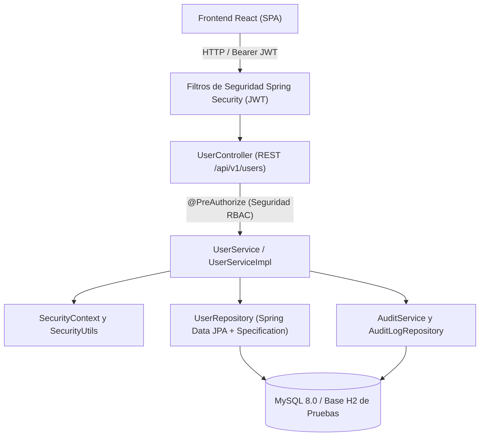
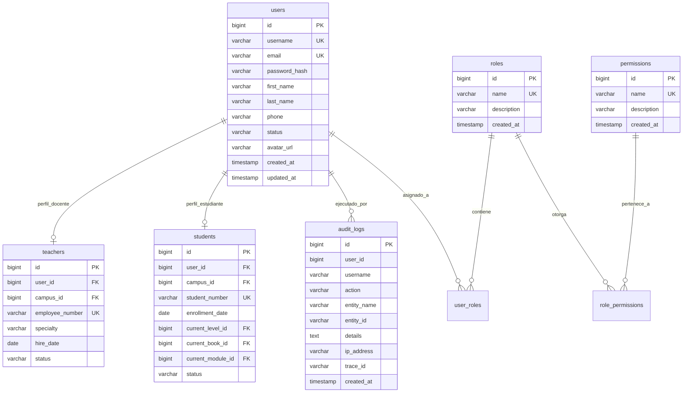
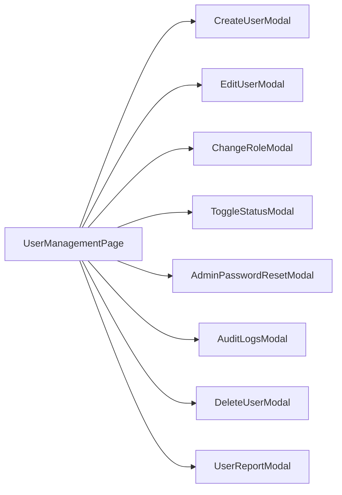
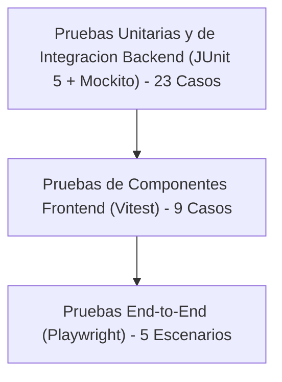

# IQ ENGLISH - MODULO DE GESTION DE USUARIOS (FASE 9)
## Arquitectura Tecnica, Especificacion Funcional y Manual de Operacion

---

## 1. Resumen Ejecutivo y Alcance del Modulo

El **Modulo de Gestion de Usuarios (Fase 9)** amplia la plataforma empresarial **IQ English Tutoring Management System** con capacidades completas para la administracion del ciclo de vida de las cuentas de usuario, control de acceso basado en roles (RBAC) estricto, flujos de trabajo seguros para credenciales y auditoria de operaciones en tiempo real.

### Capacidades Principales:
- **Gestion Integral del Ciclo de Vida de Usuarios**: Creacion, consulta paginada, filtrado por rol y estado, busqueda por texto libre, actualizacion de perfiles, activacion, desactivacion y baja logica (soft-delete).
- **Control de Acceso RBAC y Salvaguardas de Seguridad**: Esquema de autorizacion multinivel que aplica el principio de menor privilegio e implementa reglas de seguridad para evitar la eliminacion o desactivacion accidental del ultimo administrador activo del sistema.
- **Gobernanza de Credenciales**: Flujo de autoservicio para cambio de contrasena aplicable a todos los roles autenticados (Estudiante, Docente, Supervisor, Administrador) y reseteo administrativo de contrasenas para soporte tecnico.
- **Generacion de Reportes y Exportacion de Datos**: Metricas consolidadas sobre distribucion de usuarios por rol/estado y exportacion de listados en formato CSV compatible con la norma RFC 4180.
- **Trazabilidad y Auditoria en Tiempo Real**: Registro inmutable de cada accion administrativa con marca de tiempo, identificador de usuario, tipo de accion, entidad afectada y Trace ID de correlacion.

---

## 2. Arquitectura del Sistema e Interaccion de Componentes

El modulo implementa un patron de diseno por capas alineado con los principios de arquitectura limpia sobre Spring Boot 3.3.4 (Backend) y React 18 con TypeScript (Frontend SPA):

### Flujo de Ejecucion:
1. El cliente frontend emite solicitudes HTTP seguras adjuntando el token Bearer JWT en la cabecera `Authorization`.
2. El filtro `JwtAuthenticationFilter` valida la firma del token, extrae los roles y privilegios, e inicializa el `SecurityContext`.
3. El controlador REST `UserController` intercepta la peticion y evalua la expresion `@PreAuthorize` antes de delegar la ejecucion al servicio de negocio.
4. `UserServiceImpl` procesa la logica operativa, aplica validaciones de integridad y salvaguardas del sistema, e interactua con `UserRepository`.
5. Todas las transacciones mutativas invocan `AuditService` para persistir un registro inmutable en `audit_logs` dentro de la misma transaccion o de forma asincrona.

---

## 3. Modelo de Base de Datos y Diccionario de Datos

El modulo utiliza el esquema relacional central del sistema sin modificaciones destructivas, integrando `users`, `roles`, `user_roles`, `permissions`, `role_permissions`, `audit_logs`, y relacionandose con los perfiles especializados `students` y `teachers`.

### Diccionario de Datos de Entidades Principales:

#### Tabla: `users`
| Campo | Tipo | Restricciones | Descripcion |
|---|---|---|---|
| `id` | BIGINT | PRIMARY KEY, AUTO_INCREMENT | Identificador unico del registro de usuario. |
| `username` | VARCHAR(100) | UNIQUE, NOT NULL | Nombre de usuario unico para autenticacion en el sistema. |
| `email` | VARCHAR(150) | UNIQUE, NOT NULL | Correo electronico corporativo o personal del usuario. |
| `password_hash` | VARCHAR(255) | NOT NULL | Hash criptografico de la contrasena procesado con BCrypt. |
| `first_name` | VARCHAR(100) | NOT NULL | Nombre o nombres de pila del usuario. |
| `last_name` | VARCHAR(100) | NOT NULL | Apellidos del usuario. |
| `phone` | VARCHAR(30) | NULLABLE | Numero telefonico de contacto del usuario. |
| `status` | VARCHAR(30) | NOT NULL | Estado actual de la cuenta: `ACTIVE`, `INACTIVE`, `SUSPENDED`. |
| `avatar_url` | VARCHAR(255) | NULLABLE | Enlace o ruta al avatar grafico del perfil. |
| `created_at` | TIMESTAMP | NOT NULL | Fecha y hora exacta de creacion del registro. |
| `updated_at` | TIMESTAMP | NOT NULL | Fecha y hora de la ultima modificacion del registro. |

#### Tabla: `roles`
| Campo | Tipo | Restricciones | Descripcion |
|---|---|---|---|
| `id` | BIGINT | PRIMARY KEY, AUTO_INCREMENT | Identificador unico del rol. |
| `name` | VARCHAR(50) | UNIQUE, NOT NULL | Codigo identificador del rol (`ROLE_ADMIN`, `ROLE_SUPERVISOR`, `ROLE_TEACHER`, `ROLE_STUDENT`). |
| `description` | VARCHAR(255) | NULLABLE | Descripcion funcional de las atribuciones del rol. |
| `created_at` | TIMESTAMP | NOT NULL | Fecha de creacion del catalogo de roles. |

#### Tabla: `audit_logs`
| Campo | Tipo | Restricciones | Descripcion |
|---|---|---|---|
| `id` | BIGINT | PRIMARY KEY, AUTO_INCREMENT | Identificador secuencial del evento de auditoria. |
| `user_id` | BIGINT | NULLABLE | Identificador del usuario que realizo la accion o sobre quien recayo. |
| `username` | VARCHAR(100) | NULLABLE | Nombre de usuario registrado al momento del evento. |
| `action` | VARCHAR(100) | NOT NULL | Identificador de la operacion (`USER_CREATED`, `USER_UPDATED`, etc.). |
| `entity_name` | VARCHAR(100) | NOT NULL | Nombre de la entidad afectada (`User`, `Report`, `Export`). |
| `entity_id` | VARCHAR(100) | NULLABLE | Identificador especifico de la entidad modificada. |
| `details` | TEXT | NULLABLE | Detalle textual o JSON con los cambios realizados. |
| `ip_address` | VARCHAR(50) | NULLABLE | Direccion IP origen desde donde se origino la transaccion. |
| `trace_id` | VARCHAR(100) | NULLABLE | Identificador unico de trazabilidad distribuida para diagnostico. |
| `created_at` | TIMESTAMP | NOT NULL | Fecha y hora de emision del registro de auditoria. |

---

## 4. Matriz de Autorizacion RBAC y Especificacion de Endpoints REST

La arquitectura de seguridad define una matriz estricta de permisos evaluada mediante anotaciones `@PreAuthorize` en los controladores:

### Matriz de Roles y Permisos:

| Permiso / Capacidad | ROLE_ADMIN | ROLE_SUPERVISOR | ROLE_TEACHER | ROLE_STUDENT |
|---|:---:|:---:|:---:|:---:|
| `USER_READ` (Consultar usuarios y reportes) | SI | SI | NO | NO |
| `USER_CREATE` (Crear nuevos usuarios) | SI | NO | NO | NO |
| `USER_UPDATE` (Modificar perfiles y estados) | SI | NO | NO | NO |
| `USER_DISABLE` (Desactivar / baja logica) | SI | NO | NO | NO |
| `ROLE_MANAGE` (Asignar y modificar roles) | SI | NO | NO | NO |
| `AUDIT_READ` (Consultar historial de auditoria) | SI | NO | NO | NO |
| `SELF_PASSWORD_CHANGE` (Cambiar propia contrasena) | SI | SI | SI | SI |

### Catalogo Completo de Endpoints REST:

| Metodo | Endpoint | Autoridad Requerida | Descripcion Operativa | Codigos HTTP |
|---|---|---|---|---|
| `GET` | `/api/v1/users/me` | `isAuthenticated()` | Obtiene el perfil del usuario autenticado en la sesion actual. | 200, 401 |
| `GET` | `/api/v1/users` | `USER_READ` / `ADMIN` / `SUPERVISOR` | Lista paginada de usuarios con soporte de busqueda, filtro por rol y estado. | 200, 401, 403 |
| `GET` | `/api/v1/users/all` | `USER_READ` / `ADMIN` / `SUPERVISOR` | Lista completa de todos los usuarios registrados sin paginacion. | 200, 401, 403 |
| `GET` | `/api/v1/users/{id}` | `USER_READ` / `ADMIN` / `SUPERVISOR` | Consulta el detalle y perfiles vinculados de un usuario por su ID. | 200, 401, 403, 404 |
| `POST` | `/api/v1/users` | `USER_CREATE` / `ADMIN` | Registra un nuevo usuario y crea su perfil complementario segun el rol. | 200, 400, 401, 403, 409 |
| `PUT` | `/api/v1/users/{id}` | `USER_UPDATE` / `ADMIN` | Actualiza los datos de perfil y atributos del usuario especificado. | 200, 400, 401, 403, 404, 409 |
| `PATCH` | `/api/v1/users/{id}/status` | `USER_UPDATE` / `ADMIN` | Modifica el estado del usuario (`ACTIVE`, `INACTIVE`, `SUSPENDED`). | 200, 400, 401, 403, 404 |
| `PATCH` | `/api/v1/users/{id}/role` | `ROLE_MANAGE` / `ADMIN` | Actualiza los roles asignados a una cuenta de usuario. | 200, 400, 401, 403, 404 |
| `DELETE` | `/api/v1/users/{id}` | `USER_DISABLE` / `ADMIN` | Aplica baja logica (soft-delete) estableciendo el estado en `INACTIVE`. | 200, 400, 401, 403, 404 |
| `POST` | `/api/v1/users/change-password` | `isAuthenticated()` | Permite a cualquier usuario autenticado actualizar su propia contrasena. | 200, 400, 401 |
| `POST` | `/api/v1/users/{id}/password-reset` | `USER_UPDATE` / `ADMIN` | Reseteo administrativo de contrasena para un usuario especifico. | 200, 400, 401, 403, 404 |
| `GET` | `/api/v1/users/report` | `USER_READ` / `ADMIN` / `SUPERVISOR` | Retorna metricas consolidadas sobre distribucion de usuarios. | 200, 401, 403 |
| `GET` | `/api/v1/users/export/csv` | `USER_READ` / `ADMIN` / `SUPERVISOR` | Genera y descarga el padron de usuarios en formato CSV (RFC 4180). | 200, 401, 403 |
| `GET` | `/api/v1/users/{id}/audit` | `AUDIT_READ` / `ADMIN` | Consulta el historial cronologico de auditoria asociado a un usuario. | 200, 401, 403, 404 |

---

## 5. Reglas de Negocio y Restricciones de Seguridad

1. **Salvaguarda del Ultimo Administrador (BR-ADM-01)**:
   - El sistema prohibe estrictamente desactivar (`INACTIVE`, `SUSPENDED`), eliminar (baja logica) o remover el rol `ROLE_ADMIN` de la unica cuenta de administrador activa restante en el sistema.
   - Cualquier intento de violacion retorna un error HTTP 400 Bad Request con los codigos especificos `CANNOT_DISABLE_LAST_ADMIN`, `CANNOT_DELETE_LAST_ADMIN` o `CANNOT_REMOVE_LAST_ADMIN_ROLE`.

2. **Prevencion de Auto-Eliminacion (BR-ADM-02)**:
   - Un administrador autenticado no puede ejecutar la operacion de eliminacion o baja logica sobre su propia cuenta en sesion.
   - Si se detecta que el ID solicitado coincide con el usuario autenticado en `SecurityUtils.getCurrentUserId()`, se genera un error HTTP 400 con codigo `CANNOT_DELETE_SELF`.

3. **Gobernanza y Cifrado de Credenciales (BR-SEC-01)**:
   - Todas las contrasenas se procesan con el algoritmo BCrypt utilizando un factor de costo computacional (strength) de 10.
   - Longitud minima requerida de contrasena: 6 caracteres.
   - Las contrasenas en texto plano nunca se retornan en las respuestas DTO ni se imprimen en los registros de auditoria o trazas de logs.

4. **Validacion de Unicidad de Identificadores (BR-SEC-02)**:
   - El nombre de usuario (`username`) y la direccion de correo electronico (`email`) deben ser unicos en la base de datos.
   - Intentos de registro o actualizacion con identificadores duplicados arrojan excepciones `USERNAME_ALREADY_EXISTS` o `EMAIL_ALREADY_EXISTS` con codigo HTTP 409 Conflict.

5. **Trazabilidad de Auditoria Inmutable (BR-AUD-01)**:
   - Toda operacion administrativa mutativa genera un registro en `audit_logs` con las siguientes acciones estandarizadas:
     - `USER_CREATED`: Alta de nueva cuenta de usuario.
     - `USER_UPDATED`: Actualizacion de datos de perfil.
     - `USER_ACTIVATED` / `USER_DEACTIVATED`: Modificacion de estado operativo.
     - `USER_ROLES_UPDATED`: Reasignacion de roles de acceso.
     - `USER_DELETED`: Baja logica de cuenta.
     - `USER_PASSWORD_CHANGED`: Cambio de contrasena por el propio usuario.
     - `USER_PASSWORD_RESET`: Reseteo de contrasena ejecutado por el administrador.
     - `USER_REPORT_GENERATED`: Generacion de reporte estadistico.
     - `USER_EXPORT_CSV`: Descarga de padron de usuarios en formato CSV.

6. **Sincronizacion de Perfiles Especializados (BR-PRF-01)**:
   - Al registrar o actualizar un usuario con rol `ROLE_STUDENT`, el sistema valida y asocia automaticamente la entidad `Student` vinculandola con el plantel (`campus`), nivel academico (`AcademicLevel`), libro (`Book`) y modulo inicial (`Module`).
   - Al registrar o actualizar un usuario con rol `ROLE_TEACHER`, el sistema crea o actualiza la entidad `Teacher` con su numero de empleado, especialidad, fecha de contratacion y plantel asignado.

---

## 6. Arquitectura Frontend UI / UX y Componentes Modales

La interfaz grafica de usuario se encuentra implementada bajo los lineamientos del sistema de diseno corporativo de IQ English:

### Lineamientos de Diseno:
- **Color Principal Corporativo**: `#002e6d` (Azul Marino Profundo - Pantone 294 C).
- **Color Secundario de Accion**: `#5eb3e4` (Azul Cielo Claro - Pantone 2915 C).
- **Tipografia**: Familia tipografica Montserrat para todos los encabezados, tablas y controles de entrada.
- **Badges Semanticos**: Estados y roles representados con codigos de color distintivos (Verde para `ACTIVE`, Gris para `INACTIVE`, Ambar para `SUSPENDED`; Morado para `ADMIN`, Azul para `TEACHER`, Esmeralda para `STUDENT`, Naranja para `SUPERVISOR`).

### Componente Principal (`UserManagementPage.tsx`):
1. **Tarjetas KPI de Resumen**:
   - Total de Usuarios Registrados.
   - Usuarios Activos.
   - Total de Estudiantes.
   - Total de Docentes.
2. **Barra de Herramientas Operativa**:
   - Campo de busqueda por texto con mecanismo de retardo (debounce) para optimizar consultas de red.
   - Filtros desplegables por Rol y Estado.
   - Boton para exportacion directa a CSV.
   - Boton de apertura de metricas y reportes estadisticos.
   - Boton de creacion de nuevo usuario.
3. **Tabla Reactiva con Paginacion en Servidor**:
   - Columnas detalladas: Usuario / Avatar, Nombre Completo, Correo, Telefono, Roles, Estado, Fecha de Registro y Acciones Contextuales.
   - Controles de navegacion de paginas con indicador de registros totales y estado de carga (`LoadingSpinner`).

### Catalogo de Componentes Modales (`UserModals.tsx`):

- **CreateUserModal**: Formulario estructurado que adapta sus campos dinamicamente segun el rol seleccionado (datos generales, asignacion de sede, nivel academico y libro para estudiantes, especialidad y numero de empleado para docentes).
- **EditUserModal**: Permite la actualizacion de datos personales, correo electronico, telefono y atributos academicos o profesionales del perfil vinculado.
- **ChangeRoleModal**: Dialogo especializado para la reasignacion de roles con alertas contextuales sobre impacto en permisos.
- **ToggleStatusModal**: Permite conmutar el estado del usuario entre Activo, Inactivo y Suspendido, advirtiendo sobre restricciones de acceso.
- **AdminPasswordResetModal**: Proporciona al administrador una via directa y segura para reasignar la contrasena de un usuario en caso de bloqueo.
- **AuditLogsModal**: Visor interactivo de eventos con linea de tiempo cronologica, identificador de traza (Trace ID), direccion IP y resumen textual del cambio.
- **DeleteUserModal**: Cuadro de dialogo de confirmacion de baja logica con advertencia visual de impacto y validacion de salvaguarda.
- **UserReportModal**: Visualizacion grafica y tabular de la distribucion demografica de usuarios por rol y estado, junto con las altas de los ultimos 30 dias.

---

## 7. Nuevas Funcionalidades y Capacidades Extendidas

En la version actual del modulo se han integrado las siguientes extensiones funcionales clave:

1. **Enriquecimiento Dinamico de Perfiles (Enrichment Pattern)**:
   - El servicio incorpora de manera transparente en cada consulta DTO los perfiles especificos de estudiante (`StudentDTO`) o docente (`TeacherDTO`) mediante el metodo `enrichUserDTO`, permitiendo una presentacion unificada en el frontend sin sobrecarga de peticiones N+1.

2. **Progreso Academico Integrado en el Alta y Edicion**:
   - Enlace directo a la estructura curricular (`AcademicLevel`, `Book`, `Module`) al momento de crear o editar estudiantes, garantizando consistencia relacional desde el primer instante de registro.

3. **Exportador CSV de Alto Rendimiento**:
   - Generacion de flujos CSV en memoria con encabezados estandarizados (`text/csv; charset=UTF-8`), escape formal de caracteres especiales conforme a RFC 4180 y registro automatico de evento de auditoria `USER_EXPORT_CSV`.

4. **Doble Mecanismo de Gestion de Contrasenas**:
   - Separacion funcional estricta entre el cambio de contrasena por el propio usuario autenticado (`/api/v1/users/change-password`) requiriendo la contrasena actual previa, y el reseteo administrativo de emergencia (`/api/v1/users/{id}/password-reset`) reservado exclusivamente para roles con privilegio administrativo.

5. **Pista de Auditoria por Usuario**:
   - Endpoint dedicado `/api/v1/users/{id}/audit` para consultar de forma aislada la historia completa de cambios y transacciones de un usuario en particular.

---

## 8. Aseguramiento de Calidad y Suite de Pruebas Automatizadas

El modulo de gestion de usuarios cuenta con una cobertura exhaustiva alineada con la piramide de pruebas:

### Detalle de Cobertura de Pruebas:

1. **Pruebas Backend (JUnit 5 + Mockito / Spring Boot Test)**:
   - **`UserServiceTest`**: 13 pruebas unitarias exhaustivas validando:
     - Creacion exitosa de usuarios con perfiles de estudiante y docente.
     - Deteccion de conflictos por `username` y `email` duplicados.
     - Salvaguarda `CANNOT_DISABLE_LAST_ADMIN` al intentar desactivar el ultimo administrador.
     - Salvaguarda `CANNOT_DELETE_LAST_ADMIN` y `CANNOT_DELETE_SELF` en bajas logicas.
     - Validacion de longitud y reglas de reseteo y cambio de contrasena.
     - Generacion correcta de reportes y exportacion de datos a CSV.
   - **`UserControllerTest`**: 10 pruebas de capa web verificando:
     - Respuestas HTTP 200/201 ante solicitudes validas con MockMvc.
     - Restricciones de autorizacion `@PreAuthorize` ante roles no autorizados (HTTP 403).
     - Manejo estandarizado de excepciones mediante `GlobalExceptionHandler`.

2. **Pruebas Frontend (Vitest + React Testing Library)**:
   - **`UserManagementPage.test.tsx`**: 9 pruebas de interfaz verificando:
     - Renderizado correcto de metricas KPI y lista de usuarios.
     - Filtrado interactivo por rol y busqueda de texto.
     - Apertura y cierre de modales de creacion, edicion, roles y auditoria.
     - Manejo de estados de carga y mensajes de error amigables.

3. **Pruebas End-to-End (Playwright)**:
   - 5 escenarios completos cubriendo:
     - Inicio de sesion como administrador y navegacion a la gestion de usuarios.
     - Creacion integral de un estudiante con asignacion de sede y nivel academico.
     - Modificacion de perfil y actualizacion de estado operativo.
     - Reseteo administrativo de contrasena.
     - Generacion y descarga del reporte CSV de usuarios.

4. **Coleccion Postman**:
   - Suite completa de peticiones REST automatizadas con validacion de codigos de respuesta, estructura JSON Schema y tiempo de respuesta para todos los endpoints del modulo.

---
*Documento generado y mantenido por el equipo de ingenieria de software de IQ English.*
