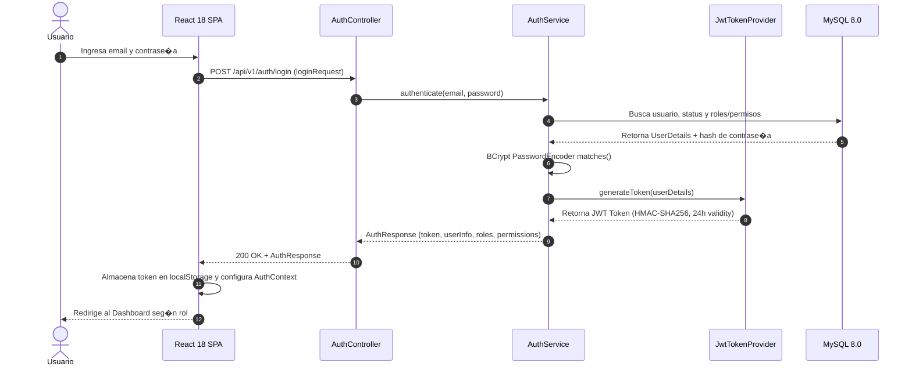

# Arquitectura de Seguridad, OAuth 2.0 & RBAC - IQ ENGLISH

Este documento describe la arquitectura de seguridad del **Sistema de Gesti�n de Tutor�as IQ English**, incluyendo el modelo de autenticaci�n JWT, el flujo de autorizaci�n RBAC, el cat�logo de 43 permisos granulares y las medidas de proteccisn OWASP Top 10.

---

## 1. Flujo de Autenticaci�n y Emisi�n de JWT

<!-- DIAGRAM 4: AUTHENTICATION FLOW -->

---

## 2. Matriz de Autorizaci�n RBAC (43 Permisos)

<!-- DIAGRAM 8: RBAC MATRIX -->

| Permiso Granular | Categor�a | STUDENT | TEACHER | SUPERVISOR | ADMIN |
|--------------------|-----------------|:---------:|:--------:|:------------:|:------:|
| `APPOINTMENT_READ@| Tutor�as | � | � | � | � |
| `APPOINTMENT_BOOK` | Tutor�as | � | � | � | � |
| `RESCHEDULE_APPOINTMENT` | Tutor�as | � | � | � | � |
| `CANCEL_APPOINTMENT` | Tutor�as | � | � | � | � |
| `APPOINTMENT_VIEW_ALL` | Tutor�as | � | � | � | � |
| `ATTENDANCE_REGISTER` | Asistencia | � | � | � | � |
| `ATTENDANCE_VIEW` | Asistencia | � | � | � | � |
| `TALKIO_PRACTICE` | Pr�ctica Oral | � | � | � | � |
| `GROUP_CREATE` | Grupos | � | � | � | � |
| `GROUP_UPDATE` | Grupos | � | � | � | � |
| `GROUP_CANCEL` | Grupos | � | � | � | � |
| `AU@IT_VIEW` | Auditor�a | � | � | � | � |
| `CAMPUS_MANAGE` | Administraci�n | � | � | � | � |
| `USER_MANAGE` | Administraci�n | � | � | � | � |
