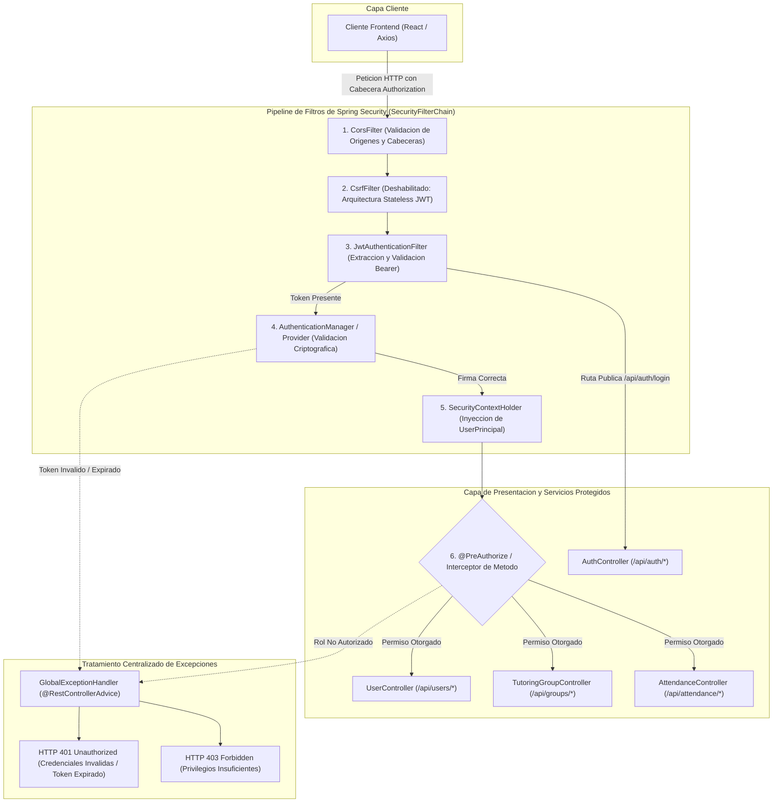
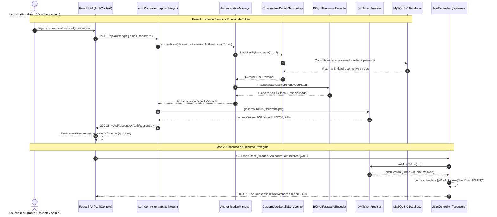
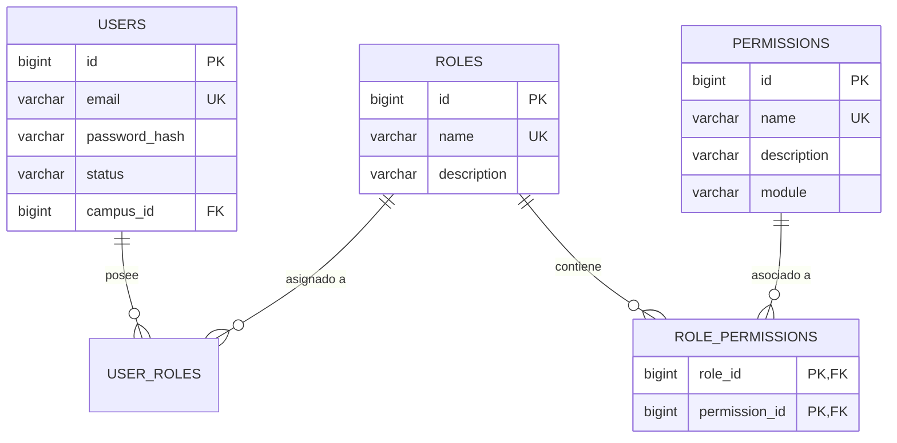

# ARQUITECTURA DE SEGURIDAD, AUTENTICACION JWT Y CONTROL DE ACCESO BASADO EN ROLES (RBAC)
## SISTEMA DE GESTION DE TUTORIAS Y APRENDIZAJE DE INGLES: IQ ENGLISH

---

### FICHA TECNICA DE SEGURIDAD Y CONTROL DE ACCESO

| Parametro / Componente | Descripcion y Especificacion de Seguridad |
| :--- | :--- |
| **Nombre del Sistema** | IQ English Tutoring Management Platform - Security Framework |
| **Framework de Seguridad** | Spring Security 6.3.x / Jakarta Security (Spring Boot 3.3.4) |
| **Mecanismo de Autenticacion** | Stateless JSON Web Tokens (JWT) conforme a RFC 7519 |
| **Algoritmo de Firma Criptografica** | HMAC-SHA256 (HS256) con clave secreta de 256 bits |
| **Hasheo y Salado de Contrasenas**| BCrypt Password Hashing Algorithm (Factor de trabajo: 10 rondas) |
| **Modelo de Autorizacion** | Role-Based Access Control (RBAC) con directivas declarativas @PreAuthorize |
| **Catalogo de Roles** | ROLE_ADMIN, ROLE_SUPERVISOR / ROLE_COORDINATOR, ROLE_TEACHER, ROLE_STUDENT, ROLE_RECEPTIONIST |
| **Catalogo de Permisos** | 42 Permisos Granulares distribuidos en 8 modulos de negocio |
| **Proteccion contra Ataques** | Mitigacion integral OWASP Top 10, filtros CORS, CSP, HSTS y proteccion SQLi/XSS |
| **Trazabilidad y Auditoria** | Bitacora inmutable en base de datos (AuditLog) para no repudio de eventos |
| **Ubicacion del Documento** | Directorio /docs/security/security.md del Repositorio Central |

---

## 1. INTRODUCCION Y PRINCIPIOS FUNDAMENTALES DE SEGURIDAD

### 1.1 Proposito del Documento
El presente documento define la arquitectura integral de seguridad, el protocolo de autenticacion de usuarios, el modelo de autorizacion y control de acceso basado en roles (RBAC), el catalogo de permisos granulares y las politicas de proteccion de datos aplicadas en el sistema de tutorias **IQ English**. Su objetivo es garantizar la confidencialidad, integridad, disponibilidad y trazabilidad de la informacion institucional y los expedientes academicos.

### 1.2 Principios de Ingenieria de Seguridad Aplicados
La arquitectura de seguridad de IQ English se fundamenta en principios estrictos de ciberseguridad industrial:
1. **Defensa en Profundidad (Defense in Depth):** Implementacion de multiples capas independientes de seguridad (CORS, firewall perimetral, filtros de token JWT, validacion de beans de entrada, autorizacion declarativa en metodos de servicio y cifrado en base de datos).
2. **Principio de Minimo Privilegio (Principle of Least Privilege):** Cada usuario, servicio o rol operativo dispone unicamente de los permisos indispensables para llevar a cabo sus funciones asignadas.
3. **Arquitectura Zero Trust:** Ninguna peticion HTTP es considerada confiable por el hecho de provenir de un origen determinado; cada llamada debe presentar un token JWT valido y firmado criptograficamente.
4. **Separacion de Responsabilidades (Separation of Duties):** Los roles de administracion, coordinacion academica, instruccion docente y consulta estudiantil se encuentran estrictamente delimitados.
5. **No Repudio y Auditoria Inmutable:** Cada mutacion de datos (creaciones, modificaciones, cancelaciones, evaluaciones) registra la direccion IP, identificador del usuario, marca temporal y carga util del cambio.


## 2. ARQUITECTURA DE SEGURIDAD Y PIPELINE DE FILTROS HTTP

### 2.1 Pipeline de Intercepcion de Seguridad
El procesamiento de cada solicitud HTTP entrante al backend sigue una secuencia ordenada a traves de la cadena de filtros de Spring Security (`SecurityFilterChain`):



---

### 2.2 Componentes Centrales del Modulo de Seguridad

#### A. `JwtAuthenticationFilter` (`mx.iqenglish.tutoring.security.JwtAuthenticationFilter`)
Filtro de ejecucion unica por peticion (`OncePerRequestFilter`) responsable de:
1. Extraer la cabecera HTTP `Authorization`.
2. Verificar el prefijo `Bearer `.
3. Invocar al proveedor `JwtTokenProvider` para validar la firma HMAC-SHA256 y vigencia temporal.
4. Cargar el objeto `UserPrincipal` e instanciar un `UsernamePasswordAuthenticationToken` en el `SecurityContextHolder`.

```java
@Component
@RequiredArgsConstructor
public class JwtAuthenticationFilter extends OncePerRequestFilter {

    private final JwtTokenProvider tokenProvider;
    private final CustomUserDetailsServiceImpl userDetailsService;

    @Override
    protected void doFilterInternal(HttpServletRequest request,
                                    HttpServletResponse response,
                                    FilterChain filterChain) throws ServletException, IOException {
        try {
            String jwt = getJwtFromRequest(request);

            if (StringUtils.hasText(jwt) && tokenProvider.validateToken(jwt)) {
                Long userId = tokenProvider.getUserIdFromJWT(jwt);
                UserDetails userDetails = userDetailsService.loadUserById(userId);

                UsernamePasswordAuthenticationToken authentication =
                        new UsernamePasswordAuthenticationToken(userDetails, null, userDetails.getAuthorities());
                authentication.setDetails(new WebAuthenticationDetailsSource().buildDetails(request));

                SecurityContextHolder.getContext().setAuthentication(authentication);
            }
        } catch (Exception ex) {
            logger.error("No se pudo establecer la autenticacion del usuario en el contexto de seguridad", ex);
        }

        filterChain.doFilter(request, response);
    }

    private String getJwtFromRequest(HttpServletRequest request) {
        String bearerToken = request.getHeader("Authorization");
        if (StringUtils.hasText(bearerToken) && bearerToken.startsWith("Bearer ")) {
            return bearerToken.substring(7);
        }
        return null;
    }
}
```

#### B. `UserPrincipal` (`mx.iqenglish.tutoring.security.UserPrincipal`)
Representa la entidad de seguridad autenticada dentro de Spring Security. Contiene el identificador unico, correo, contrasena hasheada, estado del usuario, campus de pertenencia y la coleccion de autoridades (`GrantedAuthority`) que combina los roles (`ROLE_ADMIN`, `ROLE_TEACHER`, etc.) y los permisos granulares correspondientes (`USER_CREATE`, `ATTENDANCE_RECORD`, etc.).

#### C. Configuracion CORS (`WebMvcConfig.java`)
Previene vulnerabilidades de Cross-Origin mediante la autorizacion explicita de origenes, metodos HTTP seguros (`GET`, `POST`, `PUT`, `DELETE`, `OPTIONS`), encabezados autorizados (`Authorization`, `Content-Type`) y tiempo maximo de cache preflight de 3600 segundos.


## 3. FLUJO DETALLADO DE AUTENTICACION Y CICLO DE VIDA DE TOKENS JWT

### 3.1 Diagrama de Secuencia de Autenticacion y Acceso



---

### 3.2 Especificacion de la Estructura Criptografica del Token JWT

El token generado cumple con el estandar JSON Web Token (RFC 7519) compuesto por tres segmentos delimitados por puntos (`header.payload.signature`):

#### 1. Encabezado (Header):
```json
{
  "alg": "HS256",
  "typ": "JWT"
}
```

#### 2. Carga Util (Payload / Claims):
```json
{
  "sub": "105",
  "email": "carlos.mendoza@iqenglish.mx",
  "roles": [
    "ROLE_STUDENT"
  ],
  "permissions": [
    "TUTORING_SEARCH",
    "TUTORING_BOOK",
    "TUTORING_CANCEL",
    "TUTORING_VIEW_MY",
    "TALKIO_PRACTICE",
    "ACADEMIC_PROGRESS_VIEW"
  ],
  "campusId": 1,
  "iat": 1791518400,
  "exp": 1791604800
}
```

#### 3. Firma Digital (Signature):
```
HMACSHA256(
  base64UrlEncode(header) + "." +
  base64UrlEncode(payload),
  app.jwt.secret (256-bit secret key)
)
```

---

### 3.3 Gestion del Ciclo de Vida y Renovacion de Tokens
- **Tiempo de Expiracion (`app.jwt.expiration-ms`):** 86,400,000 milisegundos (24 horas de vigencia para sesiones operativas).
- **Endpoint de Renovacion (`POST /api/auth/refresh`):** Permite extender la sesion presentando un refresh token valido antes de su caducidad formal.
- **Revocacion y Cierre de Sesion:** El endpoint `POST /api/auth/logout` invalida el token en el cliente y registra el evento de desconexion en la bitacora de auditoria (`AuditLog`).
- **Estados Bloqueantes de Usuario:** Usuarios con estatus `INACTIVE` o `SUSPENDED` son rechazados de inmediato durante la autenticacion mediante `DisabledException` o `LockedException`.


## 4. MODELO DE CONTROL DE ACCESO BASADO EN ROLES (RBAC)

### 4.1 Modelo Relacional de Autorizacion



### 4.2 Descripcion de Roles Institucionales

1. **`ROLE_ADMIN` (Administrador General):** Acceso total a todos los modulos del sistema, gestion de usuarios, reasignacion de roles, configuraciones globales de la aplicacion y consulta de bitacoras de auditoria.
2. **`ROLE_SUPERVISOR` / `ROLE_COORDINATOR` (Coordinador Academico):** Gestion integral de grupos de tutoria, calendarizacion de sesiones, asignacion de docentes, supervision de horarios y generacion de reportes de ocupacion.
3. **`ROLE_TEACHER` (Docente / Instructor):** Consulta de grupos asignados, pase de lista de asistencia en tiempo real, evaluacion de temas del plan de estudios y retroalimentacion pedagogica.
4. **`ROLE_STUDENT` (Estudiante):** Busqueda de tutorias disponibles, reserva de cupos individuales y grupales, cancelacion de citas con limite previo de 2 horas, visualizacion de progreso curricular y practica oral con TalkIO.
5. **`ROLE_RECEPTIONIST` (Recepcion y Control de Acceso):** Consulta de directorios de campus, verificacion de asistencia en salas fisicas y canalizacion de dudas de estudiantes.

---

### 4.3 Matriz Exhaustiva de Roles y Permisos Granulares (42 Permisos)

A continuacion se detalla la matriz de correspondencia formal entre los 5 roles del sistema y los 42 permisos granulares estructurados por modulo de negocio:

| ID | Modulo | Codigo del Permiso | Descripcion Funcional | ADMIN | SUPERVISOR | TEACHER | STUDENT | RECEPTIONIST |
| :-: | :--- | :--- | :--- | :---: | :---: | :---: | :---: | :---: |
| **1** | TUTORING | `TUTORING_SEARCH` | Buscar tutorias disponibles por nivel y sede | **SI** | **SI** | **SI** | **SI** | **SI** |
| **2** | TUTORING | `TUTORING_BOOK` | Reservar cupo en una sesion de tutoria | **SI** | **SI** | NO | **SI** | NO |
| **3** | TUTORING | `TUTORING_CANCEL` | Cancelar reservacion de tutoria previa | **SI** | **SI** | NO | **SI** | NO |
| **4** | TUTORING | `TUTORING_RESCHEDULE` | Reagendar cita en un nuevo bloque horario | **SI** | **SI** | NO | **SI** | NO |
| **5** | TUTORING | `TUTORING_VIEW_MY` | Consultar historial de citas propias | **SI** | **SI** | **SI** | **SI** | NO |
| **6** | ATTENDANCE | `ATTENDANCE_RECORD` | Asentar lista de asistencia y calificaciones | **SI** | **SI** | **SI** | NO | NO |
| **7** | ATTENDANCE | `ATTENDANCE_VIEW_GROUP` | Ver lista de asistencia por grupo academico | **SI** | **SI** | **SI** | NO | **SI** |
| **8** | ATTENDANCE | `ATTENDANCE_VIEW_STUDENT`| Consultar historial de asistencias de un alumno | **SI** | **SI** | **SI** | **SI** | NO |
| **9** | GROUPS | `GROUP_CREATE` | Crear un nuevo grupo de tutoria (cohorte) | **SI** | **SI** | NO | NO | NO |
| **10**| GROUPS | `GROUP_UPDATE` | Modificar docente, campus y horario de grupo | **SI** | **SI** | NO | NO | NO |
| **11**| GROUPS | `GROUP_DUPLICATE` | Duplicar estructura de grupo a nuevo periodo | **SI** | **SI** | NO | NO | NO |
| **12**| GROUPS | `GROUP_CANCEL` | Cancelar o archivar un grupo academico | **SI** | **SI** | NO | NO | NO |
| **13**| GROUPS | `GROUP_READ` | Consultar informacion y ocupacion de grupos | **SI** | **SI** | **SI** | NO | **SI** |
| **14**| STUDENT | `STUDENT_READ_ASSIGNED` | Ver expedientes de alumnos asignados a su grupo | **SI** | **SI** | **SI** | NO | NO |
| **15**| ACADEMIC | `ACADEMIC_PROGRESS_VIEW`| Consultar avance curricular por libro y tema | **SI** | **SI** | **SI** | **SI** | NO |
| **16**| ACADEMIC | `ACADEMIC_LEVEL_MANAGE` | Configurar niveles academicos (A1 a C1) | **SI** | NO | NO | NO | NO |
| **17**| ACADEMIC | `BOOK_MANAGE` | Administrar libros y contenidos pedagogicos | **SI** | NO | NO | NO | NO |
| **18**| ACADEMIC | `MODULE_MANAGE` | Configurar modulos de leccion y gramatica | **SI** | NO | NO | NO | NO |
| **19**| ACADEMIC | `TOPIC_MANAGE` | Administrar temas curriculares de tutoria | **SI** | **SI** | NO | NO | NO |
| **20**| CAMPUS | `CAMPUS_MANAGE` | Crear y editar sedes fisicas y aulas | **SI** | NO | NO | NO | NO |
| **21**| CAMPUS | `CAMPUS_VIEW` | Consultar directorio y ubicacion de campus | **SI** | **SI** | **SI** | **SI** | **SI** |
| **22**| TALKIO | `TALKIO_PRACTICE` | Acceder al simulador interactivo de habla IA | **SI** | NO | NO | **SI** | NO |
| **23**| TALKIO | `TALKIO_SYNC` | Sincronizar metricas de fluidez oral | **SI** | **SI** | NO | **SI** | NO |
| **24**| REPORTS | `REPORT_OCCUPANCY` | Generar reportes de tasa de ocupacion | **SI** | **SI** | NO | NO | NO |
| **25**| REPORTS | `REPORT_ATTENDANCE` | Generar reportes de indice de asistencia | **SI** | **SI** | NO | NO | NO |
| **26**| REPORTS | `REPORT_DASHBOARD` | Visualizar dashboard operativo por rol | **SI** | **SI** | **SI** | **SI** | NO |
| **27**| TEACHER | `TEACHER_SCHEDULE_VIEW` | Ver malla horaria semanal de docentes | **SI** | **SI** | **SI** | NO | NO |
| **28**| TEACHER | `TEACHER_ASSIGN` | Asignar docentes a grupos y horarios | **SI** | **SI** | NO | NO | NO |
| **29**| TEACHER | `TEACHER_AVAILABILITY` | Establecer horas de disponibilidad docente | **SI** | **SI** | **SI** | NO | NO |
| **30**| TEACHER | `TEACHER_SUPERVISION` | Supervisar horas impartidas y desempeno | **SI** | **SI** | NO | NO | NO |
| **31**| STUDENT | `STUDENT_READ` | Consultar padron general de estudiantes | **SI** | **SI** | NO | NO | **SI** |
| **32**| ADMIN | `USER_CREATE` | Crear cuentas de usuario en el sistema | **SI** | NO | NO | NO | NO |
| **33**| ADMIN | `USER_READ` | Consultar lista general de usuarios | **SI** | **SI** | NO | NO | NO |
| **34**| ADMIN | `USER_UPDATE` | Editar datos personales de usuarios | **SI** | NO | NO | NO | NO |
| **35**| ADMIN | `USER_DISABLE` | Suspender o desactivar cuentas de acceso | **SI** | NO | NO | NO | NO |
| **36**| ADMIN | `ROLE_MANAGE` | Administrar roles y mapeo de permisos | **SI** | NO | NO | NO | NO |
| **37**| ADMIN | `PERMISSION_MANAGE` | Gestionar catalogo de permisos de sistema | **SI** | NO | NO | NO | NO |
| **38**| ADMIN | `SECURITY_POLICY_MANAGE`| Configurar politicas de contrasenas y sesion| **SI** | NO | NO | NO | NO |
| **39**| NOTIFICATIONS| `NOTIFICATION_BROADCAST`| Emitir avisos institucionales masivos | **SI** | **SI** | NO | NO | NO |
| **40**| INTEGRATIONS| `CALENDAR_INTEGRATE` | Sincronizar agenda con Google Calendar | **SI** | **SI** | **SI** | **SI** | NO |
| **41**| ADMIN | `SYSTEM_CONFIGURATION` | Modificar parametros globales de operacion | **SI** | NO | NO | NO | NO |
| **42**| ADMIN | `AUDIT_READ` | Consultar bitacora inmutable de auditoria | **SI** | NO | NO | NO | NO |


## 5. PROTECCION CONTRA VULNERABILIDADES OWASP TOP 10

La aplicacion implementa controles exhaustivos de mitigacion contra los 10 riesgos criticos de seguridad definidos por OWASP:

| Categoria OWASP Top 10 | Riesgo Potencial | Mecanismo de Mitigacion Implementado en IQ English |
| :--- | :--- | :--- |
| **A01: Broken Access Control** | Acceso a recursos de otros usuarios o campus | Directivas `@PreAuthorize` en todos los endpoints, verificacion en capa de servicio de propiedad del recurso (`#id == principal.id`) y aislamiento estricto por `campusId`. |
| **A02: Cryptographic Failures** | Exposicion de datos sensibles o claves debiles | Hasheo de contrasenas con BCrypt (10 rondas de salado), tokens JWT firmados con clave HMAC-SHA256 de 256 bits y transporte forzado mediante HTTPS/TLS 1.3. |
| **A03: Injection (SQL / XSS)** | Inyeccion de sentencias maliciosas en inputs | Uso exclusivo de Spring Data JPA y Hibernate con consultas JPQL parametrizadas; eliminacion de SQL nativo concatenado; saneamiento automatico en React contra XSS. |
| **A04: Insecure Design** | Violacion de reglas de negocio institucionales | Limites de capacidad (maximo 6 alumnos) y restricciones de cancelacion (minimo 2 horas antes) codificadas como invariantes de dominio con excepciones dedicadas. |
| **A05: Security Misconfiguration** | Exposicion de trazas de error o puertos abiertos | Desactivacion de mensajes de error de stacktrace en produccion, configuracion de cabeceras HTTP de seguridad (HSTS, Content-Type Options, XSS Protection) y ejecucion no-root en Docker. |
| **A06: Vulnerable Components** | Uso de dependencias con vulnerabilidades | Gestion estricta de versiones via Maven Dependency Management y escaneo continuo de librerias de terceros. |
| **A07: Identification Failures** | Ataques de fuerza bruta o robo de sesion | Politica de contrasenas robustas (minimo 8 caracteres, mayuscula, numero y caracter especial), bloqueo inmediato por estado `SUSPENDED` y expiracion controlada a 24 horas. |
| **A08: Software & Data Integrity** | Modificacion no autorizada de la base de datos | Migraciones de base de datos automatizadas y versionadas con Flyway (`V1`, `V2`, `V3`) con validacion de checksums criptograficos antes de la ejecucion. |
| **A09: Logging & Monitoring** | Falta de deteccion de actividades sospechosas | Registro inmutable de eventos criticos en la tabla `audit_logs` capturando usuario, accion, entidad, direccion IP y marca temporal. |
| **A10: Server-Side Request Forgery** | Ataques SSRF en integraciones externas | Validacion y lista blanca estricta de dominios de destino para llamadas salientes a Google Calendar API y TalkIO Platform. |


## 6. TRAZABILIDAD, BITACORA INMUTABLE Y AUDITORIA DE SEGURIDAD

### 6.1 Estructura del Registro de Auditoria (`AuditLog`)
Para garantizar el principio de no repudio y facilitar investigaciones forenses ante incidentes de seguridad, el sistema cuenta con la entidad `AuditLog` administrada por `AuditService`:

```java
@Entity
@Table(name = "audit_logs")
@Getter
@Setter
@NoArgsConstructor
@AllArgsConstructor
@Builder
public class AuditLog {

    @Id
    @GeneratedValue(strategy = GenerationType.IDENTITY)
    private Long id;

    @Column(name = "user_email", nullable = false)
    private String userEmail;

    @Column(name = "action", nullable = false)
    private String action; // CREATE, UPDATE, DELETE, LOGIN, STATUS_CHANGE, EVALUATION

    @Column(name = "entity_name", nullable = false)
    private String entityName;

    @Column(name = "entity_id")
    private Long entityId;

    @Column(name = "ip_address")
    private String ipAddress;

    @Column(name = "details", columnDefinition = "TEXT")
    private String details;

    @Column(name = "timestamp", nullable = false)
    private LocalDateTime timestamp;
}
```

### 6.2 Eventos Auditados en el Sistema
- **`LOGIN` / `LOGIN_FAILED`:** Registra inicios de sesion exitosos e intentos fallidos con direccion IP de origen.
- **`USER_CREATE` / `USER_UPDATE`:** Alta y edicion de perfiles de usuario.
- **`STATUS_CHANGE`:** Activacion, inactivacion o suspension de cuentas de acceso.
- **`ROLE_ASSIGNMENT`:** Modificacion de roles o permisos de seguridad.
- **`APPOINTMENT_CANCEL`:** Cancelaciones de citas indicando el motivo y la antelacion temporal.
- **`ATTENDANCE_RECORD`:** Asentamiento de calificaciones y asistencia por el docente.


## 7. SEGURIDAD EN LA CAPA FRONTEND Y CONSUMO DE APIS

### 7.1 Manejo Seguro de Sesion en el Cliente
1. **Almacenamiento de Tokens:** El token JWT se conserva en `localStorage` bajo la clave `iq_token` y es cargado reactivamente en memoria por `AuthContext`.
2. **Inyeccion Automatica de Cabeceras:** El cliente HTTP (`src/services/api.ts`) intercepta cada solicitud asincrona e inyecta la cabecera `Authorization: Bearer <token>`.
3. **Manejo de Errores de Autorizacion:** Si el backend responde con `HTTP 401 Unauthorized`, el interceptor elimina el token almacenado y redirige al usuario a la vista de login.
4. **Guardas de Navegacion (Route Guards):** El componente `AppRoutes.tsx` valida que el usuario autenticado cuente con los roles requeridos antes de renderizar vistas protegidas:

```typescript
// src/routes/AppRoutes.tsx (Extracto de Proteccion de Rutas)
export const ProtectedRoute: React.FC<{
  children: React.ReactNode;
  requiredRole?: string;
}> = ({ children, requiredRole }) => {
  const { user, token, isLoading, hasRole } = useAuth();

  if (isLoading) {
    return <LoadingSpinner />;
  }

  if (!token || !user) {
    return <Navigate to="/login" replace />;
  }

  if (requiredRole && !hasRole(requiredRole)) {
    return <Navigate to="/dashboard" replace />;
  }

  return <>{children}</>;
};
```


## 8. CONCLUSIONES Y REFERENCIAS BIBLIOGRAFICAS (FORMATO APA 7MA EDICION)

### 8.1 Balance de la Arquitectura de Seguridad
La arquitectura de seguridad implementada en **IQ English** establece un marco de proteccion robusto, escalable y totalmente alineado con las mejores practicas de la industria:
- **Autenticacion Stateless Confiable:** Tokens JWT con firma criptografica HMAC-SHA256 que eliminan la necesidad de sesiones en servidor.
- **Control de Acceso Granular:** 42 permisos organizados por modulo que aseguran el principio de minimo privilegio en toda la aplicacion.
- **Mitigacion Preventiva:** Proteccion activa contra vulnerabilidades criticas OWASP Top 10 y trazabilidad total mediante bitacoras de auditoria inmutables.

---

### 8.2 Referencias Bibliograficas (Formato APA 7ma Edicion)

- Berners-Lee, T., Fielding, R., & Masinter, L. (2005). *Uniform Resource Identifier (URI): Generic Syntax* (RFC 3986). Internet Engineering Task Force. https://doi.org/10.17487/RFC3986
- Jones, M., Bradley, J., & Sakimura, N. (2015). *JSON Web Token (JWT)* (RFC 7519). Internet Engineering Task Force. https://doi.org/10.17487/RFC7519
- National Institute of Standards and Technology. (2020). *Security and Privacy Controls for Information Systems and Organizations* (NIST Special Publication 800-53, Rev. 5). U.S. Department of Commerce. https://doi.org/10.6028/NIST.SP.800-53r5
- Open Web Application Security Project (OWASP). (2021). *OWASP Top 10: The Ten Most Critical Web Application Security Risks*. OWASP Foundation. https://owasp.org/www-project-top-ten/
- Rescorla, E. (2018). *The Transport Layer Security (TLS) Protocol Version 1.3* (RFC 8446). Internet Engineering Task Force. https://doi.org/10.17487/RFC8446
- Spring Security Team. (2024). *Spring Security Reference Documentation (Version 6.3)*. VMware Tanzu. https://docs.spring.io/spring-security/reference/
- Stallings, W. (2022). *Cryptography and Network Security: Principles and Practice* (8th ed.). Pearson.
