# IQ English - Especificación Detallada de Diseño UI/UX y Documentación de Interfaces

## 1. Introducción y Resumen Ejecutivo

El **Sistema de Gestión de Tutorías de IQ English** es una plataforma web desarrollada para coordinar el aprendizaje intensivo del idioma inglés bajo el modelo de inmersión conversacional. La solución optimiza la programación académica, la reserva de tutorías en grupos reducidos de máximo 5 alumnos (Regla R04), la evaluación oral estandarizada y el control administrativo integral mediante un diseño visual centrado en el usuario, responsivo y accesible.

Este documento proporciona la especificación técnica y de experiencia de usuario (UI/UX) de todas las interfaces implementadas, documentando la paleta de colores corporativa, tipografía, iconografía, tipos de controles, reglas de validación de campos, flujos de interacción y capturas de pantalla de las pruebas funcionales ejecutadas sobre el sistema en vivo.

---

## 2. Fundamentos del Sistema de Diseño (Design System)

### 2.1 Paleta de Colores Institucional y Semántica

La paleta cromática se basa en el Manual de Identidad de **IQ English**, complementada con tokens semánticos para estados de validación y accesibilidad WCAG 2.1 nivel AA:

| Token / Variable CSS | Color Hex | Nombre de Identidad | Uso en Interfaz de Usuario |
| :--- | :--- | :--- | :--- |
| `--iq-primary` | `#002E6D` | **Azul IQ (Pantone 294 C)** | Color primario de marca, barra superior, botones principales, encabezados H1/H2 y elementos activos del sidebar. |
| `--iq-primary-hover` | `#00204D` | Azul Nocturno | Estado `:hover` y `:active` de botones y navegación primaria. |
| `--iq-primary-light` | `#E6EDF7` | Azul Niebla | Fondos de contenedores destacados, tarjetas de módulos en curso y selecciones activas. |
| `--iq-secondary` | `#5EB3E4` | **Azul Cielo (Pantone 2915 C)** | Color de acento interactivo, enlaces, bordes de foco `:focus`, badges informativos y flechas de navegación. |
| `--iq-secondary-hover`| `#489ECD` | Azul Océano | Interacción en enlaces y tags de plantel. |
| `--iq-secondary-light`| `#EAF5FC` | Azul Hielo | Fondos suaves de tarjetas informativas y badges de estado. |
| `--iq-gray` | `#758592` | **Gris IQ (Pantone 7544 C)** | Texto secundario, subtítulos, etiquetas descriptivas y bordes secundarios. |
| `--iq-gray-light` | `#F1F4F7` | Gris Plomo Claro | Contenedores neutros, fondos de controles deshabilitados y filas alternas en tablas. |
| `--iq-gold` | `#C5A059` | **Oro Corporativo** | Acentos de nivel premium, medallas de progreso curricular y botón de acciones destacadas. |
| `--iq-gold-light` | `#FDFAF3` | Crema Oro | Fondos de advertencia leve y badges de nivel avanzado. |
| `--bg-app` | `#F8FAFC` | Fondo de Aplicación | Fondo neutro general del viewport para garantizar alto contraste. |
| `--bg-surface` | `#FFFFFF` | Superficie Limpia | Fondo de tarjetas, tablas de datos, modales y formularios. |
| `--text-main` | `#0F172A` | Carbón Intenso | Texto principal de alta legibilidad, títulos y valores de campos. |
| `--text-muted` | `#64748B` | Pizarra | Textos complementarios, metadatos y placeholders. |
| `--status-success` | `#10B981` | Verde Éxito | Estado *PRESENTE*, citas *CONFIRMADAS*, grupos *PUBLICADOS* y alertas de guardado. |
| `--status-warning` | `#F59E0B` | Ámbar Alerta | Grupos con *1 CUPO LIBRE*, asistencias *JUSTIFICADAS* y avisos de anticipación. |
| `--status-danger` | `#EF4444` | Rojo Error | Estado *AUSENTE*, grupos *CERRADOS*, cupo *LLENO* y validaciones fallidas. |
| `--status-info` | `#3B82F6` | Azul Notificación | Folios emitidos, sincronización de TalkIO y tags de rol. |

---

### 2.2 Tipografía y Jerarquía Visual

El sistema utiliza la fuente tipográfica corporativa **Montserrat** (con fallback a `system-ui, -apple-system, sans-serif`), aplicando las siguientes escalas:

* **Títulos de Pantalla (H1):** `24px` / `28px`, Peso `800 ExtraBold`, Color `--iq-primary`.
* **Encabezados de Sección (H2):** `18px` / `20px`, Peso `700 Bold`, Color `--text-main`.
* **Títulos de Tarjeta / Modal (H3):** `15px` / `16px`, Peso `700 Bold`, Color `--iq-primary`.
* **Cuerpo de Texto Principal:** `13.5px` / `14px`, Peso `500 Medium`, Altura de Línea `1.5`, Color `--text-main`.
* **Etiquetas de Campos (Labels):** `11px` / `12px`, Peso `700 Bold`, Mayúsculas con espaciado entre letras `0.5px`, Color `--text-main`.
* **Metadatos y Leyendas:** `11px` / `12px`, Peso `400 Regular`, Color `--text-muted`.
* **Badges y Etiquetas de Estado:** `10px` / `11px`, Peso `800 ExtraBold`, Mayúsculas, Color según semántica.

---

### 2.3 Sistema de Espaciado, Sombras y Radios

* **Bordes Redondeados:**
  * Controles pequeños y badges: `--radius-sm` (`6px`).
  * Tarjetas, tablas y campos de entrada: `--radius-md` (`10px`).
  * Diálogos modales y banners principales: `--radius-lg` (`16px`).
  * Píldoras de estado y avatares: `--radius-full` (`9999px`).
* **Elevación y Sombras:**
  * Sombras ligeras en controles: `--shadow-sm: 0 1px 2px 0 rgb(0 0 0 / 0.05)`.
  * Tarjetas y paneles: `--shadow-md: 0 4px 6px -1px rgb(0 0 0 / 0.1)`.
  * Diálogos modales y dropdowns: `--shadow-lg: 0 10px 15px -3px rgb(0 0 0 / 0.1)`.

---

### 2.4 Catálogo de Iconografía (Lucide React)

El sistema emplea la biblioteca de iconos vectoriales **Lucide React**, estandarizados en trazo de `1.8px` a `2px` para mantener uniformidad visual:

| Icono | Componente Lucide | Tamaño Típico | Propósito y Contexto de Uso en UI |
| :---: | :--- | :---: | :--- |
| 📊 | `<BarChart3 />` / `<LayoutDashboard />` | `18px` | Acceso a Dashboards y métricas ejecutivas. |
| 🔍 | `<Search />` | `18px` | Búsqueda de tutorías y filtrado de tablas. |
| 📅 | `<Calendar />` | `16px` / `18px` | Selector de fechas de sesión y módulo "Mis Tutorías". |
| 📚 | `<BookOpen />` | `18px` | Catálogo curricular de Book 1, 2 y 3. |
| 👥 | `<Users />` | `18px` | Directorio de usuarios y gestión de grupos. |
| 📋 | `<ClipboardCheck />` | `18px` | Registro de asistencia y evaluación docente. |
| 🤖 | `<Bot />` / `<Mic />` | `18px` | Práctica oral interactiva TalkIO AI. |
| 🛡️ | `<ShieldCheck />` | `18px` | Bitácora inmutable de auditoría del sistema. |
| 🔑 | `<KeyRound />` | `14px` / `16px` | Modal de cambio y restablecimiento de contraseña. |
| 🚪 | `<LogOut />` | `14px` / `16px` | Cierre de sesión y revocación de token JWT. |
| ✏️ | `<Edit2 />` | `15px` | Acción de edición en tablas de usuarios y grupos. |
| 🗑️ | `<Trash2 />` | `15px` | Acción de baja lógica o eliminación controlada. |
| ⚠️ | `<AlertTriangle />` | `16px` | Alertas de capacidad máxima y advertencias. |
| 🔊 | `<Volume2 />` | `18px` | Reproducción de audio y pronunciación en TalkIO. |

---

## 3. Estructura de Navegación y Layout Global

### 3.1 Marco Estructural (`MainLayout.tsx`)
El layout principal envuelve todas las vistas protegidas del sistema tras la autenticación:
1. **Topbar Superior Institucional:**
   * Logotipo y título corporativo: *"IQ English - Tutoring Management System"*.
   * Tag de Plantel Asignado: Píldora con sede activa (ej. *"Campus Monterrey Norte"*).
   * Botón de Acción Rápida: `<KeyRound /> Contraseña` (abre `ChangePasswordModal`).
   * Botón de Salida: `<LogOut /> Salir` (limpia `localStorage` y redirige a `/login`).
2. **Sidebar Dinámico:**
   * Encabezado con identidad corporativa IQ.
   * Menú de navegación vertical filtrado por roles:
     * **Estudiante (`ROLE_STUDENT`):** Dashboard, Buscar Tutoría, Mis Tutorías, Catálogo Académico, Práctica TalkIO AI.
     * **Docente (`ROLE_TEACHER`):** Dashboard, Registro Asistencia, Catálogo Académico.
     * **Administrador / Supervisor (`ROLE_ADMIN`, `ROLE_SUPERVISOR`):** Dashboard, Gestión de Grupos, Gestión de Usuarios, Bitácora de Auditoría, Catálogo Académico.
   * **Demo Fast Role Switcher:** Panel inferior para alternar rápidamente entre roles en demostraciones.
   * Footer de usuario con avatar circular, nombre completo y rol activo.

---

## 4. Documentación Detallada de Interfaces de Usuario (19 UIs)

---

### UI 01: Página de Login y Autenticación de Usuario

* **Ruta de Acceso:** `/login` (Ruta pública).
* **Propósito UX:** Permitir el acceso seguro a la plataforma mediante credenciales institucionales, emitiendo un token JWT firmado.
* **Componentes y Controles:**
  * **Card Central de Autenticación:** Contenedor blanco centrado con sombra `--shadow-md` y textura corporativa superior.
  * **Campo de Texto `Usuario`:** `<input type="text" />` con autofocus, validación de campo requerido y placeholder descriptivo.
  * **Campo de Contraseña `Contraseña`:** `<input type="password" />` con enmascaramiento de caracteres.
  * **Botón Principal:** `<Button variant="primary">` con etiqueta *"Iniciar Sesión"*, estado de carga integrado y spinner.
  * **Botón de Restablecimiento:** Enlace accesible *"¿Olvidó su contraseña?"* para soporte institucional.
* **Validaciones y Reglas de Negocio:**
  * Username obligatorio (mínimo 3 caracteres, sin espacios intermedios).
  * Validación contra `/api/v1/auth/login`. En caso de credenciales inválidas, renderiza alerta roja `--status-danger`.

---

### UI 02: Dashboard del Estudiante

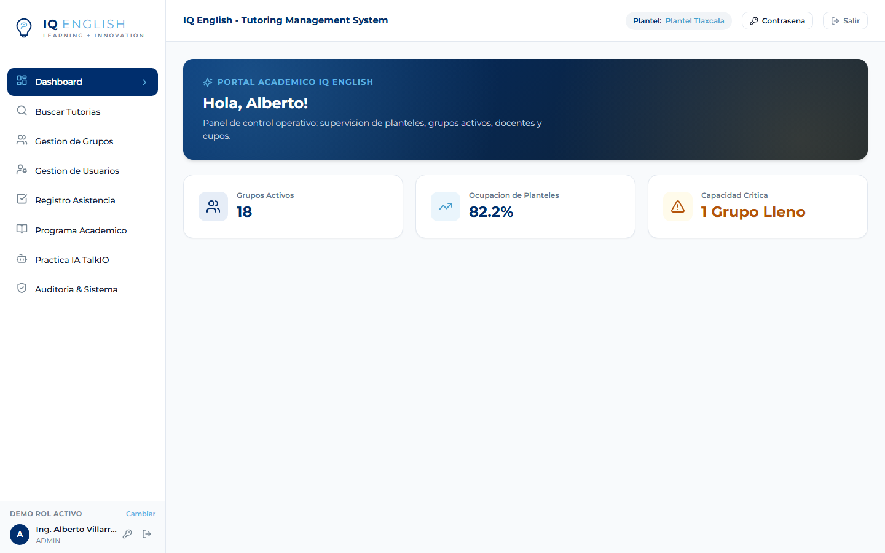

* **Ruta de Acceso:** `/dashboard` (Rol requerido: `ROLE_STUDENT`).
* **Propósito UX:** Brindar al estudiante una visión clara de su avance en el programa académico, su siguiente módulo requerido y su próxima cita confirmada.
* **Componentes y Controles:**
  * **Hero Banner de Progreso Curricular:** Contenedor estilizado con degradado corporativo `.iq-texture-bg`, indicador de nivel activo (*Book 2: Interactive Fluency*) y barra de progreso porcentual (`75% Completado`).
  * **Tarjeta de Próxima Cita:** Card destacada con borde `--status-success`, folio oficial (*APT-2026-0419*), docente, aula, horario y botón de consulta.
  * **Módulo Sugerido / Recomendación:** Tarjeta con botón de acción directa `<Button variant="primary"> Agendar Tutoría` para avanzar al módulo *Lesson 5B*.
  * **Línea de Tiempo Curricular:** Cuadrícula de lecciones con badges de estado: *COMPLETADO* (verde con nota `95.0`), *CONFIRMADO* (azul) y *PENDIENTE* (gris).

---

### UI 03: Búsqueda y Filtrado de Tutorías

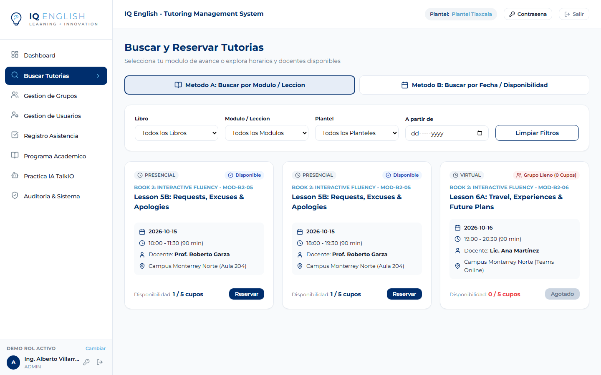

* **Ruta de Acceso:** `/tutoring/search` (Rol requerido: `ROLE_STUDENT`).
* **Propósito UX:** Facilitar la localización de grupos de tutoría con cupos libres mediante dos modalidades: búsqueda curricular (por libro/módulo) o por disponibilidad de fechas.
* **Componentes y Controles:**
  * **Selector de Método de Búsqueda:** Botones tipo pestaña para alternar entre *Método A: Por Módulo Objetivo* y *Método B: Por Fecha*.
  * **Filtro de Campus:** `<select>` desplegable con planteles activos (*Campus Monterrey Norte*, *Campus Central*).
  * **Filtro de Libro Curricular:** `<select>` filtrado por el nivel del alumno (*Book 2: Interactive Fluency*).
  * **Filtro de Módulo / Lección:** `<select>` dinámico que actualiza las opciones según el libro seleccionado (*Lesson 5B: Requests & Excuses*).
  * **Listado de Resultados:** Tarjetas de sesión que muestran: código de grupo, docente titular, fecha, horario, aula, modalidad y badge de cupos (*1 CUPO LIBRE* / *LLENO*).
  * **Botón de Acción:** `<Button>` con etiqueta *"Reservar"* en grupos con `availableSeats > 0`. Deshabilitado en grupos llenos.

---

### UI 04: Modal de Confirmación de Reserva de Tutoría

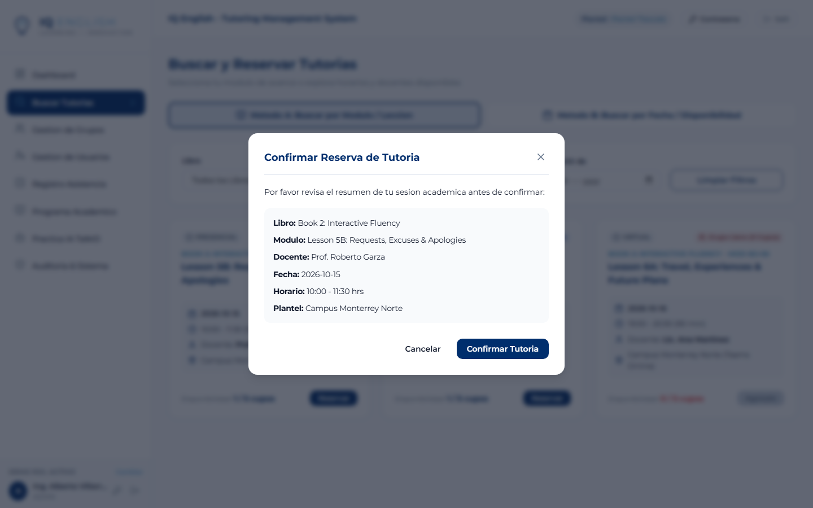

* **Componente:** `BookingConfirmationModal` (Invocado desde `/tutoring/search`).
* **Propósito UX:** Prevenir reservas accidentales, confirmar la disponibilidad del cupo y presentar la política de cancelación previa a la persistencia.
* **Componentes y Controles:**
  * **Fondo Atenuado (Modal Overlay):** Bloqueo visual con desenfoque de fondo y foco accesible.
  * **Panel de Resumen de Sesión:** Contenedor gris claro con módulo, grupo (*GRP-B2-L5B-02*), docente (*Prof. Roberto Garza*), aula (*Aula 204*) y fecha.
  * **Aviso de Política de Cancelación:** Alerta amarilla destacando la regla de cancelación con mínimo 12 horas de anticipación.
  * **Botones de Pie de Modal:**
    * `<Button variant="outline"> Cancelar` (cierra diálogo).
    * `<Button variant="primary"> Confirmar mi Cita` (ejecuta `POST /api/v1/appointments`).

---

### UI 05: Mis Tutorías del Estudiante

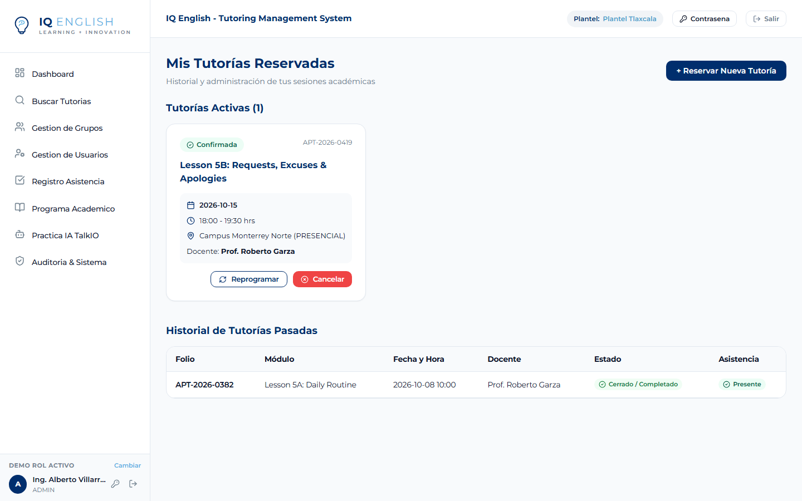

* **Ruta de Acceso:** `/tutoring/my-appointments` (Rol requerido: `ROLE_STUDENT`).
* **Propósito UX:** Gestionar las citas agendadas activas, consultar folios oficiales y revisar el historial de sesiones asistidas y calificaciones.
* **Componentes y Controles:**
  * **Tabla de Citas Activas e Historial:**
    * Columnas: *Folio Oficial*, *Lección / Módulo*, *Fecha y Horario*, *Sede / Aula*, *Docente*, *Estado*, *Calificación*, *Acciones*.
  * **Badges de Estado de Cita:**
    * `CONFIRMADA` (verde suave con texto verde oscuro).
    * `ASISTIDA` (azul suave con calificación numérica visible).
    * `CANCELADA` (rojo suave).
  * **Botón de Nueva Reserva:** Botón superior para redirigir rápidamente al buscador.

---

### UI 06: Catálogo Académico Curricular

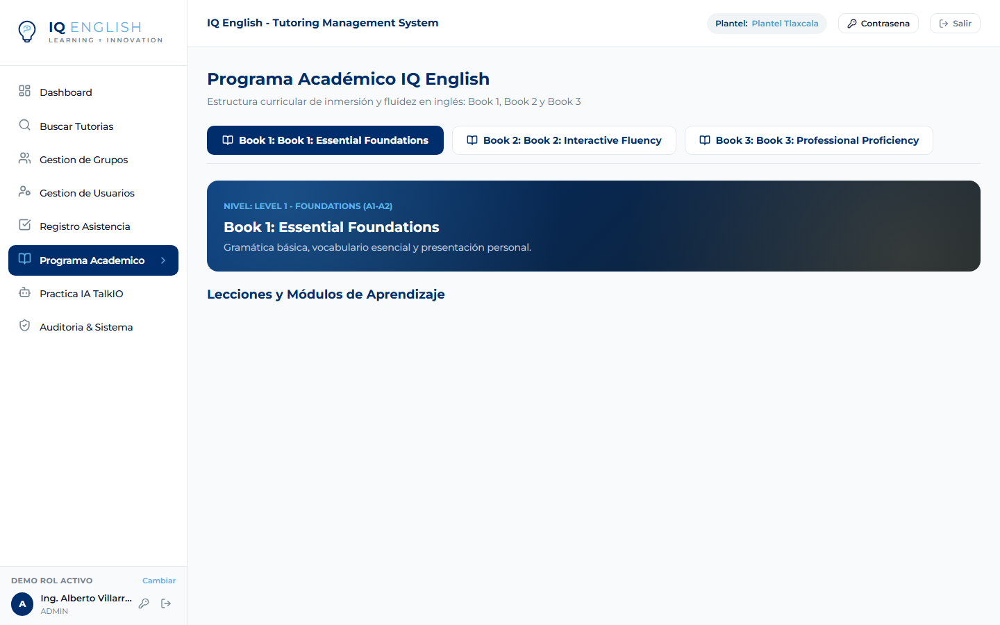

* **Ruta de Acceso:** `/academic` (Todos los roles autenticados).
* **Propósito UX:** Consultar la estructura pedagógica de IQ English, objetivos de aprendizaje, libros de texto y rúbricas de evaluación oral.
* **Componentes y Controles:**
  * **Navegador de Libros por Pestañas:** Pestañas superiores para alternar entre *Book 1 (A1-A2)*, *Book 2 (B1)* y *Book 3 (B2-C1)*.
  * **Hero Informativo de Nivel:** Banner corporativo con nivel MCER, enfoque didáctico y número de lecciones.
  * **Cuadrícula de Módulos:** Tarjetas estructuradas que desglosan cada lección en:
    * Código de lección (*MOD-B2-04*, *MOD-B2-05*).
    * Foco gramatical (*Modal Verbs Could/Would*).
    * Foco de fluidez oral (*Workplace Negotiations*).
    * Duración requerida (3 tutorías guiadas de 90 minutos c/u).

---

### UI 07: Módulo de Práctica Oral TalkIO AI

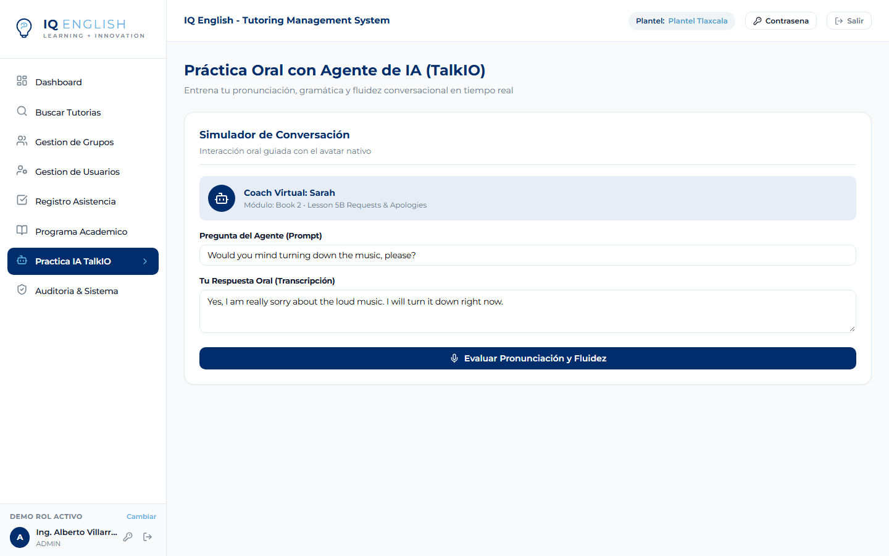

* **Ruta de Acceso:** `/talkio` (Rol requerido: `ROLE_STUDENT`).
* **Propósito UX:** Proveer al alumno un entorno autónomo de práctica oral asistida por inteligencia artificial con retroalimentación instantánea de pronunciación y gramática.
* **Componentes y Controles:**
  * **Selector de Avatar Tutor:** Selección de voz y personalidad del tutor virtual (*Sarah AI Tutor*).
  * **Área de Prompt Conversacional:** Caja de texto con la situación de rol propuesta para el módulo activo (*Lesson 5B*).
  * **Controles de Audio:** Botón de grabación de micrófono con animación de ondas de voz y botón de escucha de modelo.
  * **Panel de Métricas de Desempeño:** Tres indicadores circulares con puntajes de 0 a 100: *Pronunciación (94%)*, *Gramática (96%)*, *Vocabulario (95%)*.

---

### UI 08: Dashboard del Usuario Docente

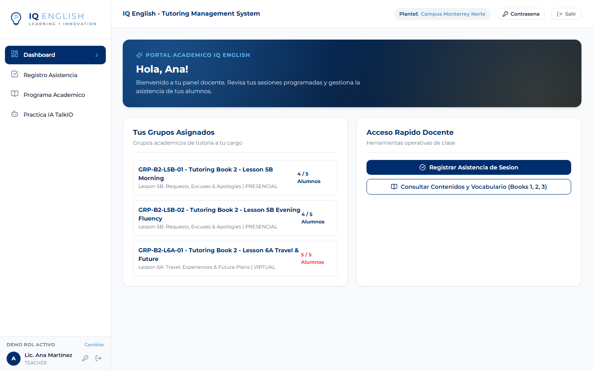

* **Ruta de Acceso:** `/dashboard` (Rol requerido: `ROLE_TEACHER`).
* **Propósito UX:** Concentrar las herramientas operativas del profesor titular: sesiones asignadas para la fecha actual, acceso directo a listas de asistencia y promedios grupales.
* **Componentes y Controles:**
  * **Tarjetas de Resumen Operativo:**
    * *Sesiones Programadas Hoy:* 2 clases.
    * *Total Alumnos Activos:* 18 estudiantes.
    * *Promedio de Evaluación Oral:* `92.4 / 100`.
  * **Tarjeta de Próxima Sesión a Iniciar:** Grupo *GRP-B2-L5B-01* con horario (*10:00 - 11:30*), aula (*Aula 204*) y botón destacado `<Button variant="primary"> Tomar Asistencia`.
  * **Lista de Grupos Asignados en la Semana:** Tabla resumida con cupos ocupados y acceso rápido a la bitácora.

---

### UI 09: Módulo de Toma de Asistencia (Selector de Sesiones)

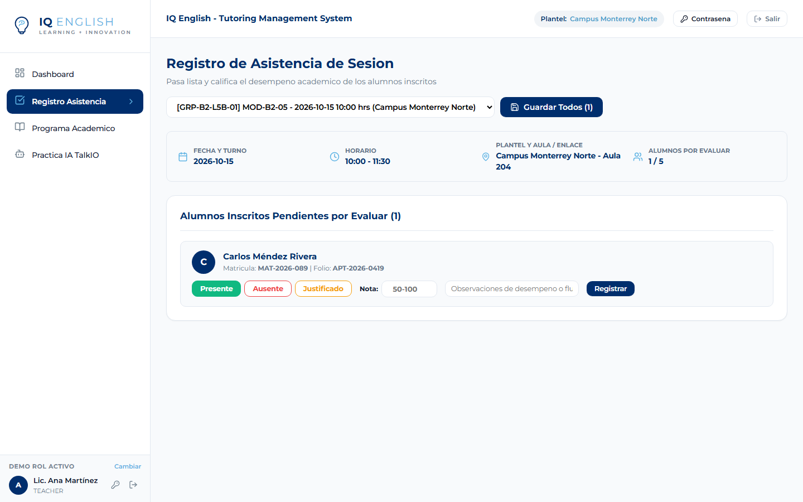

* **Ruta de Acceso:** `/attendance` (Rol requerido: `ROLE_TEACHER`).
* **Propósito UX:** Filtrar y cargar las sesiones de tutoría asignadas al profesor para iniciar el pase de lista y la captura de notas.
* **Componentes y Controles:**
  * **Barra de Filtro de Sesión:**
    * Selector de Plantel (fijado a la sede del profesor).
    * Selector de Fecha: `<input type="date" />`.
    * Selector de Sesión Asignada: `<select>` con grupos disponibles (*GRP-B2-L5B-01*, *GRP-B2-L5B-02*).
  * **Botón de Carga:** `<Button variant="primary"> Cargar Lista de Alumnos`.

---

### UI 10: Matriz de Evaluación Oral y Toma de Asistencia

* **Ruta de Acceso:** `/attendance` (Vista de grupo cargado).
* **Propósito UX:** Capturar de forma ágil y estandarizada la asistencia de cada estudiante agendado y calificar su desempeño oral en la sesión.
* **Componentes y Controles:**
  * **Banner del Grupo Activo:** Identificador de grupo, módulo curricular (*Lesson 5B*), fecha y total de inscritos (4 alumnos).
  * **Tabla de Alumnos Agendados:**
    * Columnas: *Matrícula*, *Nombre del Estudiante*, *Libro*, *Estado de Asistencia*, *Calificación*, *Observaciones*, *Acción*.
  * **Controles de Asistencia por Fila:**
    * Grupo de botones de radio: `[● PRESENTE]` (verde), `[AUSENTE]` (rojo), `[JUSTIFICADO]` (ámbar).
  * **Campo de Calificación Oral:** `<input type="number" min="0" max="100" step="0.5" />` para notas numéricas (ej. `95.00`).
  * **Campo de Observaciones:** `<input type="text" />` para retroalimentación cualitativa.
  * **Botón de Guardado por Lote:** `<Button variant="primary"> Guardar Asistencias y Calificaciones` (dispara `POST /api/v1/attendance/batch`).

---

### UI 11: Dashboard de Administrador y Supervisor

* **Ruta de Acceso:** `/dashboard` (Roles requeridos: `ROLE_ADMIN`, `ROLE_SUPERVISOR`).
* **Propósito UX:** Proveer una vista ejecutiva de la ocupación de sedes, grupos activos, volumen de citas y métricas globales de gestión académica.
* **Componentes y Controles:**
  * **Tarjetas de KPIs Institucionales:**
    * *Total Grupos Activos:* 18 grupos.
    * *Citas Confirmadas Hoy:* 6 tutorías.
    * *Tasa de Ocupación Global:* `82.2%`.
    * *Notificaciones de Control:* 1 pendiente.
  * **Accesos Directos Administrativos:** Botones de navegación hacia *Gestión de Grupos*, *Directorio de Usuarios* y *Bitácora de Auditoría*.

---

### UI 12: Gestión de Grupos de Tutoría (Tabla Principal)

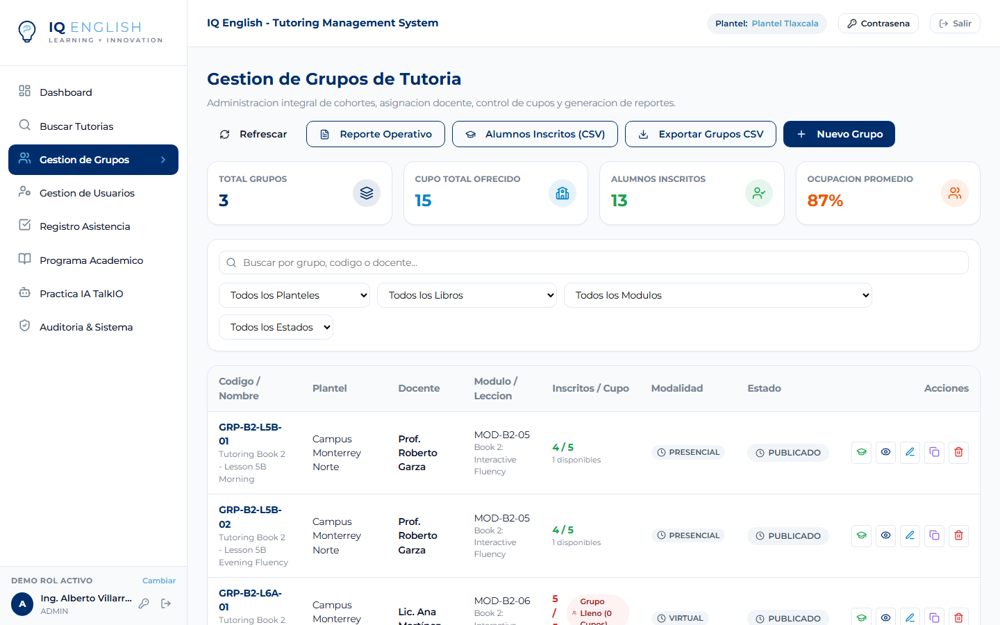

* **Ruta de Acceso:** `/groups` (Roles requeridos: `ROLE_ADMIN`, `ROLE_SUPERVISOR`).
* **Propósito UX:** Control centralizado de apertura, monitoreo, duplicación y reporte de grupos de tutoría institucional.
* **Componentes y Controles:**
  * **Tarjetas Superiores de Métricas de Grupos:**
    * *Total Grupos:* 18 | *Cupo Ofrecido:* 90 | *Inscritos:* 74 | *Ocupación:* `82.2%`.
  * **Barra de Filtrado:**
    * Búsqueda por texto (código o nombre).
    * Filtro por Plantel (*Monterrey Norte*, *Central*).
    * Filtro por Módulo (*Lesson 5B*, *Lesson 6A*).
    * Botón de exportación CSV: `<Button variant="outline"> Descargar CSV`.
    * Botón de creación: `<Button variant="primary"> + Nuevo Grupo`.
  * **Tabla de Datos de Grupos:**
    * Columnas: *Código*, *Grupo / Módulo*, *Docente*, *Horario*, *Inscritos / Capacidad*, *Modalidad*, *Estado*, *Acciones*.
    * Iconos de Acción: Editar (`<Edit2 />`), Descargar Lista (`<Users />`), Baja (`<Trash2 />`).

---

### UI 13: Modal de Creación de Nuevo Grupo de Tutoría

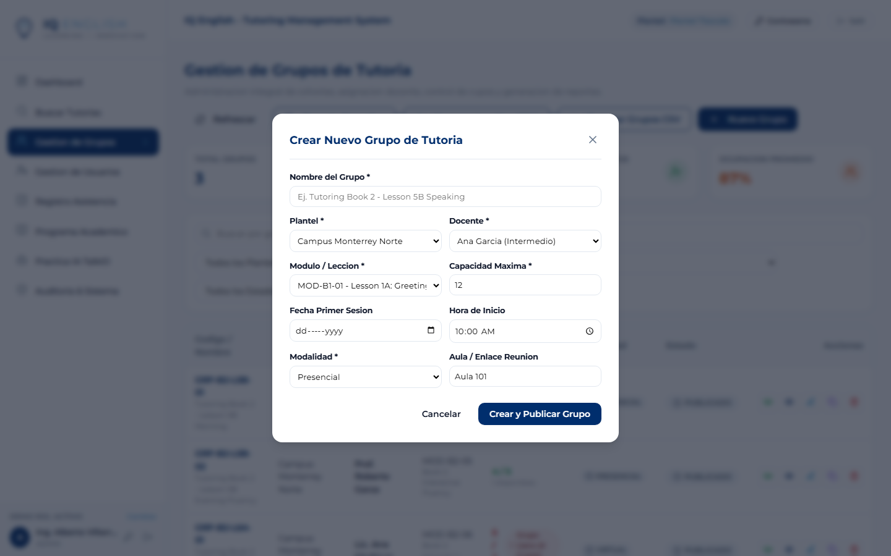

* **Componente:** `CreateGroupModal` (Invocado desde `/groups`).
* **Propósito UX:** Programar una nueva sesión de tutoría asignando docente, sede, lección curricular y horario.
* **Componentes y Controles:**
  * **Nombre del Grupo:** `<input type="text" required maxLength="150" />`.
  * **Selector de Plantel:** `<select>` con sedes habilitadas.
  * **Selector de Docente Titular:** `<select>` con profesores asignables.
  * **Selector de Módulo / Lección:** `<select>` con lecciones curriculares.
  * **Campo de Capacidad Máxima:** `<input type="number" defaultValue="5" min="4" max="5" />` (Restricción estricta de Regla R04).
  * **Fecha y Horario:** `<input type="date" />`, `<input type="time" />` (inicio y fin).
  * **Aula o Enlace Virtual:** `<input type="text" placeholder="Ej. Aula 204 o URL Teams" />`.
  * **Botón de Guardado:** `<Button variant="primary"> Crear Grupo`.

---

### UI 14: Modal de Edición de Grupo de Tutoría

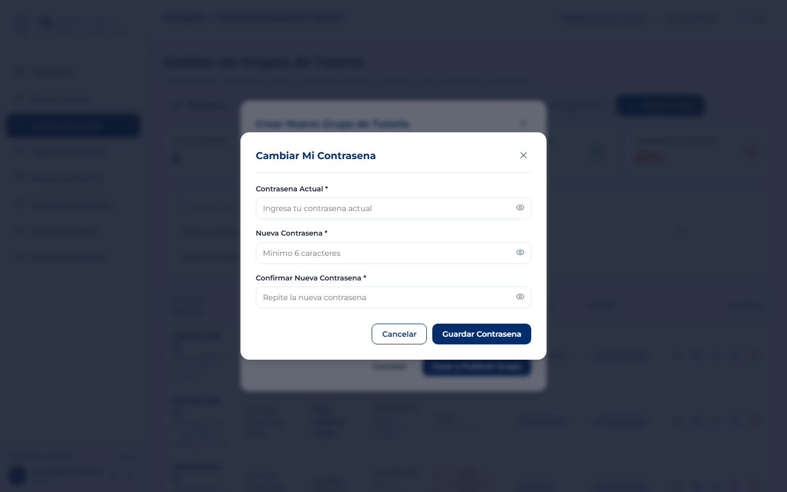

* **Componente:** `EditGroupModal` (Invocado desde `/groups`).
* **Propósito UX:** Modificar parámetros de un grupo existente (capacidad, docente, estado) y visualizar el listado de estudiantes inscritos.
* **Componentes y Controles:**
  * **Edición de Parámetros:** Modificación de nombre, docente asignado, estado (*PUBLICADO*, *LLENO*, *CERRADO*).
  * **Control de Capacidad:** Validación de que la capacidad no sea menor al número actual de inscritos.
  * **Reporte Integrado de Alumnos Inscritos:** Caja verde suave con conteo de inscritos (*4 / 5 Alumnos*) y nombres de los estudiantes.
  * **Botones de Descarga:** Botón para exportar lista de asistencia del grupo en CSV.

---

### UI 15: Directorio General de Usuarios

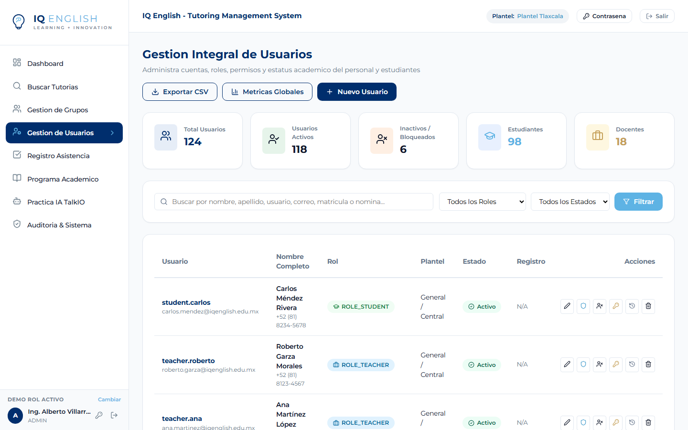

* **Ruta de Acceso:** `/users` (Roles requeridos: `ROLE_ADMIN`, `ROLE_SUPERVISOR`).
* **Propósito UX:** Administrar las cuentas institucionales de estudiantes, docentes y personal directivo con filtros avanzados y auditoría.
* **Componentes y Controles:**
  * **Tarjetas de Estadísticas de Usuarios:**
    * *Total Cuentas:* 124 | *Estudiantes:* 98 | *Docentes:* 18 | *Directivos:* 8.
  * **Barra de Filtros y Búsqueda:**
    * Input de búsqueda por nombre, username, correo o matrícula.
    * Filtro por Rol: `<select>` (*ROLE_STUDENT*, *ROLE_TEACHER*, *ROLE_SUPERVISOR*, *ROLE_ADMIN*).
    * Filtro por Plantel y Filtro por Estado (*ACTIVO*, *INACTIVO*).
    * Botón de alta: `<Button variant="primary"> + Nuevo Usuario`.
  * **Tabla de Usuarios:**
    * Columnas: *Usuario / Matrícula*, *Nombre Completo*, *Correo*, *Rol*, *Plantel*, *Estado*, *Acciones*.
    * Iconos de Acción: Editar perfil (`<Edit2 />`), Restablecer contraseña (`<KeyRound />`), Historial (`<History />`), Eliminar (`<Trash2 />`).

---

### UI 16: Modal de Creación de Usuario

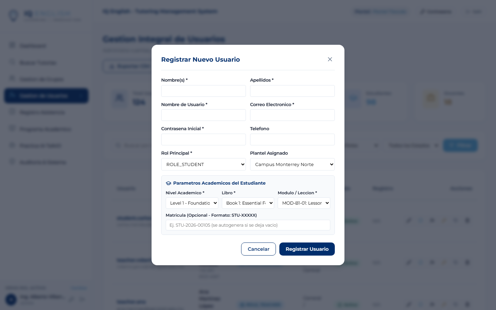

* **Componente:** `CreateUserModal` (Invocado desde `/users`).
* **Propósito UX:** Dar de alta cuentas de estudiantes, profesores o directivos con sus atributos específicos según el rol asignado.
* **Componentes y Controles:**
  * **Datos Generales:** Nombres, Apellidos, Username, Correo Institucional, Contraseña Temporal, Teléfono.
  * **Selector de Rol:** `<select>` (*Estudiante*, *Docente*, *Supervisor*, *Administrador*).
  * **Selector de Plantel:** Sede institucional asignada.
  * **Sección Condicional de Estudiante:** Nivel Académico (*Level 2*), Libro (*Book 2*), Módulo Inicial (*Lesson 5B*), Matrícula (*MAT-2026-XXX*).
  * **Sección Condicional de Docente:** Número de empleado, Especialidad de nivel, Certificación de idioma, Carga horaria máxima.
  * **Botón de Guardado:** `<Button variant="primary"> Registrar Usuario`.

---

### UI 17: Modal de Edición de Usuario

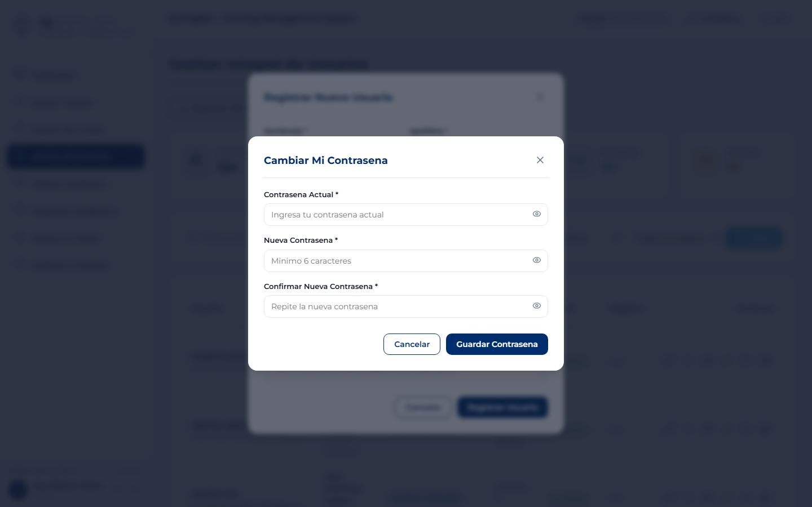

* **Componente:** `EditUserModal` (Invocado desde `/users`).
* **Propósito UX:** Actualizar los datos de contacto, estado de cuenta y plan curricular de un usuario registrado.
* **Componentes y Controles:**
  * **Edición de Datos de Contacto:** Nombres, Apellidos, Correo institucional, Teléfono.
  * **Estado de la Cuenta:** `<select>` (*ACTIVE*, *INACTIVE*, *SUSPENDED*).
  * **Actualización Curricular de Estudiante:** Modificación de Nivel, Libro y Módulo para recalcular automáticamente el avance del alumno.
  * **Botón de Guardado:** `<Button variant="primary"> Guardar Cambios`.

---

### UI 18: Bitácora de Auditoría del Sistema

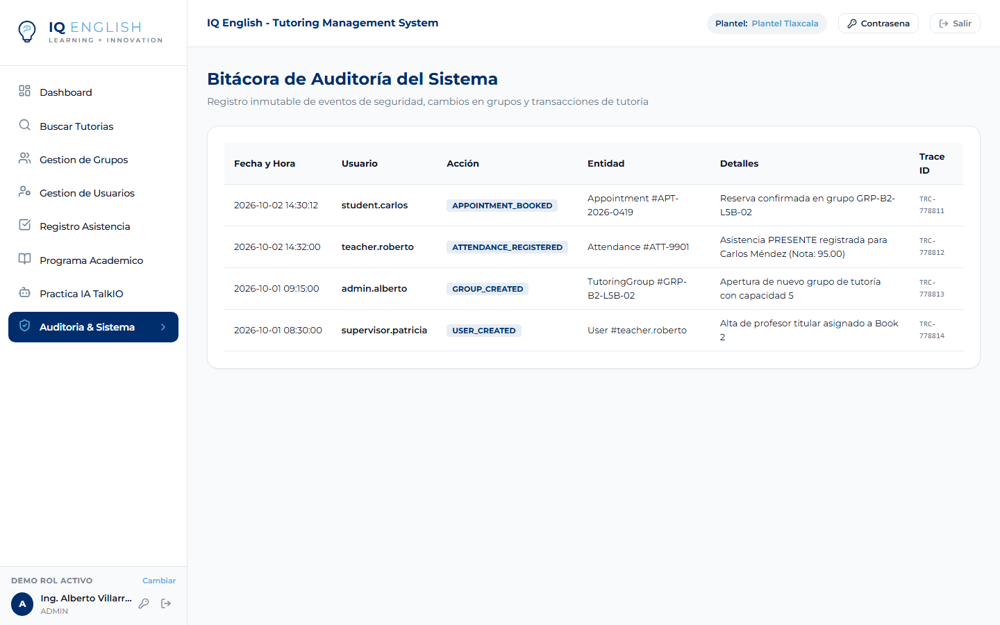

* **Ruta de Acceso:** `/admin/audit` (Roles requeridos: `ROLE_ADMIN`, `ROLE_SUPERVISOR`).
* **Propósito UX:** Garantizar la trazabilidad y seguridad institucional mediante un registro inmutable de todas las operaciones realizadas en la plataforma.
* **Componentes y Controles:**
  * **Encabezado con Icono de Seguridad:** `<ShieldCheck />` y título descriptivo.
  * **Tabla de Trazas Inmutables:**
    * Columnas: *Fecha y Hora*, *Usuario*, *Acción Realizada*, *Entidad Afectada*, *Detalles de la Operación*, *Dirección IP*, *Trace ID*.
  * **Tipos de Eventos Auditados:** `APPOINTMENT_BOOKED`, `ATTENDANCE_REGISTERED`, `GROUP_CREATED`, `USER_CREATED`, `PASSWORD_CHANGED`.

---

### UI 19: Modal Global de Cambio de Contraseña

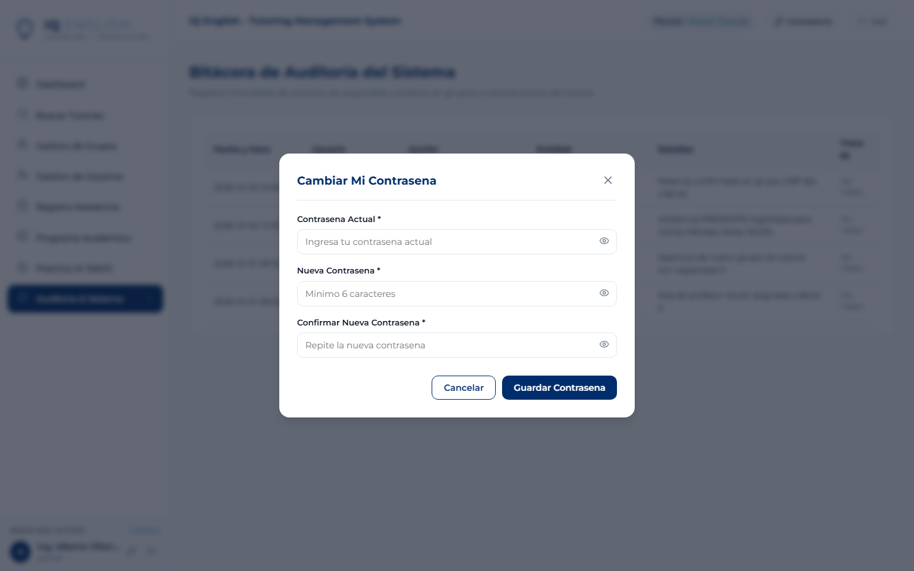

* **Componente:** `ChangePasswordModal` (Accesible globalmente desde el Topbar superior).
* **Propósito UX:** Permitir a cualquier usuario autenticado actualizar su contraseña de acceso cumpliendo con políticas de seguridad.
* **Componentes y Controles:**
  * **Contraseña Actual:** `<input type="password" required />`.
  * **Nueva Contraseña:** `<input type="password" required />` con validación de complejidad (mínimo 8 caracteres, mayúscula, minúscula, número y carácter especial).
  * **Confirmar Nueva Contraseña:** `<input type="password" required />` con validación de coincidencia en tiempo real.
  * **Botón de Acción:** `<Button variant="primary"> Actualizar Contraseña`.

---

## 5. Matriz de Trazabilidad de Reglas de Negocio en la Interfaz

| Regla | Descripción de la Regla | Interfaz donde se Aplica y Valida | Comportamiento UI/UX |
| :---: | :--- | :--- | :--- |
| **R01** | **Secuencia Curricular** | `/dashboard`, `/tutoring/search` | Solo se habilita la reserva de módulos correspondientes al progreso activo del estudiante (ej. *Lesson 5B*). Módulos posteriores permanecen bloqueados. |
| **R02** | **Desbloqueo de Libros** | `/academic`, `/dashboard` | El acceso a Book 3 requiere la acreditación previa del 100% de lecciones de Book 2 con promedio oral >= 70.0. |
| **R03** | **Cita Única por Módulo** | `/tutoring/search`, `BookingModal` | Impide reservar dos tutorías simultáneas para el mismo módulo si ya existe una cita confirmada activa. |
| **R04** | **Capacidad Máxima (5 Alumnos)** | `/groups`, `CreateGroupModal`, `/tutoring/search` | Los grupos restringen su cupo estrictamente a un máximo de 5 alumnos. Al alcanzar 5 inscritos, el estado pasa a *LLENO* y se desactiva el botón *Reservar*. |
| **R05** | **Evaluación y Asistencia** | `/attendance` | El docente captura asistencia obligatoria (*PRESENTE/AUSENTE/JUSTIFICADO*) y nota numérica (0-100). Notas >= 70.0 acreditan la lección. |

---

## 6. Lineamientos de Accesibilidad (WCAG 2.1 AA) y Usabilidad

1. **Contraste de Color:** Todas las combinaciones de texto y fondo cumplen con una relación de contraste superior a `4.5:1` para texto normal y `3.0:1` para texto grande e iconos interactivos.
2. **Navegación por Teclado:** Todos los controles (`<button>`, `<input>`, `<select>`, `<Modal>`) disponen de anillos de foco visibles (`--border-color-focus: #5EB3E4`) y soporte para navegación con tecla `Tab` y cierre de modales con `Esc`.
3. **Indicadores Redundantes:** Ningún estado depende exclusivamente del color; cada estado de asistencia o grupo combina color de fondo, icono vectorial y etiqueta textual explícita.
4. **Retroalimentación Asincrónica:** Todas las acciones de envío (`POST`, `PUT`, `DELETE`) proporcionan retroalimentación visual inmediata mediante spinners de carga y notificaciones Toast flotantes con auto-cierre.

---

> **Ubicación del Entregable:** Este documento se encuentra archivado en [`docs/ux/UI_UX_DESIGN_SPECIFICATION.md`](file:///c:/Users/DELL/.gemini/antigravity/playground/iq-english-tutoring-system/docs/ux/UI_UX_DESIGN_SPECIFICATION.md), junto a la totalidad de las 19 capturas de pantalla funcionales en formato PNG.
